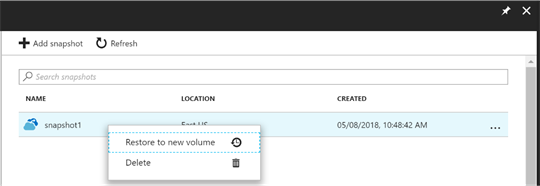

# Restore a snapshot to a new volume using Azure NetApp Files

[Snapshots](snapshots-introduction.md) enable point-in-time recovery of volumes. This article describes how to create a new volume from a snapshot by using Azure NetApp Files.

## Considerations 

* Currently, you can [restore a snapshot only to a new volume](snapshots-introduction.md#restoring-cloning-an-online-snapshot-to-a-new-volume). 

* If you use the standard storage with cool access feature, see [Manage Azure NetApp Files standard storage with cool access](manage-cool-access.md#considerations) for more considerations. 

## Steps

1. Select **Snapshots** from the Volume page to display the snapshot list. 
2. Right-click the snapshot to restore and select **Restore to new volume** from the menu option.  

    

3. In the **Create a Volume** page, provide information for the new volume.  

    The new volume uses the same protocol that the snapshot uses.   
    For information about the fields in the Create a Volume page, see: 
    * [Create an NFS volume](azure-netapp-files-create-volumes.md)   
    * [Create an SMB volume](azure-netapp-files-create-volumes-smb.md)   
    * [Create a dual-protocol volume](create-volumes-dual-protocol.md)

    By default, the new volume includes a reference to the snapshot that was used for the restore operation from the original volume from Step 2, referred to as the *base snapshot*. This base snapshot does *not* consume any additional space because of [how snapshots work](snapshots-introduction.md). If you don't want the new volume to contain this base snapshot, select **Delete base snapshot** during the new volume creation.

    :::image type="content" source="../media/azure-netapp-files/snapshot-restore-new-volume.png" alt-text="Screenshot showing the Create a Volume window for restoring a volume from a snapshot."::: 

4. Select **Review+create**. Select **Create**.   
    The Volumes page displays the new volume to which the snapshot restores. Refer to the **Originated from** field to see the name of the snapshot used to create the volume. 

## Next steps

* [Learn more about snapshots](snapshots-introduction.md)
* [Monitor volume and snapshot metrics](azure-netapp-files-metrics.md#volumes)
* [Troubleshoot snapshot policies](troubleshoot-snapshot-policies.md)
* [Resource limits for Azure NetApp Files](azure-netapp-files-resource-limits.md)
* [Azure NetApp Files Snapshots 101 video](https://www.youtube.com/watch?v=uxbTXhtXCkw)
* [Azure NetApp Files Snapshot Overview](https://anfcommunity.com/2021/01/31/azure-netapp-files-snapshot-overview/)
