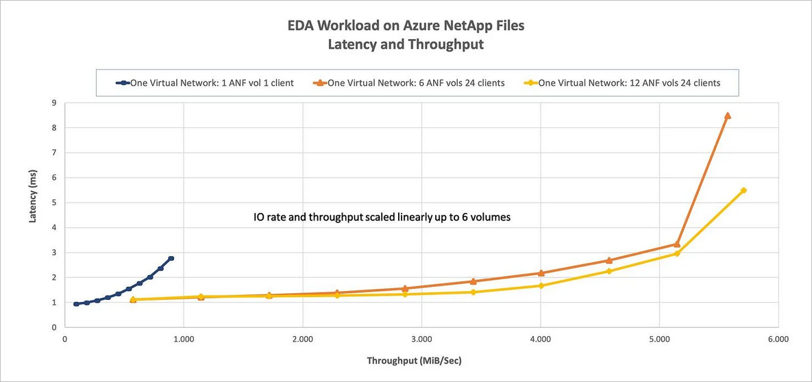

# Benefits of using Azure NetApp Files for electronic design automation

Time-to-market (TTM) is a critical consideration for the semiconductor and chip design industry. The industry has high bandwidth and low latency needs for storage. This article explains the solution Azure NetApp Files provides for meeting the industry’s needs. It presents test scenarios running a standard industry benchmark for electronic design automation (EDA) using Azure NetApp Files. 

## Test scenario configurations

The tests involve three scenarios with the following configurations. 

|    Scenario    |    Volumes    |    Clients  SLES15 D16s_v3  |
|----------------|---------------|--------------------------------|
|    One         |    1          |    1                           |
|    Two         |    6          |    24                          |
|    Three       |    12         |    24                          |

The first scenario addresses how far a single volume can be driven.  

The second and the third scenarios evaluate the limits of a single Azure NetApp Files endpoint. They investigate the potential benefits of I/O upper limits and latency.

## Test scenario results

The following table summarizes the test scenarios results.

|    Scenario       |    I/O rate   at 2 ms     |    I/O rate   at the edge     |    Throughput   at 2 ms     |    Throughput   at the edge     |
|-------------------|---------------------------|--------------------------------|-----------------------------|----------------------------------|
|    1 volume       |    39,601                 |    49,502                      |    692 MiB/s                 |    866 MiB/s                      |
|    6 volumes      |    255,613                |    317,000                     |    4,577 MiB/s               |    5,568 MiB/s                    |
|    12 volumes     |    256,612                |    319,196                     |    4,577 MiB/s               |    5,709 MiB/s                    |

The single-volume scenario represents the basic application configuration. It's the baseline scenario for follow-on test scenarios.  

The six-volume scenario demonstrates a linear increase (600%) relative to the single-volume workload.  All volumes within a single virtual network are accessed over a single IP address.  

The 12-volume scenario demonstrates a general decrease in latency over the six-volume scenario. But it doesn’t have a corresponding increase in achievable throughput.   

The following graph illustrates the latency and operations rate for the EDA workload on Azure NetApp Files.  

   

The following graph illustrates the latency and throughput for the EDA workload on Azure NetApp Files.  

 

## Layout of test scenarios 

The table below summarizes the layout of the test scenarios.

|    Test scenario     |    Total number of directories     |    Total number of files     |
|----------------------|------------------------------------|------------------------------|
|    1 volume          |    88,000                          |    880,000                   |
|    6 volumes         |    568,000                         |    5,680,000                 |
|    12 volumes        |    568,000                         |    5,680,000                 |

The complete workload is a mixture of concurrently running functional and physical phases. It represents a typical flow from one set of EDA tools to another.   

The functional phase consists of initial specifications and a logical design. The physical phase takes place when the logical design is converted to a physical chip. During the sign-off and tape-out phases, final checks are completed, and the design is delivered to a foundry for manufacturing.  

The functional phase includes a mixture of sequential and random read and write I/O. The functional phase is metadata intensive, like file stat and access calls. Although metadata operations are effectively without size, the read and write operations range between less than 1 K and 16 K. Most reads are between 4 K and 16 K.  Most writes are 4 K or less. The physical phase is composed of sequential read and write operations entirely, with a mixture of 32 K and 64 K OP sizes.  

In the graphs above, most of the throughput comes from the sequential physical phase of workload. The I/O comes from the small random and metadata-intensive functional phase. Both phases happen in parallel. 

In conclusion, you can pair Azure compute with Azure NetApp Files for EDA design to get scalable bandwidth. 

## Next steps

- [Solution architectures using Azure NetApp Files](azure-netapp-files-solution-architectures.md)
