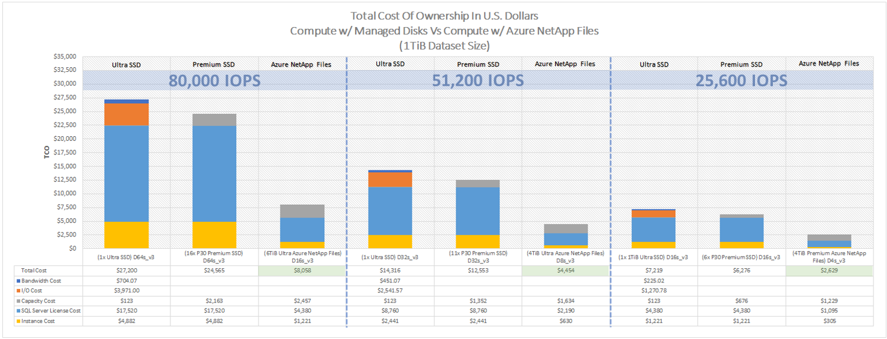
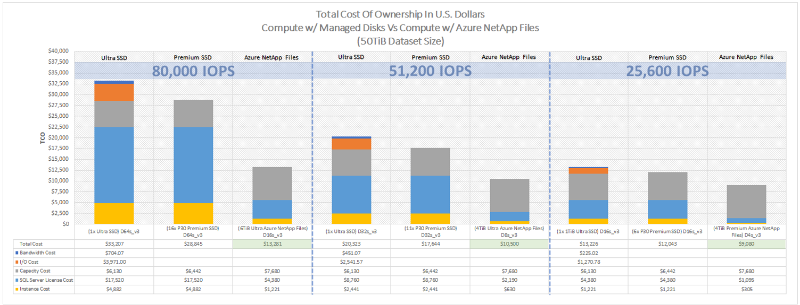
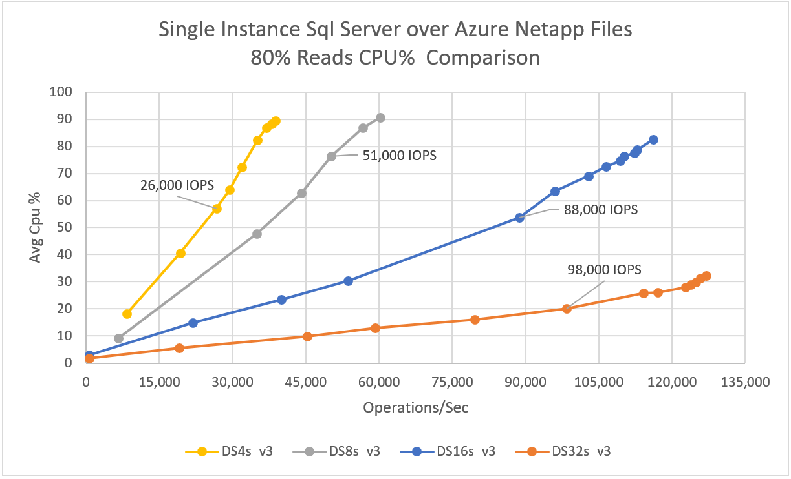
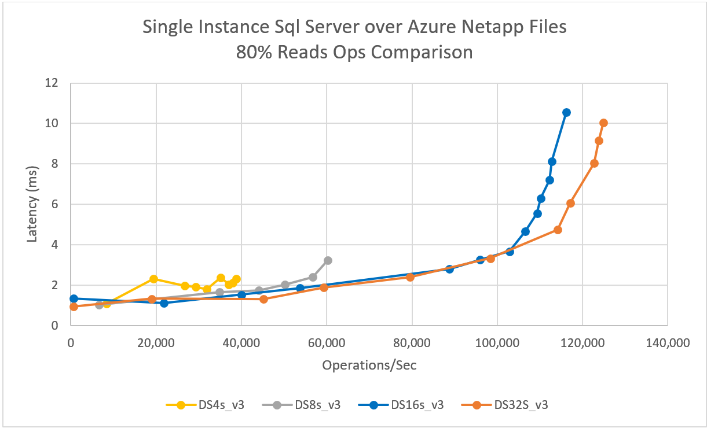

#  Benefits of using Azure NetApp Files for SQL Server deployment

Azure NetApp Files reduces SQL Server total cost of ownership (TCO) as compared to block storage solutions.  With block storage, virtual machines have imposed limits on I/O and bandwidth for disk operations. Only network bandwidth limits are applied against Azure NetApp Files, and on egress only at that.  In other words, no VM level I/O limits are applied to Azure NetApp Files. Without these I/O limits, SQL Server running on smaller virtual machines connected to Azure NetApp Files can perform as well as SQL Server running on much larger virtual machines. Sizing instances down as such reduces the compute cost to 25% of the former price tag.  *You can reduce compute costs with Azure NetApp Files.*  

Compute costs, however, are small compared to SQL Server license costs.  Microsoft SQL Server [licensing](https://download.microsoft.com/download/B/C/0/BC0B2EA7-D99D-42FB-9439-2C56880CAFF4/SQL_Server_2017_Licensing_Datasheet.pdf) is tied to physical core count. As such, decreasing instance size introduces an even larger cost saving for software licensing. *You can reduce software license costs with Azure NetApp Files.*

This article shows a detailed cost analysis and performance benefits about using Azure NetApp Files for SQL Server deployment. Not only do smaller instances have sufficient CPU to do the database work only possible with block on larger instances, *in many cases, the smaller instances are even more performant than their larger, disk-based counterparts because of Azure NetApp Files.* 

## Detailed cost analysis 

The two sets of graphics in this section show the TCO example.  The number and type of managed disks, the Azure NetApp Files service level, and the capacity for each scenario have been selected to achieve the best price-capacity-performance.  Each graphic is made up of grouped machines (D16 with Azure NetApp Files, compared to D64 with managed disk by example), and prices are broken down for each machine type.  

The first set of graphic shows the overall cost of the solution using a 1-TiB database size, comparing the D16s_v4 to the D64, the D8 to the D32, and the D4 to the D16. The projected IOPs for each configuration are indicated by a green or yellow line and corresponds to the right-hand side Y axis.

The second set of graphic shows the overall cost using a 50-TiB database. The comparisons are otherwise the same – D16 compared with Azure NetApp Files versus D64 with block by example. 

 
## Performance, and lots of it  

To deliver on the significant cost reduction assertion requires lots of performance - the largest instances in the general Azure inventory support 80,000 disk IOPS by example. A single Azure NetApp Files volume can achieve 80,000 database IOPS, and instances such as the D16 are able to consume the same. The D16, normally capable of 25,600 disk IOPS, is 25% the size of the D64.  The D64s_v4 is capable of 80,000 disk IOPS, and as such, presents an excellent upper level comparison point.

The D16s_v4 can drive an Azure NetApp Files volume to 80,000 database IOPS. As proven by the SQL Storage Benchmark (SSB) benchmarking tool, the D16 instance achieved a workload 125% greater than that achievable to disk from the D64 instance.  See the [SSB testing tool](#ssb-testing-tool) section for details about the tool.

Using a 1-TiB working set size and an 80% read, 20% update SQL Server workload, performance capabilities of most the instances in the D instance class were measured; most, not all, as the D2 and D64 instances themselves were excluded from testing. The former was left out as it doesn't support accelerated networking, and the latter because it's the comparison point. See the following graph to understand the limits of D4s_v4, D8s_v4, D16s_v4, and D32s_v4, respectively.  Managed disk storage tests are not shown in the graph. Comparison values are drawn directly from the [Azure Virtual Machine limits table](../virtual-machines/dv3-dsv3-series.md) for the D class instance type.

With Azure NetApp Files, each of the instances in the D class can meet or exceed the disk performance capabilities of instances two times larger.  *You can reduce software license costs significantly with Azure NetApp Files.*  

* The D4 at 75% CPU utilization matched the disk capabilities of the D16.  
    * The D16 is rate limited at 25,600 disk IOPS.  
* The D8 at 75% CPU utilization matched the disk capabilities of the D32.  
    * The D32 is rate limited at 51,200 disk IOPS.  
* The D16 at 55% CPU utilization matched the disk capabilities of the D64.  
    * The D64 is rate limited at 80,000 disk IOPS.  
* The D32 at 15% CPU utilization matched the disk capabilities of the D64 as well.  
    * The D64 as stated above is rate limited at 80,000 disk IOPS.  

### S3B CPU limits test – Performance versus processing power

The following diagram summarizes the S3B CPU limits test:

Scalability is only part of the story. The other part is latency.  It’s one thing for smaller virtual machines to have the ability to drive much higher I/O rates, it’s another thing to do so with low single-digit latencies as shown below.  

* The D4 drove 26,000 IOPS against Azure NetApp Files at 2.3-ms latency.  
* The D8 drove 51,000 IOPS against Azure NetApp Files at 2.0-ms latency.  
* The D16 drove 88,000 IOPS against Azure NetApp Files at 2.8-ms latency.
* The D32 drove 80,000 IOPS against Azure NetApp Files at 2.4-ms latency.  

### S3B per instance type latency results

The following diagram shows the latency for single-instance SQL Server over Azure NetApp Files:

## SSB testing tool 
 
The [TPC-E](http://www.tpc.org/tpce/) benchmarking tool, by design, stresses *compute* rather than *storage*. The test results shown in this section are based on a stress testing tool named SQL Storage Benchmark (SSB).  The SQL Server Storage Benchmark can drive massive-scale SQL execution against a SQL Server database to simulate an OLTP workload, similar to the [SLOB2 Oracle benchmarking tool](https://kevinclosson.net/slob/). 

The SSB tool generates a SELECT and UPDATE driven workload issuing the said statements directly to the SQL Server database running within the Azure virtual machine.  For this project, the SSB workloads ramped from 1 to 100 SQL Server users, with 10 or 12 intermediate points at 15 minutes per user count.  All performance metrics from these runs were from the point of view of perfmon, for repeatability SSB ran three times per scenario. 

The tests themselves were configured as 80% SELECT and 20% UPDATE statement, thus 90% random read.  The database itself, which SSB created, was 1000 GB in size. It's comprised of 15 user tables and 9,000,000 rows per user table and 8192 bytes per row. 

The SSB benchmark is an open-source tool.  It's freely available at the [SQL Storage Benchmark GitHub page](https://github.com/NetApp/SQL_Storage_Benchmark.git).  

## In summary  

With Azure NetApp Files, you can increase SQL server performance while reducing your total cost of ownership significantly. 

## Next Steps

* [Create an SMB volume for Azure NetApp Files](azure-netapp-files-create-volumes-smb.md) 
* [Solution architectures using Azure NetApp Files – SQL Server](azure-netapp-files-solution-architectures.md#sql-server) 

