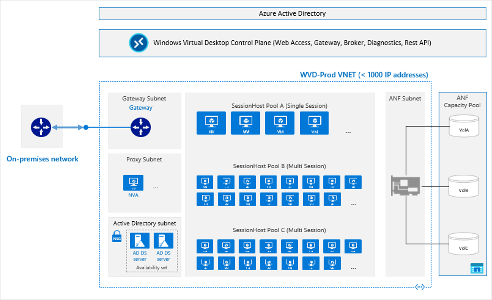

# Benefits of using Azure NetApp Files with Azure Virtual Desktop 

This article provides best practice guidance on deploying Azure Virtual Desktop with Azure NetApp Files.

Azure NetApp Files is a highly performant file storage service from Azure. It can provide up to 450,000 IOPS and sub-millisecond latency, capable of supporting extremely large scale of Azure Virtual Desktop deployments. You can adjust the bandwidth and change the service level of your Azure NetApp Files volumes on demand almost instantaneously without pausing IO while retaining data plane access. This capability allows you to easily optimize your Azure Virtual Desktop deployment scale for cost. You can also create space-efficient, point-in-time volume snapshots without impacting volume performance. This capability makes it possible for you to roll back individual [FSLogix user profile containers](../virtual-desktop/store-fslogix-profile.md) via a copy from the `~snapshot` directory, or to instantaneously roll back the entire volume at once via the volume revert capability.  With up to 255 (rotational) snapshots in place to protect a volume from data loss or corruption, administrators have many chances to undo what has been done.

## Sample blueprints

The following sample blueprints show the integration of Azure Virtual Desktop with Azure NetApp Files. In a pooled desktop scenario, users are directed to the best available session (the [breadth-first mode](../virtual-desktop/host-pool-load-balancing.md#breadth-first-load-balancing-algorithm)) host in the pool, using [multi-session virtual machines](../virtual-desktop/windows-10-multisession-faq.yml#what-is-windows-10-enterprise-multi-session). On the other hand, personal desktops are reserved for scenarios in which each user has their own virtual machine.

### Pooled desktop scenario

For the pooled scenario, the Azure Virtual Desktop team [recommends](/windows-server/remote/remote-desktop-services/virtual-machine-recs#multi-session-recommendations) the following guidance by user count to vCPU. Note that no virtual machine size is specified in this recommendation.

|     Workload type     |     Light    |     Medium    |     Heavy    |
|-----------------------|--------------|---------------|--------------|
|     Users per vCPU    |     6        |     4         |     2        |

This recommendation is confirmed by a 500-user LoginVSI test, logging approximately 62 “knowledge / medium users” onto each D16as_V4 virtual machine. 

As an example, at 62 users per D16as_V4 virtual machine, Azure NetApp Files can easily support 60,000 users per environment. Testing to evaluate the upper limit of the D32as_v4 virtual machine is ongoing. If the Azure Virtual Desktop user per vCPU recommendation holds true for the D32as_v4, more than 120,000 users would fit within 1,000 virtual machines before broaching [the 1,000 IP VNet limit](./azure-netapp-files-network-topologies.md), as shown in the following figure.  

   

### Personal desktop scenario 

In a personal desktop scenario, the following figure shows the general-purpose architectural recommendation. Users are mapped to specific desktop pods and each pod has just under 1,000 virtual machines, leaving room for IP addresses propagating from the management VNet. Azure NetApp Files can easily handle 900+ personal desktops per single-session host pool VNet, with the actual number of virtual machines being equal to 1,000 minus the number of management hosts found in the Hub VNet. If more personal desktops are needed, it's easy to add more pods (host pools and virtual networks), as shown in the following figure. 

  

When building a POD based architecture like this, assigning users to the correct pod upon login is of importance to assure users will always find their user profiles. 

## Next steps

- [Solution architectures using Azure NetApp Files](azure-netapp-files-solution-architectures.md)