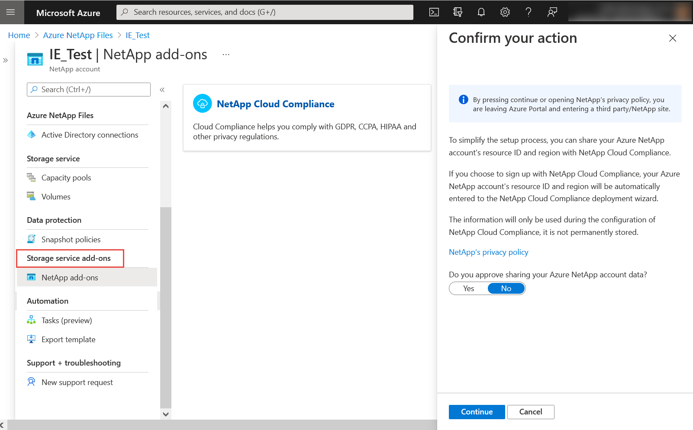

# Storage service add-ons for Azure NetApp Files

The **Storage service add-ons** portal menu of Azure NetApp Files provides a “launching pad” for available third-party, ecosystem add-ons to the Azure NetApp Files storage service. 

## Access storage service add-ons  

Clicking a category (for example, **NetApp add-ons**) under **Storage service add-ons** displays tiles for available add-ons in that category. Clicking an add-on tile in the category takes you to a landing page for quick access of that add-on and directs you to the add-on installation page. 

## Next steps

* [Solution architectures using Azure NetApp Files](azure-netapp-files-solution-architectures.md)
