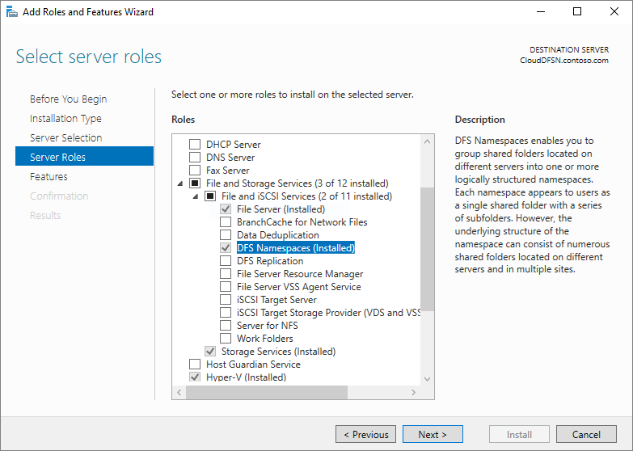
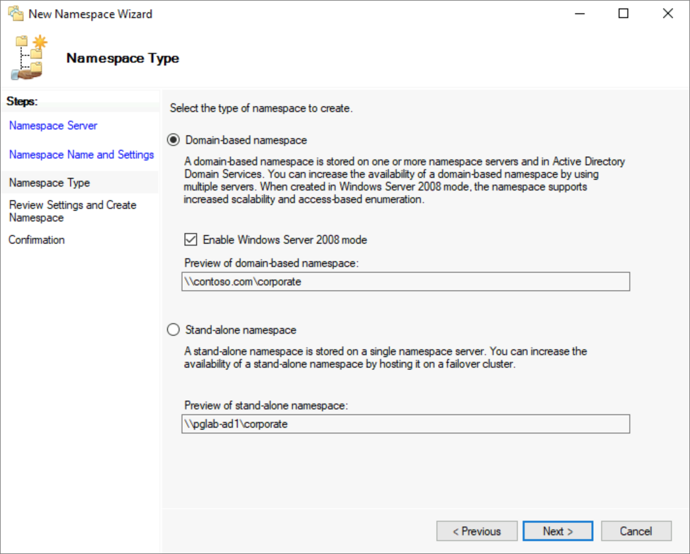
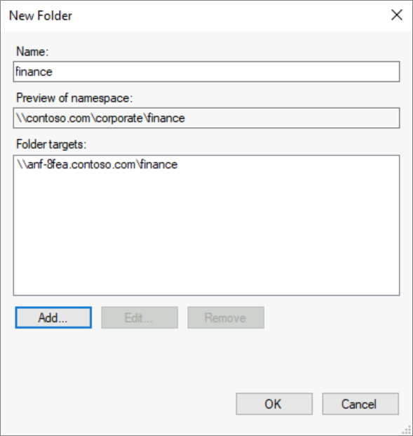
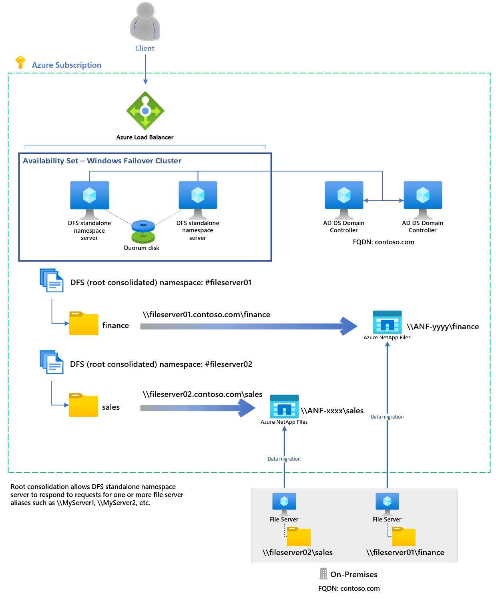
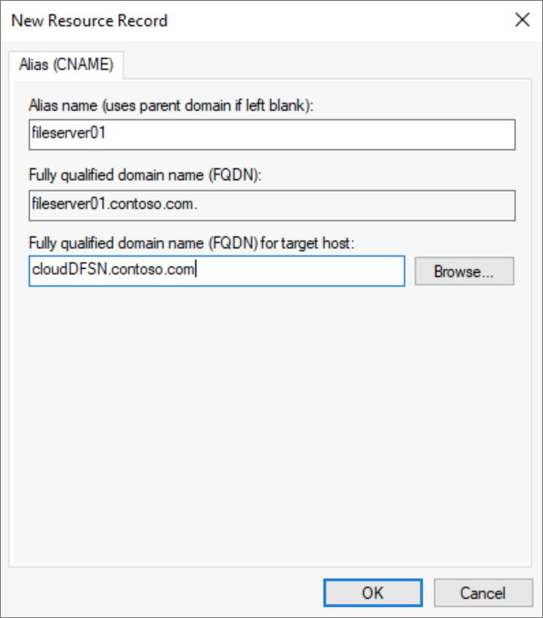
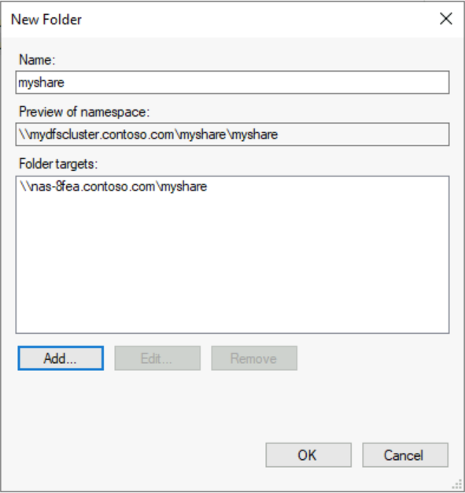

# How to use DFS Namespaces with Azure NetApp Files

[Distributed File Systems Namespaces](/windows-server/storage/dfs-namespaces/dfs-overview), commonly referred to as DFS Namespaces or DFS-N, is a Windows Server server role that is widely used to simplify the deployment and maintenance of SMB file shares in production. DFS Namespaces is a storage namespace virtualization technology, which means that it enables you to provide a layer of indirection between the UNC path of your file shares and the actual file shares themselves. DFS Namespaces works with SMB file shares, agnostic of where those file shares are hosted: it can be used with SMB shares hosted on an on-premises Windows File Server with or without Azure File Sync, Azure file shares directly, SMB file shares hosted in Azure NetApp Files, and even with file shares hosted in other clouds.

At its core, DFS Namespaces provide a mapping between a user-friendly UNC path, like `\\contoso\shares\ProjectX` and the underlying UNC path of the SMB share like `\\Server01-Prod\ProjectX` or `\\anf-xxxx\projectx`. When the end user wants to navigate to their file share, they type in the user-friendly UNC path, but their SMB client accesses the underlying SMB path of the mapping. You can also extend this basic concept to take over an existing file server name, such as `\\MyServer\ProjectX` using DFS root consolidation. You can use these capabilities to achieve the following scenarios:

- **Provide a migration-proof name for a logical set of data**  
In this example, you have a mapping like `\\contoso\shares\Engineering` that maps to `\\OldServer\Engineering`. When you complete your migration to Azure NetApp Files, you can change your mapping so your user-friendly UNC path points to `\\anf-xxxx\engineering`. When an end user accesses the user-friendly UNC path, they will be seamlessly redirected to the Azure NetApp Files share path.

- **Extend a logical set of data across size, IO, or other scale thresholds**  
This is common when dealing with corporate shares, where different folders have different performance requirements, or with scratch shares, where users get arbitrary space to handle temporary data needs. With DFS Namespaces, you stitch together multiple folders into a cohesive namespace. For example, `\\contoso\shares\engineering` maps to `\\anf-xxxx\engineering` (Azure NetApp Files, ultra tier), `\\contoso\shares\sales` maps to `\\anf-yyyy\sales` (Azure NetApp Files, standard tier), and so on.

- **Preserve the logical name of one or more legacy file servers after the data has been migrated to Azure NetApp Files**  
Using DFS-N with root consolidation allows you to take over the hostname and share paths exactly as they are. This leaves document shortcuts, embedded document links, and UNC paths unchanged after the migration.

If you already have a DFS Namespace in place, no special steps are required to use it with Azure NetApp Files. If you're accessing your Azure NetApp Files share from on-premises, normal networking considerations apply; see [Guidelines for Azure NetApp Files network planning](./azure-netapp-files-network-topologies.md) for more information.

## Applies to

| File share type | SMB | NFS | dual-protocol* |
|-|:-:|:-:|:-:|
| Azure NetApp Files |  |  |  |

> [!IMPORTANT]
> This functionality applies to the SMB side of Azure NetApp Files dual-protocol volumes.

## Namespace types

DFS Namespaces provides three namespace types:

- **Domain-based namespace**:  
A namespace hosted as part of your Windows Server AD domain. Namespaces hosted as part of AD will have a UNC path containing the name of your domain, for example, `\\contoso.com\shares\myshare`, if your domain is `contoso.com`. Domain-based namespaces support larger scale limits and built-in redundancy through AD. Domain-based namespaces can't be a clustered resource on a failover cluster.

- **Standalone namespace**:  
A namespace hosted on an individual server or a Windows Server failover cluster, not hosted as part of Windows Server AD. Standalone namespaces will have a name based on the name of the standalone server, such as `\\MyStandaloneServer\shares\myshare`, where your standalone server is named `MyStandaloneServer`. Standalone namespaces support lower scale targets than domain-based namespaces but can be hosted as a clustered resource on a failover cluster.

- **Standalone namespace with root consolidation**:  
One or more namespaces hosted on an individual server or on a Windows Server failover cluster, not hosted as part of Windows Server AD. Standalone namespaces with root consolidation will have a UNC path that matches the name of the old file server you would like to take over, such as `\\oldserver`, where your namespace is named `#oldserver`. Standalone namespaces support lower scale targets than domain-based namespaces but can be hosted as a clustered resource on a Windows Server failover cluster.

## Requirements

To use DFS Namespaces with Azure NetApp Files, you must have the following resources:

- An Active Directory domain. This can be hosted anywhere you like: an on-premises environment, an Azure virtual machine (VM), or even in another cloud.

- A Windows Server that can host the namespace. For domain-based namespaces, a common deployment pattern is to use the Active Directory domain controller to host the namespaces, however the namespaces can be setup from any server with the DFS Namespaces server role installed. DFS Namespaces are available on all supported Windows Server versions.

- For namespace root consolidation, Active Directory domain controllers can not be used to host the namespace. It is required to use a dedicated standalone Windows Server or a Windows Server failover cluster to host the namespace(s).

- One or more Azure NetApp Files SMB file shares hosted in a domain-joined environment.

## Install the DFS Namespaces server role

For all DFS Namespace types, the **DFS Namespaces** server role must be installed. If you are already using DFS Namespaces, you may skip these steps.

# [GUI](#tab/windows-gui)

1. Open **Server Manager**

2. Select **Manage**

3. Select **Add Roles and Features**. 

4. For the **Installation Type**, select **Role-based or feature-based installation**

5. Click **Next**. 

6. For **Server Selection**, select the desired server(s) on which you would like to install the DFS Namespaces server role

7. Click **Next**.

8. In the **Server Roles** section, select and check the **DFS Namespaces** role from role list under **File and Storage Services** > **File and iSCSI Services**.



9. Click **Next** until the **Install** button is available

10. Click **Install**

# [PowerShell](#tab/azure-powershell)

From an elevated PowerShell session (or using PowerShell remoting), execute the following command:

```PowerShell
Install-WindowsFeature -Name "FS-DFS-Namespace", "RSAT-DFS-Mgmt-Con"
```

---

## Configure a DFS-N Namespace with Azure NetApp Files SMB volumes

If you do not need to take over an existing legacy file server, a domain-based namespace is recommended. Domain-based namespaces are hosted as part of AD and will have a UNC path containing the name of your domain, for example, `\\contoso.com\corporate\finance`, if your domain is `contoso.com`. An example of this architecture is shown in the graphic below.


>[!IMPORTANT]
>If you wish to use DFS Namespaces to take over an existing server name with root consolidation, skip to [Take over existing server names with root consolidation](#take-over-existing-server-names-with-root-consolidation).

### Create a namespace

The basic unit of management for DFS Namespaces is the namespace. The namespace root, or name, is the starting point of the namespace, such that in the UNC path `\\contoso.com\corporate\`, the namespace root is `corporate`.

# [GUI](#tab/windows-gui)

1. From a domain controller, open the **DFS Management** console. This can be found by selecting the **Start** button and typing **DFS Management**. The resulting management console has two sections **Namespaces** and **Replication**, which refer to DFS Namespaces and DFS Replication (DFS-R) respectively.
2. Select the **Namespaces** section, and select the **New Namespace** button (you may also right-click on the **Namespaces** section). The resulting **New Namespace Wizard** walks you through creating a namespace.

3. The first section in the wizard requires you to pick the DFS Namespace server to host the namespace. Multiple servers can host a namespace, but you will need to set up DFS Namespaces with one server at a time. Enter the name of the desired DFS Namespace server and select **Next**. 
 
4. In the **Namespace Name and Settings** section, you can enter the desired name of your namespace and select **Next**.

5. The **Namespace Type** section allows you to choose between a **Domain-based namespace** and a **Stand-alone namespace**. Select a domain-based namespace. Refer to [namespace types](#namespace-types) above for more information on choosing between namespace types.  



6. Select **Create** to create the namespace and **Close** when the dialog completes.

# [PowerShell](#tab/azure-powershell)

From a PowerShell session on the DFS Namespace server, execute the following PowerShell commands, populating `$namespace` and `$type` with the relevant values for your environment:

```PowerShell
# Variables
$namespace = "corporate"
$type = "DomainV2"

$dfsnServer = $env:ComputerName
$namespaceServer =  Get-CimInstance -ClassName "Win32_ComputerSystem" | `
Select-Object -ExpandProperty Domain


# Create share for DFS-N namespace
$smbShare = "C:\DFSRoots\$namespace"
if (!(Test-Path -Path $smbShare)) { New-Item -Path $smbShare -ItemType Directory }
New-SmbShare -Name $namespace -Path $smbShare -FullAccess Everyone

# Create DFS-N namespace
Import-Module -Name DFSN
$namespacePath = "\\$namespaceServer\$namespace"
$targetPath = "\\$dfsnServer\$namespace"
New-DfsnRoot -Path $namespacePath -TargetPath $targetPath -Type $type
```

---

### Configure folders and folder targets

For a namespace to be useful, it must have folders and folder targets. Each folder can have one or more folder targets, which are pointers to the SMB file share(s) that host that content. When users browse a folder with folder targets, the client computer receives a referral that transparently redirects the client computer to one of the folder targets. You can also have folders without folder targets to add structure and hierarchy to the namespace.

You can think of DFS Namespaces folders as analogous to file shares.

# [GUI](#tab/windows-gui)

1. In the DFS Management console, select the namespace you just created and select **New Folder**. The resulting **New Folder** dialog will allow you to create both the folder and its targets.



2. In the textbox labeled **Name** provide the name of the share. 

3. Select **Add...** to add folder targets for this folder. The resulting **Add Folder Target** dialog provides a textbox labeled **Path to folder target** where you can provide the UNC path to your Azure NetApp Files SMB share. 
 
4. Select **OK** on the **Add Folder Target** dialog. 
 
5. Select **OK** on the **New Folder** dialog to create the folder and folder targets.

# [PowerShell](#tab/azure-powershell)

```PowerShell
# Variables
$shareName = "finance"
$targetUNC = "\\anf-xxxx.contoso.com\finance"

# Create folder and folder targets
$sharePath = "$namespacePath\$shareName"
New-DfsnFolder -Path $sharePath -TargetPath $targetUNC
```

---

Now that you have created a namespace, a folder, and a folder target, you should be able to mount your file share through DFS Namespaces. The full path for your share should be `\\contoso.com\corporate\finance`.

## Take over existing server names with root consolidation

An important use for DFS Namespaces is to take over an existing server name for the purposes of refactoring the physical layout of the file shares. For example, you may wish to consolidate file shares from multiple old file servers together on Azure NetApp Files volume(s) during a modernization migration. Traditionally, end user familiarity and document-linking limit your ability to consolidate file shares from disparate file servers together on one host, but the DFS Namespace root consolidation feature allows you to stand-up a single server or failover cluster to take over multiple server names and route to the appropriate Azure NetApp Files share name(s).

Although useful for various datacenter migration scenarios, root consolidation is especially useful for adopting Azure NetApp Files shares because Azure NetApp Files shares don't allow you to keep existing on-premises server names.

Root consolidation may only be used with standalone namespaces. If you already have an existing domain-based namespace for your file shares, you do not need to create a root consolidated namespace.

This section outlines the steps to configure DFS Namespace root consolidation on a standalone server. For a highly available architecture please work with your Microsoft technical team to configure Windows Server failover clustering and an Azure Load Balancer as required. An example of a highly available architecture is shown in the graphic below.




### Enabling root consolidation

Root consolidation can be enabled by setting the following registry keys from an elevated PowerShell session (or using PowerShell remoting) on the standalone DFS Namespace server or on the failover cluster.

```PowerShell
New-Item `
    -Path "HKLM:SYSTEM\CurrentControlSet\Services\Dfs" `
    -Type Registry `
    -ErrorAction SilentlyContinue
New-Item `
    -Path "HKLM:SYSTEM\CurrentControlSet\Services\Dfs\Parameters" `
    -Type Registry `
    -ErrorAction SilentlyContinue
New-Item `
    -Path "HKLM:SYSTEM\CurrentControlSet\Services\Dfs\Parameters\Replicated" `
    -Type Registry `
    -ErrorAction SilentlyContinue
Set-ItemProperty `
    -Path "HKLM:SYSTEM\CurrentControlSet\Services\Dfs\Parameters\Replicated" `
    -Name "ServerConsolidationRetry" `
    -Value 1
```

### Creating DNS entries for existing file server names

In order for DFS Namespaces to respond to existing file server names, **you must** create alias (CNAME) records for your existing file servers that point at the DFS Namespaces server name. The exact procedure for updating your DNS records may depend on what servers your organization is using and if your organization is using custom tooling to automate the management of DNS. The following steps are shown for the DNS server included with Windows Server and automatically used by Windows AD. In this example, the DFS-N server name is `mydfscluster`.

# [GUI](#tab/windows-gui)

1. From a Windows DNS server, open the DNS management console.

2. Navigate to the forward lookup zone for your domain. For example, if your domain is `contoso.com`, the forward lookup zone can be found under **Forward Lookup Zones** > **`contoso.com`** in the management console. The exact hierarchy shown in this dialog will depend on the DNS configuration for your network.

3. Right-click on your forward lookup zone and select **New Alias (CNAME)**. 

4. In the resulting dialog, enter the short name for the file server you're replacing (the fully qualified domain name will be auto-populated in the textbox labeled **Fully qualified domain name**)

5. In the textbox labeled **Fully qualified domain name (FQDN) for the target host**, enter the name of the DFS-N server you have set up. You can use the **Browse** button to help you select the server if desired. 



6. Select **OK** to create the CNAME record for your server.

# [PowerShell](#tab/azure-powershell)

On a Windows DNS server, open a PowerShell session (or use PowerShell remoting) to execute the following commands, populating `$oldServer` and `$dfsnServer`, with the relevant values for your environment (`$domain` will auto-populate with the domain name, but you can also manually type this out as well).

```PowerShell
# Variables
$oldServer = "fileserver01"
$domain = Get-CimInstance -ClassName "Win32_ComputerSystem" | `
    Select-Object -ExpandProperty Domain
$dfsnServer = "mydfscluster.$domain"

# Create CNAME record
Import-Module -Name DnsServer
Add-DnsServerResourceRecordCName `
    -Name $oldServer `
    -HostNameAlias $dfsnServer `
    -ZoneName $domain
```

---

### Create a namespace

The basic unit of management for DFS Namespaces is the namespace. The namespace root, or name, is the starting point of the namespace, such that in the UNC path `\\contoso.com\Public\`, the namespace root is `Public`.

To take over an existing server name with root consolidation, the name of the namespace should be the name of server name you want to take over, prepended with the `#` character. For example, if you wanted to take over an existing server named `MyServer`, you would create a DFS-N namespace called `#MyServer`. The PowerShell section below takes care of prepending the `#`, but if you create via the DFS Management console, you will need to prepend as appropriate.

# [GUI](#tab/windows-gui)

1. Open the **DFS Management** console. This can be found by selecting the **Start** button and typing **DFS Management**. The resulting management console has two sections **Namespaces** and **Replication**, which refer to DFS Namespaces and DFS Replication (DFS-R) respectively.

2. Select the **Namespaces** section, and select the **New Namespace** button (you may also right-click on the **Namespaces** section). The resulting **New Namespace Wizard** walks you through creating a namespace.

3. The first section in the wizard requires you to pick the DFS Namespace server to host the namespace. Multiple servers can host a namespace, but you will need to set up DFS Namespaces with one server at a time. Enter the name of the desired DFS Namespace server and select **Next**. 
 
4. In the **Namespace Name and Settings** section, you can enter the desired name of your namespace and select **Next**.

5. The **Namespace Type** section allows you to choose between a **Domain-based namespace** and a **Stand-alone namespace**. If you intend to use DFS Namespaces to preserve an existing file server/NAS device name, you should select the standalone namespace option. For any other scenarios, you should select a domain-based namespace. Refer to [namespace types](#namespace-types) above for more information on choosing between namespace types.

6. Select the desired namespace type for your environment and select **Next**. The wizard will then summarize the namespace to be created.  


7. Select **Create** to create the namespace and **Close** when the dialog completes.

# [PowerShell](#tab/azure-powershell)

From a PowerShell session on the DFS Namespace server, execute the following PowerShell commands, populating `$namespace` and `$type` with the relevant values for your environment:

```PowerShell
# Variables
$namespace = "#fileserver01"
$type = "Standalone"

$dfsnServer = $env:ComputerName
$namespaceServer = $dfsnServer

# Create share for DFS-N namespace
$smbShare = "C:\DFSRoots\$namespace"
if (!(Test-Path -Path $smbShare)) { New-Item -Path $smbShare -ItemType Directory }
New-SmbShare -Name $namespace -Path $smbShare -FullAccess Everyone

# Create DFS-N namespace
Import-Module -Name DFSN
$namespacePath = "\\$namespaceServer\$namespace"
$targetPath = "\\$dfsnServer\$namespace"
New-DfsnRoot -Path $namespacePath -TargetPath $targetPath -Type $type
```

---

### Configure folders and folder targets

For a namespace to be useful, it must have folders and folder targets. Each folder can have one or more folder targets, which are pointers to the SMB file share(s) that host that content. When users browse a folder with folder targets, the client computer receives a referral that transparently redirects the client computer to one of the folder targets. You can also have folders without folder targets to add structure and hierarchy to the namespace.

You can think of DFS Namespaces folders as analogous to file shares.

# [GUI](#tab/windows-gui)

1. In the DFS Management console, select the namespace you just created and select **New Folder**. The resulting **New Folder** dialog will allow you to create both the folder and its targets.



2. In the textbox labeled **Name** provide the name of the share. 

3. Select **Add...** to add folder targets for this folder. The resulting **Add Folder Target** dialog provides a textbox labeled **Path to folder target** where you can provide the UNC path to your Azure NetApp Files SMB share. 
 
4. Select **OK** on the **Add Folder Target** dialog. 
 
5. Select **OK** on the **New Folder** dialog to create the folder and folder targets.

# [PowerShell](#tab/azure-powershell)

```PowerShell
# Variables
$shareName = "finance"
$targetUNC = "\\anf-xxxx.contoso.com\finance"

# Create folder and folder targets
$sharePath = "$namespacePath\$shareName"
New-DfsnFolder -Path $sharePath -TargetPath $targetUNC
```

---

Now that you have created a namespace, a folder, and a folder target, you should be able to mount your file share through DFS Namespaces. Using a standalone namespace with root consolidation, you can access directly through your old server name, such as `\\fileserver01\finance`.

## See also

- [Create an SMB volume for Azure NetApp Files](./azure-netapp-files-create-volumes-smb.md)
- [Guidelines for Azure NetApp Files network planning](./azure-netapp-files-network-topologies.md)
- [Windows Server Distributed File System Namespaces](/windows-server/storage/dfs-namespaces/dfs-overview)
