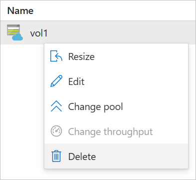

# Delete an Azure NetApp Files volume

This article describes how to delete an Azure NetApp Files volume.

> [!IMPORTANT] 
> If the volume you want to delete is in a replication relationship, follow the steps in [Delete source or destination volumes](cross-region-replication-delete.md#delete-source-or-destination-volumes). 

## Before you begin

* Stop any applications that may be using the volume. Unmount the volume from all hosts before deleting. 
* Remove the volume from automounter configurations such as `fstab`.

## Delete a volume

1. From the Azure portal and under storage service, select **Volumes**.  Locate the volume you want to delete.   
2. Right click the volume name and select **Delete**.   

    

## Next steps  

* [Delete volume replications or volumes](cross-region-replication-delete.md)
* [Troubleshoot volume errors for Azure NetApp Files](troubleshoot-volumes.md)
