# What changing to volume hard quota means for your Azure NetApp Files service

From the beginning of the service, Azure NetApp Files has been using a capacity-pool provisioning and automatic growth mechanism. Azure NetApp Files volumes are thinly provisioned on an underlying, customer-provisioned capacity pool of a selected tier and size. Volume sizes (quotas) are used to provide performance and capacity, and the quotas can be adjusted on-the-fly at any time. This behavior means that, currently, the volume quota is a performance lever used to control bandwidth to the volume. Currently, underlaying capacity pools automatically grow when the capacity fills up.   

> [!IMPORTANT] 
> The Azure NetApp Files behavior of volume and capacity pool provisioning will change to a *manual* and *controllable* mechanism. **Starting from April 30, 2021 (updated), volume sizes (quota) will manage bandwidth performance, as well as provisioned capacity, and underlying capacity pools will no longer grow automatically.** 

## Reasons for the change to volume hard quota

Many customers have indicated three main challenges with the *initial* behavior:
* VM clients would see the thinly provisioned (100 TiB) capacity of any given volume when using OS space or capacity monitoring tools, giving inaccurate client or application side capacity visibility.
* Application owners would have no control over provisioned capacity pool space (and associated cost), because of the capacity pool auto-grow behavior. This situation is cumbersome in environments where  “run-away processes” could rapidly fill up and grow the provisioned capacity and cost.
* Customers want to see and maintain a direct correlation between volume size (quota) and performance. With the current behavior of (implicit) oversubscribing a volume (capacity-wise) and pool auto-grow, customers do not have a direct correlation, until volume quota has been actively set or reset. 

Many customers have requested direct control over provisioned capacity. They want to control and balance storage capacity and utilization. They also want to control cost along with application-side and client-side visibility of available, used, and provisioned capacity and performance of their application volumes. 

## What is the volume hard quota change   

With the volume hard quota change, Azure NetApp Files volumes will no longer be thin provisioned at (the maximum) 100 TiB. The volumes will be provisioned at the actual configured size (quota). Also, the underlaying capacity pools will no longer automatically grow upon reaching full-capacity consumption. This change will reflect the behavior like Azure managed disks, which are also provisioned as-is, without automatic capacity increase.

For example, consider an Azure NetApp Files volume configured at 1-TiB size (quota) on a 4-TiB Ultra service level capacity pool. An application is continuously writing data to the volume.

The *initial* behavior:  
* Expected bandwidth: 128 MiB/s
* Total usable (and client visible) capacity: 100 TiB   
    You will not be able to write more data on the volume beyond this size.
* Capacity pool: Automatically grows with 1 TiB increments when it is full.
* Volume quota change: Only changes performance (bandwidth) of the volume. It does not change client visible or usable capacity.

The *changed* behavior:  
* Expected bandwidth: 128 MiB/s
* Total usable (and client visible) capacity: 1 TiB 
    You will not be able to write more data on the volume beyond this size.
* Capacity pool: Remains 4 TiB in size and does not automatically grow. 
* Volume quota change: Changes performance (bandwidth) and client visible or usable capacity of the volume.

You need to proactively monitor the utilization of Azure NetApp Files volumes and capacity pools. You need to purposely change the volume and pool utilization for close-to-full consumption. Azure NetApp Files will continue to allow for [on-the-fly volume and capacity pool resize operations](azure-netapp-files-resize-capacity-pools-or-volumes.md).

## How to operationalize the volume hard quota change

This section provides guidance on how to operationalize the change to volume hard quota for a smooth transition. It also provides insights for handling currently provisioned volumes and capacity pools, on-going monitoring, and alerting and capacity management options.

### Currently provisioned volumes and capacity pools

Because of the volume hard quota change, you should change your operating model. The provisioned volumes and capacity pools will require ongoing capacity management.  Because the changed behavior will happen instantly, the Azure NetApp Files team recommends a series of one-time corrective measures for existing, previously provisioned volumes and capacity pools, as described in this section.

#### One-time corrective or preventative measures recommendations  

The volume hard quota change will result in changes in provisioned and available capacity for previously provisioned volumes and pools. As a result, some capacity allocation challenges might happen. To avoid short-term out-of-space situations for customers, the Azure NetApp Files team recommends the following, one-time corrective/preventative measures: 

* **Provisioned volume sizes**:   
    Resize every provisioned volume to have appropriate buffer based on change rate and alerting or resize turnaround time (for example, 20% based on typical workload considerations), with a maximum of 100 TiB (which is the regular [volume size limit](azure-netapp-files-resource-limits.md#resource-limits). This new volume size, including buffer capacity, should be based on the following factors:
    * **Provisioned** volume capacity, in case the used capacity is less than the provisioned volume quota.
    * **Used** volume capacity, in case the used capacity is more than the provisioned volume quota.  
    There is no additional charge for volume-level capacity increase if the underlaying capacity pool does not need to be grown. As an effect of this change, you might observe a bandwidth limit *increase* for the volume (in case the [auto QoS capacity pool type](azure-netapp-files-understand-storage-hierarchy.md#qos_types) is used).

* **Provisioned capacity pool sizes**:   
    After the volume sizes adjustments, if the sum of volumes sizes becomes larger than the size of the hosting capacity pool, the capacity pool will have to be increased to a size equal to or larger than the sum of the volumes, with a maximum of 500 TiB (which is the [capacity pool size limit](azure-netapp-files-resource-limits.md#resource-limits)). Additional capacity pool capacity will be subject to ACR charge as normal.

You should work with your Azure NetApp Files specialists to validate your environment, if you need help with setting up monitoring or alerting as described in the sections below.

### Ongoing capacity management  

After performing the one-time corrective measures,  you should put together ongoing processes to monitor and manage capacity. The following sections provide suggestions and alternatives about capacity monitoring and management.

### Monitor capacity utilization

You can monitor capacity utilization at various levels. 

#### VM-level monitoring 

The highest level of monitoring (closest to the application) is from within the application virtual machine. You will observe a change in behavior in capacity reporting from within the VM client OS.

In the following two scenarios, consider an Azure NetApp Files volume configured at 1-TiB size (quota) on a 4-TiB, Ultra service-level capacity pool. 

##### Windows

Windows clients can check the used and available capacity of a volume by using the network mapped drive properties. You can use the **Explorer** -> **Drive** -> **Properties** option.  

The following examples show the volume capacity reporting in Windows *before* the changed behavior:

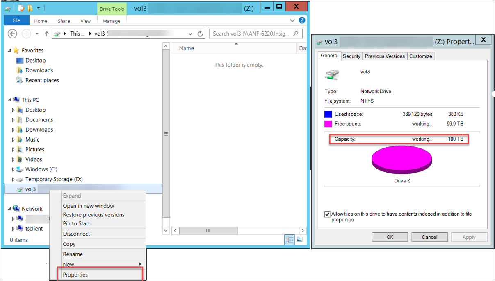

You can also use the `dir` command at the command prompt as shown below:

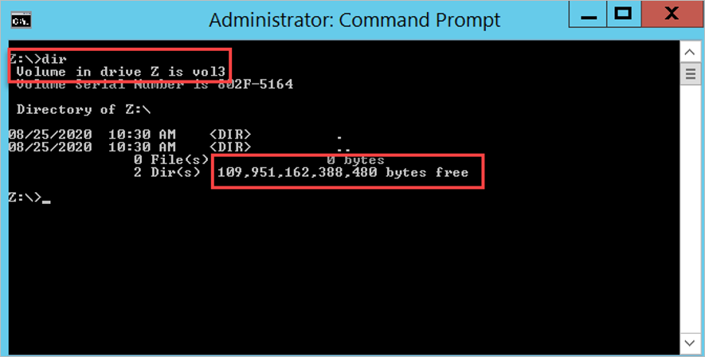

The following examples show the volume capacity reporting in Windows *after* the changed behavior:

The following example shows the `dir` command output:  

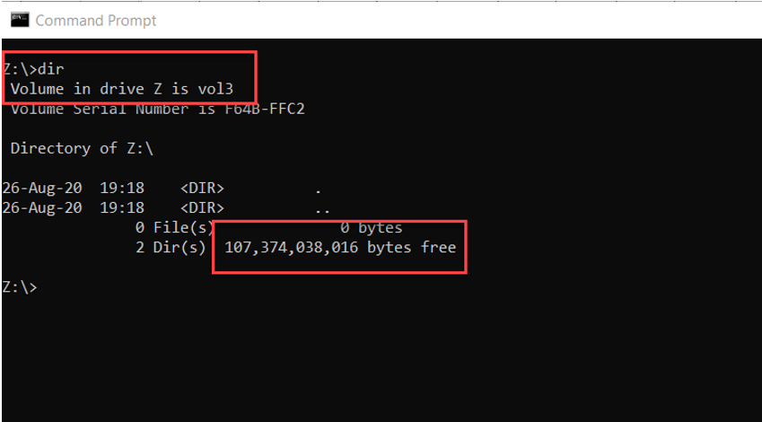

##### Linux 

Linux clients can check the used and available capacity of a volume by using the [`df` command](https://linux.die.net/man/1/df). The `-h` option will show the size, used space, and available space in human-readable format, using M, G, and T unit sizes.

The following example shows volume capacity reporting in Linux *before* the changed behavior:  

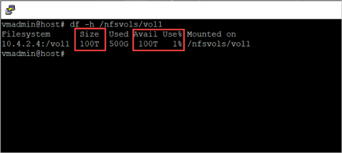

The following example shows volume capacity reporting in Linux *after* the changed behavior:  

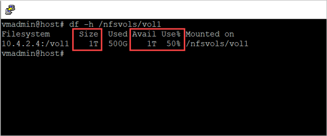

### Configure alerts using ANFCapacityManager

You can use the community-supported Logic Apps ANFCapacityManager tool to monitor Azure NetApp Files capacity and receive tailored alerting. The ANFCapacityManager tool is available on the [ANFCapacityManager GitHub page](https://github.com/ANFTechTeam/ANFCapacityManager).

ANFCapacityManager is an Azure Logic App that manages capacity-based alert rules. It automatically increases volume sizes to prevent your Azure NetApp Files volumes from running out of space. It is easy to deploy and provides the following Alert Management capabilities:

* When an Azure NetApp Files capacity pool or volume is created, ANFCapacityManager creates a metric alert rule based on the specified percent consumed threshold.
* When an Azure NetApp Files capacity pool or volume is resized, ANFCapacityManager modifies the metric alert rule based on the specified percent capacity consumed threshold. If the alert rule does not exist, it will be created.
* When an Azure NetApp Files capacity pool or volume is deleted, the corresponding metric alert rule will be deleted.

You can configure the following key alerting settings:  

* **Capacity Pool % Full Threshold** - This setting determines the consumed threshold that triggers an alert for capacity pools. A value of 90 would cause an alert to be triggered when the capacity pool reaches 90% consumed.
* **Volume % Full Threshold** - This setting determines the consumed threshold that triggers an alert for volumes. A value of 80 would cause an alert to be triggered when the volume reaches 80% consumed.
* **Existing Action Group for Capacity Notifications** - This setting is the action group that will be triggered for capacity-based alerting. This setting should be pre-created by you. The action group can send email, SMS, or other formats.

The following illustration shows the alert configuration:  

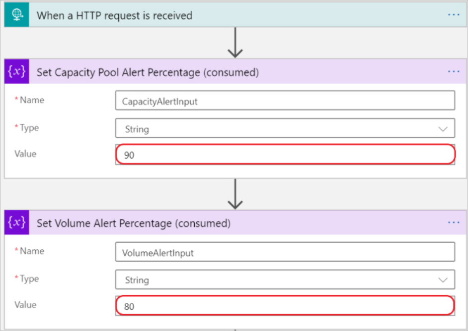

After installing ANFCapacityManager, you can expect the following behavior: When an Azure NetApp Files capacity pool or volume is created, modified, or deleted, the Logic App will automatically create, modify, or delete a capacity-based Metric Alert rule with the name `ANF_Pool_poolname` or `ANF_Volume_poolname_volname`. 

### Manage capacity

In addition to monitoring and alerting, you should also incorporate an application-capacity management practice to manage Azure NetApp Files (increased) capacity consumption. When an Azure NetApp Files volume or capacity pool fills up, [extra capacity can be provided on-the-fly without application disruption](azure-netapp-files-resize-capacity-pools-or-volumes.md). This section describes various manual and automated ways to increase volume and capacity pool provisioned space as needed.
 
#### Manual 

You can use the portal or the CLI to manually increase the volume or capacity pool sizes. 

##### Portal 

You can [change the size of a volume](azure-netapp-files-resize-capacity-pools-or-volumes.md#resize-a-volume-using-the-azure-portal) as necessary. A volume's capacity consumption counts against its pool's provisioned capacity.

1. From the Manage NetApp Account blade, select **Volumes**.  
2. Right-click the name of the volume that you want to resize or select the `…` icon at the end of the volume's row to display the context menu. 
3. Use the context menu options to resize or delete the volume.   

    

    

In some cases, the hosting capacity pool does not have sufficient capacity to resize the volumes. However, you can [change the capacity pool size](azure-netapp-files-resize-capacity-pools-or-volumes.md#resizing-the-capacity-pool-or-a-volume-using-azure-cli) in 1-TiB increments or decrements. The capacity pool size cannot be smaller than 4 TiB. *Resizing the capacity pool changes the purchased Azure NetApp Files capacity.*

1. From the Manage NetApp Account blade, select the capacity pool that you want to resize.
2. Right-click the capacity pool name or select the `…` icon at the end of the capacity pool’s row to display the context menu.
3. Use the context menu options to resize or delete the capacity pool.    

    

   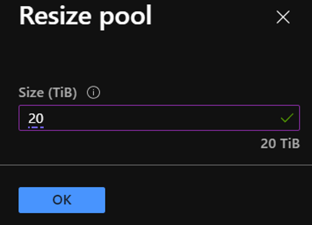 

##### CLI or PowerShell

You can use the [Azure NetApp Files CLI tools](azure-netapp-files-sdk-cli.md#cli-tools), including the Azure CLI and Azure PowerShell, to manually change the volume or capacity pool size.  The following two commands can be used to manage Azure NetApp Files volume and pool resources:  

* [`az netappfiles pool`](/cli/azure/netappfiles/pool)
* [`az netappfiles volume`](/cli/azure/netappfiles/volume)

To manage Azure NetApp Files resources using Azure CLI, you can open the Azure portal and select the Azure **Cloud Shell** link in the top of the menu bar: 

This action will open the Azure Cloud Shell:

[ 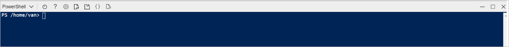 ](../media/azure-netapp-files/hard-quota-update-cloud-shell-window.png#lightbox)

The following examples use the commands to [show](/cli/azure/netappfiles/volume#az-netappfiles-volume-show) and [update](/cli/azure/netappfiles/volume#az-netappfiles-volume-update) the size of a volume:
 
[ 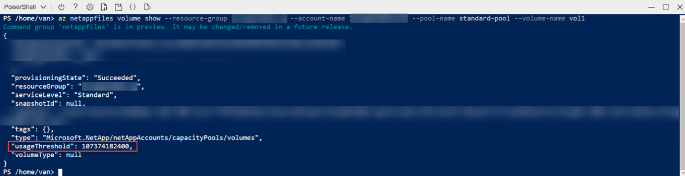 ](../media/azure-netapp-files/hard-quota-update-powershell-volume-show.png#lightbox)

[ 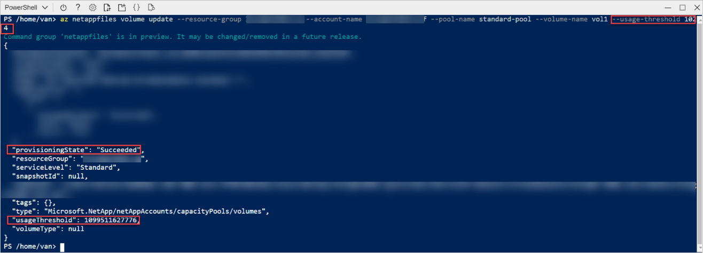 ](../media/azure-netapp-files/hard-quota-update-powershell-volume-update.png#lightbox)

The following examples use the commands to [show](/cli/azure/netappfiles/pool#az-netappfiles-pool-show) and [update](/cli/azure/netappfiles/pool#az-netappfiles-pool-update) the size of a capacity pool:

[ 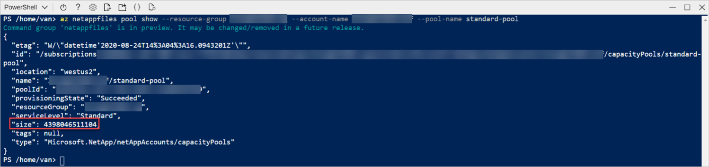 ](../media/azure-netapp-files/hard-quota-update-powershell-pool-show.png#lightbox) 

[ 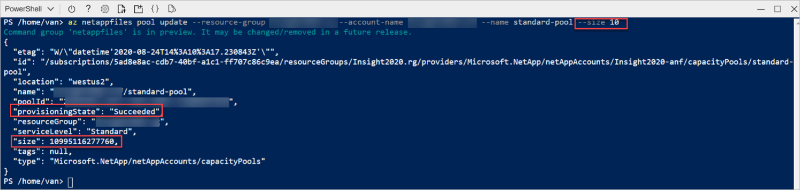 ](../media/azure-netapp-files/hard-quota-update-powershell-pool-update.png#lightbox)

#### Automated  

You can build an automated process to manage the changed behavior.

##### REST API   

The REST API for the Azure NetApp Files service defines HTTP operations against resources such as the NetApp account, the capacity pool, the volumes, and snapshots. The REST API specification for Azure NetApp Files is published through the [Azure NetApp Files Resource Manager GitHub page](https://github.com/Azure/azure-rest-api-specs/tree/main/specification/netapp/resource-manager)]. You can find [example code for use with REST APIs](https://github.com/Azure/azure-rest-api-specs/tree/main/specification/netapp/resource-manager/Microsoft.NetApp/stable/2020-06-01/examples) in GitHub.

See [Develop for Azure NetApp Files with REST API](azure-netapp-files-develop-with-rest-api.md). 

##### REST API using PowerShell  

The REST API for the Azure NetApp Files service defines HTTP operations against resources such as the NetApp account, the capacity pool, the volumes, and snapshots. The [REST API specification for Azure NetApp Files](https://github.com/Azure/azure-rest-api-specs/tree/main/specification/netapp/resource-manager) is published through GitHub.

See [Develop for Azure NetApp Files with REST API using PowerShell](develop-rest-api-powershell.md).

##### Capacity management using ANFCapacityManager

ANFCapacityManager is an Azure Logic App that manages capacity-based alert rules. It automatically increases volume sizes to prevent your Azure NetApp Files volumes from running out of space. In addition to sending alerts, it can enable the automatic increase of volume and capacity pool sizes to prevent your Azure NetApp Files volumes from running out of space: 

* Optionally, when an Azure NetApp Files Volume reaches the specified percent consumed threshold, the volume quota (size) will be increased by the percent specified between 10-100.  
* If increasing the volume size exceeds the capacity of the containing capacity pool, the capacity pool size will also be increased to accommodate the new volume size.

You can configure the following key capacity management setting:  

* **AutoGrow Percent Increase** - Percent of the existing volume size to automatically grow a volume if it reaches the specified **% Full Threshold**. A value of 0 (zero) will disable the AutoGrow feature. A value between 10 and 100 is recommended.

     

## FAQ 

This section answers some questions about the volume hard quota change. 

### Does snapshot space count towards the usable or provisioned capacity of a volume?

Yes, the consumed snapshot capacity counts towards the provisioned space in the volume. In case the volume runs full, consider two remediation options:

* Resize the volume as described in this article.
* Remove older snapshots to free up space in the hosting volume.

### Does this change mean the volume auto-grow behavior will disappear from Azure NetApp Files?

A common misconception is that Azure NetApp Files *volumes* would automatically grow upon filling up. Volumes were thinly provisioned with a size of 100 TiB, regardless of the actual set quota, while the underlaying *capacity pool* would automatically grow with 1-TiB increments. This change will address the (visible and usable) *volume* size to the set quota, and *capacity pools* will no longer automatically grow. This change results in commonly desired accurate client-side space and capacity reporting. It avoids "runaway" capacity consumption.

### Does this change have any effect on volumes replicated with cross-region-replication (preview)? 

The hard volume quota is not enforced on replication destination volumes.

### Does this change have any effect on metrics currently available in Azure Monitor?

Portal metrics and Azure Monitor statistics will accurately reflect the new allocation and utilization model.

### Does this change have any effect on the resource limits for Azure NetApp Files?

There's no change in resource limits for Azure NetApp Files beyond the quota changes described in this article.

### Is there an example ANFCapacityManager workflow?  

Yes. See the [Volume AutoGrow Workflow Example GitHub page](https://github.com/ANFTechTeam/ANFCapacityManager/blob/master/ResizeWorkflow.md).

### Is ANFCapacityManager Microsoft supported?  

[The ANFCapacityManager logic app is provided as-is and is not supported by NetApp or Microsoft](https://github.com/ANFTechTeam/ANFCapacityManager#disclaimer). You're encouraged to modify to fit your specific environment or requirements. You should  test the functionality before deploying it to any business critical or production environments.

### How can I report a bug or submit a feature request for ANFCapacityManger?
You can submit bugs and feature requests by selecting **New Issue** on the [ANFCapacityManager GitHub page](https://github.com/ANFTechTeam/ANFCapacityManager/issues).

## Next steps
* [Resize a capacity pool or a volume](azure-netapp-files-resize-capacity-pools-or-volumes.md) 
* [Metrics for Azure NetApp Files](azure-netapp-files-metrics.md)
