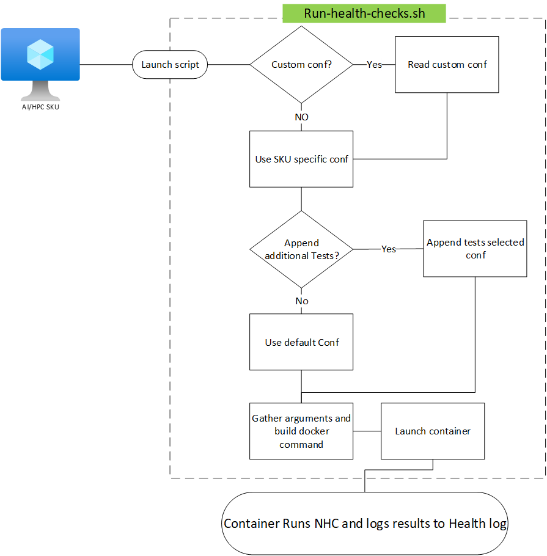
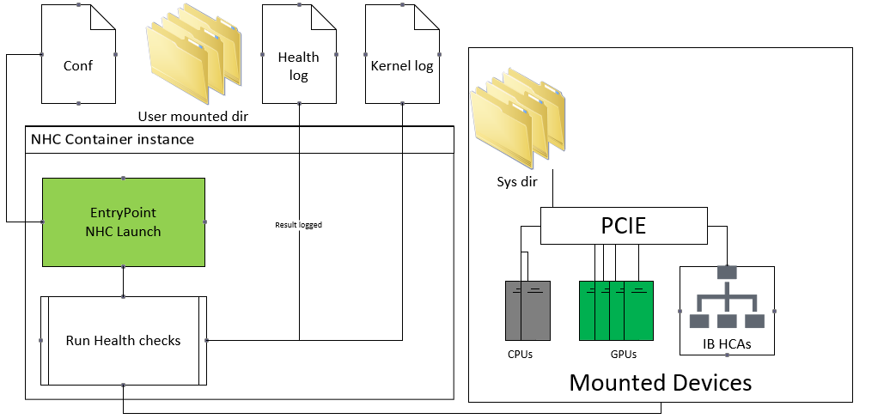

# AzureHPC Node Health Checks

## Description

[Azure Node Health Checks (AzNHC)](https://github.com/Azure/azurehpc-health-checks) provides a suite of tests that target Azure AI/HPC VM offerings. AzNHC is an extension of the existing test suite, [LBNL Node Health Checks](https://github.com/mej/nhc). It combines Azure custom and NHC default checks to target AI and HPC components internal to a VM/node.

## Key Features
1. All checks are single node and runtime is relatively short up to 5 minutes.
1. Easy set up and use. See the [quickstart guide](./quickstart.md).
1. Targets AI/HPC hardware components (GPU, InfiniBand, CPU). See the [test coverage page](./test-coverage.md).
1. Customizable tests. See the detailed [running AzNHC guide](./running-health-checks.md).

## Recommended Usage
AzNHC can be used in a few ways to validate node health.
1. Validate VM health before launching intended AI/HPC workload.
1. Validate idle VM capacity on a reoccurring interval. 
1. Validate suspected faulty VMs to troubleshoot and isolate issues. In cases where performance degradation is observed by other means (i.e. performance drop during AI/HPC workload).

## Supported VM SKU Offerings
Refer to the [AzNHC Github page](https://github.com/Azure/azurehpc-health-checks) for the supported VM SKUs.

## Design
AzNHC is launched via the [run script](https://github.com/Azure/azurehpc-health-checks/blob/main/run-health-checks.sh). This deploys a docker container which performs the targeted health checks. Refer to sections [Work Flow](#work-flow) and [Container Diagram](#container-diagram) below for more details.

### Work Flow
The AzNHC process begins by launching run-health-checks script. The work flow follows the below graphic:

### Container Diagram

## Health Checks

The checks presented here are Azure custom checks. If you would like to learn more about the default NHC tests, find out more at [Node Health Checks project](https://github.com/mej/nhc).

The following are Azure custom checks added to the existing NHC suite of tests:

| Check | Component Tested | nd96asr_v4 expected| nd96amsr_a100_v4 expected | nd96isr_h100_v5 expected | hx176rs expected | hb176rs_v4 expected |
|-----|-----|-----|-----|-----|-----|-----|
| check_gpu_count | GPU count | 8 | 8 | 8 | NA | NA |
| check_nvlink_status | NVlink | no inactive links | no inactive links  | no inactive links  | NA | NA |
| check_gpu_xid | GPU XID errors | not present | not present | not present | NA | NA |
| check_nvsmi_healthmon | Nvidia-smi GPU health check | pass | pass | pass | NA | NA |
| check_gpu_bandwidth | GPU DtH/HtD bandwidth | 23 GB/s | 23 GB/s | 52 GB/s | NA | NA |
| check_gpu_ecc | GPU Mem Errors (ECC) |  20000000 | 20000000 | 20000000 | NA | NA |
| check_gpu_clock_throttling | GPU Throttle codes assertion | not present | not present | not present | NA | NA |
| check_nccl_allreduce | GPU NVLink bandwidth | 228 GB/s | 228 GB/s | 460 GB/s | NA | NA |
| check_ib_bw_gdr | InfiniBand device (GDR) bandwidth | 180 GB/s | 180 GB/s | 380 GB/s | NA | NA |
| check_ib_bw_non_gdr | InfiniBand device (non GDR) bandwidth | NA | NA | NA | 390 GB/s | 390 GB/s |
| check_nccl_allreduce_ib_loopback | GPU/GPU Direct RDMA(GDR) + InfiniBand device bandwidth | 18 GB/s | 18 GB/s | NA | NA | NA |
| check_hw_topology | InfiniBand/GPU device topology/PCIE mapping | pass | pass | pass | NA | NA |
| check_ib_link_flapping | InfiniBand link flap occurrence  | not present | not present | not present | not present | not present |
| check_cpu_stream | CPU compute/memory bandwidth | NA | NA | NA | 665500 MB/s | 665500 MB/s |

Note: See the [test coverage page](./test-coverage.md) for more detailed descriptions.

## References
- [Azure HPC Node Health Checks](https://github.com/Azure/azurehpc-health-checks)
- [LBNL Node Health Checks](https://github.com/mej/nhc)
- [Azure HPC Images](https://github.com/Azure/azhpc-images)
