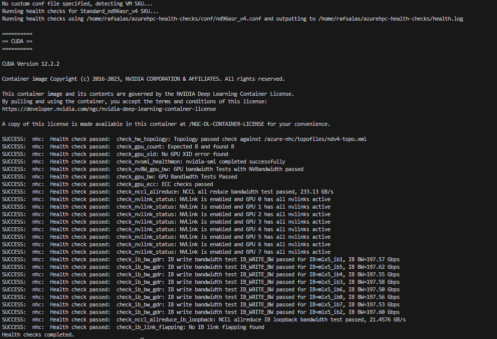
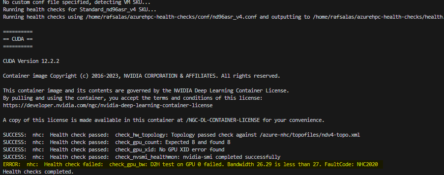

# Using Azure Node Health Checks
This page provides a detailed guide to using AzNHC. Refer to the [quick start guide](./quickstart.md) for streamlined instructions.

## Getting AzNHC
Clone the project from Github:
```git clone https://github.com/Azure/azurehpc-health-checks.git```


## Usage

- Invoke health checks using the run script that determines SKU and runs the appropriate checks:
```sudo ./run-health-checks.sh [-h|--help] [-c|--config <path to an NHC .conf file>] [-o|--output <directory path to output all log files>] [-a|--all_tests] [-v|--verbose] [-d| --mount_dir]```

  - See help menu for more options:

    | Option        | Argument    | Description                                                                                                                                   |
    |---------------|-------------|-----------------------------------------------------------------------------------------------------------------------------------------------|
    | -h, --help    |             | Display this help                                                                                                                             |
    | -c, --config  | conf file   | Optional path to a custom NHC config file. If not specified the current VM SKU will be detected and the appropriate conf file will be used.   |
    | -o, --output  | log file    | Optional path to output the health check logs to. All directories in the path must exist. If not specified it will use output to ./health.log |
    | -t, --timeout | n seconds   | Optional timeout in seconds for each health check. If not specified it will default to 500 seconds.                                           |
    | -a, --all     |             | Run ALL checks; don't exit on first failure.                                                                                                  |
    | -v, --verbose |             | If set, enables verbose and debug outputs.                                                                                                    |
    | -d, --mount_dir | dir path  | Optional path to mount directories to the docker container. Provide single directory or comma separate directories. All directories will have the same path but with the prefix /mnt/ added to the path within the container. |

  - Adding more tests to the configuration files may require modifying the time flag (-t) to avoid timeout. For the default tests provided we recommend setting the time out to 500 seconds but this may vary from machine to machine.

### Example Usage:
  1. Run all tests to completion (Don't exit on individual test failure): ```sudo ./run-health-checks.sh -a'''
  1. Increased logging:  ```sudo ./run-health-checks.sh -v'''
  1. Provide custom conf file:  ```sudo ./run-health-checks.sh -c mycustomfile.conf'''
  1. Specify different log file path: ```sudo ./run-health-checks.sh -o /my/path/mylogfile.log'''

## Running NHC

### Things to Note
  - If the AzNHC container was not pulled down previously then AzNHC will need acquire the image from the AzNHC registry. First use of AzNHC will incur additional runtime due to this.
  - Typical runtime for AzNHC is up to 5 minutes excluding the first time the container is pulled down from the registry.
  - Additional arguments can be used to configure AzNHC. Check the help menu for more options.
 
### Running NHC
  1. Launch AzNHC: ``` sudo ./run-health-checks.sh ```
  1. AzNHC will output results to terminal as well as the health log ( health.log by default).
  1. If no errors are encountered then the health checks have completed successfully.
  1. In the event of an error refer to [reviewing results page](./reviewing-results.md).
  1. Refer to [Kusto export guide](./export-kusto.md) for instructions on how to export logs to Kusto.

### Example Output

#### Pass

#### Fail

