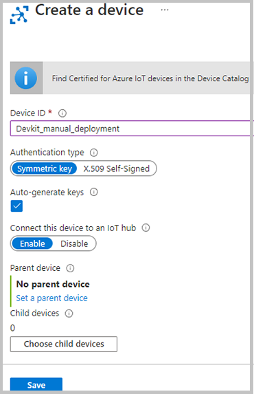
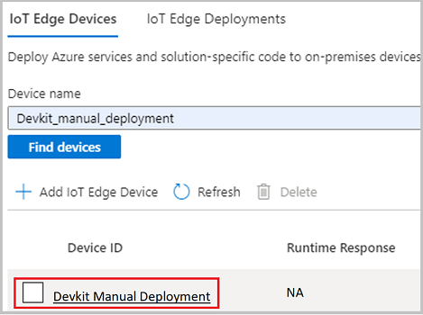
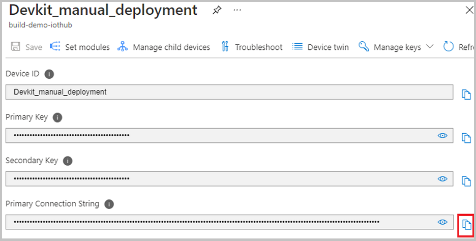

# Manually create and deploy an Azure Precept Devkit 
The following guide is to help customers manually deploy a factory fresh IoT Edge deployment to existing Azure Percept devices. We have also included the steps to manually create your Azure Percept IoT Edge device instance.

## Prerequisites

- Highly recommended: Update your Percept Devkit to the [latest version](./software-releases-usb-cable-updates.md)
- Azure account with IoT Hub created 
- Install [VSCode](https://code.visualstudio.com/Download)
- Install the [Azure IoT Tools](https://marketplace.visualstudio.com/items?itemName=vsciot-vscode.azure-iot-tools) Extension for VSCode
- Find the software image version running on your Percept Devkit (see below). 

## How to identify your Azure Percept Devkit software version 

SSH (Secure Shell) into your devkit and run the following command then write down the output for later reference. 

`cat /etc/adu-version`

Example output: 2021.111.124.109 

## Create an Azure IoT Edge device for the Devkit
If you have a device already created, you can skip to the [Manually deploy the deployment.json to the device](#manually-deploy-the-deploymentjson-to-the-azure-percept-device) section. 
1. Go to [Azure portal](https://portal.azure.com) and select the **IoT Hub** where you will create the device. 
2. Navigate to **IoT Edge** and select **Add an IoT Edge device**
3. On the **Create a Device** screen, name your device in the **Device ID** section and leave all other fields as default, then click the **Save** button.  

1. Select your newly created device.  

2. Copy the **Primary Connection String**. We will use this copied text in the Azure Percept Onboarding/setup web pages.  
   

## Connect to and Setup the Devkit 
<!-- Introduction paragraph -->
1. Setup your Devkit using the main instructions and **STOP** at to the **Select your preferred configuration** page 
1. Select **Connect to an existing device** 
1. Paste the **Primary Connection String** that you copied from the earlier steps. 
2. Click Finish. 
3. The **Device setup complete!** page should now display.  
   **If this page does not disappear after 10 secs, don’t worry. Just go ahead with the next steps** 
4. You will be disconnected from the Devkit’s Wi-Fi hotspot. Reconnect your computer to your main Wi-Fi (if needed).  

## Manually deploy the deployment.json to the Azure Percept device 
The deployment.json files are a representation of all default modules necessary to begin using the Azure Percept devkit. 
1. Download the appropriate deployment.json from [GitHub](https://github.com/microsoft/azure-percept-advanced-development/tree/main/default-configuration) for your reported software version. Refer to the [How to Identify your Azure Percept Devkit software version](#how-to-identify-your-azure-percept-devkit-software-version) section above.
   1. For 2021.111.124.xxx and later   -----> use [default-deployment-2112.json](https://github.com/microsoft/azure-percept-advanced-development/blob/main/default-configuration/default-deployment-2112.json)
   2. For 2021.109.129.xxx and lower use ----> use [default-deployment-2108.json](https://github.com/microsoft/azure-percept-advanced-development/blob/main/default-configuration/default-deployment-2108.json)
2. Launch VSCode and Sign into Azure. Be sure you have installed the [Azure IoT Tools](https://marketplace.visualstudio.com/items?itemName=vsciot-vscode.azure-iot-tools) Extension 
3. Connect to your subscription and select your IoTHub 
4. Locate your IoT Edge Device then right click it and choose **Create deployment for a Single Device**.  
 

5. Navigate to the "Deployment.json" you saved from step 1 and use this. 
6. Deployment will take 1-5 mins to fully complete. 
   1. For those interested in watching the IoT Edge log as this deployment is going on, you can SSH into your Azure Percept devkit and watch the iotedge logs by issuing the command below.  
    `sudo journalctl -u iotedge -f` 
7. Your Devkit is now ready to use!

<!-- 5. Next steps
Required. Provide at least one next step and no more than three. Include some 
context so the customer can determine why they would click the link.
-->

## Next steps
Navigate to the [Azure Percept portal](https://ms.portal.azure.com/#blade/AzureEdgeDevices/Main/overview) for more AI models. 