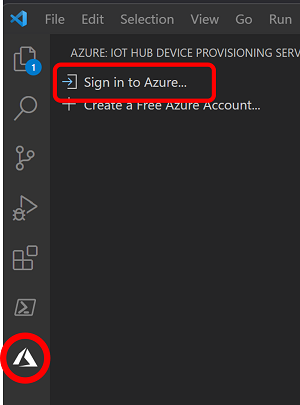
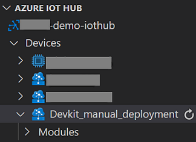
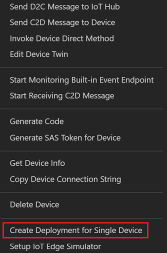

# How to do a manual default container deployment to Azure Percept DK 

[!INCLUDE [Retirement note](./includes/retire.md)]

The following guide is to help customers manually deploy a factory fresh IoT Edge deployment to existing Azure Percept devices. We've also included the steps to manually create your Azure Percept IoT Edge device instance.

## Prerequisites

- Highly recommended: Update your Azure Percept DK to the [latest version](./software-releases-usb-cable-updates.md)
- Create an Azure account with an IoT Hub 
- Install [VSCode](https://code.visualstudio.com/Download)
- Install the [Azure IoT Tools](https://marketplace.visualstudio.com/items?itemName=vsciot-vscode.azure-iot-tools) Extension for VSCode
- Find the software image version running on your Azure Percept Devkit (see below)

## Identify your Azure Percept DK software version 

Using SSH (Secure Shell), run the command line below. Write down the output for later reference. 

`cat /etc/adu-version`

Example output: 2021.111.124.109 

## Create an Azure IoT Edge device for the Azure Percept DK
If you already have an IoT Edge device instance created in your subscription for the devkit, you can skip to the [Manually deploy the deployment.json to the Azure Percept DK](#manually-deploy-the-deploymentjson-to-the-azure-percept-dk) section. 
1. Go to [Azure portal](https://portal.azure.com) and select the **IoT Hub** where you'll create the device 
2. Navigate to **IoT Edge** and select **Add an IoT Edge device**
3. On the **Create a Device** screen, name your device in the **Device ID** section and leave all other fields as default, then select **Save**  
:::image type="content" source="./media/manually-deploy-azure-precept-devkit-images/create-device.png" alt-text="create new device":::

1. Select your newly created device  
:::image type="content" source="./media/manually-deploy-azure-precept-devkit-images/select-new-device.png" alt-text="select new device.":::

2. Copy the **Primary Connection String**, we will use this copied text in the Azure Percept Onboarding/setup web pages  
:::image type="content" source="./media/manually-deploy-azure-precept-devkit-images/primary-connection-string.png" alt-text="primary connection string.":::

## Connect to and set up the Azure Percept DK
<!-- Introduction paragraph -->
1. Set up your devkit using the main instructions and **STOP** at to the **Select your preferred configuration** page 
1. Select **Connect to an existing device** 
1. Paste the **Primary Connection String** that you copied from the earlier steps
2. Select Finish 
3. The **Device set up complete!** page should now display 
   **If this page does not disappear after 10 secs, don’t worry. Just go ahead with the next steps** 
4. You'll be disconnected from the devkit’s Wi-Fi hotspot, reconnect your computer to your main Wi-Fi (if needed)  

## Manually deploy the deployment.json to the Azure Percept DK

The deployment.json files are a representation of all default modules necessary to begin using the Azure Percept DK. 
1. Download the appropriate deployment.json from [GitHub](https://github.com/microsoft/azure-percept-advanced-development/tree/main/default-configuration) for your reported software version. Refer to the [Identify your Azure Percept DK software version](#identify-your-azure-percept-dk-software-version) section above.
   1. For 2021.111.124.xxx and later, use [default-deployment-2112.json](https://github.com/microsoft/azure-percept-advanced-development/blob/main/default-configuration/default-deployment-2112.json)
   2. For 2021.109.129.xxx and lower, use [default-deployment-2108.json](https://github.com/microsoft/azure-percept-advanced-development/blob/main/default-configuration/default-deployment-2108.json)
2. Launch VSCode and Sign into Azure. Be sure you've installed the [Azure IoT Tools](https://marketplace.visualstudio.com/items?itemName=vsciot-vscode.azure-iot-tools) Extension.  
   
   

3. Connect to your subscription and select your IoT Hub 
4. Locate your IoT Edge Device then right select it and choose **Create deployment for a Single Device**.  

      

5. Navigate to the "Deployment.json" you saved from step 1 and select it. Then select OK.
6. Deployment will take 1-5 minutes to fully complete 
   1. If you are interested in watching the Azure IoT Edge log while the deployment is going on, you can SSH into your Azure Percept DK and watch the Azure IoT Edge logs by issuing the command below.  
    `sudo journalctl -u iotedge -f` 
7. Your Azure Percept DK is now ready to use!

<!-- 5. Next steps
	@@ -77,4 +76,4 @@ context so the customer can determine why they would click the link.
-->

## Next steps
Navigate to the [Azure Percept Studio](https://portal.azure.com/#blade/AzureEdgeDevices/Main/overview) for more AI models. 

