# Create a people counting solution with Azure Percept Vision  

[!INCLUDE [Retirement note](./includes/retire.md)]

This guide will focus on detecting and counting people using the Azure Percept DK hardware, Azure IoT Hub, Azure Stream Analytics, and Power BI dashboard. 

The tutorial is intended to show detailed steps on how users can create, configure, and implement the basic components of this solution. Users can easily expand the tutorial and create additional ways to visualize people counting data. 

Top customer scenarios:
- People counting intelligence: aggregation of people counting over a given day, week, or duration. 
- Occupancy: determine when a space is free and available for use. Quantify how long the space is idle and unused. 
- Understanding peak occupancy levels and when they occur. 
- Detecting people counting after hours: count of people in space during non-business hours. 

In this tutorial, you learn how to:

- Set up your Azure Percept DK and Vision AI model
- Create a Container Registry resource
- Build and push your edge solution to Container Registry 
- Deploy edge solution to device
- Add a consumer group to your IoT Hub
- Create a Stream Analytics Job
- Create and publish a Power BI report to visualize data
  
## Solution architecture
[ 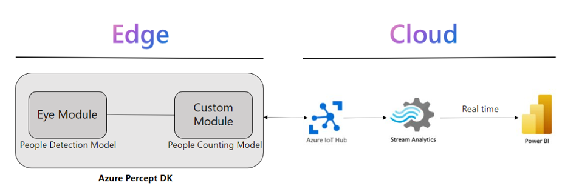 ](./media/create-people-counting-solution-with-azure-percept-vision-images/solution-architecture.png#lightbox)

- Input : Video stream from Azure Percept DK

- Output: Count of people in Power BI dashboard 
  
[ 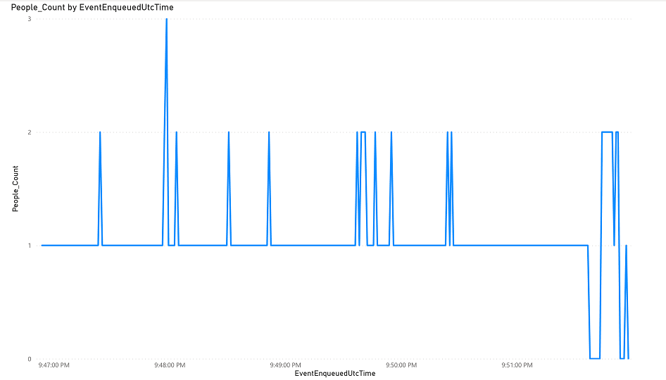 ](./media/create-people-counting-solution-with-azure-percept-vision-images/power-bi.png#lightbox)

- Azure Subscription: ([Free trial account](https://azure.microsoft.com/free/))
- Power BI subscription: ([Try Power BI for free](https://go.microsoft.com/fwlink/?LinkId=874445&clcid=0x409&cmpid=pbi-gett-hero-try-powerbifree))
- Power BI workspace: ([Create the new workspaces in Power BI](https://github.com/MicrosoftDocs/powerbi-docs/blob/main/powerbi-docs/collaborate-share/service-create-the-new-workspaces.md))
- [Azure Percept DK setup experience](./quickstart-percept-dk-set-up.md): you connected your devkit to a Wi-Fi network, created an IoT Hub, and connected your devkit to the IoT Hub
- Download and install [VS Code]()
- Download and install [Git]()
- Install the IoT Hub Extension in VS Code
- Install the Azure IoT Tools Extension in VS Code
- Download and install [Docker Desktop]() (Will require a PC reboot)
- (Only for Windows Users) Install WSL2 by running the following commands in Windows PowerShell or Terminal (on macOS) (Will require a PC restart)

    `wsl --install`

    `wsl --set-default-version 2`

## Step 0: Set up your Azure Percept DK and Vision AI model
Setting up the Azure Percept DK is the first step in the tutorial. Below are the steps to follow and links to further guidance. 

1. Follow [Quickstart: unbox and assemble your Azure Percept DK components](./quickstart-percept-dk-unboxing.md) and the next steps.
2. Connect the camera module to the Azure Percept DK via the USB-C cable.
3. Open Command Prompt (for Windows) or Terminal (on macOS) and execute the command-

    `git clone https://github.com/microsoft/Azure-Percept-Reference-Solutions.git` 

    Within the cloned repository go to `people-counting-with-azure-percept-vision` directory.

## Step 1: Create a Container Registry resource
Azure Container Registry is a managed, private Docker registry service based on the open-souce Docker Registry. Container Registries are used to manage and store your private Docker containers images and related artifacts. 

1. Login to Azure portal https://portal.azure.com/
2. To create a Container Registry, go to [Create container registry - Microsoft Azure](https://portal.azure.com/#create/Microsoft.ContainerRegistry)

    a. Select your Azure Subscription in the `Subscription` drop-down box 

    b. Select your preferred resource group from the `Resource group` drop-down menu. It is recommended to use the `Resource group` which contains the IOT Hub connected to the Azure Percept DK. 

    c. Provide a unique `Registry Name`

    d. Under `Location`, select the region to deploy resource (We suggest select `West US`) 

    e. `Availability Zones` - disabled

    f. For `SKU`, select `Standard`  

    g. Keep all other tab as default and click `Review + create` at the bottom of the screen. Once the validation passes, click `Create`. This will create your Container Registry. 

    :::image type="content" source="./media/create-people-counting-solution-with-azure-percept-vision-images/container-registry.png" alt-text="Container Registry Creation.":::
3. After successful resource deployment go to your container registry resource. On the left scroll panel select `Access Keys` under `Settings` and `enable` the `Admin user` 
    :::image type="content" source="./media/create-people-counting-solution-with-azure-percept-vision-images/access-keys.png" alt-text="Container Registry access key setting.":::
4. Make a note of the `Login Server`, `Username`, and `password` 
    :::image type="content" source="./media/create-people-counting-solution-with-azure-percept-vision-images/access-keys-1.png" alt-text="Container Registry login.":::
5. Go to the git repository and `people-counting-with-azure-percept-vision` directory and rename `envtemplate` to `.env`. Open the file and fill in the following details-

    a. CONTAINER_REGISTRY_USERNAME= your container registry Username

    b. CONTAINER_REGISTRY_PASSWORD= your container registry Password

    c. CONTAINER_REGISTRY_LOGINSERVER= your container registry Login Server

    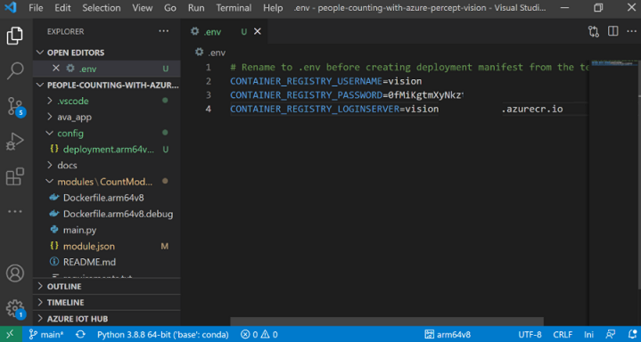

## Step 2: Build and push your edge solution to Container Registry
This section guides users on modifying the cloned people counting repo with their individual deployment information, building the model image, and pushing model image to container registry.  

1. Open VS Code, at the bottom of the screen ensure you have `arm64v8` as the `Default Platform for IoT Edge Solution` selected (if not, then please click and select arm64v8 from the list)

    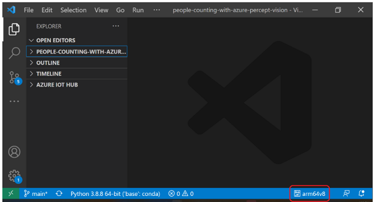

2. Within the `people-counting-with-azure-percept-vision` directory go to `modules/CountModule/` directory and open `module.json`. Fill in your `Container registry address` (same as the `Login server` saved earlier) and followed by a `repository name` **(Note- please make sure your repository name is all lowercase)** 

    `"repository": "<Your container registry login server/repository name>"` 
    
    will change as 	follows, for example-

    `"repository": "visiontrainingacr.azurecr.io/countmodule"`
    
    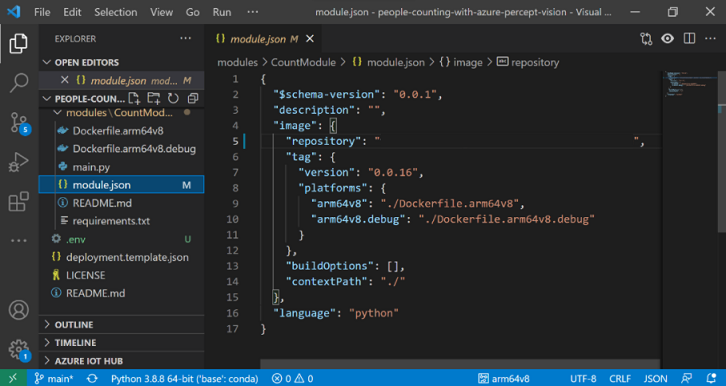

3. Now you will build the module image and push it to your container registry. Open Visual Studio Code integrated terminal by selecting `View > Terminal `

4. Sign into Docker with the Azure Container registry (ACR) credentials that you saved after creating the registry using below command in terminal. Note that this command would give a warning that using --password or -p via CLI is insecure. Therefore, if you want a more secure login for your future solution development, use `--password-stdin` instead by following [this instruction](https://docs.docker.com/engine/reference/commandline/login/).  

    `docker login -u <ACR username> -p <ACR password> <ACR login server>`
    
5. Visual Studio Code now has access to your container registry. In the next steps you will turn the solution code into a container image. In Visual Studio Code explorer, right click the `deployment.template.json` file and select `Build and Push IoT Edge Solution`

    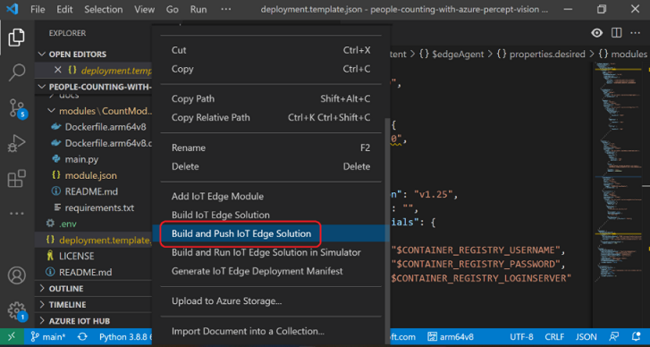

    The build and push command starts three operations. First, it creates a new folder in the solution called `config` that holds the full deployment manifest, built out of information in the deployment template and other solution files. Second, it runs `docker build` to build the container image based on the appropriate docker file for your target architecture. Then, it runs `docker push` to push the image repository to your container registry. This process may take several minutes the first time but is faster the next time that you run the commands.

6. Open the `deployment.arm64v8.json` file in the newly created config folder. The filename reflects the target architecture, so it will be different if you choose a different architecture.

7. Notice that the two parameters that had placeholders now are filled in with their proper values. The `registryCredentials` section has your registry username and password pulled from the .env file. The `CountModule` has the full image repository with the `name`, `version`, and `architecture` tag from the `module.json` file. 

8. To further verify what the build and push command did, go to the Azure portal, and navigate to your container registry. In your container registry, select `Repositories` then `countmodule`

    :::image type="content" source="./media/create-people-counting-solution-with-azure-percept-vision-images/azure-container-registry.png" alt-text="Select repositories.":::

## Step 3: Deploy edge solution to device
Step 3 will guide users on creating and deploying a manifest to the Azure Percept Dev Kit. This deployment will create a new edge module ‘CountModule’ and will overwrite any previous deployments of ‘CountModule’. 

1. In the Visual Studio Code explorer, under the `Azure IoT Hub` section, expand `Devices` to see your list of IoT devices 

2. Right-click the IoT Edge device that you want to deploy to, then select `Create Deployment for Single Device`

    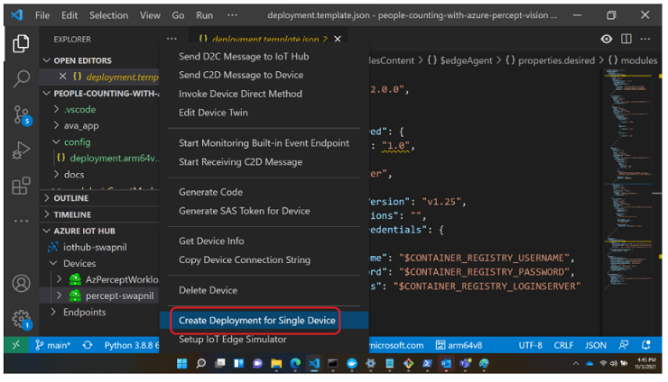

3. In the file explorer, navigate into the `config` folder then select the `deployment.arm64v8.json` file and click `Select Edge Deployment Manifest`. 

    **Do not use the deployment.template.json file, which does not have the container registry credentials or module image values in it.**

4. Under your device, expand `Modules` to see a list of deployed and running modules. Click the refresh button. You should see the `CountModule` running on your device.

    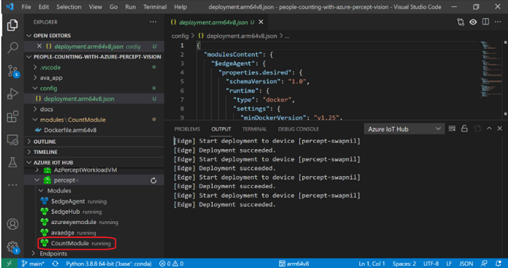

5. Go to [Azure Percept Studio](https://portal.azure.com/#blade/AzureEdgeDevices/Main/devices) and on the left panel, select Devices, then select your Azure Percept device 

    :::image type="content" source="./media/create-people-counting-solution-with-azure-percept-vision-images/devices.png" alt-text="Select devices.":::

6. Ensure that your device is `Connected`. Click on `Vision`
    
    :::image type="content" source="./media/create-people-counting-solution-with-azure-percept-vision-images/vision.png" alt-text="check for device connected.":::

7. Click `View your device stream `

    :::image type="content" source="./media/create-people-counting-solution-with-azure-percept-vision-images/device-stream.png" alt-text="View your device stream.":::

8. The previous step will deploy modules to your device. In the `Notifications` tab click `View Stream`. This will open a new tab in your browser, please verify that you see the video stream. If you point the camera module to a person then you will see the person detection with bounding box

    :::image type="content" source="./media/create-people-counting-solution-with-azure-percept-vision-images/stream.png" alt-text="Verify the video stream.":::

9. After verifying the video stream and bounding boxes, please close the web stream browser tab. 

10. To ensure the Count Module is setup correctly, in the Azure portal go to your IoT Hub. On the left panel under `Device management `select `IoT Edge`

    :::image type="content" source="./media/create-people-counting-solution-with-azure-percept-vision-images/iot-edge.png" alt-text="Select IoT edge.":::

11. From the IoT device list click on your Azure Percept DK device

    :::image type="content" source="./media/create-people-counting-solution-with-azure-percept-vision-images/device.png" alt-text="Azure Percept DK device.":::

12. Scroll down to check if all deployed modules are in `running` status 

    :::image type="content" source="./media/create-people-counting-solution-with-azure-percept-vision-images/running.png" alt-text="Check the running status.":::

13. Click `Troubleshoot`

    :::image type="content" source="./media/create-people-counting-solution-with-azure-percept-vision-images/troubleshoot.png" alt-text="Choose troubleshoot.":::

14. From the drop-down list select `CountModule`

    :::image type="content" source="./media/create-people-counting-solution-with-azure-percept-vision-images/dropdown.png" alt-text="View count module.":::

15. Ensure you see `People_Count` logs as follows-

    :::image type="content" source="./media/create-people-counting-solution-with-azure-percept-vision-images/logs.png" alt-text="Check the box.":::

## Step 4: Add a consumer group to your IoT Hub
Consumer Groups provide independent views into the event stream that enable apps and Azure services to independently consume data. This consumer group will be used by the Stream Analytics Job we will create in Step 5.

1. In the [Azure portal](https://portal.azure.com), go to your IoT hub which is connected to your Azure Percept DK. 

2. On the left pane, select `Hub settings > Built-in endpoints`. Enter a name for your new consumer group in the text box under `Consumer Groups`

    :::image type="content" source="./media/create-people-counting-solution-with-azure-percept-vision-images/consumer-group.png" alt-text="New consumer group.":::

3. Click anywhere outside the text box to save the consumer group

## Step 5: Create a Stream Analytics job
Step 5 guides users through creating, configuring, and running a Stream Analytics job. Stream Analytics is a hot path to stream data from out Azure IoT Hub to a Power BI workspace in real time. We will create a query so only People Counting telemetry will be streamed. Once People Counting data is in our Power BI workspace it will be easy to render with a Power BI report.

1. Go to New [Stream Analytics job - Microsoft Azure](https://portal.azure.com/#create/Microsoft.StreamAnalyticsJob) 

2. Enter the following information for the job - 

    - `Job name` - The name of the job. The name must be globally unique. 

    - `Resource group` - Use the same resource group that your IoT hub uses. 

    - `Location` - Use the same location as your resource group. 

    :::image type="content" source="./media/create-people-counting-solution-with-azure-percept-vision-images/stream-analytics-job.png" alt-text="New Stream Analytics job.":::

3. Click `Create`

### Add an input to the Stream Analytics job
1. Open the previously created Stream Analytics job. Under `Job topology`, select `Inputs`

2. In the `Inputs` pane, select `Add stream input`, then select `IoT Hub` from the drop-down list.

    :::image type="content" source="./media/create-people-counting-solution-with-azure-percept-vision-images/stream-analytics-input.png" alt-text="Add an input.":::

3. On the new input pane, enter the following information - 

    - `Input alias` - Enter a unique alias for the input 
  
    - `Select IoT Hub from your subscription` - Select this radio button 
    - `Subscription` - Select the Azure subscription you are using for this lab 
    - `IoT Hub` - Select the IoT Hub you are using for this lab 
    - `Consumer group` - Select the consumer group you created previously 
    - `Shared access policy name` - Select the name of the shared access policy you want the Stream Analytics job to use for your IoT hub. For this lab, you can select service 
    - `Shared access policy key` - This field is auto filled based on your selection for the shared access policy name 
    - `Endpoint` - Select Messaging 

    Leave all other fields as default-

    :::image type="content" source="./media/create-people-counting-solution-with-azure-percept-vision-images/stream-analytics-input-fields.png" alt-text="Example input fields.":::

4. Click `Save`

### Add an output to the Stream Analytics job

1. Create a Group Workspace, take the following steps to create one -

    a. In a new web browser tab open [Power BI](https://msit.powerbi.com/home)

    b. On the left panel click on `Workspaces > Create a workspace`

    c. Give your workspace a name and description (optional) and click `Save `

    d. Go back to the Azure portal and go to the Stream Analytics job

2. Under `Job topology`, select `Outputs`
3. In the `Outputs` pane, select `Add`, and then select `Power BI` from the drop-down list 

    :::image type="content" source="./media/create-people-counting-solution-with-azure-percept-vision-images/stream-analytics-output.png" alt-text="Add an output.":::

4. Enter the following information-

    -  `Output alias` - A unique alias for the output 
  
    -  `Select Group workspace from your subscriptions` - Select this radio button 
    -  `Group workspace` - Select your target group workspace 
    -  `Dataset name` - Enter a dataset name 
    -  `Table name` - Enter a table name 
    -  `Authentication mode` - User token 

    :::image type="content" source="./media/create-people-counting-solution-with-azure-percept-vision-images/stream-analytics-output-fields.png" alt-text="Power BI new output fields.":::

5. On the `Power BI - New output` pane, select `Authorize` and follow the prompts to sign into your Power BI account 

6. Click `Save `

### Configure the query of the Stream Analytics job
1. Under `Job topology`, select `Query `

2. Replace `[YourInputAlias]` with the input alias of the job 

3. Replace `[YourOutputAlias]` with the output alias of the job 

4. Add the following `WHERE` clause as the last line of the query. This line ensures that only messages with a `People_Count` property will be forwarded to Power BI. 

    `WHERE People_Count IS NOT NULL `

5. The query will look as follows - 

    :::image type="content" source="./media/create-people-counting-solution-with-azure-percept-vision-images/query.png" alt-text="Displays the query.":::

6. Click `Save Query`

    **Note- The `People_Count` property is sent from the `countmodule` to the IoT hub and is forwarded to the Stream Analytics job.**

### Run the Stream Analytics job
1. In the Stream Analytics job, select `Overview`, then select `Start > Now > Start`

    :::image type="content" source="./media/create-people-counting-solution-with-azure-percept-vision-images/stream-analytics-start.png" alt-text="Start the stream analytics job.":::

2. Once the job successfully starts, the job status changes from `Stopped` to `Running` 

    :::image type="content" source="./media/create-people-counting-solution-with-azure-percept-vision-images/stream-analytics-running.png" alt-text="See running state.":::

## Step 6: Create and publish a Power BI report to visualize data
This step will guide users on how to create a Power BI report from the People Counting telemetry data. The tutorial walks through initial steps to visualize people counting data. Users who are interested to learn more ways to transform, aggregate, and visualize their data could explore the [Power BI product page](https://powerbi.microsoft.com/) for ideas and templates.

1. Login to [Power BI](https://msit.powerbi.com/home) and select your Workspace (this is the same Group Workspace you used while creating the Stream Analytics job output) 

    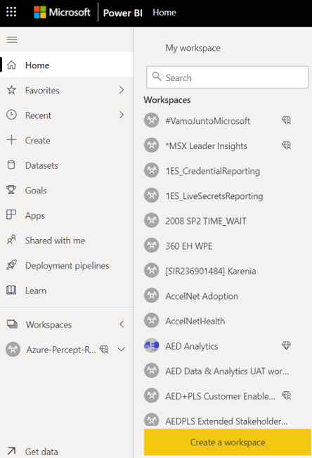

2. Verify that you see your dataset

    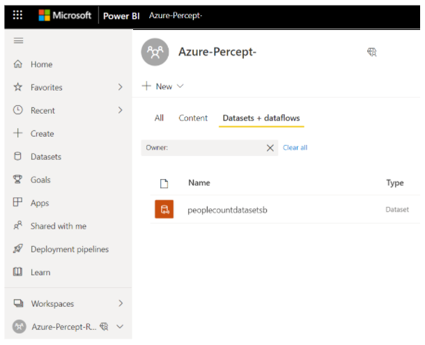

3. On the left scroll panel select `+ Create` and then click `Pick a published dataset`

    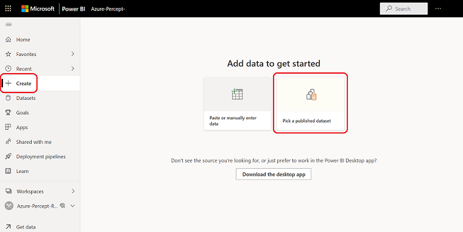

4. Select your dataset and click `Create `

5. On the right, expand the `Fields` dropdown and select `EventEnqueuedUtcTime` and `ΣPeople_Count` 

6. Under `Visualizations` select `Line and clustered column chart`

    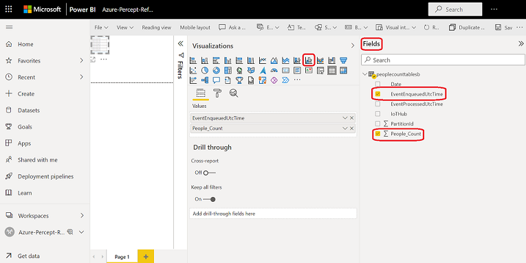

7. This will generate a graph as follows-

    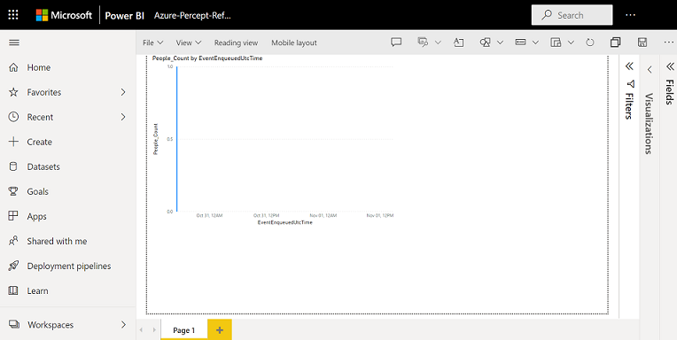

8. Click `Refresh` periodically to update the graph

    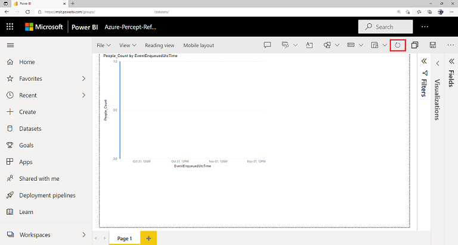

<!-- 6. Clean up resources
Required. If resources were created during the tutorial. If no resources were created, 
state that there are no resources to clean up in this section.
-->

## Step 7: Clean up resources

If you're not going to continue to use this application, delete
Azure resources with the following steps:

1. Login to the [Azure portal](https://portal.azure.com), go to `Resource Group` you have been using for this tutorial. Select the `Stream Analytics Job` resource created and stop the job from running then delete. 

2. Login to [Power BI](https://msit.powerbi.com/home) and select your Workspace (this is the same Group Workspace you used while creating the Stream Analytics job output), and delete workspace. 

<!-- 7. Next steps
Required: A single link in the blue box format. Point to the next logical tutorial 
in a series, or, if there are no other tutorials, to some other cool thing the 
customer can do. 
-->

## Next steps

Check out the other tutorial under Advanced prototyping with Azure Percept section for your Azure Percept DK.

<!--
Remove all the comments in this template before you sign-off or merge to the 
main branch.
-->
