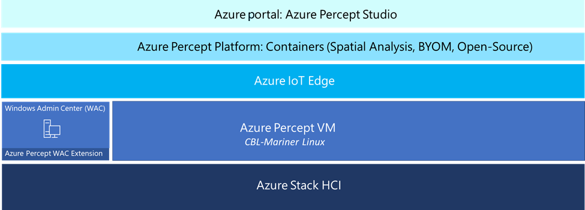

# Azure Percept on Azure Stack HCI overview
Azure Percept on Azure Stack HCI is a virtualized workload that enables you to extend the capabilities of your existing [Azure Stack HCI](https://azure.microsoft.com/products/azure-stack/hci/) deployments quickly and easily by adding sophisticated AI solutions at the Edge. It is available as a preconfigured virtual hard disk (VHDX) that functions as an Azure IoT Edge device with AI capabilities. 

## Azure Percept on Azure Stack HCI enables you:

### Maximize your investments easily
Maximize your existing investments in the Azure Stack HCI computer infrastructure when you run Azure Percept on Azure Stack HCI. You can leverage [Windows Admin Center (WAC)](https://www.microsoft.com/windows-server/windows-admin-center) management expertise with Azure Percept for Azure Stack HCI extension to ingest and analyze data streams from your existing IP camera infrastructure. Using WAC also enables you to easily deploy, manage, scale, and secure your Azure Percept virtual machine (VM).

### Bring data to storage and compute
Use Azure Stack HCI’s robust storage and compute options to pre-process raw data at the Edge before sending it to Azure for further processing and training. Since artificial intelligence/machine learning (AI/ML) solutions at the edge generate and process a significant amount of data, using Azure Stack HCI reduces the amount of data transfer or bandwidth consumed into Azure.

### Maintain device security
Azure Percept on Azure Stack HCI provides multiple layers of security. Leverage security mechanisms and processes built into the solution, including virtual trusted platform module (TPM), secure boot, secure provisioning, trusted software, secure update, and [Microsoft Defender for IoT](https://www.microsoft.com/security/blog/2021/11/02/how-microsoft-defender-for-iot-can-secure-your-iot-devices/#:~:text=Microsoft%20Defender%20for%20IoT%20is%20an%20open%20platform,to%20enrich%20the%20information%20coming%20from%20multiple%20sources).

## Key components of Azure Percept on Azure Stack HCI
Azure Percept on Azure Stack HCI integrates with Azure Percept Studio, Azure IoT Edge, IoT Hub, and Spatial Analysis from Azure Cognitive Services to create an end-to-end intelligent solution that leverages your existing IP camera devices.

The following diagram provides a high-level view of the Azure Percept on Azure Stack HCI architecture.

**Azure Percept on Azure Stack HCI includes the following key components:**  

### Azure Stack HCI
[Azure Stack HCI](https://azure.microsoft.com/products/azure-stack/hci/) is a hyperconverged infrastructure (HCI) cluster solution that hosts virtualized Windows and Linux workloads and their storage in a hybrid environment that combines on-premises infrastructure with Azure cloud services. It requires a minimum of two clustered compute nodes, scales to as many as 16 clustered nodes, and enables data pre-processing at the edge by providing robust storage and compute options. Azure Percept on Azure Stack HCI runs as a pre-configured VM on Azure Stack HCI and has failover capability to ensure continuous operation. For information about customizable solutions that you can configure to meet your needs, see [certified Azure Stack HCI systems](https://azurestackhcisolutions.azure.microsoft.com/#/catalog).

### Azure Percept virtual machine (VM)
The Azure Percept VM leverages a virtual hard disk (VHDX) that runs on the Azure Stack HCI device. It enables you to host your own AI models, communicate with the cloud via IoT Hub, and update the Azure Percept virtual machine (VM) so you can update containers, download models, and manage devices remotely.

The Percept VM leverages Azure IoT Edge to communicate with [Azure IoT Hub](https://www.bing.com/aclk?ld=e8d3D-tqxgHU7f2fug-xNf9TVUCUyRhu5fu58-tWHmwhmAtKIzkXCQETOv1QnKdXCr1kFm6NQ4SA4K5mukLPrpKC5z7nTlhrXnaiTqPPGu2a47SnDq-aKylUzhYQLxKs1yyOtnDuD1DDg4q04CZdFUFwPani9jnp6DLiQPMoYBkhhEJ3FV6SFro1VVB67p_n_4De1B7A&u=aHR0cHMlM2ElMmYlMmZhenVyZS5taWNyb3NvZnQuY29tJTJmZW4tdXMlMmZmcmVlJTJmaW90JTJmJTNmT0NJRCUzZEFJRDIyMDAyNzdfU0VNX2VhM2NkYWExN2Y5MzFkNDE2NTkwYjgyMjdlMjk0ZjdmJTNhRyUzYXMlMjZlZl9pZCUzZGVhM2NkYWExN2Y5MzFkNDE2NTkwYjgyMjdlMjk0ZjdmJTNhRyUzYXMlMjZtc2Nsa2lkJTNkZWEzY2RhYTE3ZjkzMWQ0MTY1OTBiODIyN2UyOTRmN2Y&rlid=ea3cdaa17f931d416590b8227e294f7f&ntb=1). It runs locally and securely, performs AI inferencing at the Edge, and communicates with Azure services for security and updates. It includes [Defender for IoT](https://www.bing.com/ck/a?!&&p=4b4f5983a77f5d870170a12cd507a8d967bd32e10eab125544ac7aad1691be23JmltdHM9MTY1Mjc1MzE3OCZpZ3VpZD1mZmQyZGJiNi1iOWFlLTRiYjgtOTQ1MC1iM2FlNmQ1ZTBlNmUmaW5zaWQ9NTQ1Mg&ptn=3&fclid=f087fcb3-d585-11ec-b34a-9f80cb12a098&u=a1aHR0cHM6Ly9henVyZS5taWNyb3NvZnQuY29tL2VuLXVzL3NlcnZpY2VzL2lvdC1kZWZlbmRlci8&ntb=1) to provide a lightweight security agent that proactively monitors for security threats like botnets, brute force attempts, crypto miners, malware, and chatbots, that you can also integrate into your Azure Monitor infrastructure.

### Azure Percept Windows Admin Center Extension (WAC)
[Windows Admin Center (WAC)](https://www.microsoft.com/windows-server/windows-admin-center) is a locally deployed application accessed via your browser for managing Azure Stack HCI clusters, Windows Server, and more. Azure Percept on Azure Stack HCI is installed through a WAC extension that guides the user through configuring and deploying the Percept VM and related services. It creates a secure and performant AI video inferencing solution usable from the edge to the cloud.

### Azure Percept Solution Development Paths 
Whether you're a beginner, an expert, or anywhere in between, from zero to low code, to creating or bringing your own models, Azure Percept has a solution development path for you to build your Edge artificial intelligence (AI) solution. Azure Percept has three solution development paths that you can use to build Edge AI solutions: Azure Percept Studio, Azure Percept for DeepStream, and Azure Percept Open-Source Project. You aren't limited to one path; you can choose any or all of them depending on your business needs. For more information about the solution development paths, visit [Azure Percept solution development paths overview](https://microsoft.sharepoint-df.com/:w:/t/AzurePerceptHCIDocumentation/EU92ZnNynDBGuVn3P5Xr5gcBFKS5HQguZm7O5sEENPUvPA?e=33T6Vi).

#### *Azure Percept Studio* 
[Azure Percept Studio](/azure/azure-percept/studio/azure-percept-studio-overview) is a user-friendly portal for creating, deploying, and operating Edge artificial intelligence (AI) solutions. Using a low-code to no-code approach, you can discover and complete guided workflows and create an end-to-end Edge AI solution. This solution integrates Azure IoT and Azure AI cloud services like Azure IoT Hub, IoT Edge, Azure Storage, Log Analytics, and Spatial Analysis from Azure Cognitive Services.   

#### *Azure Percept for DeepStream*
[Azure Percept for DeepStream](/azure/azure-percept/deepstream/azure-percept-for-deepstream-overview) includes developer tools that provide a custom developer experience. It enables you to create NVIDIA DeepStream containers using Microsoft-based images and guidance, supported models from NVIDIA out of the box, and/or bring your own models (BYOM). DeepStream is NVIDIA’s toolkit to develop and deploy Vision AI applications and services. It provides multi-platform, scalable, Transport Layer Security (TLS)-encrypted security that can be deployed on-premises, on the edge, and in the cloud.  

#### *Azure Percept Open-Source Project*
[Azure Percept Open-Source Project](/azure/azure-percept/open-source/azure-percept-open-source-project-overview) is a framework for creating, deploying, and operating Edge artificial intelligence (AI) solutions at scale with the control and flexibility of open-source natively on your environment. Azure Percept Open-Source Project is fully open-sourced and leverages the open-source software (OSS) community to deliver enhanced experiences. It's a self-managed solution where you host the environment in your own cluster. 

## Next steps

Text to come.

<!-- Before you start setting up your Azure Percept virtual machine (VM), we recommend the following articles: 
- [Getting started checklist for Azure Percept on Azure Stack HCI](https://github.com/microsoft/santa-cruz-workload/blob/main/articles/getting-started-checklist-for-azure-percept.md)
- [Azure Percept solution development paths overview](https://microsoft.sharepoint-df.com/:w:/t/AzurePerceptHCIDocumentation/EU92ZnNynDBGuVn3P5Xr5gcBFKS5HQguZm7O5sEENPUvPA?e=DKZtr6) 

If you’re ready to start setting up your Azure Percept virtual machine (VM), we recommend the following tutorial: 
- [Tutorial: Setting up Azure Percept on Azure Stack HCI using WAC extension (Cluster server)](https://github.com/microsoft/santa-cruz-workload/blob/main/articles/tutorial-setting-up-azure-percept-using-wac-extension-cluster.md) -->
