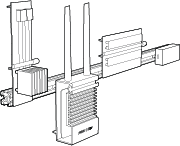
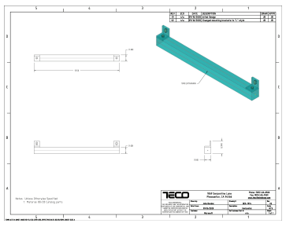
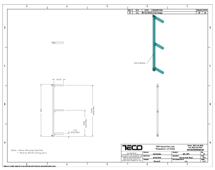
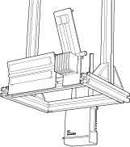
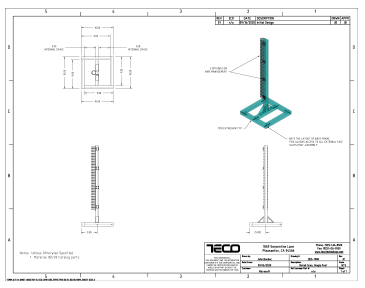
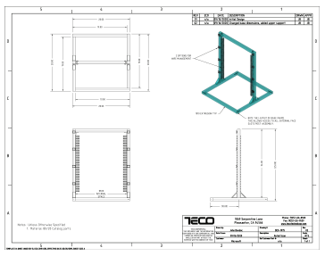
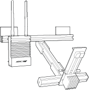
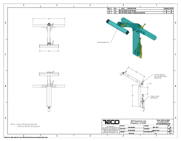

# Azure Percept DK 80/20 integration

The Azure Percept DK and Audio Accessory were designed to integrate with the [80/20 T-slot aluminum building system](https://8020.net/).

## 80/20 features

The Azure Percept DK carrier board, Azure Percept Vision device, and Azure Percept Audio accessory are manufactured with integrated 80/20 1010 extrusion connections, which allow for endless mounting configurations with 80/20 rails. This integration enables customers and solution builders to more easily extend their proof of concepts to production environments.

Check out this video for more information on how to use Azure Percept DK with 80/20:

 

> [!VIDEO https://www.youtube.com/embed/Dg6mtD9psLU]  

To accelerate your prototype creation, we have also designed a few examples of 80/20 mounting assemblies. 
We have included the technical drawings of these options below so they can be easily ordered and built by
your local 80/20 distributor: https://8020.net/distributorlookup/

| Design Name  | Overall Design    | CAD Design  1  | CAD Design 2  |
|--------------|-----------|------------|------------|
| Wall Mounts|   |  | |
|Ceiling Mounts|  |  |  |
| Arm Mounts      | |      |        |

## Next steps

> [!div class="nextstepaction"]
> [Buy an Azure Percept DK from the Microsoft online store](https://go.microsoft.com/fwlink/p/?LinkId=2155270)
