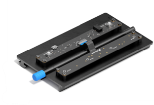

# Introduction to Azure Percept Audio

Azure Percept Audio is an accessory device that adds speech AI capabilities to the Azure Percept DK. It contains a preconfigured speech AI accelerator and a four-microphone linear array, enabling you to apply custom commands, keyword spotting, and far field speech to local listening devices. Azure Percept Audio enables device manufacturers to extend Azure Percept DK vision capabilities to new, smart voice-activated devices. It is integrated out-of-the-box with Azure Percept DK, Azure Percept Studio, and other Azure edge management services. It is available for purchase at the [Microsoft online store](https://go.microsoft.com/fwlink/p/?LinkId=2155270)

## Azure Percept Audio components

Azure Percept Audio contains the following major components:

- Production-ready Azure Percept Audio device (SoM) with four-microphone linear array
- Developer board (includes 2x buttons, 3x LEDs, USB Micro, and 3.5 mm Audio Jack)
- Required cables: Flex cable, USB Micro Type-B to USB-A
- Welcome card
- Mechanical mounting plate with integrated 80/20 1010 series mount

<!---

## How it works

Azure Percept Audio passes the audio input to the Azure Percept DK carrier board in a hybrid edge-cloud manner. Specifically,

- The Azure Percept Audio device: processes the incoming speech input to the clearest format by executing beam forming and echo cancellation befor sending the input to the Azure Percept DK. 
- The Azure Percept DK uses edge processing to perform keyword spotting and then sends the relevant inputs to Azure speech services.
- Cloud: Processing of natural language commands and phrases, in addition to keyword verification and retraining.
- Offline: If the device is offline it will detect the keyword and capture telemetry that there is no internet connection at the time of the command. It will not be able to weed out false accepts since it cannot perform keyword verification.

-->

## Getting started

- Order one at the [Microsoft online store](https://go.microsoft.com/fwlink/p/?LinkId=2155270)
- [Assemble your Azure Percept DK](./quickstart-percept-dk-unboxing.md)
- [Complete the Azure Percept DK setup experience](./quickstart-percept-dk-setup.md)
- [Connect your Azure Percept Audio device to your devkit](quickstart-percept-audio-setup)

### Build a no-code prototype

Build a [no-code speech solution](./tutorial-nocode-speech.md) using Azure Percept voice assistant templates for hospitality, healthcare, inventory, and automotive scenarios.

## Additional technical information

- [Azure Percept Audio datasheet](./azure-percept-audio-datasheet.md)