# Voice control your inventory with Azure Percept Audio  
This article will give detailed instructions for building the main components of the solution and deploying the edge speech AI. The solution uses the Azure Percept DK device and the Audio SoM, Azure Speech Services -Custom Commands, Azure Function App, SQL Database, and Power BI. Users can learn how to manage their inventory with voice using Azure Percept Audio and visualize results with Power BI. The goal of this article is to empower users to create a basic inventory management solution.

Users who want to take their solution further can add an additional edge module for visual inventory inspection or expand on the inventory visualizations within Power BI.

In this tutorial, you learn how to:

- Create an Azure SQL Server and SQL Database
- Create an Azure function project and publish to Azure
- Import an available template to Custom Commands
- Create a Custom Commands using an available template
- Deploy modules to your Devkit
- Import dataset from Azure SQL to Power BI


## Prerequisites
- Percept DK ([Purchase](https://www.microsoft.com/store/build/azure-percept/8v2qxmzbz9vc))
- Azure Subscription : [Free trial account](https://azure.microsoft.com/free/)
- [Azure Percept DK setup experience](./quickstart-percept-dk-set-up.md)
- [Azure Percept Audio setup](./quickstart-percept-audio-setup.md)
- Speaker or headphones that can connect to 3.5mm audio jack (optional) 
- Install [Power BI Desktop](https://powerbi.microsoft.com/downloads/)
- Install [VS code](https://code.visualstudio.com/download) 
- Install the [IoT Hub](https://marketplace.visualstudio.com/items?itemName=vsciot-vscode.azure-iot-toolkit) and [IoT Tools](https://marketplace.visualstudio.com/items?itemName=vsciot-vscode.azure-iot-tools) Extension in VS Code 
- The [Azure Functions Core Tools](https://github.com/MicrosoftDocs/azure-docs/blob/master/articles/azure-functions/functions-run-local.md) version 3.x.
- The [Python extension](https://marketplace.visualstudio.com/items?itemName=ms-python.python) for Visual Studio Code.
- The [Azure Functions extension](https://marketplace.visualstudio.com/items?itemName=ms-azuretools.vscode-azurefunctions) for Visual Studio Code.
- Create an [Azure SQL server](/azure/azure-sql/database/single-database-create-quickstart)


## Software architecture 
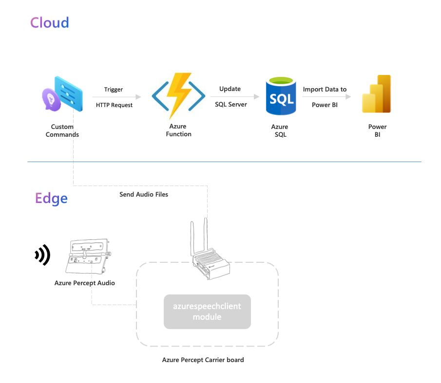


## Step 1: Create an Azure SQL Server and SQL Database
In this section, you will learn how to create the table for this lab. This table will be the main source of truth for your current inventory and the basis of data visualized in Power BI.

1. Set SQL server firewall
   1. Click Set server firewall 
        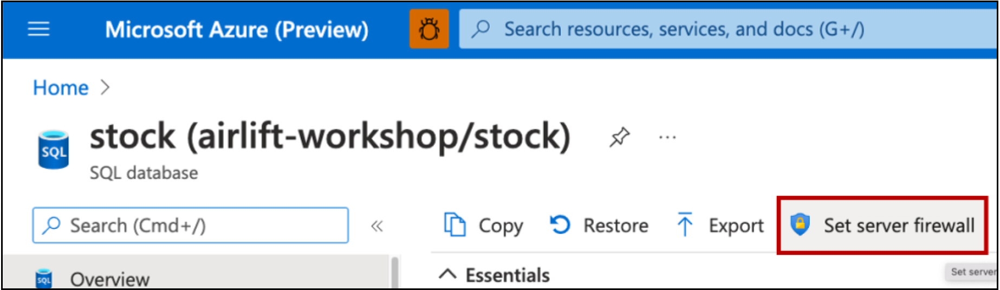  
   2. Add Rule name workshop - Start IP 0.0.0.0 and End IP 255.255.255.255 to the IP allowlist for lab purpose
        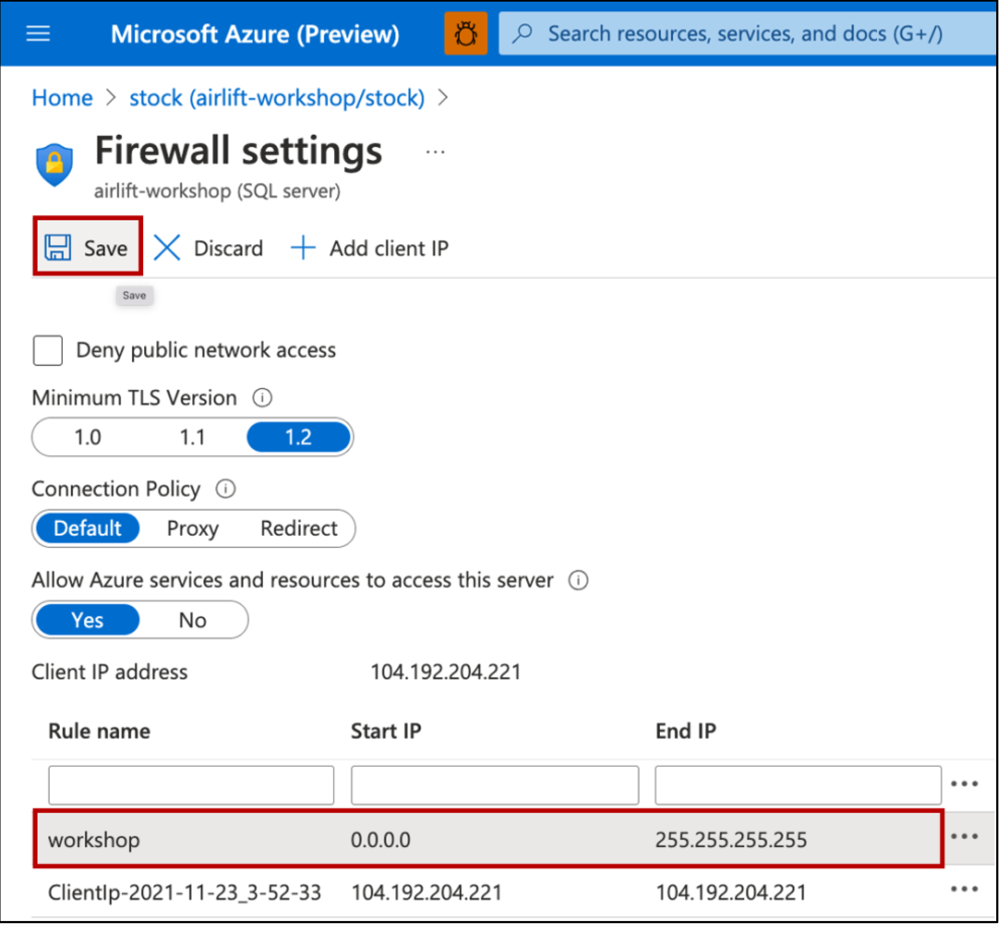  
   3. Click Query editor to login your sql database <br />
        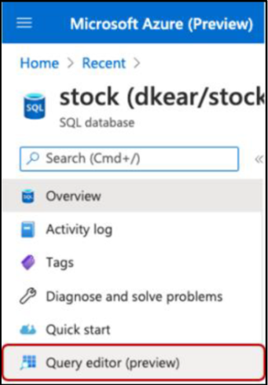 <br /> 
   4. Login to your SQL database through SQL Server Authentication <br />
        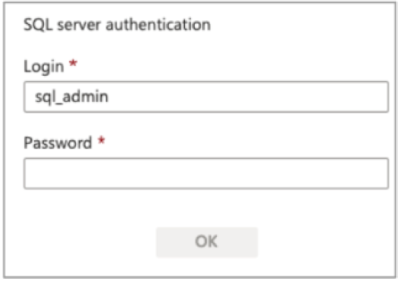 <br />
2. Run the T-SQL query below in the query editor to create the table <br />

       
   ```sql
   -- Create table stock
   CREATE TABLE Stock
   (
            color varchar(255), 
            num_box int 
   )

   ```
    
    :::image type="content" source="./media/voice-control-your-inventory-images/create-sql-table.png" alt-text="Create SQL table.":::
 
## Step 2: Create an Azure Functions project and publish to Azure
In this section, you will use Visual Studio Code to create a local Azure Functions project in Python. Later in this article, you'll publish your function code to Azure.

1. Go to the [GitHub link](https://github.com/microsoft/Azure-Percept-Reference-Solutions/tree/main/voice-control-inventory-management) and clone the repository
   1. Click Code and HTTPS tab
        :::image type="content" source="./media/voice-control-your-inventory-images/clone-git.png" alt-text="Code and HTTPS tab."::: 
   2. Copy the command below in your terminal to clone the repository
        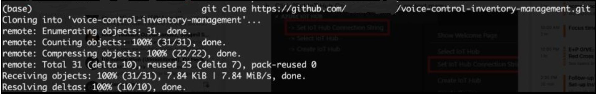

        ```
        git clone https://github.com/microsoft/Azure-Percept-Reference-Solutions/tree/main/voice-control-inventory-management
        ```

2. Enable Azure Functions. 

   1. Click Azure Logo in the task bar

        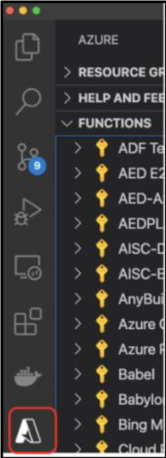 
   2. Click "..." and check the “Functions” has been checked
        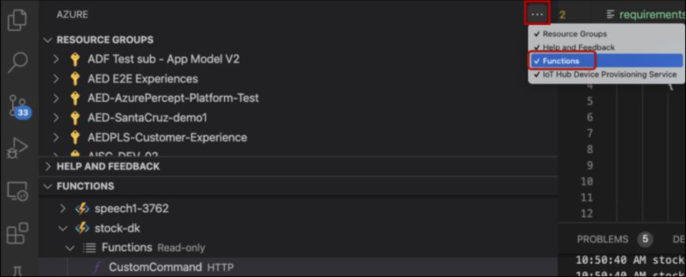 
   
3. Create your local project
   1. Create a folder (ex: airlift_az_func) for your project workspace
        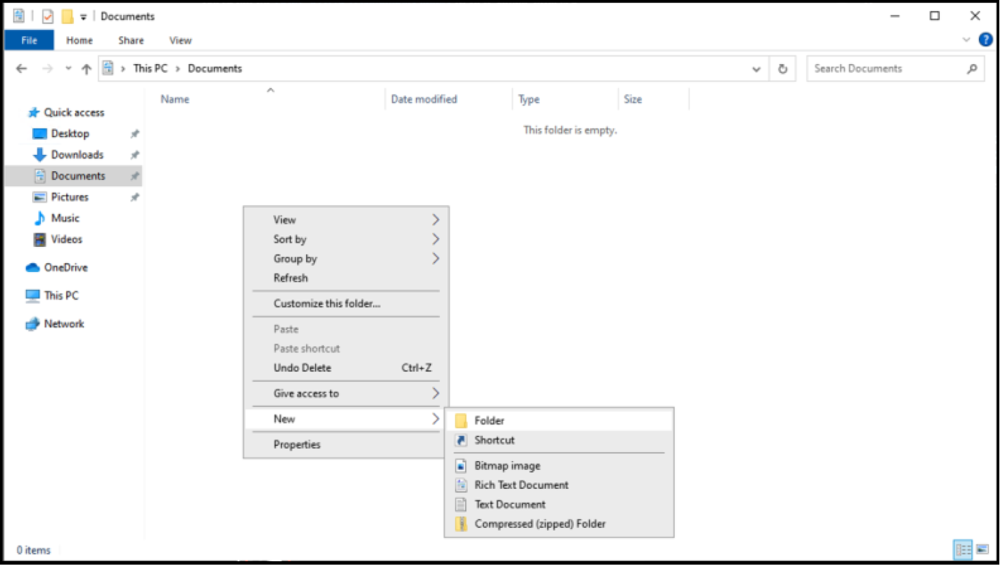 
   2. Choose the Azure icon in the Activity bar, then in Functions, select the <strong>Create new project...</strong>icon.
        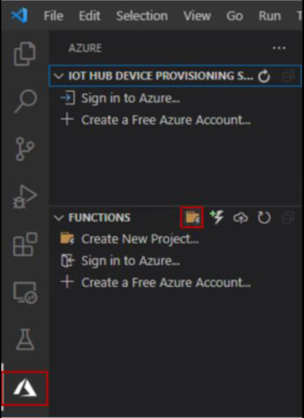 
   3. Choose the directory location you just created for your project workspace and choose **Select**.
        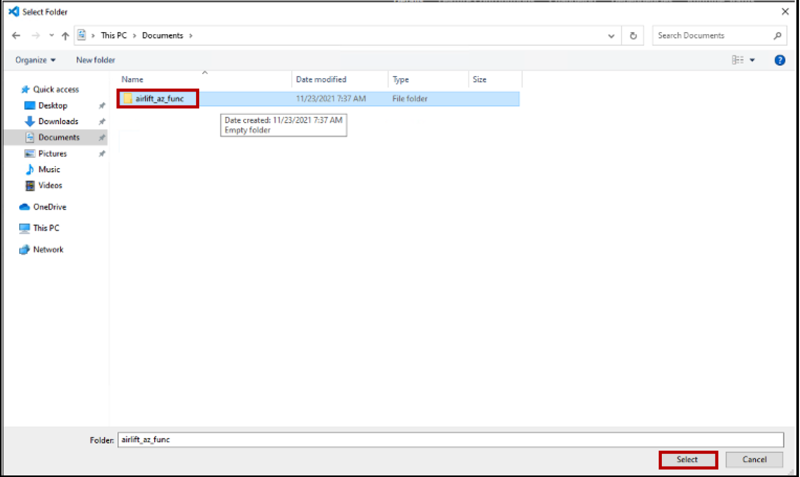 
   4. <strong>Provide the following information at the prompts</strong>: Select a language for your function project: Choose <strong>Python</strong>.
        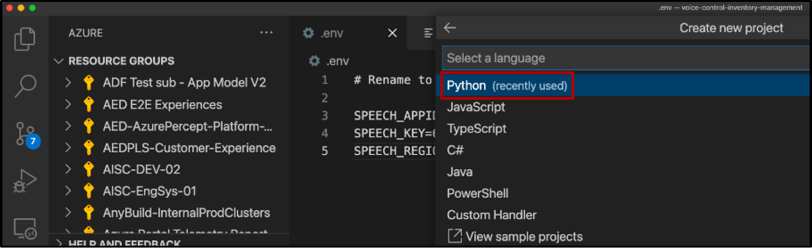 
   5. <strong>Select a Python alias to create a virtual environment</strong>: Choose the location of your Python interpreter. If the location isn't shown, type in the full path to your Python binary. Select skip virtual environment you don’t have Python installed.
        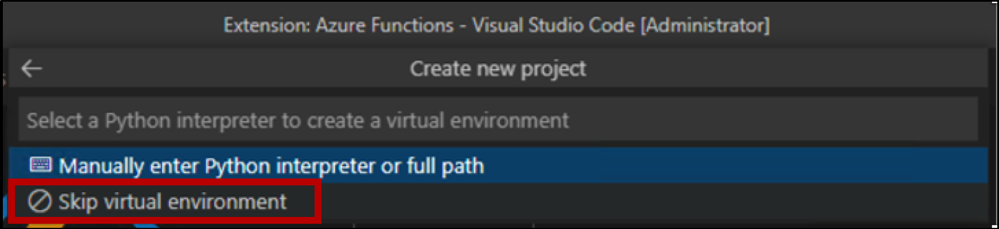 
   6. <strong>Select a template for your project's first function</strong>: Choose <strong>HTTP trigger</strong>.
        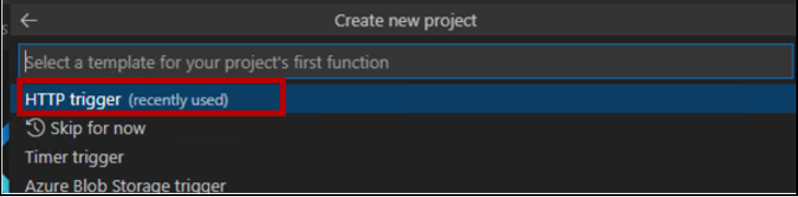 
   7. <strong>Provide a function name</strong>: Type <strong>HttpExample</strong>.
        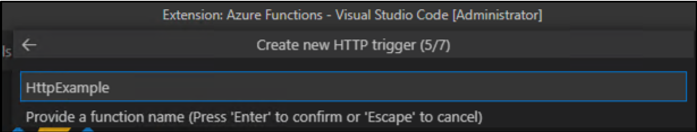 
   8. <strong>Authorization level</strong>: Choose <strong>Anonymous</strong>, which enables anyone to call your function endpoint. To learn about authorization level, see [Authorization keys](https://github.com/MicrosoftDocs/azure-docs/blob/master/articles/azure-functions/functions-bindings-http-webhook-trigger.md).
         
   9.  <strong>Select how you would like to open your project</strong>: Choose Add to workspace. Trust folder and enable all features.
   
        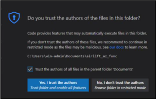 
   1. You will see the HTTPExample function has been initiated
        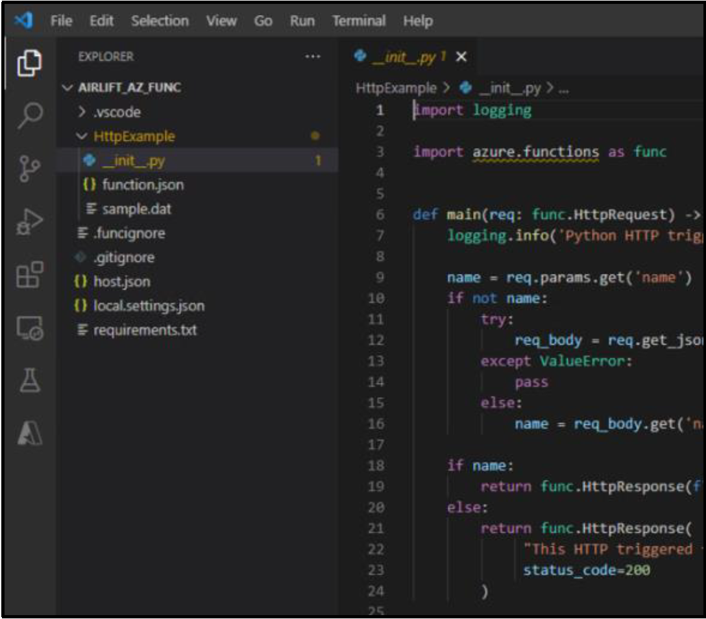 
   
4. Develop CRUD.py to update Azure SQL on Azure Function
   1. Replace the content of the <strong>__init__.py</strong> in [here](https://github.com/microsoft/Azure-Percept-Reference-Solutions/blob/main/voice-control-inventory-management/azure-functions/__init__.py) by copying the raw content of <strong>__init__.py</strong>
        :::image type="content" source="./media/voice-control-your-inventory-images/copy-raw-content-mini.png" alt-text="Copy raw contents." lightbox="./media/voice-control-your-inventory-images/copy-raw-content.png":::
   2. Drag and drop the <strong>CRUD.py</strong> to the same layer of <strong>init.py</strong>
        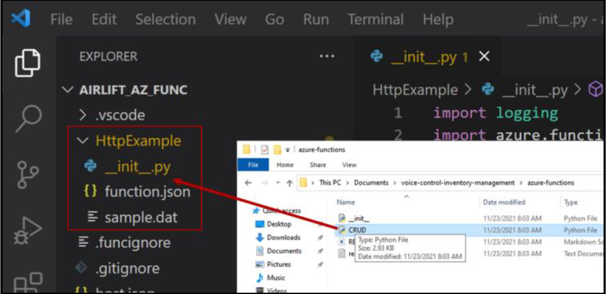
        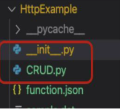
   3. Update the value of the <strong>sql server full address</strong>, <strong>database</strong>, <strong>username</strong>, <strong>password</strong> you created in section 1 in <strong>CRUD.py</strong>
        :::image type="content" source="./media/voice-control-your-inventory-images/server-name-mini.png" alt-text="Update the values."lightbox="./media/voice-control-your-inventory-images/server-name.png":::
        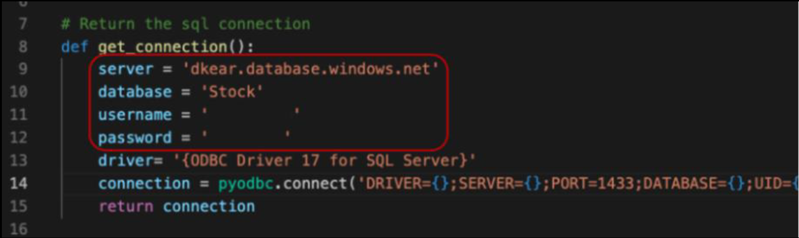
   4. Replace the content of the <strong>requirements.txt</strong>  in here by copying the raw content of requirements.txt
        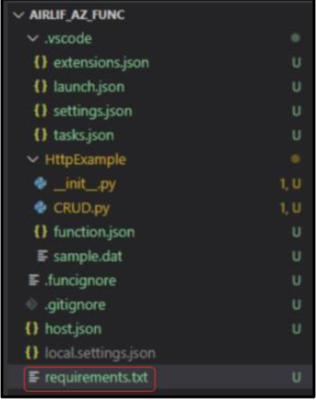
        :::image type="content" source="./media/voice-control-your-inventory-images/view-requirement-file-mini.png" alt-text="Replace the content." lightbox= "./media/voice-control-your-inventory-images/view-requirement-file.png":::
   5. Press “Ctrl + s” to save the content
   
5. Sign in to Azure
   1. Before you can publish your app, you must sign into Azure. If you aren't already signed in, choose the Azure icon in the Activity bar, then in the Azure: Functions area, choose <strong>Sign in to Azure...</strong>.If you're already signed in, go to the next section.
        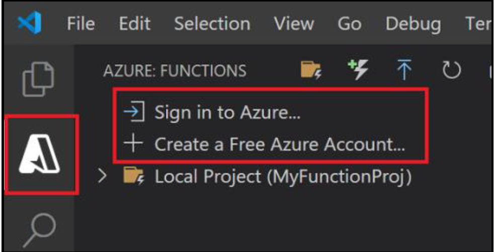

   2. When prompted in the browser, choose your Azure account and sign in using your Azure account credentials.
   3. After you've successfully signed in, you can close the new browser window. The subscriptions that belong to your Azure account are displayed in the Side bar.
   
6. Publish the project to Azure
   1. Choose the Azure icon in the Activity bar, then in the <strong>Azure: Functions area</strong>, choose the <strong>Deploy to function app...</strong> button.
        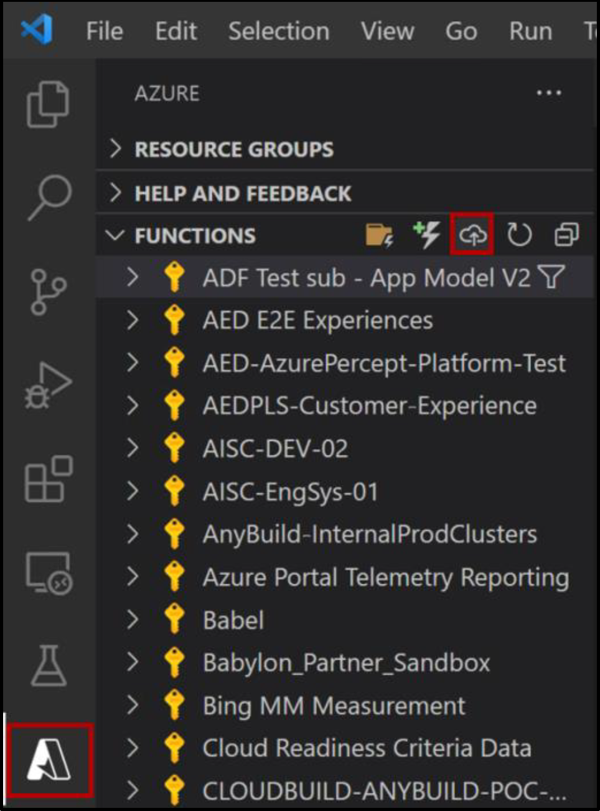
   2. Provide the following information at the prompts:
      1. <strong>Select folder</strong>: Choose a folder from your workspace or browse to one that contains your function app. You won't see this if you already have a valid function app opened.
      2. <strong>Select subscription</strong>: Choose the subscription to use. You won't see this if you only have one subscription.
      3. <strong>Select Function App in Azure</strong>: Choose + Create new Function App. (Don't choose the Advanced option, which isn't covered in this article.)
      4. <strong>Enter a globally unique name for the function app</strong>: Type a name that is valid in a URL path. The name you type is validated to make sure that it's unique in Azure Functions.
      5. <strong>Select a runtime</strong>: Choose the version of <strong>3.9</strong>
            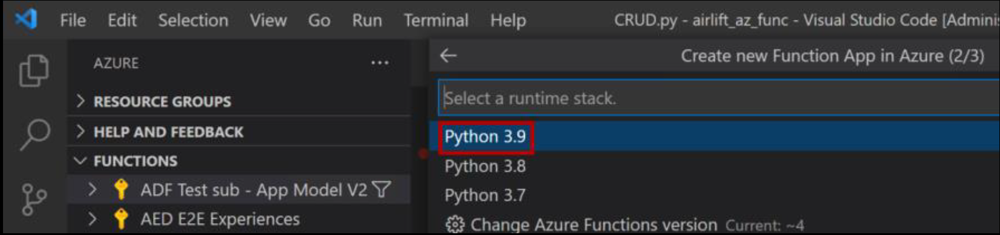
    1. <strong>Select a location for new resources</strong>: Choose the region.
    2. Select <strong>View Output</strong> in this notification to view the creation and deployment results, including the Azure resources that you created. If you miss the notification, select the bell icon in the lower right corner to see it again.
            
        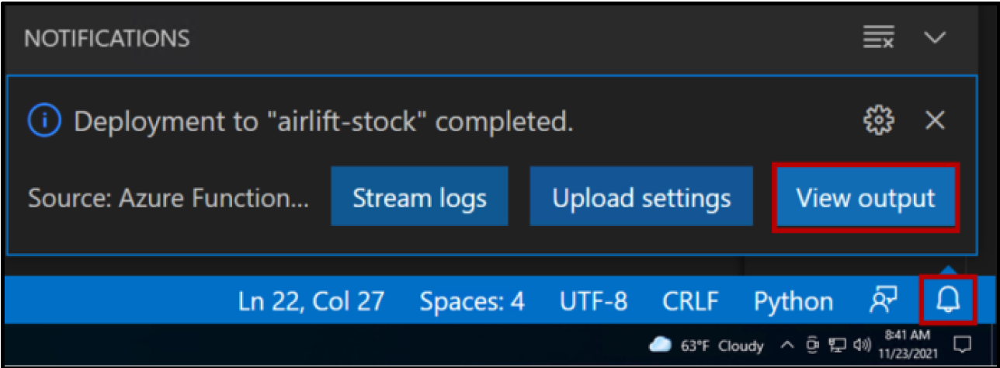
    3. <strong>Note down the HTTP Trigger Url</strong> for further use in the section 4 
        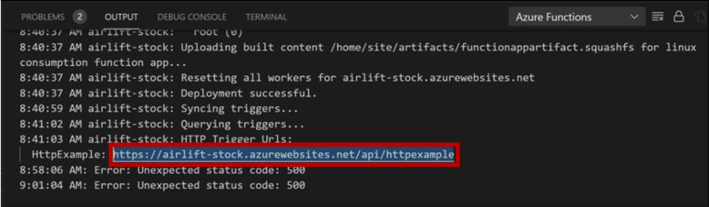

7. Test your Azure Function App
   1. Choose the Azure icon in the Activity bar, expand your subscription, your new function app, and Functions.
   2. Right-click the HttpExample function and choose <strong>Execute Function Now</strong>....
        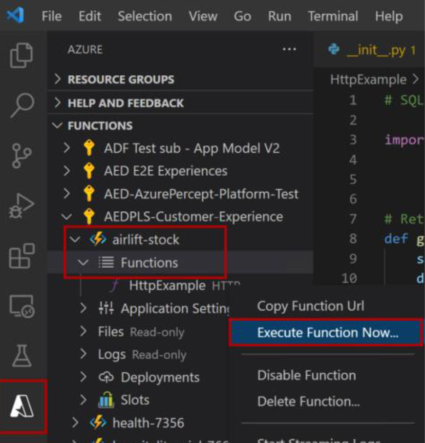
   3. In Enter request body you see the request message body value of
        ```
      { "color": "yellow", "num_box" :"2", "action":"remove" } 
      ```
       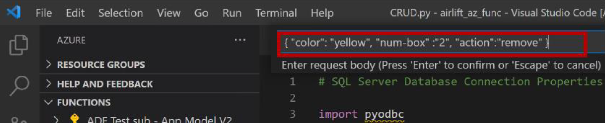
        Press Enter to send this request message to your function.  
       
    1. When the function executes in Azure and returns a response, a notification is raised in Visual Studio Code.
        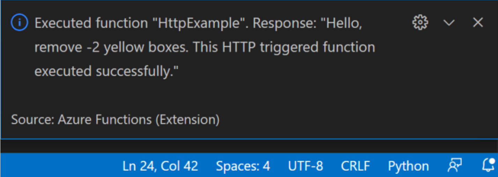
   
## Step 3: Import an inventory speech template to Custom Commands
In this section, you will import an existing application config json file to Custom Commands.

1. Create an Azure Speech resource in a region that supports Custom Commands.
   1. Click [Create Speech Services portal](https://ms.portal.azure.com/#create/Microsoft.CognitiveServicesSpeechServices) to create an Azure Speech resource
      1. Select your Subscription
      2. Use the Resource group you just created in exercise 1
      3. Select the Region(Please check here to see the support region in custom commands)
      4. Create Name for your speech service
      5. Select Pricing tier to Free F0
   2. Go to the Speech Studio for Custom Commands
      1. In a web browser, go to [Speech Studio](https://speech.microsoft.com/portal).
      2. Select <strong>Custom Commands</strong>.
        The default view is a list of the Custom Commands applications you have under your selected subscription.
        :::image type="content" source="./media/voice-control-your-inventory-images/cognitive-service.png" alt-text="Custom Commands applications.":::
      3. Select your Speech <strong>subscription</strong> and <strong>resource group</strong>, and then select <strong>Use resource</strong>.
        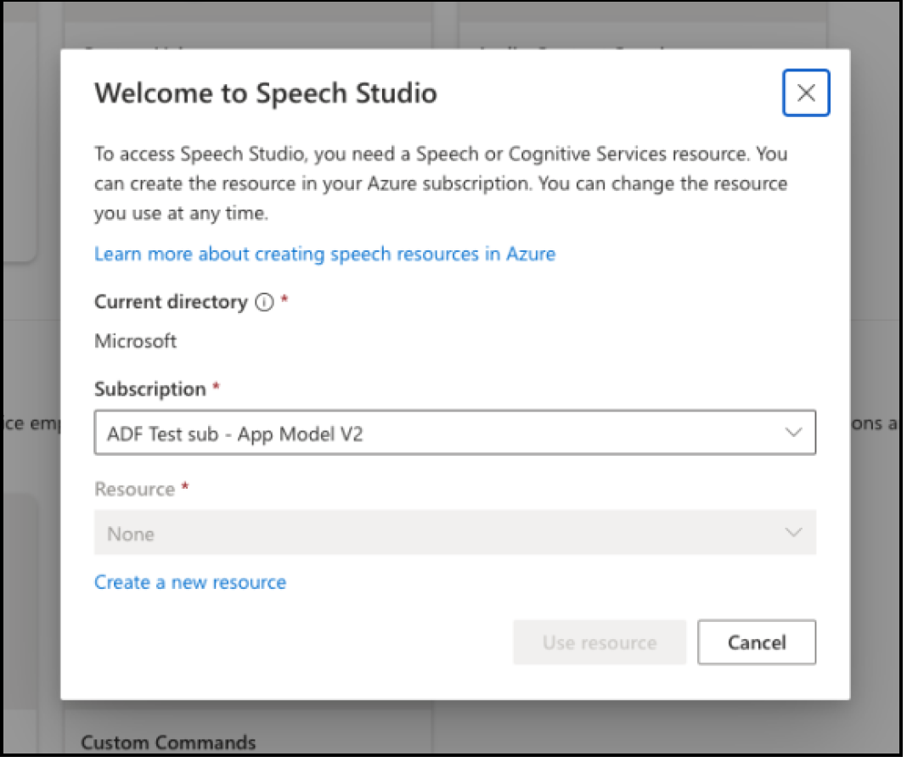
   3. Import an existing application config as a new Custom Commands project
      1. Select <strong>New project</strong> to create a project.
        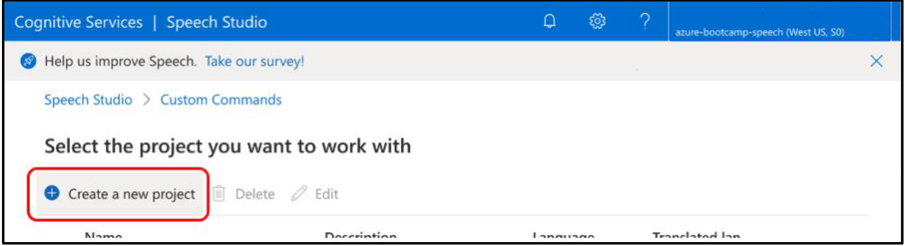
      2. In the <strong>Name</strong> box, enter project name as Stock (or something else of your choice).
      3. In the <strong>Language</strong> list, select <strong>English (United States)</strong>.
      4. Select <strong>Browse files</strong> and in the browse window, select the <strong>smart-stock.json</strong> file in the <strong>custom-commands folder</strong>
        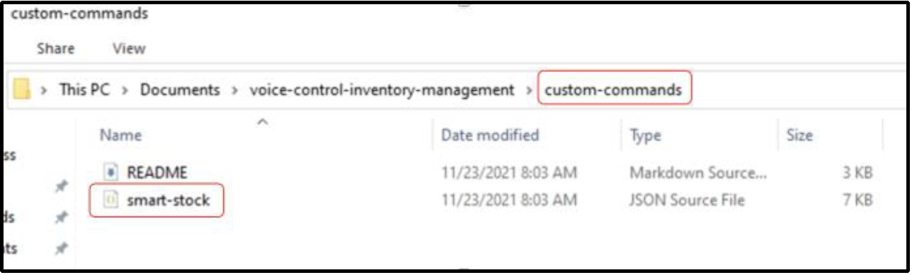
        

      5. In the <strong>LUIS authoring resource</strong> list, select an authoring resource. If there are no valid authoring resources, create one by selecting <strong>Create new LUIS authoring resource</strong>.
        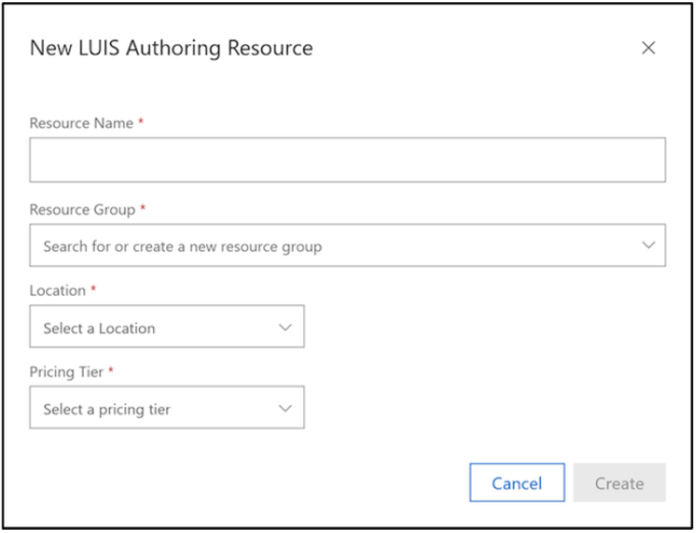
   
      6. In the <strong>Resource Name</strong> box, enter the name of the resource.
      7. In the <strong>Resource Group</strong> list, select a resource group.
      8. In the <strong>Location list</strong>, select a region.
      9. In the <strong>Pricing Tier</strong> list, select a tier.
      10. Next, select <strong>Create</strong> to create your project. After the project is created, select your project. You should now see overview of your new Custom Commands application.


## Step 4: Train, test, and publish the Custom Commands
In this section, you will train, test, and publish your Custom Commands

1. Replace the web endpoints URL
   1. Click Web endpoints and replace the URL
   2. Replace the value in the URL to the <strong>HTTP Trigger Url</strong> you noted down in section 2 (ex: `https://xxx.azurewebsites.net/api/httpexample`)
    :::image type="content" source="./media/voice-control-your-inventory-images/web-point-url.png" alt-text="Replace the value in the URL.":::
2. Create LUIS prediction resource
   1. Click <strong>settings</strong> and create a <strong>S0</strong> prediction resource under LUIS <strong>prediction resource</strong>.
    :::image type="content" source="./media/voice-control-your-inventory-images/predict-source.png" alt-text="Prediction resource-1.":::
    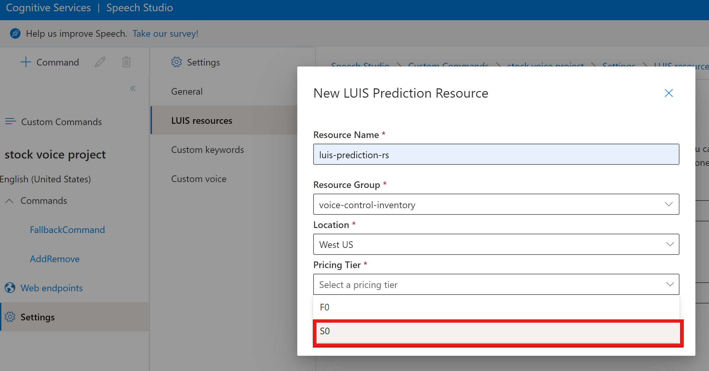
3. Train and Test with your custom command
   1. Click <strong>Save</strong> to save the Custom Commands Project
   2. Click <strong>Train</strong> to Train your custom commands service
    :::image type="content" source="./media/voice-control-your-inventory-images/train-model.png" alt-text="Custom commands train model.":::
   3. Click <strong>Test</strong> to test your custom commands service
    :::image type="content" source="./media/voice-control-your-inventory-images/test-model.png" alt-text="Custom commands test model.":::
   4. Type “Add 2 green boxes” in the pop-up window to see if it can respond correctly
    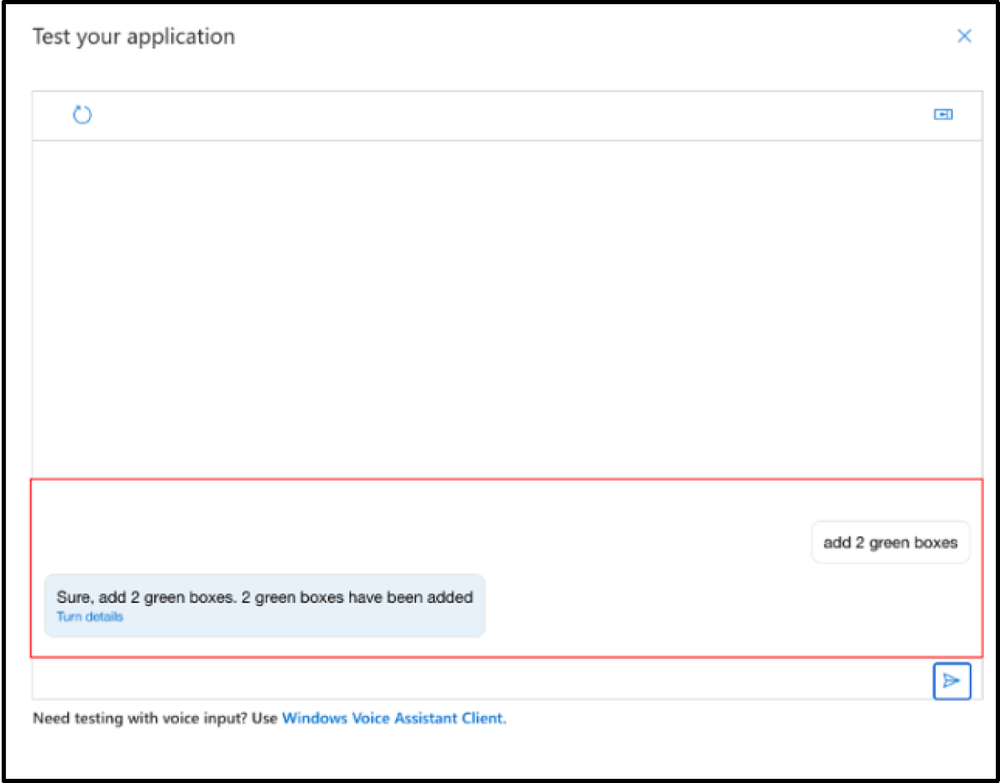
4. Publish your custom command
   1. Click Publish to publish the custom commands
    :::image type="content" source="./media/voice-control-your-inventory-images/publish.png" alt-text="Publish the custom commands.":::
5. Note down your application ID, speech key in the settings for further use
    :::image type="content" source="./media/voice-control-your-inventory-images/application-id.png" alt-text="Application ID.":::

## Step 5: Deploy modules to your Devkit
In this section, you will learn how to use deployment manifest to deploy modules to your device.
1. Set IoT Hub Connection String
   1. Go to your IoT Hub service in Azure portal. Click <strong>Shared access policies</strong> -> <strong>Iothubowner</strong>
   2. Click <strong>Copy</strong> the get the <strong>primary connection string</strong>
        :::image type="content" source="./media/voice-control-your-inventory-images/iot-hub-owner.png" alt-text="Primary connection string.":::
   3. In Explorer of VS Code, click "Azure IoT Hub".
        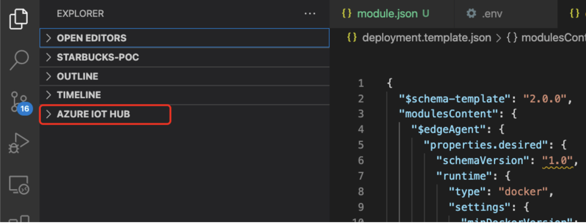
   4. Click "Set IoT Hub Connection String" in context menu
        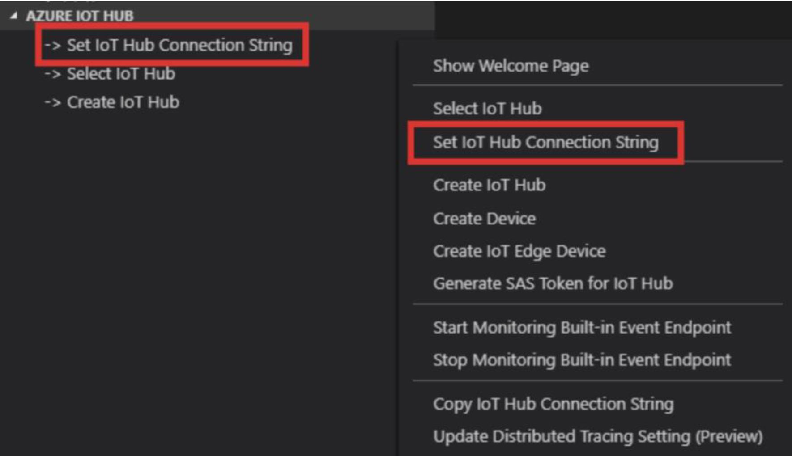
   5. An input box will pop up, then enter your IoT Hub Connection String<br />
2. Open VSCode to open the folder you cloned in the section 1 <br />
    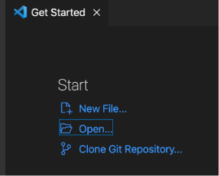
3. Modify the envtemplate<br />
   1. Right click the <strong>envtemplate</strong> and rename to <strong>.env</strong>. Provide values for all variables such as below.<br />
    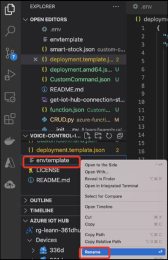
    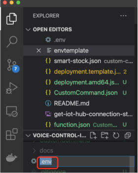
   2. Relace your Application ID and Speech resource key by checking your Speech Studio<br />
    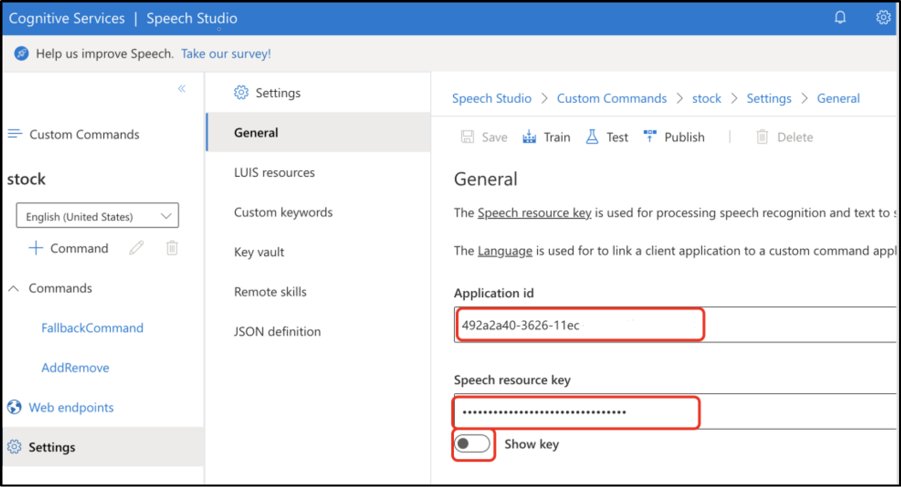
    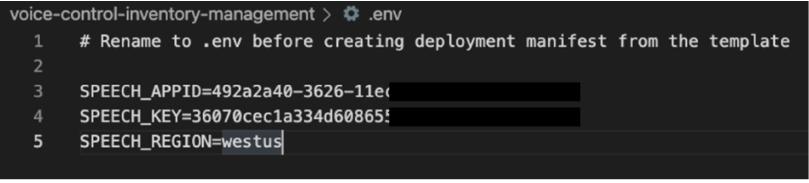
   3. Check the region by checking your Azure speech service, and mapping the <strong>display name</strong> (e.g. West US) to <strong>name</strong>  (e.g., westus) [here](https://azuretracks.com/2021/04/current-azure-region-names-reference/).
    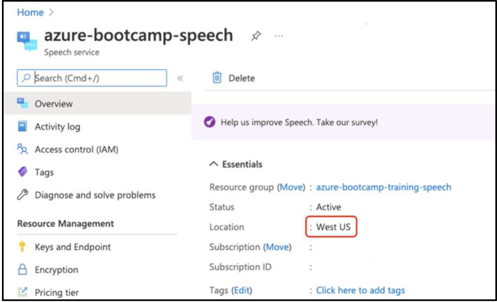
   4. Replace the Speech Region to the name (e.g.: westus) you just get from the mapping table. (Check all characters are in lower case.)
    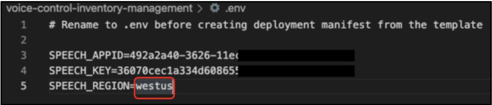
   
4. Deploy modules to device
   1. Right click on deployment.template.json and <strong>select Generate IoT Edge Deployment Manifest</strong> 
    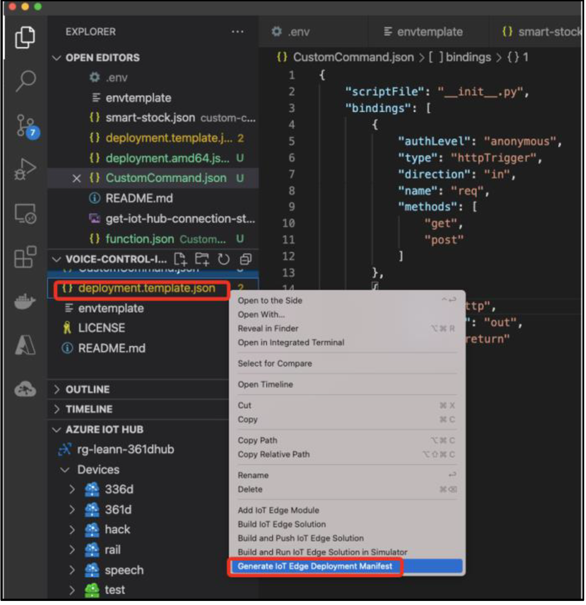
   2. After you generated the manifest, you can see <strong>deployment.amd64.json</strong> is under config folder. Right click on deployment.amd64.json and choose Create Deployment for <strong>Single Device</strong>
    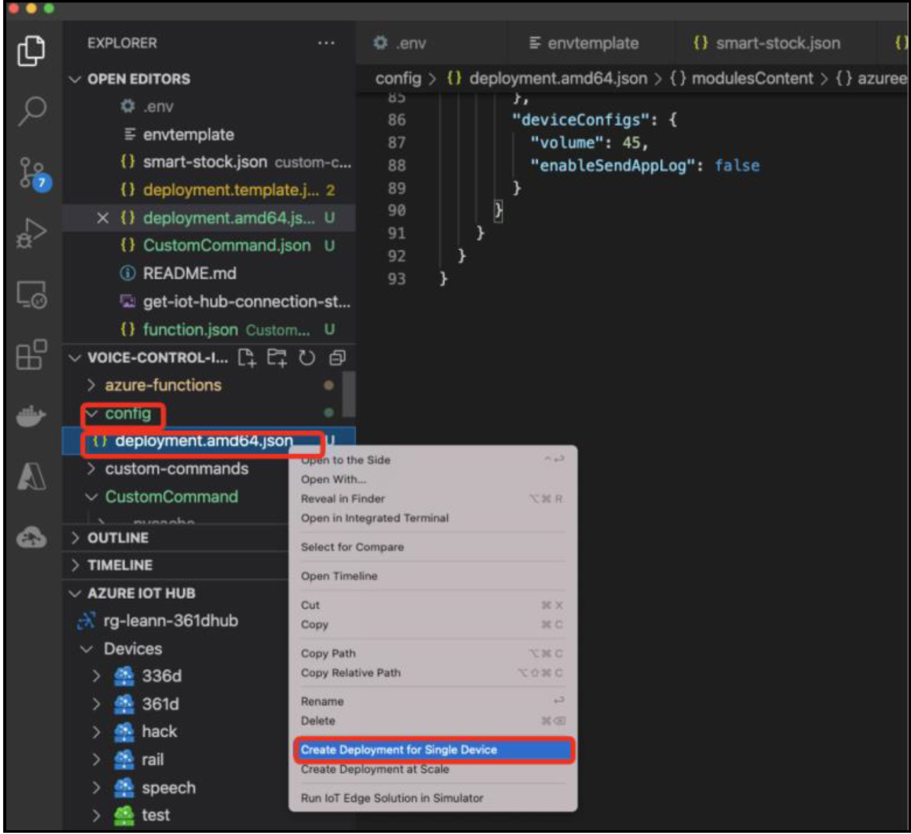
   3. Choose the IoT Hub device you are going to deploy
    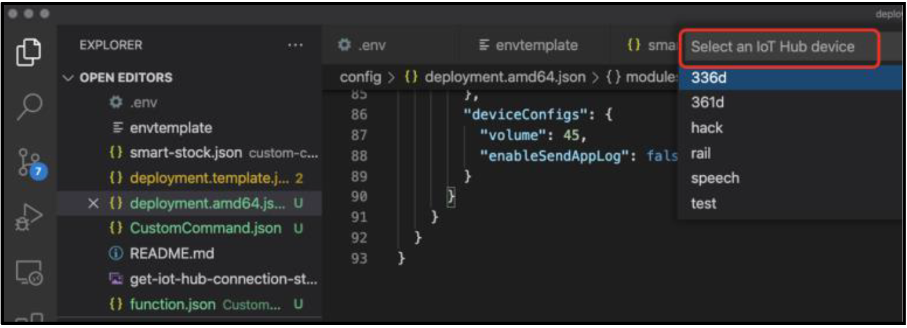
   4. Check your log of the azurespeechclient module
      1. Go to Azure portal to click your Azure IoT Hub
        !:::image type="content" source="./media/voice-control-your-inventory-images/voice-iothub.png" alt-text="Select IoT hub.":::
      2. Click IoT Edge
        :::image type="content" source="./media/voice-control-your-inventory-images/portal-iotedge.png" alt-text="Go to IoT edge.":::
      3. Click your Edge device to see if the modules run well
        :::image type="content" source="./media/voice-control-your-inventory-images/device-id.png" alt-text="Confirm modules.":::
      4. Click <strong>azureearspeechclientmodule</strong> module
        :::image type="content" source="./media/voice-control-your-inventory-images/azure-ear-module.png" alt-text="Select ear module.":::
      5. Click <strong>Troubleshooting</strong> tab of the azurespeechclientmodule
        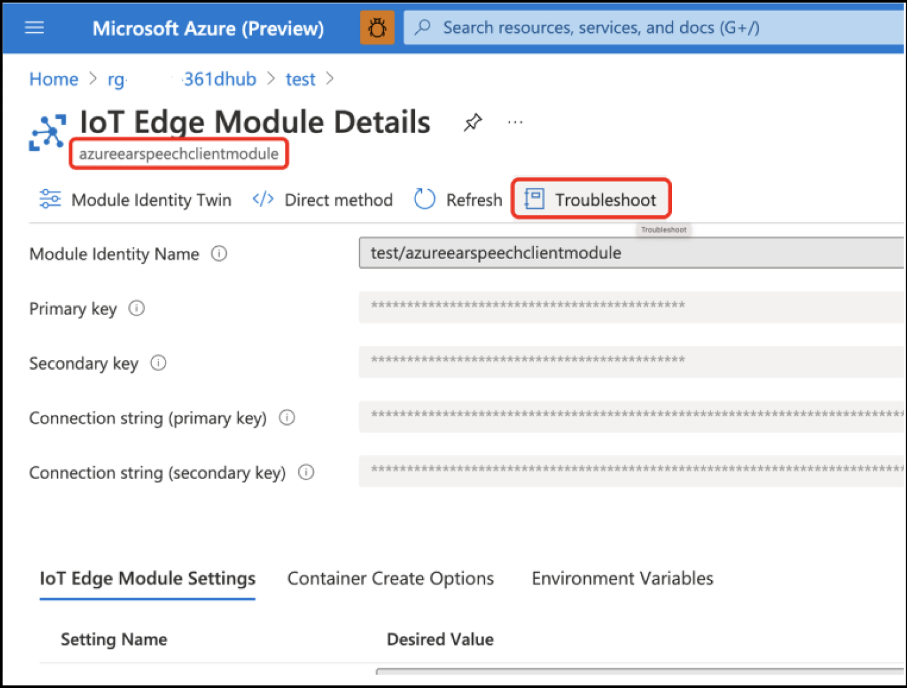
    
   5. Check your log of the azurespeechclient module
      1. Change the Time range to 3 minutes to check the latest log
        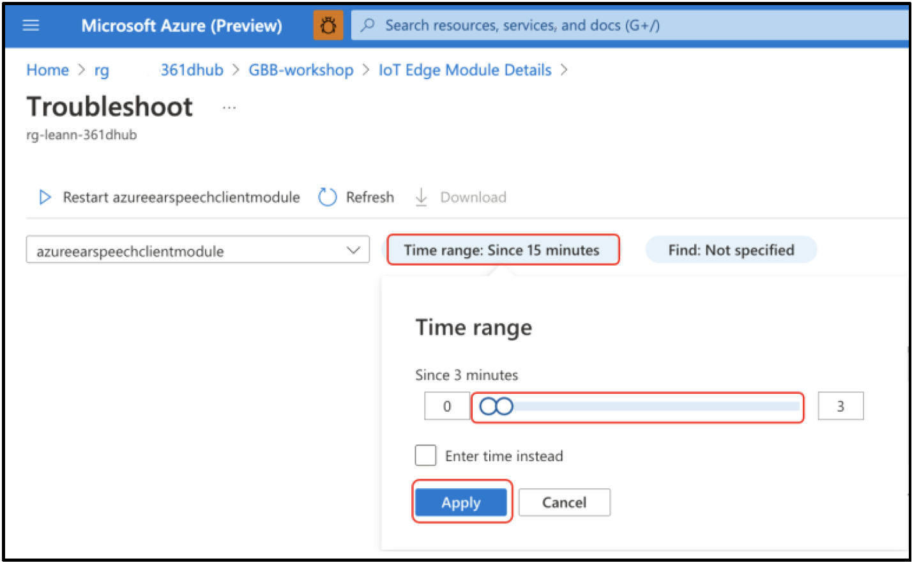
      2. Speak <strong>“Computer, remove 2 red boxes”</strong> to your Azure Percept Audio
        (Computer is the wake word to wake Azure Percept DK, and remove 2 red boxes is the command)
        Check the log in the speech log if it shows <strong>“sure, remove 2 red boxes. 2 red boxes have been removed.”</strong>
        :::image type="content" source="./media/voice-control-your-inventory-images/speech-regconizing.png" alt-text="Verify log.":::
      >[!NOTE] 
      >If you have set up the wake word before, please use the wake work you set up to wake your DK.
 

## Step 6: Import dataset from Azure SQL to Power BI
In this section, you will create a Power BI report and check if the report has been updated after you speak commands to your Azure Percept Audio.
1. Open the Power BI Desktop Application and import data from Azure SQL Server
   1. Click close of the pop-up window
        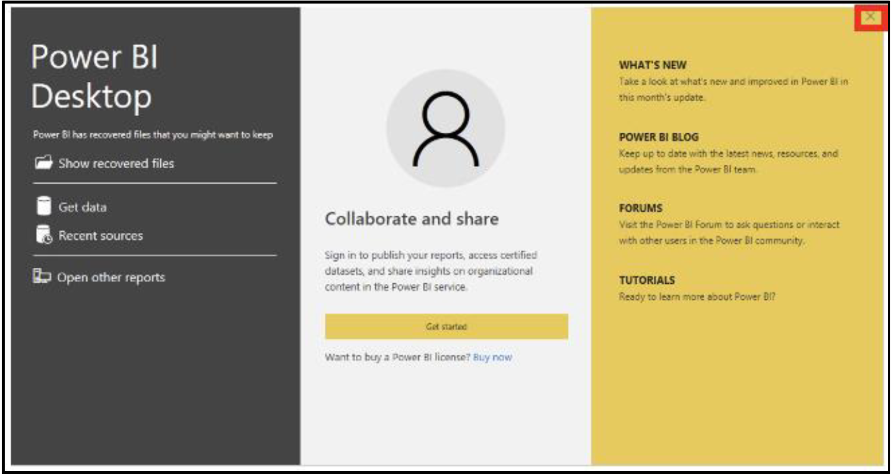
   2. Import data from SQL Server
        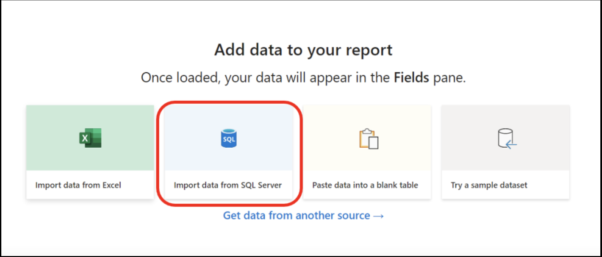
   3. Enter your sql server name \<sql server name\>.database.windows.NET, and choose DirectQuery
        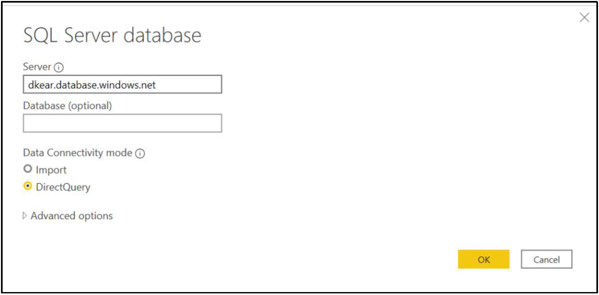
   4. Select Database, and enter the username and the password
        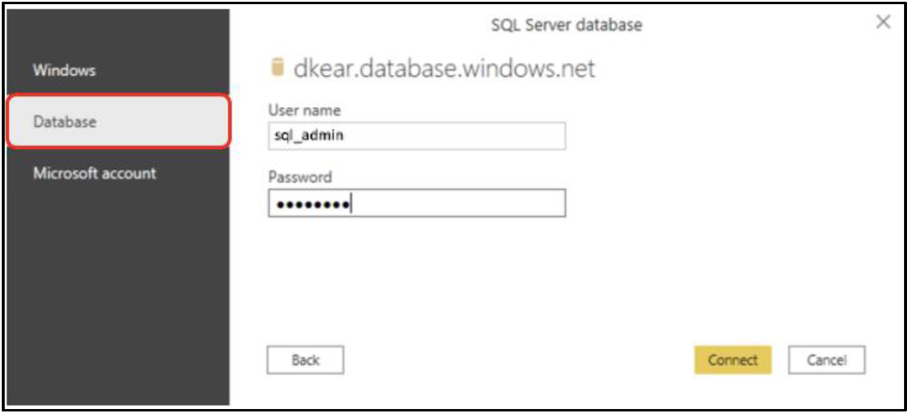
   5. <strong>Select</strong> the table Stock, and Click <strong>Load</strong> to load dataset to Power BI Desktop<br />
        
        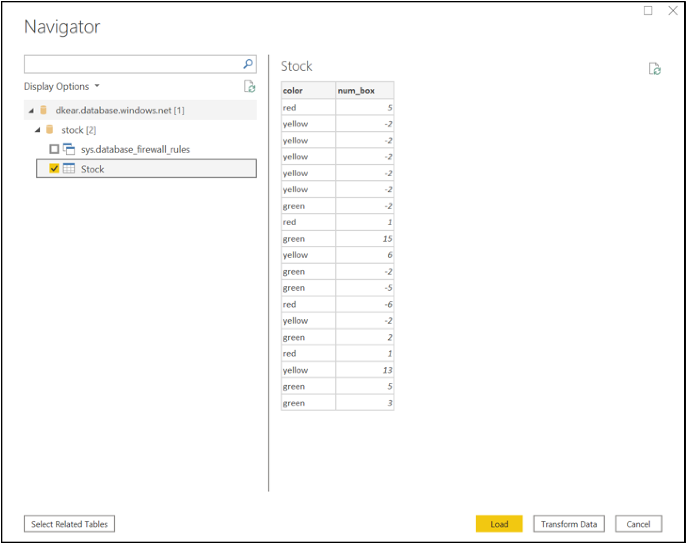
2. Create your Power BI report
   1. Click color, num_box columns in the Fields. And choose visualization Clustered column chart to present your chart.<br />
        
        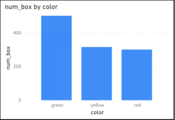
   2. Drag and drop the <strong>color</strong>column to the <strong>Legend</strong> and you will get the chart that looks like below.
        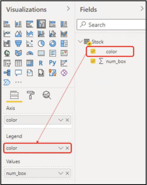
        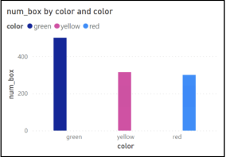
   3. Click <strong>format</strong> and click Data colors to change the colors accordingly. You will have the charts that look like below.
        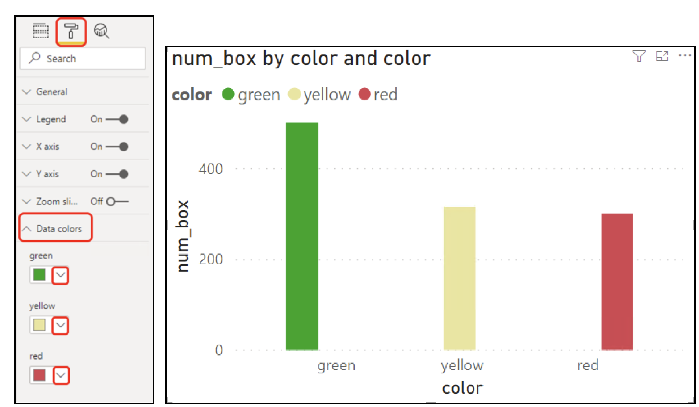
   4. Select card visualization  
        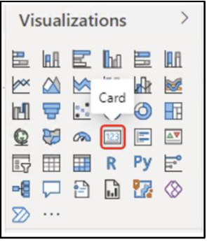
   5. Check the num_box                             
        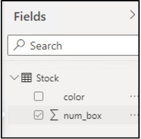
   6. Drag and drop the <strong>color</strong> column to <strong>Filters on this visual</strong>
        
   7. Select green in the Filters on this visual
   
        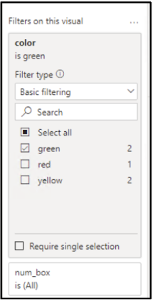
   8. Double click the column name of the column in the Fields and change the name of the column from “Count of the green box”
        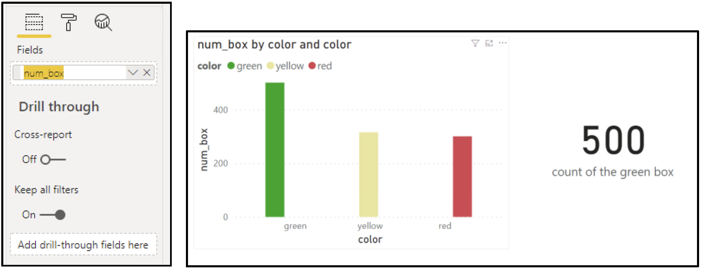
3. Speak command to your Devkit and refresh Power BI
   1. Speak “Add three green boxes” to Azure Percept Audio
   2. Click “Refresh”. You will see the number of green boxes has been updated.
        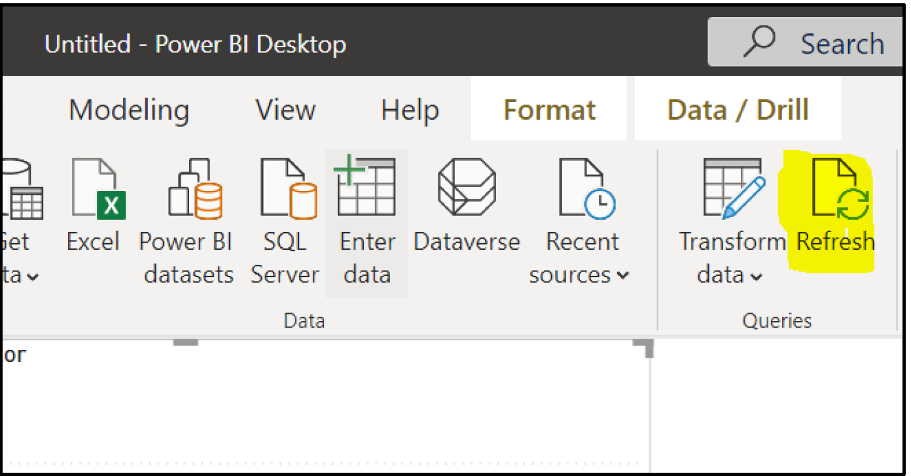

Congratulations! You now know how to develop your own voice assistant! You went through a lot of configuration and set up the custom commands for the first time. Great job! Now you can start trying more complex scenarios after this tutorial. Looking forward to seeing you design more interesting scenarios and let voice assistant help in the future.

<!-- 6. Clean up resources
Required. If resources were created during the tutorial. If no resources were created, 
state that there are no resources to clean up in this section.
-->

## Clean up resources

If you're not going to continue to use this application, delete
resources with the following steps:

1. Login to the [Azure portal](https://portal.azure.com), go to `Resource Group` you have been using for this tutorial. Delete the SQL DB, Azure Function, and Speech Service resources.

2. Go into [Azure Percept Studio](https://ms.portal.azure.com/#blade/AzureEdgeDevices/Main/overview), select your device from the `Device` blade, click the `Speech` tab within your device, and under `Configuration` remove reference to your custom command. 

3. Go in to [Speech Studio](https://speech.microsoft.com/portal) and delete project created for this tutorial. 

4. Login to [Power BI](https://msit.powerbi.com/home) and select your Workspace (this is the same Group Workspace you used while creating the Stream Analytics job output), and delete workspace.


<!-- 7. Next steps
Required: A single link in the blue box format. Point to the next logical tutorial 
in a series, or, if there are no other tutorials, to some other cool thing the 
customer can do. 
-->

## Next steps

Check out the tutorial [Create a people counting solution with Azure Percept Vision](./create-people-counting-solution-with-azure-percept-devkit-vision.md).

<!--
Remove all the comments in this template before you sign-off or merge to the 
main branch.
-->
