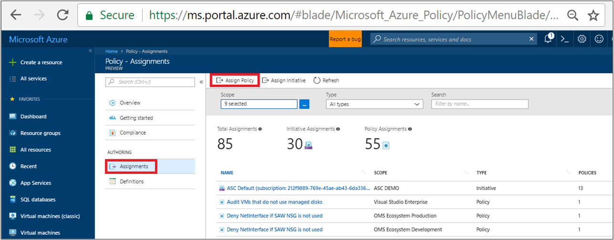
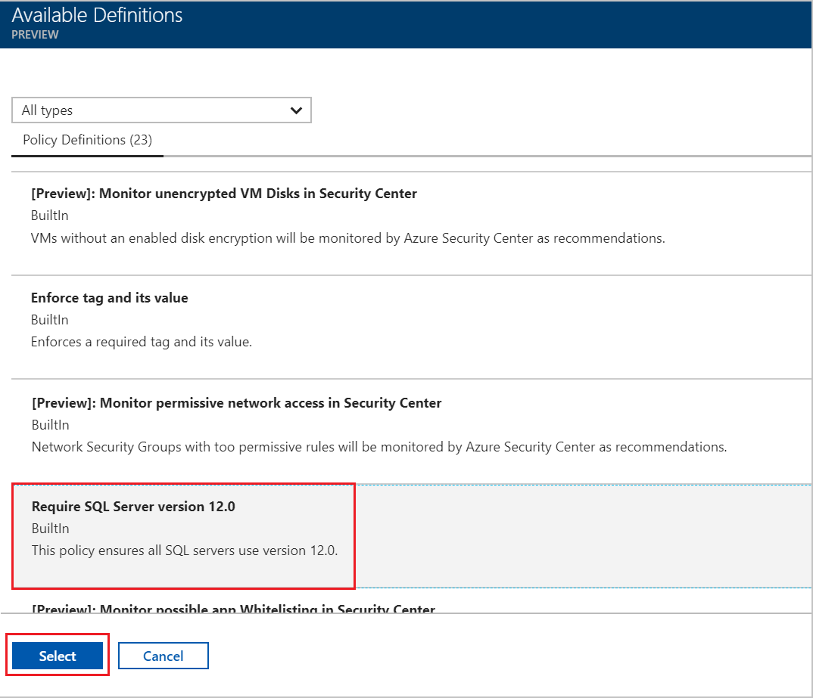
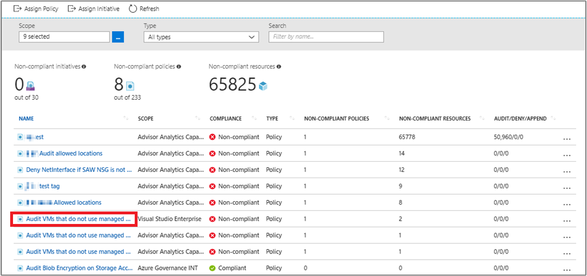
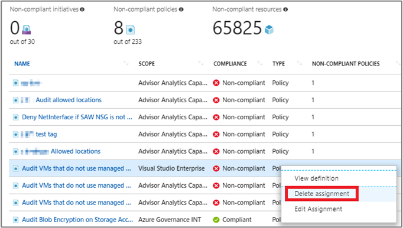

# Create a policy assignment to identify non-compliant resources in your Azure environment

The first step in understanding compliance in Azure is to identify the status of your resources. This quickstart steps you through the process of creating a policy assignment to identify virtual machines that are not using managed disks.

At the end of this process, you will successfully identify virtual machines that are not using managed disks. They are *non-compliant* with the policy assignment.

If you don't have an Azure subscription, create a [free](https://azure.microsoft.com/free/) account before you begin.

## Create a policy assignment

In this quickstart, you create a policy assignment and assign the *Audit Virtual Machines without Managed Disks* policy definition.

1. Launch the Azure Policy service in the Azure portal by clicking **All services**, then searching for and selecting **Policy**.

   

2. Select **Assignments** on the left side of the Azure Policy page. An assignment is a policy that has been assigned to take place within a specific scope.
3. Select **Assign Policy** from the top of the **Policy - Assignments** page.

   

4. On the **Assign Policy** page, select the **Scope** by clicking the ellipsis and selecting a subscription (required) and resource group (optional). A scope determines what resources or grouping of resources the policy assignment gets enforced on.  Then click **Select** at the bottom of the **Scope** page.

   This example uses the **Contoso Subscription**. Your subscription will differ.

5. If you wanted to exclude one or more resource groups (if you only scoped a subscription) or specific resources within a resource group (either scoping case), you could configure **Exclusions** from the policy assignment. Leave it blank for now.

6. Select the **Policy definition** ellipsis to open the list of available definitions. Azure Policy comes with already built-in policy definitions you can use. Many built-in policy definitions are available, such as:

   - Enforce tag and its value
   - Apply tag and its value
   - Require SQL Server version 12.0

    For a complete list of all the available built-in polices, see [Policy samples](json-samples.md).

7. Search through the policy definitions list to find the *Audit VMs that do not use managed disks* definition. Click on that policy and click **Select**.

   

8. The **Assignment name** is automatically populated with the policy name you selected, but you can change it. For this example, leave *Audit VMs that do not use managed disks*. You can also add an optional **Description**. The description provides details about this policy assignment.

9. Click **Assign**.

You’re now ready to identify non-compliant resources to understand the compliance state of your environment.

## Identify non-compliant resources

Select **Compliance** in the left side of the page and locate the **Audit VMs that do not use managed disks** policy assignment you created.

If there are any existing resources that are not compliant with this new assignment, they appear under **Non-compliant resources**.

When a condition is evaluated against your existing resources and found true, then those resources are marked as non-compliant with the policy. The following table shows how different policy effects work with the condition evaluation for the resulting compliance state. Although you don’t see the evaluation logic in the Azure portal, the compliance state results are shown. The compliance state result is either compliant or non-compliant.

| **Resource State** | **Effect** | **Policy Evaluation** | **Compliance State** |
| --- | --- | --- | --- |
| Exists | Deny, Audit, Append\*, DeployIfNotExist\*, AuditIfNotExist\* | True | Non-Compliant |
| Exists | Deny, Audit, Append\*, DeployIfNotExist\*, AuditIfNotExist\* | False | Compliant |
| New | Audit, AuditIfNotExist\* | True | Non-Compliant |
| New | Audit, AuditIfNotExist\* | False | Compliant |

\* The Append, DeployIfNotExist, and AuditIfNotExist effects require the IF statement to be TRUE. The effects also require the existence condition to be FALSE to be non-compliant. When TRUE, the IF condition triggers evaluation of the existence condition for the related resources.

## Clean up resources

Other guides in this collection build upon this quickstart. If you plan to continue to work with subsequent tutorials, do not clean up the resources created in this quickstart. If you do not plan to continue, use the following steps to delete all resources created by this quickstart in the Azure portal.

1. Select **Compliance** (or **Assignments**) in the left side of the Azure Policy page and locate the **Audit VMs that do not use managed disks** policy assignment you created.

2. Right-click the **Audit VMs that do not use managed disks** policy assignment and select **Delete assignment**

   

## Next steps

In this quickstart, you assigned a policy definition to a scope and evaluated its compliance report. The policy definition ensures that all the resources in the scope are compliant and identifies which ones aren’t.

To learn more about assigning policies to ensure that **future** resources that get created are compliant, continue to the tutorial for:

> [!div class="nextstepaction"]
> [Creating and managing policies](create-manage-policy.md)