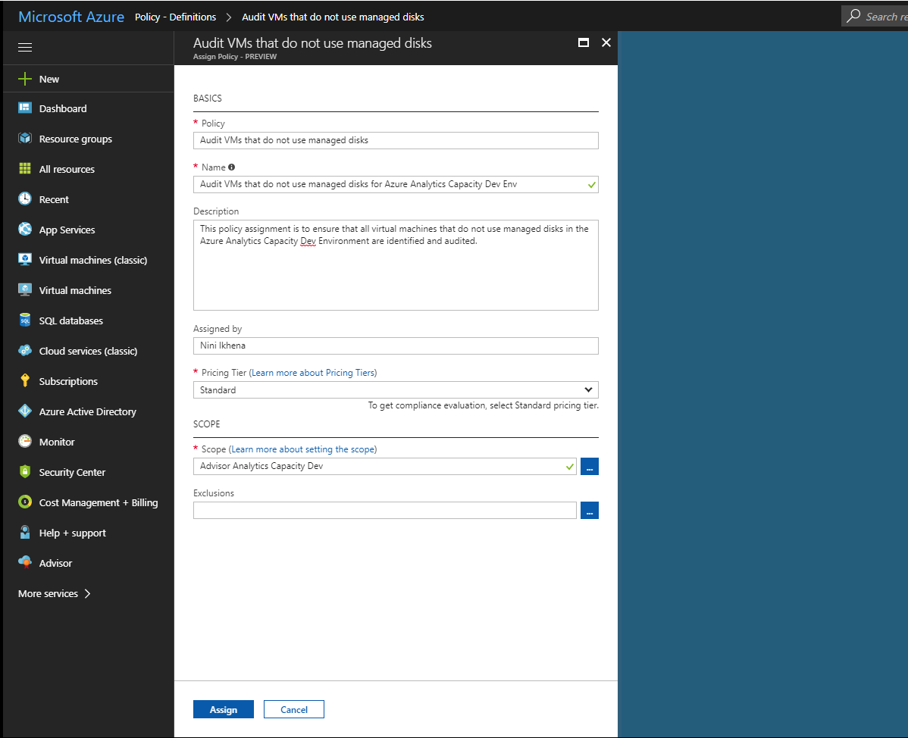

# Create a policy assignment to identify non-compliant resources in your Azure environment
The first step in understanding compliance in Azure is knowing where you stand with your own current resources. This quickstart steps you through the process of creating a policy assignment to identify resources that are not using SQL Server version 12.0. At the end of this process, you will have successfully identified what servers are of a different version, and therefore *non-compliant*.

If you don't have an Azure subscription, create a [free account](https://azure.microsoft.com/free/?WT.mc_id=A261C142F) before you begin.

## Opt in to Azure Policy

Azure Policy is now available in Limited Preview, so you need to register to request access.

1. Go to Azure Policy at https://aka.ms/getpolicy and select **Sign Up** in the left pane.

   

2. Opt-in to Azure Policy by selecting the subscriptions in the **Subscription** list you would like to work with. Then select **Register**.

   

   It may take a couple of days for us to accept your registration request, based on demand. Once your request gets accepted, you will be notified via email that you can begin using the service.

## Create a policy assignment

In this quickstart, we create a policy assignment and assign the *Require SQL Server Version 12.0* definition. 

1. Select **Assignments** on the left pane of the Azure Policy page.
2. Select **Assign Policy** from the top of the **Assignments** pane.

   

3. On the **Assign Policy** page, click  next to **Policy** field to open the list of available definitions.

   

   Azure Policy comes with already built in policy definitions you can use. You see built-in policy definitions such as:

   - Enforce tag and its value
   - Apply tag and its value
   - Require SQL Server Version 12.0

4. Search through your policy definitions to find the *Require SQL Server Version 12.0* definition. Click on that policy and click **Select**.

   

5. Provide a display **Name** for the policy assignment. In this case, let’s use *Require SQL Server version 12.0*. You can also add an optional **Description**. The description provides details about how this policy assignment ensures all SQL servers created in this environment are version 12.0.
6. Change the pricing tier to **Standard** to ensure that the policy gets applied to existing resources.

   There are two pricing tiers within Azure Policy – *Free* and *Standard*. With the Free tier, you can only enforce policies on future resources, while with Standard, you can also enforce them on existing resources to better understand your compliance state. Because we are in Limited Preview, we have not yet released a pricing model, so you will not receive a bill for selecting *Standard*. To read more about pricing, look at: [Azure Policy pricing](https://acom-milestone-ignite.azurewebsites.net/pricing/details/azure-policy/).

7. Select the **Scope** you would like the policy to be applied to.  A scope determines what resources or grouping of resources the policy assignment gets enforced on. It could range from a subscription to resource groups.
8. Select the subscription (or resource group) you previously registered when you opted into Azure Policy. In this example, we are using this subscription - **Azure Analytics Capacity Dev**, but your options will differ.

   

9. Select **Assign**.

You’re now ready to identify non-compliant resources to understand the compliance state of your environment.

## Identify non-compliant resources

Select **Compliance** on the left pane, and search for the policy assignment you created.

If there are any existing resources that are not compliant with this new assignment, they will show up under the **Non-compliant resources** tab.

If a condition is evaluated across your existing resources and it comes out true for some of them, those resources are marked as non-compliant with the policy. Here’s a table of how the different actions we have available today work with the condition evaluation result and the compliance state of your resources.

|Resource  |If Condition in the Policy Evaluates to  |Action in the Policy   |Compliance State  |
|-----------|---------|---------|---------|
|Exists     |True     |Deny     |Non-compliant |
|Exists     |False    |Deny     |Compliant     |
|Exists     |True     |Append   |Non-compliant |
|Exists     |False    |Append   |Compliant     |
|Exists     |True     |Audit    |Non-compliant |
|Exists     |False    |Audit    |Non-compliant |

## Clean up resources

Other guides in this collection build upon this quickstart. If you plan to continue to work with subsequent tutorials, do not clean up the resources created in this quickstart. If you do not plan to continue, use the following steps to delete all resources created by this quickstart in the Azure portal.
1. Select **Assignments** on the left pane.
2. Search for the assignment you just created.

   

3.	Select **Delete Assignment**.

## Next steps

In this quickstart, you assigned a policy definition to a scope to ensure that all the resources in that scope are compliant and to identify which ones aren’t.

To learn more about assigning policies to ensure that **future** resources that get created are compliant, continue to the tutorial for:

> [!div class="nextstepaction"]
> [Creating and managing policies](./create-manage-policy.md)

