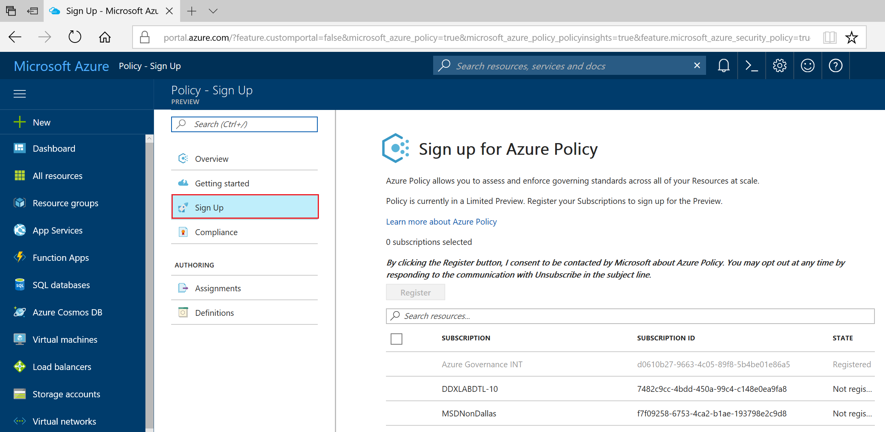
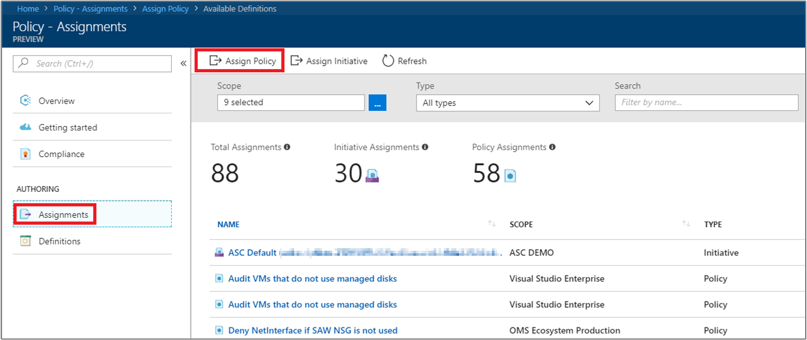
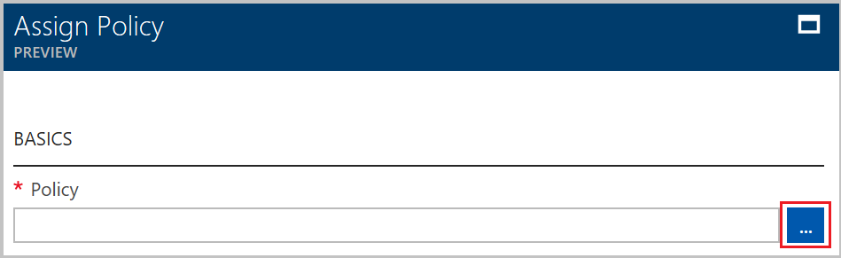
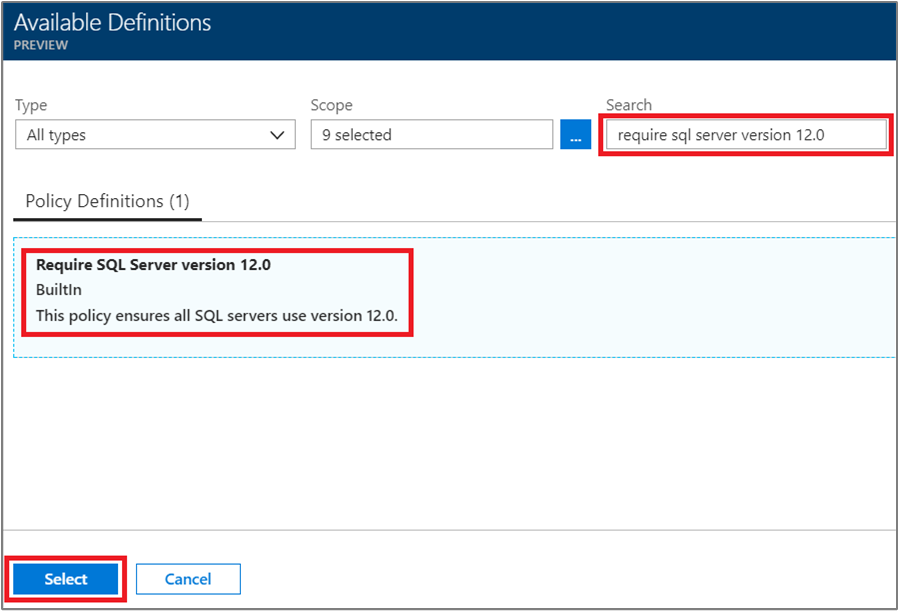
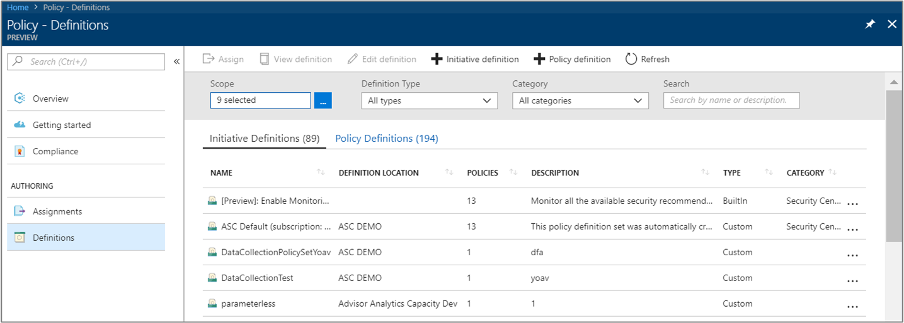
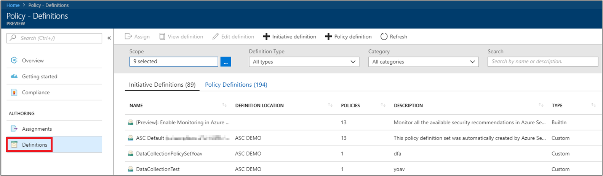
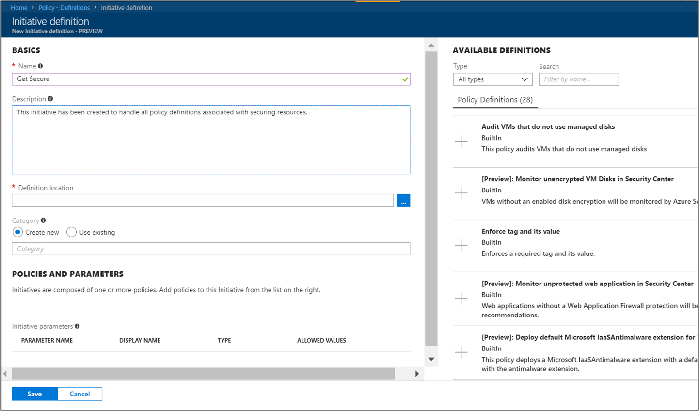
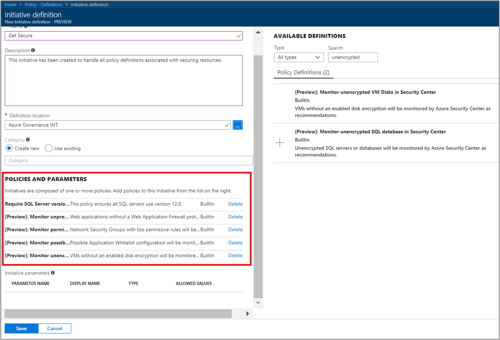
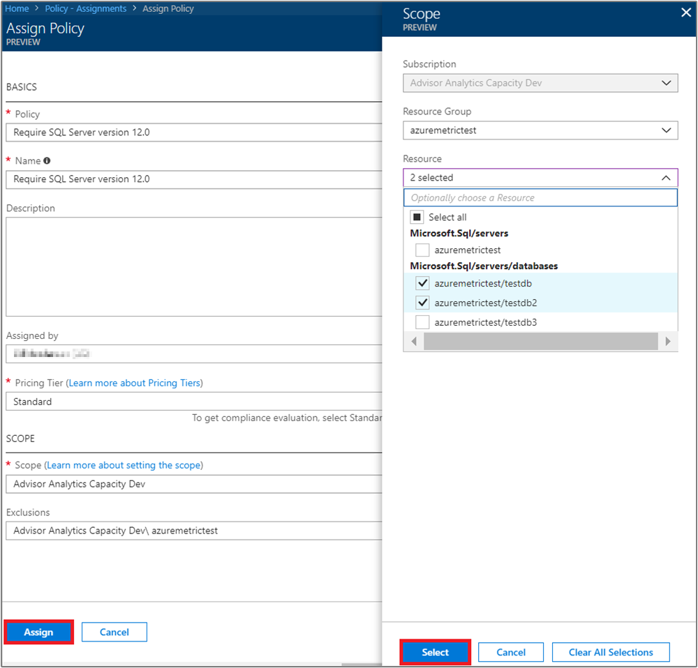

# Create and manage policies to enforce compliance

Understanding how to create and manage policies in Azure is important for staying compliant with your corporate standards and service level agreements. In this tutorial, you'll learn to use Azure Policy to do some of the more common tasks related to creating, assigning and managing policies across your organization, such as:

> [!div class="checklist"]
> * Assign a policy to enforce a condition for resources you create in the future
> * Create and assign an initiative definition to track compliance for multiple resources
> * Resolve a non-compliant or denied resource
> * Implement a new policy across an organization

If you don't have an Azure subscription, create a [free account](https://azure.microsoft.com/free/?WT.mc_id=A261C142F) before you begin.

## Opt in to Azure Policy

Azure Policy is now available in Limited Preview, so you need to register to request access.

1. Go to Azure Policy at https://aka.ms/getpolicy and select **Sign Up** in the left pane.

   

2. Opt-in to Azure Policy by selecting the subscriptions in the **Subscription** list you would like to work with. Then select **Register**.

   Your subscription list includes all your Azure subscriptions.

   

   Depending on demand, it may take up to a couple of days for us to accept your registration request. Once your request gets accepted, you will be notified via email that you can begin using the service.

## Assign a policy

The first step in enforcing compliance with Azure Policy is to assign a policy definition. A policy definition defines under what condition a policy is enforced, and what action to take. In this example, we assign a built-in policy definition called *Require SQL Server Version 12.0*, to enforce the condition that all SQL Server databases must be v12.0 to be compliant.

1. Launch the Azure Policy service in the Azure portal by searching for and selecting **Policy** in the left pane.

   

2. Select **Assignments** on the left pane of the Azure Policy page. An assignment is a policy that has been assigned to take place within a specific scope.
3. Select **Assign Policy** from the top of the **Assignments** pane.

   

4. On the **Assign Policy** page, click  next to **Policy** field to open the list of available definitions.

   

5. Select **Require SQL Server Version 12.0**.

   

6. Provide a display **Name** for the policy assignment. In this case, let’s use *Require SQL Server version 12.0*. You can also add an optional **Description**. The description provides details about how this policy assignment ensures all SQL servers created in this environment are version 12.0.
7. Change the pricing tier to **Standard** to ensure that the policy gets applied to existing resources.

   There are two pricing tiers within Azure Policy – *Free* and *Standard*. With the Free tier, you can only enforce policies on future resources, while with Standard, you can also enforce them on existing resources to better understand your compliance state. Because we are in Limited Preview, we have not yet released a pricing model, so you will not receive a bill for selecting *Standard*. To read more about pricing, look at: [Azure Policy pricing](https://acom-milestone-ignite.azurewebsites.net/pricing/details/azure-policy/).

8. Select the **Scope** - the subscription (or resource group) you previously registered when you opted into Azure Policy. A scope determines what resources or grouping of resources the policy assignment gets enforced on. It could range from a subscription to resource groups.

   For this example we are using this subscription - **Azure Analytics Capacity Dev**. Your subscription will differ.

10. Select **Assign**.

## Implement a new custom policy

Now that we've assigned the policy definition, we're going to create a new policy to save costs by ensuring that VMs created across your environment cannot be in the G series. This way, every time a user in your org tries to create VM in the G series, the request will get denied.

1. Select **Definition** under **Authoring** in the left pane.

   

2. Select **+ Policy Definition**.
3. Enter the following:

   - The name of the policy definition - *Require VM SKUs smaller than the G series*
   - The description of what the policy definition is intended to do – This policy definition enforces that all VMs created in this scope have SKUs smaller than the G series to reduce cost.
   - The subscription in which the policy definition will live in – In this case, our policy definition will live in  **Advisor Analytics Capacity Dev**. Your subscription list will differ.
   - Write the json code with:
      - The policy parameters.
      - The policy rules/conditions, in this case – VM SKU size equal to G series
      - The policy effect, in this case – **Deny**.

   Here's what the json should look like

```json
{
    "policyRule": {
      "if": {
        "allOf": [
          {
            "field": "type",
            "equals": "Microsoft.Compute/virtualMachines"
          },
          {
            "field": "Microsoft.Compute/virtualMachines/sku.name",
            "like": "Standard_G*"
          }
        ]
      },
      "then": {
        "effect": "deny"
      }
    }
}
```

<!-- Update the following link to the top level samples page
-->
   To view samples of json code, look at this article  - [Resource policy overview](../azure-resource-manager/resource-manager-policy.md)

4. Select **Save**.

## Create a policy definition with REST API

You can create a policy with the REST API for Policy Definitions. The REST API enables you to create and delete policy definitions, and get information about existing definitions.
To create a policy definition, use the following example:

```
PUT https://management.azure.com/subscriptions/{subscription-id}/providers/Microsoft.authorization/policydefinitions/{policyDefinitionName}?api-version={api-version}

```
Include a request body similar to the following example:

```
{
  "properties": {
    "parameters": {
      "allowedLocations": {
        "type": "array",
        "metadata": {
          "description": "The list of locations that can be specified when deploying resources",
          "strongType": "location",
          "displayName": "Allowed locations"
        }
      }
    },
    "displayName": "Allowed locations",
    "description": "This policy enables you to restrict the locations your organization can specify when deploying resources.",
    "policyRule": {
      "if": {
        "not": {
          "field": "location",
          "in": "[parameters('allowedLocations')]"
        }
      },
      "then": {
        "effect": "deny"
      }
    }
  }
}
```

## Create a policy definition with PowerShell

Before proceeding with the PowerShell example, make sure you have installed the latest version of Azure PowerShell. Policy parameters were added in version 3.6.0. If you have an earlier version, the examples return an error indicating the parameter cannot be found.

You can create a policy definition using the `New-AzureRmPolicyDefinition` cmdlet.

To create a policy definition from a file, pass the path to the file. For an external file, use the following example:

```
$definition = New-AzureRmPolicyDefinition `
    -Name denyCoolTiering `
    -DisplayName "Deny cool access tiering for storage" `
    -Policy 'https://raw.githubusercontent.com/Azure/azure-policy-samples/master/samples/Storage/storage-account-access-tier/azurepolicy.rules.json'
```

For a local file use, use the following example:

```
$definition = New-AzureRmPolicyDefinition `
    -Name denyCoolTiering `
    -Description "Deny cool access tiering for storage" `
    -Policy "c:\policies\coolAccessTier.json"
```

To create a policy definition with an inline rule, use the following example:

```
$definition = New-AzureRmPolicyDefinition -Name denyCoolTiering -Description "Deny cool access tiering for storage" -Policy '{
  "if": {
    "allOf": [
      {
        "field": "type",
        "equals": "Microsoft.Storage/storageAccounts"
      },
      {
        "field": "kind",
        "equals": "BlobStorage"
      },
      {
        "not": {
          "field": "Microsoft.Storage/storageAccounts/accessTier",
          "equals": "cool"
        }
      }
    ]
  },
  "then": {
    "effect": "deny"
  }
}'
```

The output is stored in a `$definition` object, which is used during policy assignment.
The following example creates a policy definition that includes parameters:

```
$policy = '{
    "if": {
        "allOf": [
            {
                "field": "type",
                "equals": "Microsoft.Storage/storageAccounts"
            },
            {
                "not": {
                    "field": "location",
                    "in": "[parameters(''allowedLocations'')]"
                }
            }
        ]
    },
    "then": {
        "effect": "Deny"
    }
}'

$parameters = '{
    "allowedLocations": {
        "type": "array",
        "metadata": {
          "description": "The list of locations that can be specified when deploying storage accounts.",
          "strongType": "location",
          "displayName": "Allowed locations"
        }
    }
}'

$definition = New-AzureRmPolicyDefinition -Name storageLocations -Description "Policy to specify locations for storage accounts." -Policy $policy -Parameter $parameters
```

## View policy definitions

To see all policy definitions in your subscription, use the following command:

```
Get-AzureRmPolicyDefinition
```

It returns all available policy definitions, including built-in policies. Each policy is returned in the following format:

```
Name               : e56962a6-4747-49cd-b67b-bf8b01975c4c
ResourceId         : /providers/Microsoft.Authorization/policyDefinitions/e56962a6-4747-49cd-b67b-bf8b01975c4c
ResourceName       : e56962a6-4747-49cd-b67b-bf8b01975c4c
ResourceType       : Microsoft.Authorization/policyDefinitions
Properties         : @{displayName=Allowed locations; policyType=BuiltIn; description=This policy enables you to
                     restrict the locations your organization can specify when deploying resources. Use to enforce
                     your geo-compliance requirements.; parameters=; policyRule=}
PolicyDefinitionId : /providers/Microsoft.Authorization/policyDefinitions/e56962a6-4747-49cd-b67b-bf8b01975c4c
```

## Create a policy definition with Azure CLI

You can create a policy definition using Azure CLI with the policy definition command.
To create a policy definition with an inline rule, use the following example:

```
az policy definition create --name denyCoolTiering --description "Deny cool access tiering for storage" --rules '{
  "if": {
    "allOf": [
      {
        "field": "type",
        "equals": "Microsoft.Storage/storageAccounts"
      },
      {
        "field": "kind",
        "equals": "BlobStorage"
      },
      {
        "not": {
          "field": "Microsoft.Storage/storageAccounts/accessTier",
          "equals": "cool"
        }
      }
    ]
  },
  "then": {
    "effect": "deny"
  }
}'
```

## View policy definitions

To see all policy definitions in your subscription, use the following command:

```
az policy definition list
```

It returns all available policy definitions, including built-in policies. Each policy is returned in the following format:

```
{                                                            
  "description": "This policy enables you to restrict the locations your organization can specify when deploying resources. Use to enforce your geo-compliance requirements.",                      
  "displayName": "Allowed locations",
  "id": "/providers/Microsoft.Authorization/policyDefinitions/e56962a6-4747-49cd-b67b-bf8b01975c4c",
  "name": "e56962a6-4747-49cd-b67b-bf8b01975c4c",
  "policyRule": {
    "if": {
      "not": {
        "field": "location",
        "in": "[parameters('listOfAllowedLocations')]"
      }
    },
    "then": {
      "effect": "Deny"
    }
  },
  "policyType": "BuiltIn"
}
```

## Create and assign an initiative definition

With an initiative definition, you can group several policy definitions to achieve one overarching goal. You create an initiative definition to ensure that resources within the scope of the definition stay compliant with the policy definitions that make up the initiative definition.  See the [Azure Policy overview](./azure-policy-introduction.md) for more information on initiative definitions.

### Create an initiative definition

1. Select **Definitions** under **Authoring** on the left pane.

   

2. Select **Initiative Definition** at the top of the page, this selection takes you to the **Initiative Definition** form.
3. Enter the name and description of the initiative.

   In this example, we want to ensure that resources are in compliance with policy definitions about getting secure, the name of the initiative would be **Get Secure**, and the description would be: **This initiative has been created to handle all policy definitions associated with securing resources**.

   

4. Browse through the list of **Available Definitions** and select the policy definition(s) you would like to add to that initiative. For our **Get secure** initiative, add the following built in policy definitions:
   - Require SQL Server version 12.0
   - Monitor unprotected web applications in the security center.
   - Monitor permissive network across in Security Center.
   - Monitor possible app Whitelisting in Security Center.
   - Monitor unencrypted VM Disks in Security Center.

   

   After selecting the policy definitions from the list you'll see it under **Policies and parameters**, as shown above.

5. Select **Create**.

### Assign an initiative definition

1. Go to the **Definitions** tab under **Authoring**.
2. Search for the **Get secure** initiative definition you created.
3. Select the initiative definition, and then select **Assign**.

   

4. Fill out the **Assignment** form, by entering:
   - name: Get secure assignment
   - description: this initiative assignment is tailored towards enforcing this group of policy definitions in the **Azure Advisor Capacity Dev** subscription
   - pricing tier: Standard
   - scope you would like this assignment applied to: **Azure Advisor Capacity Dev**

5. Select **Assign**.

## Resolve a non-compliant or denied resource

Following the example above, after assigning the policy definition to require SQL server version 12.0, a SQL server created with a different version would get denied. In this section, we’re walking through resolving a denied attempt to created a SQL server of a different version.

1. Select **Assignments** on the left pane.
2. Browse through all policy assignments and launch the *Require SQL Server version 12.0* assignment.
3. Request an exclusion for the resource groups in which you are trying to create the SQL server. In this case, we are excluding Microsoft.Sql/servers/databases: *baconandbeer/Cheetos* and *baconandbeer/Chorizo*.

   

   Other ways you could resolve a denied resource include: Reaching out to the contact associated with the policy if you have a strong justification for needing the SQL server created, and directly editing the policy if you have access to.

4. Select **Save**.

In this section, you resolved the denial of your attempt to create a SQL server with version 12.0, by requesting an exclusion to the resources.

## Clean up resources

If you plan to continue to work with subsequent tutorials, do not clean up the resources created in this guide. If you do not plan to continue, use the following steps to delete any of the assignments or definitions created above:

1. Select **Definitions** (or **Assignments** if you are trying to delete an assignment) on the left pane.
2. Search for the new initiative or policy definition (or assignment) you just created.
3. Select the ellipses on the end of the definition or assignment, and select **Delete Definition** (or **Delete Assignment**).

## Next steps

In this tutorial, you successfully accomplished the following:

> [!div class="checklist"]
> * Assigned a policy to enforce a condition for resources you create in the future
> * Created and assign an initiative definition to track compliance for multiple resources
> * Resolved a non-compliant or denied resource
> * Implemented a new policy across an organization

To learn more about the structures of policy definitions, look at this article:

> [!div class="nextstepaction"]
> [Azure Policy definition structure](policy-definition.md)
