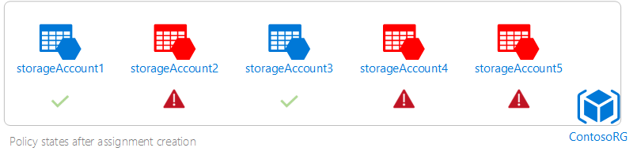

# Programmatically create policies and view compliance data

This article walks you through programmatically creating and managing policies. It also shows you how to view resource compliance states and polices. Policy definitions enforce different rules and actions over your resources. Enforcement makes sure that resources stay compliant with your corporate standards and service level agreements.

## Prerequisites

Before you begin, make sure that the following prerequisites are met:

1. If you haven't already, install the [ARMClient](https://github.com/projectkudu/ARMClient). It's a tool that sends HTTP requests to Azure Resource Manager-based APIs.
2. Update your AzureRM PowerShell module to the latest version. For more information about the latest version, see Azure PowerShell https://github.com/Azure/azure-powershell/releases.
3. Register the Policy Insights resource provider using Azure PowerShell to ensure that your subscription works with the resource provider. To register a resource provider, you must have permission to perform the register action operation for the resource provider. This operation is included in the Contributor and Owner roles. Run the following command to register the resource provider:

    ```
    Register-AzureRmResourceProvider -ProviderNamespace Microsoft.PolicyInsights
    ```

    For more information about registering and viewing resource providers, see  [Resource Providers and Types](../azure-resource-manager/resource-manager-supported-services.md).

4. If you haven't already, install Azure CLI. You can get the latest version at [Install Azure CLI 2.0 on Windows](/azure/install-azure-cli-windows?view=azure-cli-latest).

## Create and assign a policy definition

The first step toward better visibility of your resources is to create and assign policies over your resources. The next step is to learn how to programmatically create and assign a policy. The example policy audits storage accounts that are open to all public networks using PowerShell, Azure CLI, and HTTP requests.

The following commands create policy definitions for the Standard tier. The Standard tier helps you achieve at-scale management, compliance evaluation, and remediation. For more information about pricing tiers, see [Azure Policy pricing](https://azure.microsoft.com/pricing/details/azure-policy).

### Create and assign a policy definition with PowerShell

1. Use the following JSON snippet to create a JSON file with the name AuditStorageAccounts.json.

    ```
    {
    "if": {
      "allOf": [
        {
          "field": "type",
          "equals": "Microsoft.Storage/storageAccounts"
        },
        {
          "field": "Microsoft.Storage/storageAccounts/networkAcls.defaultAction",
          "equals": "Allow"
        }
      ]
    },
    "then": {
      "effect": "audit"
    }
  }

    ```

    For more information about authoring a policy definition, see [Azure Policy Definition Structure](policy-definition.md).

2. Run the following command to create a policy definition using the AuditStorageAccounts.json file.

    ```
    PS C:\>New-AzureRmPolicyDefinition -Name "AuditStorageAccounts" -DisplayName "Audit Storage Accounts Open to Public Networks" -Policy C:\AuditStorageAccounts.json
    ```

    The command creates a policy definition named _Audit Storage Accounts Open to Public Networks_. For more information about other parameters that you can use, see [New-AzureRmPolicyDefinition](/powershell/module/azurerm.resources/new-azurermpolicydefinition?view=azurermps-4.4.1).

3. After you create your policy definition, you can create a policy assignment by running the following commands:

    ```
$rg = Get-AzureRmResourceGroup -Name "ContosoRG"
```

    ```
$Policy = Get-AzureRmPolicyDefinition -Name "AuditStorageAccounts"
    ```

    ```
New-AzureRmPolicyAssignment -Name "AuditStorageAccounts" -PolicyDefinition $Policy -Scope $rg.ResourceId –Sku @{Name='A1';Tier='Standard'}
    ```

    Replace _ContosoRG_ with the name of your intended resource group.

For more information about managing resource policies using the Azure Resource Manager PowerShell module, see [AzureRM.Resources](/powershell/module/azurerm.resources/?view=azurermps-4.4.1#policies).

### Create and assign a policy definition using ARMClient

Use the following procedure to create a policy definition.

1. Copy the following JSON snippet to create a JSON file. You'll call the file in the next step.

    ```
    {
    "properties": {
        "displayName": "Audit Storage Accounts Open to Public Networks",
        "policyType": "Custom",
        "mode": "Indexed",
        "description": "This policy ensures that storage accounts with exposure to Public Networks are audited.",
        "parameters": {},
        "policyRule": {
			  "if": {
				"allOf": [
				  {
					"field": "type",
					"equals": "Microsoft.Storage/storageAccounts"
				  },
				  {
					"field": "Microsoft.Storage/storageAccounts/networkAcls.defaultAction",
					"equals": "Allow"
				  }
				]
			  },
			  "then": {
				"effect": "audit"
			  }
			}
    }
}
```

2. Create the policy definition using the following call:

    ```
    armclient PUT "/subscriptions/<subscriptionId>/providers/Microsoft.Authorization/policyDefinitions/AuditStorageAccounts?api-version=2016-12-01 @<path to policy definition JSON file>"
    ```

    Replace the preceding_ &lt;subscriptionId&gt; with the ID of your intended subscription.

For more information about the structure of the query, see [Policy Definitions – Create or Update](/rest/api/resources/policydefinitions/createorupdate).


Use the following procedure to create a policy assignment and assign the policy definition at the resource group level.

1. Copy the following JSON snippet to create a JSON policy assignment file. Replace example information in &lt;&gt; symbols with your own values.

    ```
    {
  "properties": {
"description": "This policy assignment makes sure that storage accounts with exposure to Public Networks are audited.",
"displayName": "Audit Storage Accounts Open to Public Networks Assignment",
"parameters": {},
"policyDefinitionId":"/subscriptions/<subscriptionId>/providers/Microsoft.Authorization/policyDefinitions/Audit Storage Accounts Open to Public Networks",
"scope": "/subscriptions/<subscriptionId>/resourceGroups/<resourceGroupName>"
},
"sku": {
    "name": "A1",
    "tier": "Standard"
	}
}
    ```

2. Create the policy assignment using the following call:

    ```
    armclient PUT "/subscriptions/<subscriptionID>/resourceGroups/<resourceGroupName>/providers/Microsoft.Authorization/policyAssignments/Audit Storage Accounts Open to Public Networks?api-version=2017-06-01-preview" @<path to Assignment JSON file>
    ```

    Replace example information in &lt;&gt; symbols with your own values.

 For more information about making HTTP calls to the REST API, see [Azure REST API Resources](/rest/api/resources/).

### Create and assign a policy definition with Azure CLI

To create a policy definition, use the following procedure:

1. Copy the following JSON snippet to create a JSON policy assignment file.

    ```
    {
    			  "if": {
    				"allOf": [
    				  {
    					"field": "type",
    					"equals": "Microsoft.Storage/storageAccounts"
    				  },
    				  {
    					"field": "Microsoft.Storage/storageAccounts/networkAcls.defaultAction",
    					"equals": "Allow"
    				  }
    				]
    			  },
    			  "then": {
    				"effect": "audit"
    			  }
    }
    ```

2. Run the following command to create a policy definition:

    ```
az policy definition create --name 'audit-storage-accounts-open-to-public-networks' --display-name 'Audit Storage Accounts Open to Public Networks' --description 'This policy ensures that storage accounts with exposures to public networks are audited.' --rules '<path to json file>' --mode All
    ```

Use the following command to create a policy assignment. Replace example information in &lt;&gt; symbols with your own values.

```
az policy assignment create --name '<Audit Storage Accounts Open to Public Networks in Contoso RG' --scope '<scope>' --policy '<policy definition ID>' --sku 'standard'
```

You can get the Policy Definition ID by using PowerShell with the following command:

```
az policy definition show --name 'Audit Storage Accounts with Open Public Networks'
```

The policy definition ID for the policy definition that you created should resemble the following example:

```
"/subscription/<subscriptionId>/providers/Microsoft.Authorization/policyDefinitions/Audit Storage Accounts Open to Public Networks"
```

For more information about how you can manage resource policies with Azure CLI, see [Azure CLI Resource Policies](/cli/azure/policy?view=azure-cli-latest).

## Identify non-compliant resources

In an assignment, a resource is non-compliant if it doesn't follow policy or initiative rules. The following table shows how different policy actions work with the condition evaluation for the resulting compliance state:

| **Resource State** | **Action** | **Policy Evaluation** | **Compliance State** |
| --- | --- | --- | --- |
| Exists | Deny, Audit, Append\*, DeployIfNotExist\*, AuditIfNotExist\* | True | Non-Compliant |
| Exists | Deny, Audit, Append\*, DeployIfNotExist\*, AuditIfNotExist\* | False | Compliant |
| New | Audit, AuditIfNotExist\* | True | Non-Compliant |
| New | Audit, AuditIfNotExist\* | False | Compliant |

\* The Append, DeployIfNotExist, and AuditIfNotExist actions require the IF statement to be TRUE. The actions also require the existence condition to be FALSE to be non-compliant. When TRUE, the IF condition triggers evaluation of the existence condition for the related resources.

To better understand how resources are flagged as non-compliant, let's use the policy assignment example created above.

For example, assume that you have a resource group – ContsoRG, with some storage accounts (highlighted in red) that are exposed to public networks.


In this example, you need to be wary of security risks. Now that you've created a policy assignment, it is evaluated for all storage accounts in the ContosoRG resource group. It audits the three non-compliant storage accounts, consequently changing their states to **non-compliant.**



Use the following procedure to identify resources in a resource group that aren't compliant with the policy assignment. In the example, the resources are storage accounts in the ContosoRG resource group.

1. Get the policy assignment ID by running the following commands:

    ```
    $policyAssignment = Get-AzureRmPolicyAssignment | where {$_.properties.displayName -eq "Audit Storage Accounts with Open Public Networks"}
    ```

    ```
    $policyAssignment.PolicyAssignmentId
    ```

    For more information about getting a policy assignment's ID, see [Get-AzureRMPolicyAssignment](https://docs.microsoft.com/en-us/powershell/module/azurerm.resources/Get-AzureRmPolicyAssignment?view=azurermps-4.4.1).

2. Run the following command to have the resource IDs of the non-compliant resources copied into a JSON file:

    ```
    armclient post "/subscriptions/<subscriptionID>/resourceGroups/<rgName>/providers/Microsoft.PolicyInsights/policyStates/latest/queryResults?api-version=2017-12-12-preview&$filter=IsCompliant eq false and PolicyAssignmentId eq '<policyAssignmentID>'&$apply=groupby((ResourceId))" > <json file to direct the output with the resource IDs into>
    ```

3. The results should resemble the following example:

  ```
      {
  "@odata.context":"https://management.azure.com/subscriptions/<subscriptionId>/providers/Microsoft.PolicyInsights/policyStates/$metadata#latest",
  "@odata.count": 3,
  "value": [
  {
      "@odata.id": null,
      "@odata.context": "https://management.azure.com/subscriptions/<subscriptionId>/providers/Microsoft.PolicyInsights/policyStates/$metadata#latest/$entity",
        "ResourceId": "/subscriptions/<subscriptionId>/resourcegroups/<rgname>/providers/microsoft.storage/storageaccounts/<storageaccount1Id>"
      },
      {
        "@odata.id": null,
        "@odata.context": "https://management.azure.com/subscriptions/<subscriptionId>/providers/Microsoft.PolicyInsights/policyStates/$metadata#latest/$entity",
        "ResourceId": "/subscriptions/<subscriptionId>/resourcegroups/<rgname>/providers/microsoft.storage/storageaccounts/<storageaccount2Id>"
     		 },
  {
        "@odata.id": null,
        "@odata.context": "https://management.azure.com/subscriptions/<subscriptionId>/providers/Microsoft.PolicyInsights/policyStates/$metadata#latest/$entity",
        "ResourceId": "/subscriptions/<subscriptionName>/resourcegroups/<rgname>/providers/microsoft.storage/storageaccounts/<storageaccount3ID>"
     		 }
  ]
  }
  ```

The results are equivalent to what you would typically see listed under **Non-compliant resources** in the [Azure portal view](assign-policy-definition.md#identify-non-compliant-resources).

Currently, non-compliant resources are only identified using the Azure portal and with HTTP requests. For more information about querying policy states, see the [Policy State](/rest/api/policy-insights/policystates) API reference article.

## View policy events

When a resource is created or updated, a policy evaluation result is generated. Results are called _policy events_. Run the following query to view all policy events associated with the policy assignment.

```
armclient POST "/subscriptions/<subscriptionId>/providers/Microsoft.Authorization/policyDefinitions/Audit Storage Accounts Open to Public Networks/providers/Microsoft.PolicyInsights/policyEvents/default/queryResults?api-version=2017-12-12-preview"
```

Your results resemble the following example:

```
{
  "@odata.context": "https://management.azure.com/subscriptions/<subscriptionId>/providers/Microsoft.PolicyInsights/policyEvents/$metadata#default",
  "@odata.count": 1,
  "value": [
    {
      "@odata.id": null,
      "@odata.context": "https://management.azure.com/subscriptions/<subscriptionId>/providers/Microsoft.PolicyInsights/policyEvents/$metadata#default/$entity",
      "NumAuditEvents": 3
    }
  ]
}

```

Like policy states, you can only view policy events with HTTP requests. For more information about querying policy events, see the [Policy Events](/rest/api/policy-insights/policyevents) reference article.

## Change a policy assignment's pricing tier

You can use the *Set-AzureRmPolicyAssignment* PowerShell cmdlet to update the pricing tier to Standard or Free for an existing policy assignment. For example:

```
Set-AzureRmPolicyAssignment -Id /subscriptions/<subscriptionId/resourceGroups/<resourceGroupName>/providers/Microsoft.Authorization/policyAssignments/<policyAssignmentID> -Sku @{Name='A1';Tier='Standard'}
```

For more information about the cmdlet, see [Set-AzureRmPolicyAssignment](/powershell/module/azurerm.resources/Set-AzureRmPolicyAssignment?view=azurermps-4.4.1).

## Next steps

Review the following articles for more information about the commands and queries in this article.

- [Azure REST API Resources](/rest/api/resources/)
- [Azure RM PowerShell Modules](/powershell/module/azurerm.resources/?view=azurermps-4.4.1#policies)
- [Azure CLI Policy Commands](/cli/azure/policy?view=azure-cli-latest)
- [Policy Insights resource provider REST API reference](/rest/api/policy-insights)
