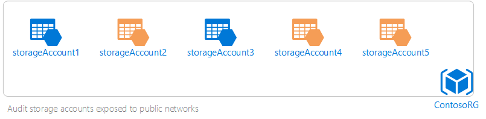

# Create and manage policies using the Policy Insights resource provider with the REST API

A resource provider is a service that allows you manage your resources or resource types in Azure. For example, you can use Microsoft.Compute to manage virtual machine resources and Microsoft.Storage to manage storage account resources. For more information, see [Resource Providers](../azure-resource-manager/resource-group-overview.md#resource-providers).

The Policy Insights resource provider exposes two resource types: **Policy Events** and **Policy States**. You can use them to view compliance states and policies.

This article describes Policy Insights resource types and how to use them with the REST API.

## Policy events

When a resource is created or updated, a policy evaluation result is generated. Results are called _policy events_. For example, assume that you have a resource group – _ContosoRG_, with some storage accounts (highlighted in red in the following diagram) that are exposed to public networks.


In this example, you will need to be wary of security risks. Later in this article, you learn how to create a policy assignment to audit such storage accounts. When you have a policy assignment to audit storage accounts, it is evaluated on all storage resources within a resource group. In this example, the ContosoRG resource group. The policy assignment audits the three non-compliant storage accounts, action highlighted in orange. Consequently, three different policy events are generated for each evaluation.


Regardless of the type of effect (deny, audit, or allow), a policy event is generated every time an evaluation runs.

## Policy states

A policy state is the compliance state of a resource against a policy assignment at a point in time.

Consider the previous policy assignment example. After the storage accounts are evaluated against the policy assignment where the three storage accounts are audited, their states are _non-compliant_.


## Policy Insights resource provider tasks

Now that you understand policy concepts, you can use the Policy Insights resource provider to complete some key scenarios.

Before you get started, do the following:

1. Install the [ARMClient](https://github.com/projectkudu/ARMClient) if you haven't already. It is one of many tools that makes it easy to send HTTP requests to Azure Resource Manager-based APIs.

2. To ensure that your subscription works with the resource provider, register the Policy Insights resource provider. To register a resource provider, you must have permission to perform the register action operation for the resource provider. This operation is included in the **Contributor** and **Owner** roles.

Run the following command to register the Policy Insights resource provider:

```
Register-AzureRmResourceProvider -ProviderNamespace Microsoft.PolicyInsights
```

You can't unregister a resource provider while you have any resource types from that resource provider in your subscription.

For more information about registering and viewing resource providers, see [Resource Providers and Types](../azure-resource-manager/resource-manager-supported-services.md).

### Create and assign a policy definition

The first step toward better visibility of your resources is to create and assign policies over your resources. The example in this article shows you how to create and assign a policy that audits storage accounts open to all public networks. The example uses the Policy Insights resource provider and the REST API.

#### Create and assign a policy definition with Azure PowerShell

1. Copy and paste the following JSON code to create a file named **AuditStorageAccounts.json**.

   ```json
{
  "policyRule": {
    "if": {
      "allOf": [
        {
          "field": "type",
          "equals": "Microsoft.Storage/storageAccounts"
        },
        {
          "field": "Microsoft.Storage/storageAccounts/networkAcls.defaultAction",
          "equals": "Allow"
        }
      ]
    },
    "then": {
      "effect": "audit"
    }
  },
  "parameters": {}
}
```

2. Run the following command to create a policy definition by using the AuditStorageAccounts.json files you created in the previous step.

   ```powershell
PS C:\>New-AzureRmPolicyDefinition -Name "Audit Storage Accounts Open to Public Networks" -Policy C:\AuditStorageAccounts.json
```

  The preceding command creates a policy definition named _Audit Storage Accounts Open to Public Networks_. The command specifies the policy as a string in valid JSON format.

  For more information about additional parameters that you can use, see [New-AzureRmPolicyDefinition](/powershell/module/azurerm.resources/new-azurermpolicydefinition?view=azurermps-4.4.1
).

3. After you create your policy definition, you can create a policy assignment by running the following commands:

   ```powershell
$rg = Get-AzureRmResourceGroup -Name "ContosoRG"
```

   ```powershell
$Policy = Get-AzureRmPolicyDefinition -Name "Audit Storage Accounts Open to Public Networks"
```

   ```powershell
New-AzureRmPolicyAssignment -Name "Audit Storage Accounts Open to Public Networks" -PolicyDefinition $Policy -Scope $rg.ResourceId
```

    The preceding commands use the following information:

    **Name** – The display **Name** for the policy assignment. In this case, it is _Audit Storage Accounts Open to Public Networks_.

    **Policy** – The policy definition, based off which you're using to create the assignment. In this case, it is the policy definition _Audit Storage Accounts Open to Public Networks._

    A **scope** - A scope determines what resources or grouping of resources the policy assignment gets enforced on. It could range from a subscription to resource groups. In this example, you are assigning the policy definition to the _ContosoRG_ resource group.

For more information about managing resource policies using the Azure Resource Manager PowerShell module, see [AzureRM.Resources](/powershell/module/azurerm.resources/?view=azurermps-4.4.1#policies).

#### Create and assign a policy definition with REST API

To create a policy definition, run the following command:

```powershell
PUT
https://management.azure.com/subscriptions/{subscriptionId}/providers/Microsoft.Authorization/policyDefinitions/{Audit Storage Accounts Open to Public Networks}?api-version=2016-12-01
```

Include the subscription ID in the query. For more information about the structure of the query, see [Policy Definitions – Create or Update](/rest/api/resources/policydefinitions/createorupdate).

To assign the policy definition you just created, run the following command:

```powershell
PUT https://management.azure.com/{scope}/providers/Microsoft.Authorization/policyAssignments/{Audit Storage Accounts Open to Public Networks}?api-version=2016-12-01
```

For more information about managing resource policies with the REST API, see [Azure Resource Manager](/rest/api/resources/).

#### Create and assign a policy definition with Azure CLI

To create a policy definition, run the following command:

```azurecli
 az policy definition create –name Audit Storage Accounts Open to Public Networks –rules <path to AuditStorageAccounts JSON file>
 ```

To create a policy assignment, use the following command:

```azurecli
az policy assignment create --name Audit Storage Accounts Open to Public Networks --policy Audit Storage Accounts Open to Public Networks --scope /resourceGroups/ContosoRG
```

Change the preceding example information for the name of resource group you are working with. For more information about how you can manage resource policies with Azure CLI, see [Azure CLI Resource Policies](/cli/azure/policy?view=azure-cli-latest).


### Identify non-compliant resources

Currently, non-compliant resources can only be identified using the portal and the REST API. Support for PowerShell and CLI is in development. To identify non-compliant resources, run the following command:

```azurecli
armclient POST /subscriptions/d0610b27-0000-4c05-89f8-5b4be01e86a5/providers/Microsoft.PolicyInsights/policyStates/default/summarize?api-version=2017-08-09-preview
```

Replace the scope and scope ID with your information. As with Policy Events, the valid scopes are:

- Management group, for example:  `/managementGroups/<mgid>`
- Subscription, for example: `/subscriptions/<subid>`
- Resource Group, for example: `/subscriptions/<subid>/resourceGroups/<rg>`
- Resource, for example: `/subscriptions/<subid>/resourceGroups/<rg>/providers/<namespace>/<type>/<id>`

Specifying the preceding information returns policy states for resources in the selected resource scope.

You can identify non-compliant resources within a policy scope. For example, policy state results for the resources associated with a policy definition or a policy set (initiative) definition. To do so, run the following query:

```azurecli
armclient POST /<policyDefinitionId>/providers/Microsoft.PolicyInsights/policyStates/default/summarize?api-version=2017-08-09-preview
```

### View policy events

As with policy states, you can only view policy events with the REST API. Support for PowerShell and Azure CLI is in development.

To view all policy events with the REST API, use the queryResults action in the following query:

```azurecli
armclient POST /subscriptions/d0610b27-0000-4c05-89f8-5b4be01e86a5/providers/Microsoft.PolicyInsights/policyEvents/default/queryResults?api-version=2017-08-09-preview
```

You can use the following valid scopes with the preceding query:

- Management group, for example:  `/managementGroups/<mgid>`
- Subscription, for example: `/subscriptions/<subid>`
- Resource Group, for example: `/subscriptions/<subid>/resourceGroups/<rg>`
- Resource, for example: `/subscriptions/<subid>/resourceGroups/<rg>/providers/<namespace>/<type>/<id>`

You can view policy evaluations in [Azure Activity Logs](../monitoring-and-diagnostics/monitoring-overview-activity-logs.md).

### View all compliance states for resources in a scope

To view compliance states, run the following query:

```azurecli
armclient POST /subscriptions/d0610b27-0000-4c05-89f8-5b4be01e86a5/providers/Microsoft.PolicyInsights/policyStates/default/queryResults?api-version=2017-08-09-preview
```

Replace the scope and scope ID with your details. As with Policy Events, the valid scopes are:

- Management group, for example:  `/managementGroups/<mgid>`
- Subscription, for example: `/subscriptions/<subid>`
- Resource Group, for example: `/subscriptions/<subid>/resourceGroups/<rg>`
- Resource, for example: `/subscriptions/<subid>/resourceGroups/<rg>/providers/<namespace>/<type>/<id>`

### Change the policy assignment pricing tier

With PowerShell, use the **Set-AzureRmPolicyAssignment** cmdlet to set the pricing tier to Standard (or Free) by running the following command. Replace examples with your information.

```powershell
Set-AzureRmPolicyAssignment -Id /subscriptions/d0610b27-0000-0000-89f8-5b4be0100000/resourceGroups/cheggpolicy/providers/Microsoft.Authorization/policyAssignments/e0b00000c6a0000fbac384aa -sku @{Name='A1';Tier='Standard'}
```

The preceding command example has the following structure inline:

```
/subscriptions/<subid>/resourceGroups/<rg>/providers/<namespace>/<type>/<id>
```

For more information about the **Set-AzureRMPolicyAssignment** cmdlet, see [Set-AzureRmPolicyAssignment](/powershell/module/azurerm.resources/Set-AzureRmPolicyAssignment?view=azurermps-4.4.1).

## Next steps

Review the following articles for more information about the commands and queries in this article.

- [Azure REST API Resources](/rest/api/resources/)
- [Azure RM PowerShell Modules](/powershell/module/azurerm.resources/?view=azurermps-4.4.1#policies)
- [Azure CLI Policy Commands](/cli/azure/policy?view=azure-cli-latest)
