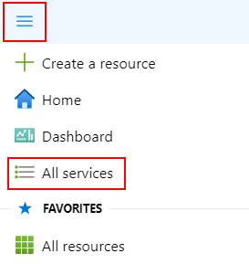
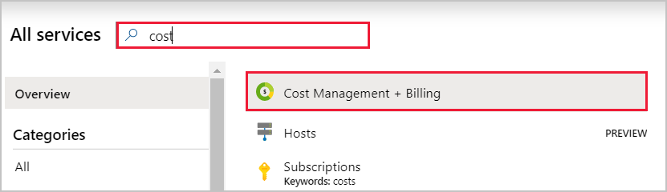
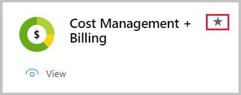
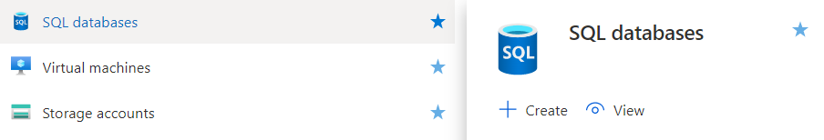
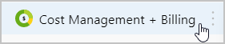

# Add, remove, and rearrange favorites

Add or remove items from your **Favorites** list so that you can quickly go to the services you use most often. We already added some common services to your **Favorites** list, but you’ll likely want to customize it. You're the only one who sees the changes you make to **Favorites**.

## Add a favorite

Items that are listed under **Favorites** are selected from **All services**. Hover over a service name to display information and resources related to the service. A filled star icon  next to the service name indicates that the item appears on the **Favorites** list. Select the star icon to add a service to the **Favorites** list.

### Add Cost Management + Billing to Favorites

1. Select **All services** from the Azure portal menu.

    

1. Enter the word "cost" in the search field. Services that have "cost" in the title or that have "cost" as a keyword are shown.

   

1. Hover over the service name to display the **Cost Management + Billing** information card. Select the star icon.

   

1. **Cost Management + Billing** is now added as the last item in your **Favorites** list.

## Remove an item from Favorites

You can now remove an item directly from the **Favorites** list.

1. In the **Favorites** section of the portal menu, hover over the name of the service you want to remove.

   

2. On the information card, select the star so that it changes from filled to unfilled. The service is removed from the **Favorites** list.

## Rearrange favorites

You can change the order that your favorite services are listed. Just drag and drop the menu item to another location under **Favorites**.

### Move Cost Management + Billing to the top of Favorites

1. Select and hold the **Cost Management + Billing** entry on the **Favorites** list.

   

1. While continuing to hold, drag the item to the top of **Favorites** and then release.

## Next steps

* To create a project-focused workspace, see [Create and share dashboards in the Azure portal](../azure-portal/azure-portal-dashboards.md)
* Discover more how-to's in the [Azure portal how-to video series](https://www.youtube.com/playlist?list=PLLasX02E8BPBKgXP4oflOL29TtqTzwhxR)