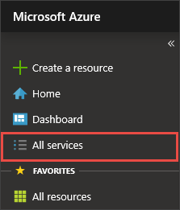
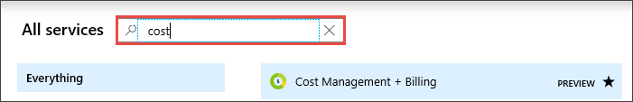

# Add, remove, and sort favorites

Add or remove items from your **Favorites** list so that you can quickly go to the services that you use most often. We already added some common services to your **Favorites** list, but you’ll likely want to customize it. You're the only one who sees the changes you make to **Favorites**.

## Add or remove a favorite

Items that are listed under **Favorites** are selected from **All services**. A star icon  next to each service indicates whether the item appears on the list. Select the star icon to add or remove a service from the **Favorites** list.

### Add Cost Management + Billing to Favorites

1. Select **All services** from the top section of the sidebar.

    

1. Enter the word "cost" in the search field. Only services that have "cost" in the title or that have "cost" as a keyword will be shown.

   

1. Select the star icon.

   

1. **Cost Management + Billing** is now added as the last item in your **Favorites** list.

## Sort favorites

You can change the order that your favorite services are listed. Just drag and drop the menu item to another location under **Favorites**.

### Move Cost Management + Billing to the top of Favorites

1. Select and hold the **Cost Management + Billing** entry on the **Favorites** list.

   

1. While continuing to hold, drag the item to the top of **Favorites** and then release.

## Next steps

* To create a project-focused workspace, see [Create and share dashboards in the Azure portal](../azure-portal/azure-portal-dashboards.md)
* Discover more how-to's in the [Azure portal how-to video series](https://www.youtube.com/playlist?list=PLLasX02E8BPBKgXP4oflOL29TtqTzwhxR)