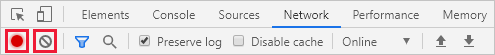
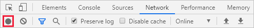
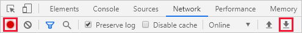
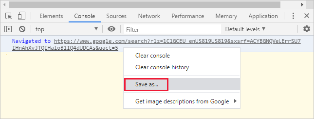
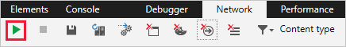
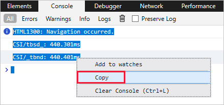

# Capture a browser trace for troubleshooting

If you're troubleshooting an issue with the Azure portal, and you need to contact Microsoft support, we recommend you first capture a browser trace and some additional information. The information you collect can provide important details about the portal at the time the issue occurs. Follow the steps in this article for the developer tools in the browser you use: Google Chrome or Microsoft Edge (Chromium), Microsoft Edge (EdgeHTML), or Apple Safari.

## Google Chrome and Microsoft Edge (Chromium)

Google Chrome and Microsoft Edge (Chromium) are both based on the [Chromium open source project](https://www.chromium.org/Home). The following steps show how to use the developer tools, which are very similar in the two browsers. For more information, see [Chrome DevTools](https://developers.google.com/web/tools/chrome-devtools) and [Microsoft Edge (Chromium) Developer Tools](/microsoft-edge/devtools-guide-chromium).

1. Sign in to the [Azure portal](https://portal.azure.com). It's important to sign in _before_ you start the trace so that the trace doesn't contain sensitive information related to your sign-in. 

1. Start recording the steps you take in the portal, using [Steps Recorder](https://support.microsoft.com/help/22878/windows-10-record-steps).

1. In the portal, navigate to the step just prior to where the issue occurs.

1. Press F12 or select  > **More tools** > **Developer tools**.

1. By default, the browser keeps trace information only for the page that's currently loaded. Set the following options so the browser keeps all trace information, even if your repro requires going to more than one page:

    1. Select the **Network** tab, then select **Preserve log**.

          

    1. Select the **Console** tab, select **Console settings**, then select **Preserve Log**. Select **Console settings** again to close the settings pane.

          

1. Select the **Network** tab, then select **Stop recording network log** and **Clear**.

    

1. Select **Record network log**, then reproduce the issue in the portal.

    

    You will see session output similar to the following image.

    

1. After you have reproduced the unexpected portal behavior, select **Stop recording network log**, then select **Export HAR** and save the file.

    

1. Stop Steps Recorder, and save the file.

1. Back in the browser developer tools pane, select the **Console** tab. Select **Save as...**, and save the console output to a text file.

    

1. Package the HAR file, console output, and Steps Recorder in a compressed format like .zip, and share that with Microsoft support.

## Microsoft Edge (EdgeHTML)

The following steps show how to use the developer tools in Microsoft Edge (EdgeHTML). For more information, see [Microsoft Edge (EdgeHTML) Developer Tools](/microsoft-edge/devtools-guide).

1. Sign in to the [Azure portal](https://portal.azure.com). It's important to sign in _before_ you start the trace so that the trace doesn't contain sensitive information related to your sign-in. 

1. Start recording the steps you take in the portal, using [Steps Recorder](https://support.microsoft.com/help/22878/windows-10-record-steps).

1. In the portal, navigate to the step just prior to where the issue occurs.

1. Press F12 or select  > **More tools** > **Developer tools**.

1. By default, the browser keeps trace information only for the page that's currently loaded. Set the following options so the browser keeps all trace information, even if your repro requires going to more than one page:

    1. Select the **Network** tab, then clear the option **Clear entries on navigate**.

          

    1. Select the **Console** tab, then select **Preserve Log**.

          

1. Select the **Network** tab, then select **Stop profiling session** and **Clear session**.

    

1. Select **Start profiling session**, then reproduce the issue in the portal.

    

    You will see session output similar to the following image.

    

1. After you have reproduced the unexpected portal behavior, select **Stop profiling session**, then select **Export as HAR** and save the file.

    

1. Stop Steps Recorder, and save the file.

1. Back in the browser developer tools pane, select the **Console** tab, and expand the window. Place your cursor at the start of the console output then drag and select the entire contents of the output. Copy the output and save it to a text file.

    

1. Package the HAR file, console output, and Steps Recorder in a compressed format like .zip, and share that with Microsoft support.

## Apple Safari

Steps go here

## Next steps

[Azure portal overview](azure-portal-overview.md)