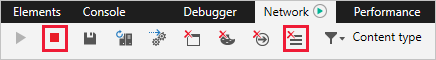
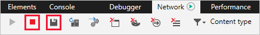

# Capture a browser trace for troubleshooting

If you're troubleshooting an issue with the Azure portal, and you need to contact Microsoft support, we recommend you first capture a browser trace and some additional information. The information you collect can provide important details about the portal at the time the issue occurs. Follow the steps in this article for the browser you use: Microsoft Edge, Google Chrome, or Apple Safari.

## Microsoft Edge

1. Sign in to the [Azure portal](https://portal.azure.com). It's important to sign in _before_ you start the trace so that the trace doesn't contain sensitive information related to your sign-in. 

1. Start recording the steps you take in the portal, using [Steps Recorder](https://support.microsoft.com/help/22878/windows-10-record-steps).

1. In the portal, navigate to the step just prior to where the issue occurs.

1. Press F12 or select  > **More tools** > **Developer tools**.

1. Ensure that the trace captures information from all the pages you visit in the portal:

    1. Select the **Network** tab, then clear the option **Clear entries on navigate**.

          

    1. Select the **Console** tab, then select **Preserve Log**.

          

1. Select the **Network** tab, then select **Stop profiling session** and **Clear session**.

    

1. Restart the session, then reproduce the issue in the portal. You will see session output similar to the following image.

    

1. Stop the session, then select **Export as HAR** and save the file.

      

1. Stop Steps Recorder, and save the file.

1. Select the **Console** tab, expand the window, and take screenshots of the output.

1. Package the HAR file, console screenshot, and Steps Recorder in a compressed format like .zip, and share that with Microsoft support.

## Google Chrome

Steps go here

## Apple Safari

Steps go here

## Next steps

[Azure portal overview](azure-portal-overview.md)