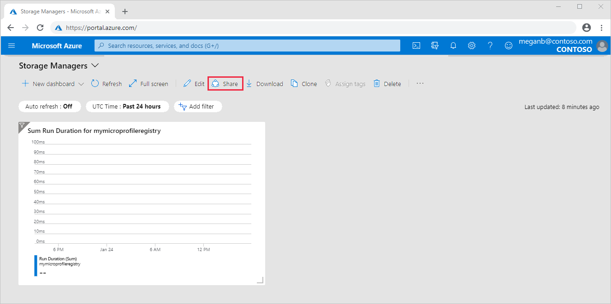
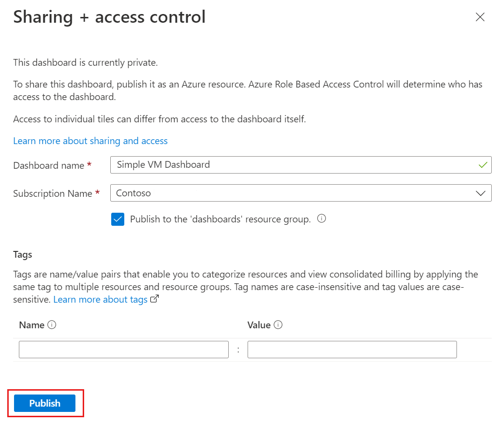
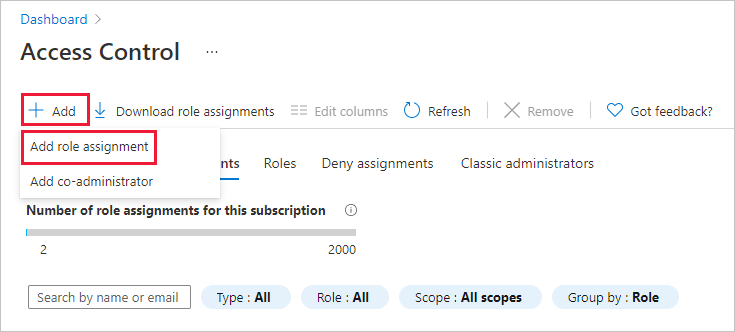

# Share Azure dashboards by using Azure role-based access control

After configuring a dashboard, you can publish it and share it with other users in your organization. You allow others to view your dashboard by using [Azure role-based access control (Azure RBAC)](../role-based-access-control/role-assignments-portal.md). Assign a single user or a group of users to a role. That role defines whether those users can view or modify the published dashboard.

All published dashboards are implemented as Azure resources. They exist as manageable items within your subscription and are contained in a resource group. From an access control perspective, dashboards are no different from other resources, such as a virtual machine or a storage account. Individual tiles on the dashboard enforce their own access control requirements based on the resources they display. You can share a dashboard broadly while protecting the data on individual tiles.

## Understanding access control for dashboards

With Azure role-based access control (Azure RBAC), you can assign users to roles at three different levels of scope:

* subscription
* resource group
* resource

The permissions you assign inherit from the subscription down to the resource. The published dashboard is a resource. You may already have users assigned to roles for the subscription that apply for the published dashboard.

Let's say you have an Azure subscription and various members of your team have been assigned the roles of *owner*, *contributor*, or *reader* for the subscription. Users who are owners or contributors can list, view, create, modify, or delete dashboards within the subscription. Users who are readers can list and view dashboards, but can't modify or delete them. Users with reader access can make local edits to a published dashboard, such as when troubleshooting an issue, but they can't publish those changes back to the server. They can make a private copy of the dashboard for themselves.

You could assign permissions to the resource group that contains several dashboards or to an individual dashboard. For example, you may decide that a group of users should have limited permissions across the subscription but greater access to a particular dashboard. Assign those users to a role for that dashboard.

## Publish a dashboard

Let's suppose you configure a dashboard that you want to share with a group of users in your subscription. The following steps show how to share a dashboard to a group called Storage Managers. You can name your group whatever you like. For more information, see [Managing groups in Azure Active Directory](../active-directory/fundamentals/active-directory-groups-create-azure-portal.md).

Before assigning access, you must publish the dashboard.

1. In the dashboard, select **Share**.

    

1. In **Sharing + access control**, select **Publish**.

    

     By default, sharing publishes your dashboard to a resource group named **dashboards**. To select a different resource group, clear the checkbox.

Your dashboard is now published. If the permissions inherited from the subscription are suitable, you don't need to do anything more. Other users in your organization can access and modify the dashboard based on their subscription level role.

## Assign access to a dashboard

You can assign a group of users to a role for that dashboard.

1. After publishing the dashboard, select **Manage sharing**.

1. In **Access Control** select **Role assignments** to see existing users that are already assigned a role for this dashboard.

1. To add a new user or group, select **Add** then **Add role assignment**.

    

1. Select the role that represents the permissions to grant, such as **Contributor**.

1. Select the user or group to assign to the role. If you don't see the user or group you're looking for in the list, use the search box. Your list of available groups depends on the groups you've created in Active Directory.

1. When you've finished adding users or groups, select **Save**.

## Next steps

* For a list of roles, see [Azure built-in roles](../role-based-access-control/built-in-roles.md).
* To learn about managing resources, see [Manage Azure resources by using the Azure portal](../azure-resource-manager/management/manage-resources-portal.md).