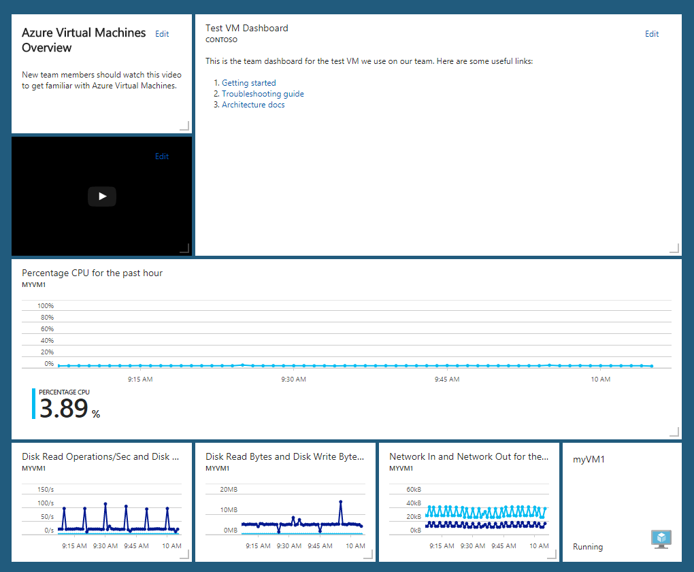
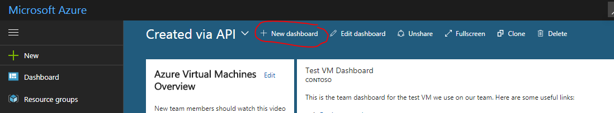
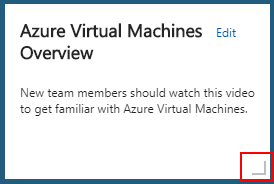
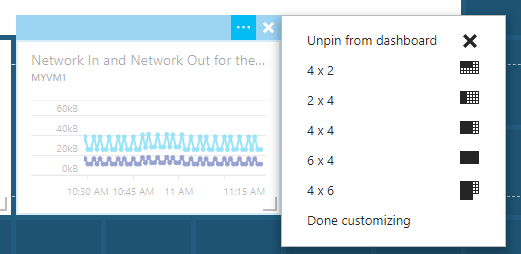
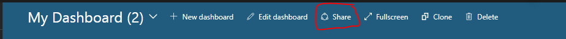
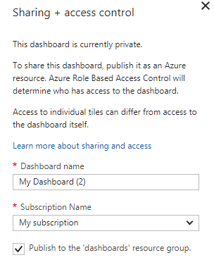
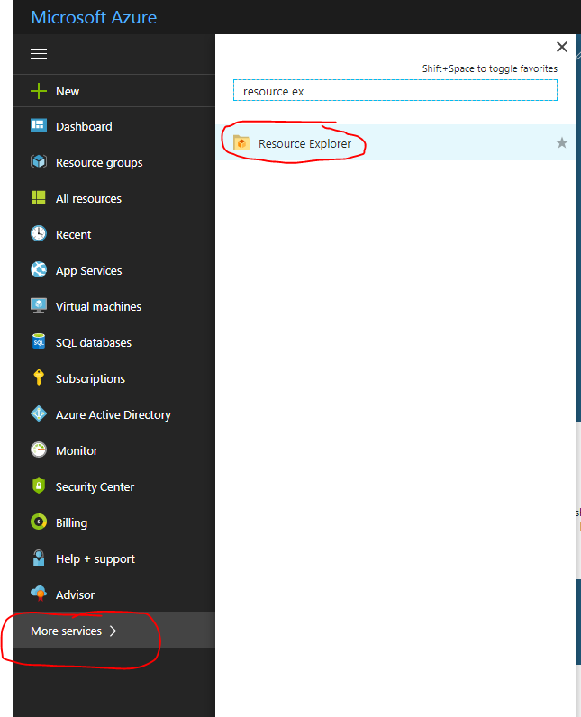
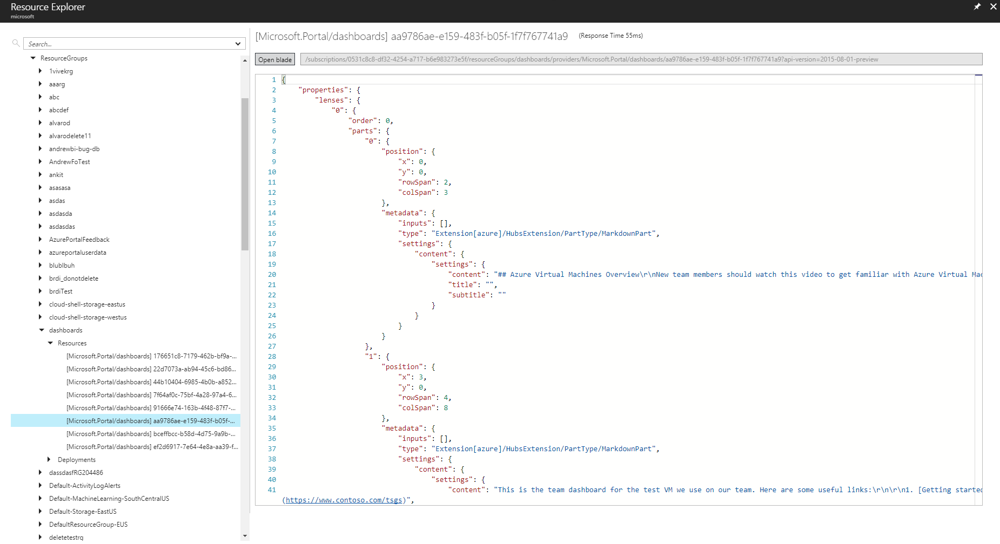

# Programmatically create Azure Dashboards

This document walks through the process of programmatically creating and publishing Azure dashboards. The dashboard shown below is referenced throughout the document.



## Overview

Shared dashboards in Azure are [resources](https://docs.microsoft.com/azure/azure-resource-manager/resource-group-overview) just like virtual machines and storage accounts.  Therefore, they can be managed programmatically via the [Azure Resource Manager REST APIs](/rest/api/), the [Azure CLI](https://docs.microsoft.com/cli/azure), [Azure PowerShell commands](https://docs.microsoft.com/powershell/azure/get-started-azureps?view=azurermps-4.2.0), and many [Azure portal](https://portal.azure.com) features build on top of these APIs to make resource management easier.  

Each of these APIs and tools offers ways to create, list, retrieve, modify, and delete resources.  Since dashboards are resources, you can pick your favorite API / tool to use.

Regardless of which tool you use, you need to construct a JSON representation of your dashboard object before you can call any resource creation API. This object contains information about the parts (a.k.a. tiles) on the dashboard. It includes sizes, positions, resources they are bound to, and any user customizations.

The most practical way to build up this JSON document is to use [the portal](https://portal.azure.com/) to interactively add and position your tiles. You then export the JSON. Finally, you create a template from the result for later use in scripts, programs, and deployment tools.

## Create a dashboard

To create a new dashboard, use the New dashboard command on the portal’s main screen.



You can then use the tile gallery to find and add tiles. Tiles are added by dragging and dropping them. Some tiles support resizing via a drag handle, while others support fixes sizes that can be seen in their context menu.

### Drag handle


### Fixed sizes via context menu


## Share the dashboard

After you have configured the dashboard to your liking the next steps are to publish the dashboard (using the Share command) and then use the resource explorer to fetch the JSON.



Clicking the Share command shows a dialog that asks you to choose which subscription and resource group to publish to. Keep in mind that [you must have write access](https://docs.microsoft.com/azure/role-based-access-control/role-assignments-portal) to the subscription and resource group that you choose.



## Fetch the JSON representation of the dashboard

Publishing only takes a few seconds.  When it’s done, the next step is to go to the [Resource Explorer](https://portal.azure.com/#blade/HubsExtension/ArmExplorerBlade) to fetch the JSON.



From the resource explorer, navigate to the subscription and resource group that you chose. Next, click on the newly published dashboard resource to reveal the JSON.



## Create a template from the JSON

The next step is to create a template from this JSON so that it can be reused programmatically with the appropriate resource management APIs, command-line tools, or within the portal.

It is not necessary to fully understand the dashboard JSON structure to create a template. In most cases, you want to preserve the structure and configuration of each tile, and then parameterize the set of Azure resources they’re pointing to. Look at your exported JSON dashboard and find all occurrences of Azure resource Ids. Our example dashboard has multiple tiles that all point at a single Azure virtual machine. That’s because our dashboard only looks at this single resource. If you search the sample json (included at the end of the document) for “/subscriptions”, you find several occurrences of this Id.

`/subscriptions/6531c8c8-df32-4254-d717-b6e983273e5d/resourceGroups/contoso/providers/Microsoft.Compute/virtualMachines/myVM1`

To publish this dashboard for any virtual machine in the future you need to parameterize every occurrence of this string within the JSON. 

There are two flavors of APIs that create resources in Azure. [Imperative APIs](https://docs.microsoft.com/rest/api/resources/resources) that create one resource at a time, and a [template-based deployment](https://docs.microsoft.com/azure/azure-resource-manager/resource-group-template-deploy) system that can orchestrate the creation of multiple, dependent resources with a single API call. The latter natively supports parameterization and templating so we use it for our example.

## Programmatically create a dashboard from your template using a template deployment

Azure offers the ability to orchestrate the deployment of multiple resources. You create a deployment template that expresses the set of resources to deploy as well as the relationships between them.  The JSON format of each resource is the same as if you were creating them one by one. The difference is that the [template language](https://docs.microsoft.com/azure/azure-resource-manager/resource-group-authoring-templates) adds a few concepts like variables, parameters, basic functions, and more. This extended syntax is only supported in the context of a template deployment and does not work if used with the imperative APIs discussed earlier.

If you’re going this route, then parameterization should be done using the template’s parameter syntax.  You replace all instances of the resource id we found earlier as shown here.

### Example JSON property with hard-coded resource Id
`id: "/subscriptions/6531c8c8-df32-4254-d717-b6e983273e5d/resourceGroups/contoso/providers/Microsoft.Compute/virtualMachines/myVM1"`

### Example JSON property converted to a parameterized version based on template parameters

`id: "[resourceId(parameters('virtualMachineResourceGroup'), 'Microsoft.Compute/virtualMachines', parameters('virtualMachineName'))]"`

You also need to declare some required template metadata and the parameters at the top of the json template like this:

```json

{
    "$schema": "http://schema.management.azure.com/schemas/2015-01-01/deploymentTemplate.json#",
    "contentVersion": "1.0.0.0",
    "parameters": {
        "virtualMachineName": {
            "type": "string"
        },
        "virtualMachineResourceGroup": {
            "type": "string"
        },
        "dashboardName": {
            "type": "string"
        }
    },
    "variables": {},

    ... rest of template omitted ...
```

__You can see the full, working template at the end of this document.__

Once you have crafted your template you can deploy it using the [REST APIs](https://docs.microsoft.com/rest/api/resources/deployments), [PowerShell](https://docs.microsoft.com/azure/azure-resource-manager/resource-group-template-deploy), The [Azure CLI](https://docs.microsoft.com/cli/azure/group/deployment#az-group-deployment-create), or the [portal’s template deployment page](https://portal.azure.com/#create/Microsoft.Template).

Here are two versions of our example dashboard JSON. The first is the version that we exported from the portal that was already bound to a resource. The second is the template version that can be programmatically bound to any VM and deployed using Azure Resource Manager.

## JSON representation of our example dashboard (before templating)

This is what you can expect to see if you follow the earlier instructions to fetch the JSON representation of a dashboard that is already deployed. Note the hard-coded resource identifiers that show that this dashboard is pointing at a specific Azure virtual machine.

```json

{
    "properties": {
        "lenses": {
            "0": {
                "order": 0,
                "parts": {
                    "0": {
                        "position": {
                            "x": 0,
                            "y": 0,
                            "rowSpan": 2,
                            "colSpan": 3
                        },
                        "metadata": {
                            "inputs": [],
                            "type": "Extension[azure]/HubsExtension/PartType/MarkdownPart",
                            "settings": {
                                "content": {
                                    "settings": {
                                        "content": "## Azure Virtual Machines Overview\r\nNew team members should watch this video to get familiar with Azure Virtual Machines.",
                                        "title": "",
                                        "subtitle": ""
                                    }
                                }
                            }
                        }
                    },
                    "1": {
                        "position": {
                            "x": 3,
                            "y": 0,
                            "rowSpan": 4,
                            "colSpan": 8
                        },
                        "metadata": {
                            "inputs": [],
                            "type": "Extension[azure]/HubsExtension/PartType/MarkdownPart",
                            "settings": {
                                "content": {
                                    "settings": {
                                        "content": "This is the team dashboard for the test VM we use on our team. Here are some useful links:\r\n\r\n1. [Getting started](https://www.contoso.com/tsgs)\r\n1. [Troubleshooting guide](https://www.contoso.com/tsgs)\r\n1. [Architecture docs](https://www.contoso.com/tsgs)",
                                        "title": "Test VM Dashboard",
                                        "subtitle": "Contoso"
                                    }
                                }
                            }
                        }
                    },
                    "2": {
                        "position": {
                            "x": 0,
                            "y": 2,
                            "rowSpan": 2,
                            "colSpan": 3
                        },
                        "metadata": {
                            "inputs": [],
                            "type": "Extension[azure]/HubsExtension/PartType/VideoPart",
                            "settings": {
                                "content": {
                                    "settings": {
                                        "title": "",
                                        "subtitle": "",
                                        "src": "https://www.youtube.com/watch?v=YcylDIiKaSU&list=PLLasX02E8BPCsnETz0XAMfpLR1LIBqpgs&index=4",
                                        "autoplay": false
                                    }
                                }
                            }
                        }
                    },
                    "3": {
                        "position": {
                            "x": 0,
                            "y": 4,
                            "rowSpan": 3,
                            "colSpan": 11
                        },
                        "metadata": {
                            "inputs": [
                                {
                                    "name": "queryInputs",
                                    "value": {
                                        "timespan": {
                                            "duration": "PT1H",
                                            "start": null,
                                            "end": null
                                        },
                                        "id": "/subscriptions/6531c8c8-df32-4254-d717-b6e983273e5d/resourceGroups/contoso/providers/Microsoft.Compute/virtualMachines/myVM1",
                                        "chartType": 0,
                                        "metrics": [
                                            {
                                                "name": "Percentage CPU",
                                                "resourceId": "/subscriptions/6531c8c8-df32-4254-d717-b6e983273e5d/resourceGroups/contoso/providers/Microsoft.Compute/virtualMachines/myVM1"
                                            }
                                        ]
                                    }
                                }
                            ],
                            "type": "Extension/Microsoft_Azure_Monitoring/PartType/MetricsChartPart",
                            "settings": {}
                        }
                    },
                    "4": {
                        "position": {
                            "x": 0,
                            "y": 7,
                            "rowSpan": 2,
                            "colSpan": 3
                        },
                        "metadata": {
                            "inputs": [
                                {
                                    "name": "queryInputs",
                                    "value": {
                                        "timespan": {
                                            "duration": "PT1H",
                                            "start": null,
                                            "end": null
                                        },
                                        "id": "/subscriptions/6531c8c8-df32-4254-d717-b6e983273e5d/resourceGroups/contoso/providers/Microsoft.Compute/virtualMachines/myVM1",
                                        "chartType": 0,
                                        "metrics": [
                                            {
                                                "name": "Disk Read Operations/Sec",
                                                "resourceId": "/subscriptions/6531c8c8-df32-4254-d717-b6e983273e5d/resourceGroups/contoso/providers/Microsoft.Compute/virtualMachines/myVM1"
                                            },
                                            {
                                                "name": "Disk Write Operations/Sec",
                                                "resourceId": "/subscriptions/6531c8c8-df32-4254-d717-b6e983273e5d/resourceGroups/contoso/providers/Microsoft.Compute/virtualMachines/myVM1"
                                            }
                                        ]
                                    }
                                }
                            ],
                            "type": "Extension/Microsoft_Azure_Monitoring/PartType/MetricsChartPart",
                            "settings": {}
                        }
                    },
                    "5": {
                        "position": {
                            "x": 3,
                            "y": 7,
                            "rowSpan": 2,
                            "colSpan": 3
                        },
                        "metadata": {
                            "inputs": [
                                {
                                    "name": "queryInputs",
                                    "value": {
                                        "timespan": {
                                            "duration": "PT1H",
                                            "start": null,
                                            "end": null
                                        },
                                        "id": "/subscriptions/6531c8c8-df32-4254-d717-b6e983273e5d/resourceGroups/contoso/providers/Microsoft.Compute/virtualMachines/myVM1",
                                        "chartType": 0,
                                        "metrics": [
                                            {
                                                "name": "Disk Read Bytes",
                                                "resourceId": "/subscriptions/6531c8c8-df32-4254-d717-b6e983273e5d/resourceGroups/contoso/providers/Microsoft.Compute/virtualMachines/myVM1"
                                            },
                                            {
                                                "name": "Disk Write Bytes",
                                                "resourceId": "/subscriptions/6531c8c8-df32-4254-d717-b6e983273e5d/resourceGroups/contoso/providers/Microsoft.Compute/virtualMachines/myVM1"
                                            }
                                        ]
                                    }
                                }
                            ],
                            "type": "Extension/Microsoft_Azure_Monitoring/PartType/MetricsChartPart",
                            "settings": {}
                        }
                    },
                    "6": {
                        "position": {
                            "x": 6,
                            "y": 7,
                            "rowSpan": 2,
                            "colSpan": 3
                        },
                        "metadata": {
                            "inputs": [
                                {
                                    "name": "queryInputs",
                                    "value": {
                                        "timespan": {
                                            "duration": "PT1H",
                                            "start": null,
                                            "end": null
                                        },
                                        "id": "/subscriptions/6531c8c8-df32-4254-d717-b6e983273e5d/resourceGroups/contoso/providers/Microsoft.Compute/virtualMachines/myVM1",
                                        "chartType": 0,
                                        "metrics": [
                                            {
                                                "name": "Network In",
                                                "resourceId": "/subscriptions/6531c8c8-df32-4254-d717-b6e983273e5d/resourceGroups/contoso/providers/Microsoft.Compute/virtualMachines/myVM1"
                                            },
                                            {
                                                "name": "Network Out",
                                                "resourceId": "/subscriptions/6531c8c8-df32-4254-d717-b6e983273e5d/resourceGroups/contoso/providers/Microsoft.Compute/virtualMachines/myVM1"
                                            }
                                        ]
                                    }
                                }
                            ],
                            "type": "Extension/Microsoft_Azure_Monitoring/PartType/MetricsChartPart",
                            "settings": {}
                        }
                    },
                    "7": {
                        "position": {
                            "x": 9,
                            "y": 7,
                            "rowSpan": 2,
                            "colSpan": 2
                        },
                        "metadata": {
                            "inputs": [
                                {
                                    "name": "id",
                                    "value": "/subscriptions/6531c8c8-df32-4254-d717-b6e983273e5d/resourceGroups/contoso/providers/Microsoft.Compute/virtualMachines/myVM1"
                                }
                            ],
                            "type": "Extension/Microsoft_Azure_Compute/PartType/VirtualMachinePart",
                            "asset": {
                                "idInputName": "id",
                                "type": "VirtualMachine"
                            },
                            "defaultMenuItemId": "overview"
                        }
                    }
                }
            }
        },
        "metadata": { }
    },
    "id": "/subscriptions/6531c8c8-df32-4254-d717-b6e983273e5d/resourceGroups/dashboards/providers/Microsoft.Portal/dashboards/aa9786ae-e159-483f-b05f-1f7f767741a9",
    "name": "aa9786ae-e159-483f-b05f-1f7f767741a9",
    "type": "Microsoft.Portal/dashboards",
    "location": "eastasia",
    "tags": {
        "hidden-title": "Created via API"
    }
}

```

### Template representation of our example dashboard

The template version of the dashboard has defined three parameters called __virtualMachineName__, __virtualMachineResourceGroup__, and __dashboardName__.  The parameters let you point this dashboard at a different Azure virtual machine every time you deploy. The parameterized ids are highlighted to show that this dashboard can be programmatically configured and deployed to point to any Azure virtual machine. The easiest way to test this feature is to copy the following template and paste it into the [Azure portal’s template deployment page](https://portal.azure.com/#create/Microsoft.Template). 

This example deploys a dashboard by itself, but the template language lets you deploy multiple resources, and bundle one or more dashboards along side them. 

```json
{
    "$schema": "http://schema.management.azure.com/schemas/2015-01-01/deploymentTemplate.json#",
    "contentVersion": "1.0.0.0",
    "parameters": {
        "virtualMachineName": {
            "type": "string"
        },
        "virtualMachineResourceGroup": {
            "type": "string"
        },
        "dashboardName": {
            "type": "string"
        }
    },
    "variables": {},
    "resources": [
        {
            "properties": {
                "lenses": {
                    "0": {
                        "order": 0,
                        "parts": {
                            "0": {
                                "position": {
                                    "x": 0,
                                    "y": 0,
                                    "rowSpan": 2,
                                    "colSpan": 3
                                },
                                "metadata": {
                                    "inputs": [],
                                    "type": "Extension[azure]/HubsExtension/PartType/MarkdownPart",
                                    "settings": {
                                        "content": {
                                            "settings": {
                                                "content": "## Azure Virtual Machines Overview\r\nNew team members should watch this video to get familiar with Azure Virtual Machines.",
                                                "title": "",
                                                "subtitle": ""
                                            }
                                        }
                                    }
                                }
                            },
                            "1": {
                                "position": {
                                    "x": 3,
                                    "y": 0,
                                    "rowSpan": 4,
                                    "colSpan": 8
                                },
                                "metadata": {
                                    "inputs": [],
                                    "type": "Extension[azure]/HubsExtension/PartType/MarkdownPart",
                                    "settings": {
                                        "content": {
                                            "settings": {
                                                "content": "This is the team dashboard for the test VM we use on our team. Here are some useful links:\r\n\r\n1. [Getting started](https://www.contoso.com/tsgs)\r\n1. [Troubleshooting guide](https://www.contoso.com/tsgs)\r\n1. [Architecture docs](https://www.contoso.com/tsgs)",
                                                "title": "Test VM Dashboard",
                                                "subtitle": "Contoso"
                                            }
                                        }
                                    }
                                }
                            },
                            "2": {
                                "position": {
                                    "x": 0,
                                    "y": 2,
                                    "rowSpan": 2,
                                    "colSpan": 3
                                },
                                "metadata": {
                                    "inputs": [],
                                    "type": "Extension[azure]/HubsExtension/PartType/VideoPart",
                                    "settings": {
                                        "content": {
                                            "settings": {
                                                "title": "",
                                                "subtitle": "",
                                                "src": "https://www.youtube.com/watch?v=YcylDIiKaSU&list=PLLasX02E8BPCsnETz0XAMfpLR1LIBqpgs&index=4",
                                                "autoplay": false
                                            }
                                        }
                                    }
                                }
                            },
                            "3": {
                                "position": {
                                    "x": 0,
                                    "y": 4,
                                    "rowSpan": 3,
                                    "colSpan": 11
                                },
                                "metadata": {
                                    "inputs": [
                                        {
                                            "name": "queryInputs",
                                            "value": {
                                                "timespan": {
                                                    "duration": "PT1H",
                                                    "start": null,
                                                    "end": null
                                                },
                                                "id": "[resourceId(parameters('virtualMachineResourceGroup'), 'Microsoft.Compute/virtualMachines', parameters('virtualMachineName'))]",
                                                "chartType": 0,
                                                "metrics": [
                                                    {
                                                        "name": "Percentage CPU",
                                                        "resourceId": "[resourceId(parameters('virtualMachineResourceGroup'), 'Microsoft.Compute/virtualMachines', parameters('virtualMachineName'))]"
                                                    }
                                                ]
                                            }
                                        }
                                    ],
                                    "type": "Extension/Microsoft_Azure_Monitoring/PartType/MetricsChartPart",
                                    "settings": {}
                                }
                            },
                            "4": {
                                "position": {
                                    "x": 0,
                                    "y": 7,
                                    "rowSpan": 2,
                                    "colSpan": 3
                                },
                                "metadata": {
                                    "inputs": [
                                        {
                                            "name": "queryInputs",
                                            "value": {
                                                "timespan": {
                                                    "duration": "PT1H",
                                                    "start": null,
                                                    "end": null
                                                },
                                                "id": "[resourceId(parameters('virtualMachineResourceGroup'), 'Microsoft.Compute/virtualMachines', parameters('virtualMachineName'))]",
                                                "chartType": 0,
                                                "metrics": [
                                                    {
                                                        "name": "Disk Read Operations/Sec",
                                                        "resourceId": "[resourceId(parameters('virtualMachineResourceGroup'), 'Microsoft.Compute/virtualMachines', parameters('virtualMachineName'))]"
                                                    },
                                                    {
                                                        "name": "Disk Write Operations/Sec",
                                                        "resourceId": "[resourceId(parameters('virtualMachineResourceGroup'), 'Microsoft.Compute/virtualMachines', parameters('virtualMachineName'))]"
                                                    }
                                                ]
                                            }
                                        }
                                    ],
                                    "type": "Extension/Microsoft_Azure_Monitoring/PartType/MetricsChartPart",
                                    "settings": {}
                                }
                            },
                            "5": {
                                "position": {
                                    "x": 3,
                                    "y": 7,
                                    "rowSpan": 2,
                                    "colSpan": 3
                                },
                                "metadata": {
                                    "inputs": [
                                        {
                                            "name": "queryInputs",
                                            "value": {
                                                "timespan": {
                                                    "duration": "PT1H",
                                                    "start": null,
                                                    "end": null
                                                },
                                                "id": "[resourceId(parameters('virtualMachineResourceGroup'), 'Microsoft.Compute/virtualMachines', parameters('virtualMachineName'))]",
                                                "chartType": 0,
                                                "metrics": [
                                                    {
                                                        "name": "Disk Read Bytes",
                                                        "resourceId": "[resourceId(parameters('virtualMachineResourceGroup'), 'Microsoft.Compute/virtualMachines', parameters('virtualMachineName'))]"
                                                    },
                                                    {
                                                        "name": "Disk Write Bytes",
                                                        "resourceId": "[resourceId(parameters('virtualMachineResourceGroup'), 'Microsoft.Compute/virtualMachines', parameters('virtualMachineName'))]"
                                                    }
                                                ]
                                            }
                                        }
                                    ],
                                    "type": "Extension/Microsoft_Azure_Monitoring/PartType/MetricsChartPart",
                                    "settings": {}
                                }
                            },
                            "6": {
                                "position": {
                                    "x": 6,
                                    "y": 7,
                                    "rowSpan": 2,
                                    "colSpan": 3
                                },
                                "metadata": {
                                    "inputs": [
                                        {
                                            "name": "queryInputs",
                                            "value": {
                                                "timespan": {
                                                    "duration": "PT1H",
                                                    "start": null,
                                                    "end": null
                                                },
                                                "id": "[resourceId(parameters('virtualMachineResourceGroup'), 'Microsoft.Compute/virtualMachines', parameters('virtualMachineName'))]",
                                                "chartType": 0,
                                                "metrics": [
                                                    {
                                                        "name": "Network In",
                                                        "resourceId": "[resourceId(parameters('virtualMachineResourceGroup'), 'Microsoft.Compute/virtualMachines', parameters('virtualMachineName'))]"
                                                    },
                                                    {
                                                        "name": "Network Out",
                                                        "resourceId": "[resourceId(parameters('virtualMachineResourceGroup'), 'Microsoft.Compute/virtualMachines', parameters('virtualMachineName'))]"
                                                    }
                                                ]
                                            }
                                        }
                                    ],
                                    "type": "Extension/Microsoft_Azure_Monitoring/PartType/MetricsChartPart",
                                    "settings": {}
                                }
                            },
                            "7": {
                                "position": {
                                    "x": 9,
                                    "y": 7,
                                    "rowSpan": 2,
                                    "colSpan": 2
                                },
                                "metadata": {
                                    "inputs": [
                                        {
                                            "name": "id",
                                            "value": "[resourceId(parameters('virtualMachineResourceGroup'), 'Microsoft.Compute/virtualMachines', parameters('virtualMachineName'))]"
                                        }
                                    ],
                                    "type": "Extension/Microsoft_Azure_Compute/PartType/VirtualMachinePart",
                                    "asset": {
                                        "idInputName": "id",
                                        "type": "VirtualMachine"
                                    },
                                    "defaultMenuItemId": "overview"
                                }
                            }
                        }
                    }
                }
            },
            "metadata": { },
            "apiVersion": "2015-08-01-preview",
            "type": "Microsoft.Portal/dashboards",
            "name": "[parameters('dashboardName')]",
            "location": "westus",
            "tags": {
                "hidden-title": "[parameters('dashboardName')]"
            }
        }
    ]
}


```
