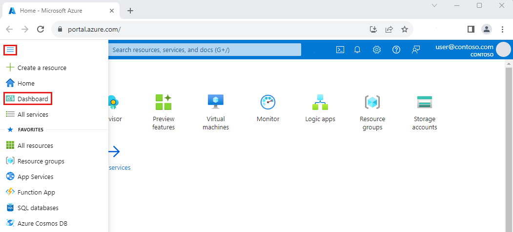
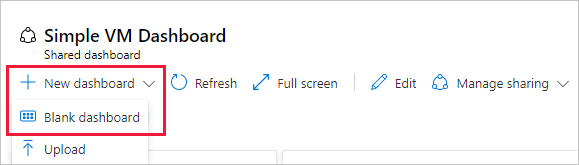
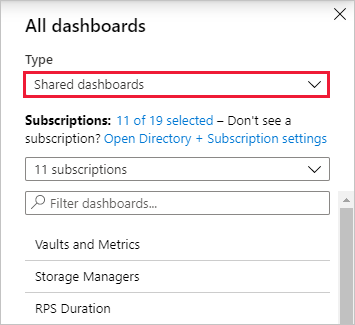

# Create a dashboard in the Azure portal

Dashboards are a focused and organized view of your cloud resources in the Azure portal. Use dashboards as a workspace where you can monitor resources and quickly launch tasks for day-to-day operations. Build custom dashboards based on projects, tasks, or user roles, for example.

The Azure portal provides a default dashboard as a starting point. You can edit the default dashboard and create and customize additional dashboards.

> [!NOTE]
> Each user can create up to 100 private dashboards. If you [publish and share the dashboard](azure-portal-dashboard-share-access.md), it will be implemented as an Azure resource in your subscription and won’t count towards this limit.

This article describes how to create a new dashboard and customize it. For information on sharing dashboards, see [Share Azure dashboards by using Azure role-based access control](azure-portal-dashboard-share-access.md).

## Create a new dashboard

This example shows how to create a new private dashboard with an assigned name. All dashboards are private when created, although you can choose to publish and share your dashboard with other users in your organization if you'd like.

1. Sign in to the [Azure portal](https://portal.azure.com).

1. From the Azure portal menu, select **Dashboard**. Your default view might already be set to dashboard.

    

1. Select **New dashboard** then **Blank dashboard**.

    

    This action opens the **Tile Gallery**, from which you can select tiles, and an empty grid where you'll arrange the tiles.

1. Select the **My Dashboard** text in the dashboard label and enter a name that will help you easily identify the custom dashboard.

    :::image type="content" source="media/azure-portal-dashboards/dashboard-name.png" alt-text="Screenshot of an empty grid with the Tile Gallery.":::

1. To save the dashboard as is, select **Done customizing** in the page header. Or, continue to Step 2 of the next section to add tiles and save your dashboard.

The dashboard view now shows your new dashboard. Select the arrow next to the dashboard name to see dashboards available to you. The list might include dashboards that other users have created and shared.

## Edit a dashboard

Now, let's edit the dashboard to add, resize, and arrange tiles that represent your Azure resources.

### Add tiles from the Tile Gallery

To add tiles to a dashboard, follow these steps:

1. Select  **Edit** from the dashboard's page header.

    

1. Browse the **Tile Gallery** or use the search field to find a certain tile. Select the tile you want to add to your dashboard.

   :::image type="content" source="media/azure-portal-dashboards/dashboard-tile-gallery.png" alt-text="Screenshot of the Tile Gallery.":::

1. Select **Add** to add the tile to the dashboard with a default size and location. Or, drag the tile to the grid and place it where you want. Add any tiles you want, but here are a couple of ideas:

    - Add **All resources** to see any resources you've already created.

    - If you work with more than one organization, add the **Organization identity** tile to your dashboard to clearly show which organization the resources belong to.

1. If desired, [resize or rearrange](#resize-or-rearrange-tiles) your tiles.

1. To save your changes, select **Save** in the page header. You can also preview the changes without saving by selecting **Preview** in the page header. This preview mode also allows you to see how [filters](#set-and-override-dashboard-filters) affect your tiles. From the preview screen, you can select **Save** to keep the changes, **Discard** to remove them, or **Edit** to go back to the editing options and make further changes.

   :::image type="content" source="media/azure-portal-dashboards/dashboard-save.png" alt-text="Screenshot of the Preview, Save, and Discard options.":::

> [!NOTE]
> A markdown tile lets you display custom, static content on your dashboard. This could be basic instructions, an image, a set of hyperlinks, or even contact information. For more information about using a markdown tile, see [Use a markdown tile on Azure dashboards to show custom content](azure-portal-markdown-tile.md).

### Pin content from a resource page

Another way to add tiles to your dashboard is directly from a resource page.

Many resource pages include a pin icon in the page header, which means that you can pin a tile representing the source page. In some cases, a pin icon may also appear by specific content within a page, which means you can pin a tile for that specific content, rather than the entire page.

:::image type="content" source="media/azure-portal-dashboards/dashboard-pin-blade.png" alt-text="Screenshot of page command bar with pin icon.":::

If you select this icon, you can pin the tile to an existing private or shared dashboard. You can also create a new dashboard which will include this pin by selecting **Create new**.

:::image type="content" source="media/azure-portal-dashboards/dashboard-pin-pane.png" alt-text="Screenshot of Pin to dashboard options.":::

### Copy a tile to a new dashboard

If you want to reuse a tile on a different dashboard, you can copy it from one dashboard to another. To do so, select the context menu in the upper right corner and then select **Copy**.

:::image type="content" source="media/azure-portal-dashboards/copy-dashboard.png" alt-text="Screenshot showing how to copy a tile in the Azure portal.":::

You can then select whether to copy the tile to an existing private or shared dashboard, or create a copy of the tile within the dashboard you're already working in. You can also create a new dashboard which will include a copy of the tile by selecting **Create new**.

### Resize or rearrange tiles

To change the size of a tile or to rearrange the tiles on a dashboard, follow these steps:

1. Select  **Edit** from the page header.

1. Select the context menu in the upper right corner of a tile. Then, choose a tile size. Tiles that support any size also include a "handle" in the lower right corner that lets you drag the tile to the size you want.

    :::image type="content" source="media/azure-portal-dashboards/dashboard-tile-resize.png" alt-text="Screenshot of dashboard with tile size menu open.":::

1. Select a tile and drag it to a new location on the grid to arrange your dashboard.

### Set and override dashboard filters

Near the top of your dashboard, you'll see options to set the **Auto refresh** and **Time settings** for data displayed in the dashboard, along with an option to add additional filters.

:::image type="content" source="media/azure-portal-dashboards/dashboard-global-filters.png" alt-text="Screenshot showing a dashboard's global filters.":::

By default, data will be refreshed every hour. To change this, select **Auto refresh** and choose a new refresh interval. When you've made your selection, select **Apply**.

The default time settings are **UTC Time**, showing data for the **Past 24 hours**. To change this, select the button and choose a new time range, time granularity, and/or time zone, then select **Apply**.

To apply additional filters, select **Add filters**. The options you'll see will vary depending on the tiles in your dashboard. For example, you may be able to show only data for a specific subscription or location. Select the filter you'd like to use and make your selections. The filter will then be applied to your data. To remove a filter, select the **X** in its button.

Tiles which support filtering have a  filter icon in the top-left corner of the tile. Some tiles allow you to override the global filters with filters specific to that tile. To do so, select **Configure tile data** from the context menu, or select the filter icon, then apply the desired filters.

If you set filters for a particular tile, the left corner of that tile displays a double filter icon, indicating that the data in that tile reflects its own filters.

:::image type="content" source="media/azure-portal-dashboards/dashboard-filter-override.png" alt-text="Screenshot showing the icon for a tile with a filter override.":::

## Modify tile settings

Some tiles might require more configuration to show the information you want. For example, the **Metrics chart** tile has to be set up to display a metric from Azure Monitor. You can also customize tile data to override the dashboard's default time settings and filters.

## Complete tile configuration

Any tile that needs to be set up displays a banner until you customize the tile. For example, in the **Metrics chart**, the banner reads **Edit in Metrics**. Other banners may use different text, such as **Configure tile**.

To customize the tile:

1. In the page header select **Save** to exit edit mode.

1. Select the banner, then do the required setup.

    

### Customize time span for a tile

Data on the dashboard shows activity and refreshes based on the global filters. Some tiles will allow you to select a different time span for just one tile. To do so, follow these steps:

1. Select **Customize tile data** from the context menu or from the  in the upper left corner of the tile.

    

1. Select the checkbox to **Override the dashboard time settings at the tile level**.

    

1. Choose the time span to show for this tile. You can choose from the past 30 minutes to the past 30 days or define a custom range.

1. Choose the time granularity to display.  You can show anywhere from one-minute increments to one-month.

1. Select **Apply**.

## Delete a tile

To remove a tile from a dashboard, do one of the following:

- Select the context menu in the upper right corner of the tile, then select **Remove from dashboard**.

- Select  **Edit** to enter customization mode. Hover in the upper right corner of the tile, then select the  delete icon to remove the tile from the dashboard.

   

## Clone a dashboard

To use an existing dashboard as a template for a new dashboard, follow these steps:

1. Make sure that the dashboard view is showing the dashboard that you want to copy.

1. In the page header, select  **Clone**.

1. A copy of the dashboard, named **Clone of** *your dashboard name* opens in edit mode. Use the preceding steps in this article to rename and customize the dashboard.

## Publish and share a dashboard

When you create a dashboard, it's private by default, which means you're the only one who can see it. To make dashboards available to others, you can publish and share them. For more information, see [Share Azure dashboards by using Azure role-based access control](azure-portal-dashboard-share-access.md).

### Open a shared dashboard

To find and open a shared dashboard, follow these steps:

1. Select the arrow next to the dashboard name.

1. Select from the displayed list of dashboards. If the dashboard you want to open isn't listed:

    1. select **Browse all dashboards**.

        

    1. In the **Type** field, select **Shared dashboards**.

        

    1. Select one or more subscriptions. You can also enter text to filter dashboards by name.

    1. Select a dashboard from the list of shared dashboards.

## Delete a dashboard

To permanently delete a private or shared dashboard, follow these steps:

1. Select the dashboard you want to delete from the list next to the dashboard name.

1. Select  **Delete** from the page header.

1. For a private dashboard, select **OK** on the confirmation dialog to remove the dashboard. For a shared dashboard, on the confirmation dialog, select the checkbox to confirm that the published dashboard will no longer be viewable by others. Then, select **OK**.

    

## Recover a deleted dashboard

If you're in the global Azure cloud, and you delete a _published_ dashboard in the Azure portal, you can recover that dashboard within 14 days of the delete. For more information, see [Recover a deleted dashboard in the Azure portal](recover-shared-deleted-dashboard.md).

## Next steps

- [Share Azure dashboards by using Azure role-based access control](azure-portal-dashboard-share-access.md)
- [Programmatically create Azure dashboards](azure-portal-dashboards-create-programmatically.md)
