# Create and share dashboards in the Azure portal
You can create multiple dashboards and share them with others who have access to your Azure subscriptions.  This article goes through the basics of creating, editing, publishing, and managing access to dashboards.

## Create a dashboard
To create a dashboard, select the **New dashboard** button next to the current dashboard's name.  

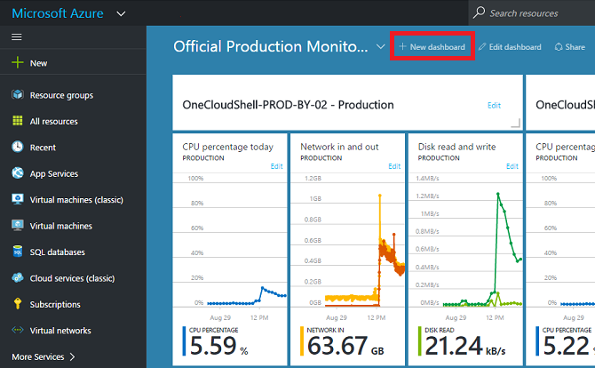

This action creates a new, empty, private dashboard and puts you into customization mode where you can name your dashboard and add or rearrange tiles.  When in this mode, the collapsible tile gallery takes over the left navigation menu.  The tile gallery lets you find tiles for your Azure resources in various ways: you can browse by [resource group](../azure-resource-manager/resource-group-overview.md#resource-groups), by resource type, by [tag](../azure-resource-manager/resource-group-using-tags.md), or by searching for your resource by name.  

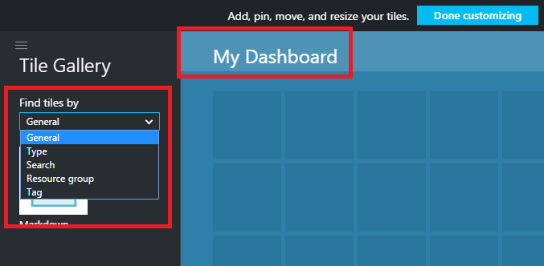

Add tiles by dragging and dropping them onto the dashboard surface wherever you want.

There's a new category called **General** for tiles that are not associated with a particular resource.  In this example, we pin the Markdown tile.  You use this tile to add custom content to your dashboard.  The tile supports plain text, [Markdown syntax](https://daringfireball.net/projects/markdown/syntax), and a limited set of HTML.  (For safety, you can't do things like inject `<script>` tags or use certain styling element of CSS that might interfere with the portal.) 

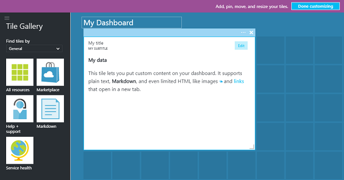

## Edit a dashboard
After creating your dashboard, you can pin tiles from the tile gallery or the tile representation of blades. Let's pin the representation of our resource group. You can either pin when browsing the item, or from the resource group blade. Both approaches result in pinning the tile representation of the resource group.

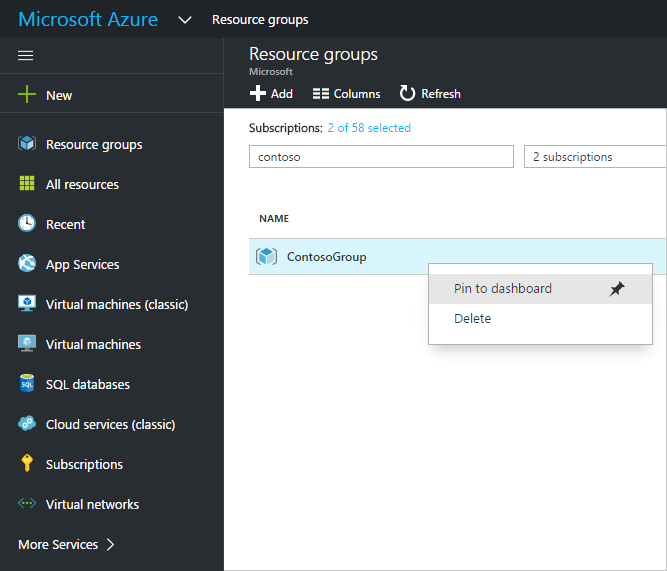

After pinning the item, it appears on your dashboard.

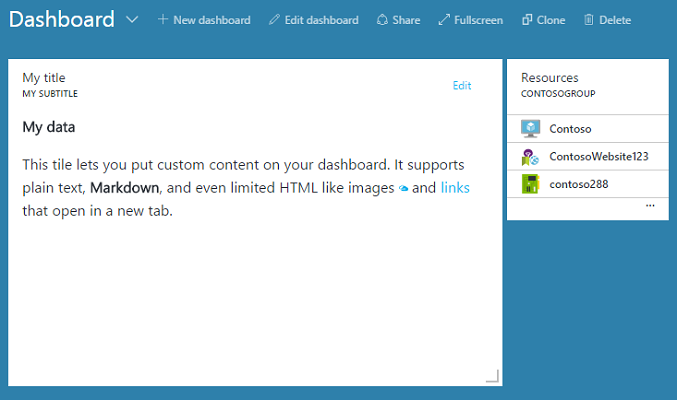

Now that we have a Markdown tile and a resource group pinned to the dashboard, we can resize and rearrange the tiles into a suitable layout.

By hovering and selecting "…" or right-clicking on a tile you can see all the contextual commands for that tile. By default, there are two items:

1. **Unpin from dashboard** – removes the tile from the dashboard
2. **Customize** – enters customize mode

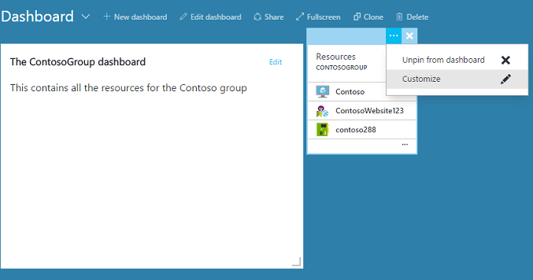

By selecting customize, you can resize and reorder tiles. To resize a tile, select the new size from the contextual menu, as shown in the following image.

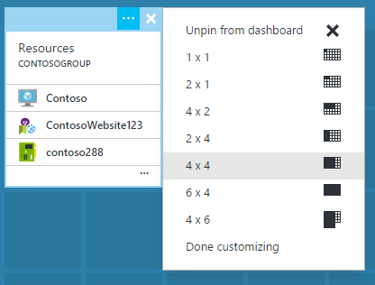

Or, if the tile supports any size, you can drag the bottom right-hand corner to the desired size.

After resizing tiles, view the dashboard.

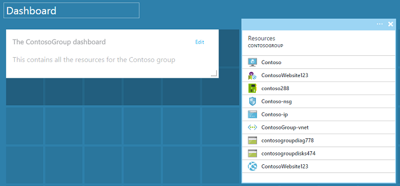

Once you are finished customizing a dashboard, simply select the **Done customizing** to exit customize mode or right-click and select **Done customizing** from the context menu.

## Publish a dashboard and manage access control
When you create a dashboard, it is private by default, which means you are the only person who can see it.  To make it visible to others, use the **Share** button that appears alongside the other dashboard commands.

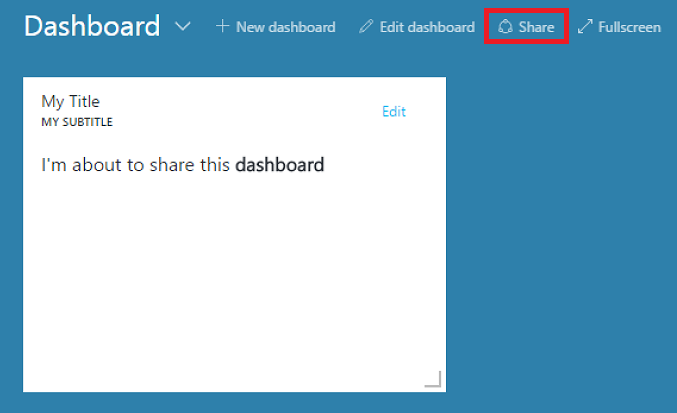

You are asked to choose a subscription and resource group for your dashboard to be published to. To seamlessly integrate dashboards into the ecosystem, we've implemented shared dashboards as Azure resources (so you can't share by typing an email address).  Access to the information displayed by most of the tiles in the portal are governed by [Azure Role Based Access Control](../role-based-access-control/role-assignments-portal.md). From an access control perspective, shared dashboards are no different from a virtual machine or a storage account.  

Let's say you have an Azure subscription and members of your team have been assigned the roles of **owner**, **contributor**, or **reader** of the subscription.  Users who are owners or contributors are able to list, view, create, modify, or delete dashboards within that subscription.  Users who are readers are able to list and view dashboards, but cannot modify or delete them.  Users with reader access are able to make local edits to a shared dashboard, but are not able to publish those changes back to the server.  However, they can make a private copy of the dashboard for their own use.  As always, individual tiles on the dashboard enforce their own access control rules based on the resources they correspond to.  

For convenience, the portal's publishing experience guides you towards a pattern where you place dashboards in a resource group called **dashboards**.  

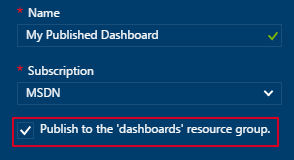

You can also choose to publish a dashboard to a particular resource group.  The access control for that dashboard matches the access control for the resource group.  Users that can manage the resources in that resource group also have access to the dashboards.

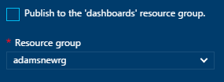

After your dashboard is published, the **Sharing + access** control pane will refresh and show you information about the published dashboard, including a link to manage user access to the dashboard.  This link launches the standard Role Based Access Control blade used to manage access for any Azure resource.  You can always get back to this view by selecting **Share**.

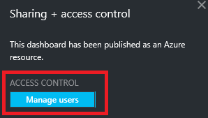

## Next steps
* To manage resources, see [Manage Azure resources through portal](../azure-resource-manager/resource-group-portal.md).
* To deploy resources, see [Deploy resources with Resource Manager templates and Azure portal](../azure-resource-manager/resource-group-template-deploy-portal.md).

