# Create and share dashboards in the Azure portal

Dashboards provide a way for you to create a focused and organized view in the Azure portal of your cloud resources. Use dashboards as a workspace where you can quickly launch tasks for day-to-day operations and monitor resources.  Build custom dashboards based on projects, tasks, or user roles, for example.  The Azure portal provides a default dashboard as a starting point. You can edit the default dashboard, create and customize additional dashboards, and publish and share dashboards to make them available to other users. This article describes how to create a new dashboard, customize the interface, and publish and share dashboards.

## Create a new dashboard

In this example, we create a new, private dashboard and assign a name. Follow these steps to get started:

1. Sign in to the [Azure portal](https://portal.azure.com).
1. Select **Dashboard** from the upper section of the left sidebar. Your default view might already be set to dashboard.
1. Select **+ New dashboard**.

    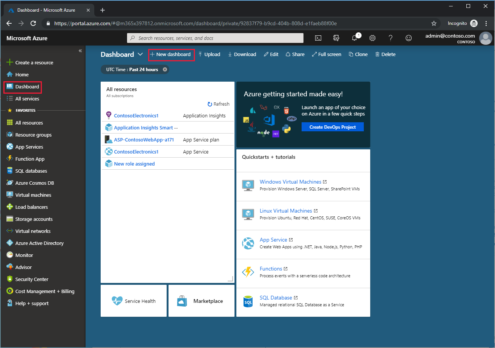

4. This action opens the **Tile Gallery**, from which you'll select tiles, and an empty grid where you'll arrange the tiles.

    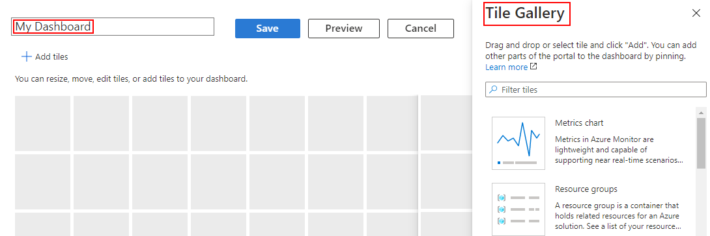

5. Select the **My Dashboard** text in the dashboard label and enter a name that will help you easily identify the custom dashboard.
1. Select **Done customizing** in the page header to exit edit mode.

The dashboard view now shows your empty dashboard. Select the drop-down next to the dashboard name to see dashboards available to you – the list might include dashboards that other users have created and shared.

## Edit a dashboard

Now, let's edit the dashboard to add, resize, and arrange tiles that represent your Azure resources.

### Add tiles

To add tiles to a dashboard, follow these steps:
1. Select  **Edit** from the page header.

    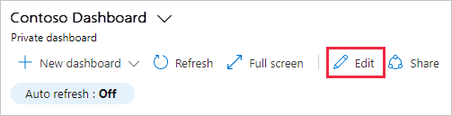

2. Browse the **Tile Gallery** or use the search field to find the tile you want.
1. Select **Add** to automatically add the tile to the dashboard with a default size and location. Or, drag the tile to the grid and place it where you want.

Many resource pages (also known as “blades”) include a pushpin icon in the command bar. If you select the icon, a tile representing the source page is pinned to the dashboard that is currently active. This method is an alternative way to add tiles to your dashboard.

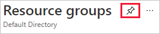

> [!TIP]
> If you work with more than one organization, add the **Organization identity** tile to your dashboard to clearly show which organization the resources belong to.
>
>
### Resize or rearrange tiles
To change the size of a tile or to rearrange the tiles on a dashboard, follow these steps:

1. Select  **Edit** from the page header.
1. Select the context menu in the upper right corner of a tile. Then, choose a tile size. Tiles that support any size also include a "handle" in the lower right corner that lets you drag the tile to the size you want.

   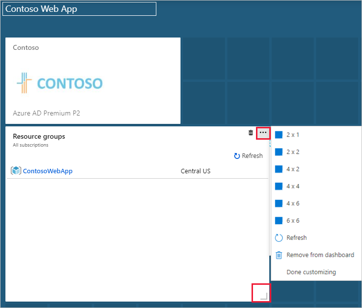

3. Select a tile and drag it to a new location on the grid to arrange your dashboard.

### Additional tile configuration

Some tiles may need more  configuration to show the information you want. For example, the **Metrics chart** tile has to be set up to display a metric from **Azure Monitor**. You can also customize tile data to override the dashboard's default time settings.

Any tile that needs to be set up displays a **Configure tile** banner until you customize the tile. Select that banner, then do the required setup.

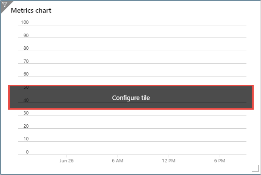

> [!NOTE]
> A markdown tile lets you display custom, static content on your dashboard. This could be basic instructions, an image, a set of hyperlinks, or even contact information. For more information about using a markdown tile, see [Use a custom markdown tile](azure-portal-markdown-tile.md).
>
>
### Customize tile data

Data on the dashboard automatically shows activity for the past 24 hours. To show a different time span for just this tile, follow these steps:

1. Select the  filter icon from the upper left corner of the tile or select **Customize tile data** from the context menu.

   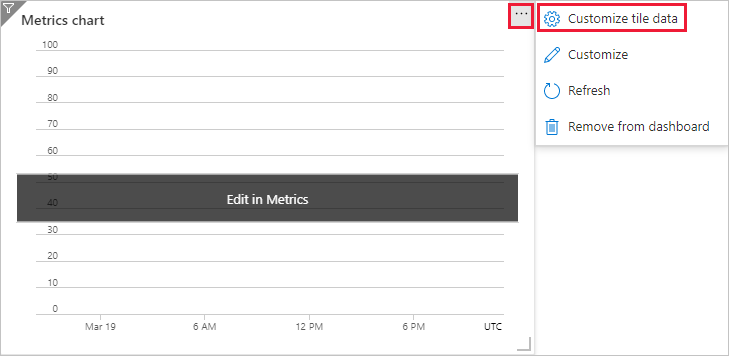

2. Select the checkbox to **Override the dashboard time settings at the tile level**.

   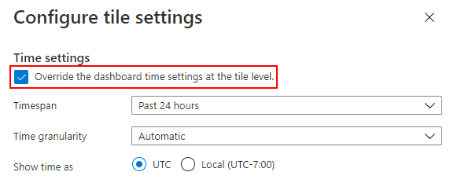

3. Choose the time span to show for this tile. You can choose from the past 30 minutes to the past 30 days or define a custom range.
1. Choose the time granularity to display. You can show anywhere from one-minute increments to one-month.
1. Select **Apply**.

## Delete a tile

To remove a tile from a dashboard, follow these steps:

* Select the context menu in the upper right corner of the tile, then select **Remove from dashboard**. Or,
* Select  **Edit** to enter customization mode. Hover in the upper right corner of the tile, then select the  delete icon to remove the tile from the dashboard.

   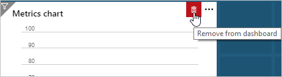

## Clone a dashboard

To use an existing dashboard as a template for a new dashboard, follow these steps:

1. Make sure that the dashboard view is showing the dashboard that you want to copy.
1. In the page header, select 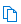 **Clone**.
1. A copy of the dashboard, named "Clone of *your dashboard name*" opens in edit mode. Use the preceding steps in this article to rename and customize the dashboard.

## Publish and share a dashboard

When you create a dashboard, it's private by default, which means you're the only one who can see it. To make dashboards available to others, you can share them with other users. First, you have to publish the dashboard as an Azure resource. To publish and share a custom dashboard, follow these steps:

1. Select  **Share** from the page header. The **Sharing + access control** form appears.
1. Verify that the correct dashboard name is shown.
1. Select a **Subscription name**. Users with access to the subscription can use the shared dashboard. Access to the resources represented by the individual tiles is determined by Azure role-based access control.
1. Select the checkbox to publish this dashboard to the 'dashboards' resource group for the selected subscription. Or, clear the checkbox and choose to publish to an existing resource group instead.
1. Choose a location for the dashboard resource. We recommend you locate the dashboard with other resources. Note: if you choose from existing resource groups, the dashboard is automatically located with that resource group.
1. Select **Publish**.

   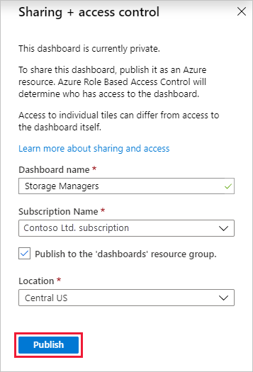

### Set access control on a shared dashboard

After the dashboard is published, manage who has access to the dashboard by following these steps:

1. In the **Sharing + access control** pane, select **Manage users**.

   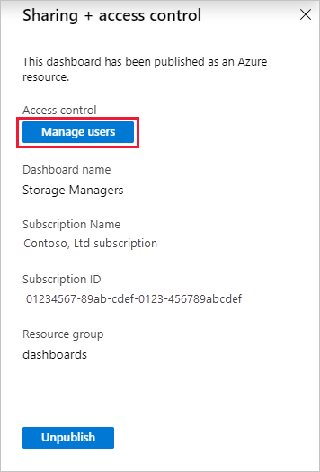

2. The **Access Control** page opens. On this page, you can review the level of access for someone or add a new role assignment. When you add a role assignment here, you're granting permissions to the dashboard.

> [!NOTE]
> Tiles are representative views of resources in your organization. Access to resources is managed through role-based access control assignment and permissions are inherited from the subscription down to the resource. Giving access to a dashboard doesn’t automatically assign permissions to the resources shown on the dashboard. For more information about permissions to shared dashboards and role-based access control for resources, see [Share dashboards with role-based access control](azure-portal-dashboard-share-access.md).

### Open a shared dashboard

To find and open a shared dashboard, follow these steps:

1. Select the drop-down next to the dashboard name.
1. Select from the displayed list of dashboards or **Browse all dashboards** if the dashboard you want to open isn't listed.

   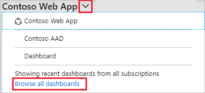

3. In the **Type** field, select **Shared dashboards**.
1. Select one or more subscriptions. You can also enter text to filter dashboards by name.
1. Select a dashboard from the list of shared dashboards.

## Delete a dashboard

To permanently delete a private or shared dashboard, follow these steps:

1. Select the dashboard you want to delete from the drop-down list next to the dashboard name.
1. Select  **Delete** from the page header.
1. For a private dashboard, select **OK** on the confirmation dialog to remove the dashboard. For a shared dashboard, on the confirmation dialog, select the checkbox to confirm that the published dashboard will no longer be viewable by others. Then, select **OK**.

   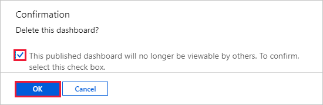

## Next steps

* [Share dashboards with role-based access control](azure-portal-dashboard-share-access.md)
* [Programmatically create Azure dashboards](azure-portal-dashboards-create-programmatically.md)
