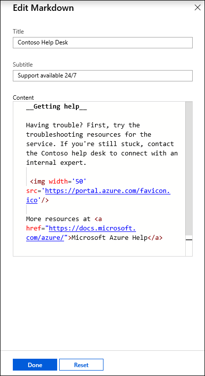

# Use a markdown tile on Azure dashboards to show custom content

You can add a markdown tile to your Azure dashboards to display custom, static content. For example, you can show basic instructions, an image, or a set of hyperlinks with a markdown tile.

## Add a markdown tile to your dashboard

1. Select **Dashboard** from the Azure portal sidebar. If you've created any custom dashboards, in the dashboard view, use the drop-down to select the dashboard where the custom markdown tile should appear. Select the edit icon to open the **Tile Gallery**.

   

2. In the **Tile Gallery**, locate the tile called **Markdown** and click **Add**. The tile is added to the dashboard and the **Edit Markdown** pane opens.

1. Edit the **Title**, **Subtitle**, and **Content** fields to customize the tile. In the example shown here, the markdown tile has been edited to display custom help desk information.

   

4. Select **Done** to dismiss the **Edit Markdown** pane. Your content will appear on the Markdown tile, which can then be resized by dragging the handle in the lower right-hand corner.

   

## Markdown content capabilities and limitations

You can use any combination of plain text, Markdown syntax, and HTML content on the markdown tile. The Azure portal uses an open-source library called _marked_ to transform your content into HTML that is shown on the tile. The HTML produced by _marked_ is pre-processed by the portal before it's rendered. This step helps make sure that your customization won't affect the security or layout of the portal. During that pre-processing, any part of the HTML that poses a potential threat is removed. The following types of content aren't allowed by the portal:

* JavaScript – `<script>` tags and inline JavaScript evaluations will be removed.
* iframes - `<iframe>` tags will be removed.
* Style - `<style>` tags will be removed. Inline style attributes on HTML elements aren't officially supported. You may find that some inline style elements work for you, but if they interfere with the layout of the portal, they could stop working at any time. The Markdown tile is intended for basic, static content that uses the default styles of the portal.

## Next steps

* To create a custom dashboard, see [Create and share dashboards in the Azure portal](../azure-portal/azure-portal-dashboards.md)
