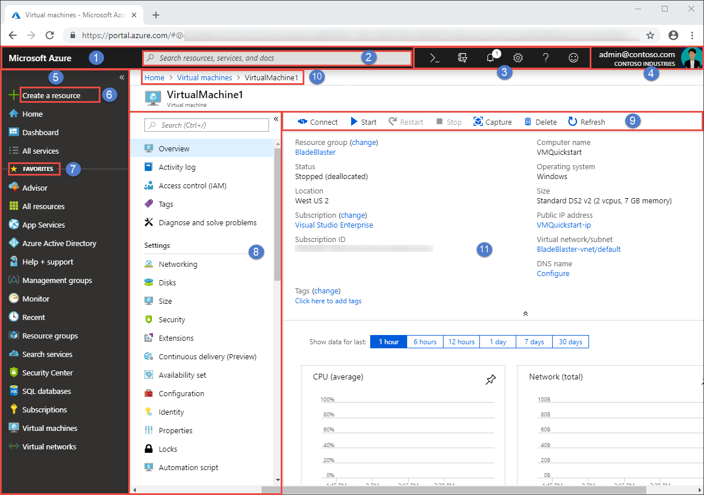

# Azure portal overview

This article introduces the Azure portal, identifies portal page elements, and helps you get familiar with the Azure portal management experience.

## What is the Azure portal?

The Azure portal is a web-based, unified console that provides an alternative to command-line tools. With the Azure portal, you can manage your Azure subscription using a graphical user interface. You can build, manage, and monitor everything from simple web apps to complex cloud deployments, create custom dashboards for an organized view of resources, and configure accessibility options for the best experience.

The Azure portal is designed for resiliency and continuous availability. It has a presence in every Azure datacenter thereby making it resilient to individual datacenter failures and also avoids network slow-downs by being close to users. The Azure portal updates continuously and requires no downtime for maintenance activities.

## Azure Home

As a new subscriber to Azure services, the first thing you see after you [sign in to the portal](https://portal.azure.com) is **Azure Home**. This page compiles resources that help you get the most from your Azure subscription. We have included links to free online courses, documentation, core services, and useful sites for staying current and managing change for your organization. For quick and easy access to work in progress, we also show a list of your most recently visited resources. You can’t customize this page, but you can choose whether to see **Azure Home** or **Azure Dashboard** as your default view. The first time you sign in, there’s a prompt at the top of the page where you can save your preference.

## Azure Dashboard

Dashboards provide a focused view of the resources in your subscription that matter most to you. We’ve given you a default dashboard to get you started. You can customize this dashboard to bring the resources you use most into a single view. Any changes you make to the default view affect your experience only. However, you can create additional dashboards for your own use or publish your customized dashboards and share them with other users in your organization. For more information, see [Create and share dashboards in the Azure portal](../azure-portal/azure-portal-dashboards.md).

## Getting around the portal

It’s helpful to understand the basic portal layout and how to interact with it. Here, we’ll introduce the components of the user interface and some of the terminology we use to give instructions. For a more detailed tour of the portal, see the course lesson [Navigate the portal](https://docs.microsoft.com/learn/modules/tour-azure-portal/3-navigate-the-portal).

The Azure portal sidebar and page header are global elements that are always present. These persistent features are the “shell” for the user interface associated with each individual service or feature and the header provides access to global controls. The configuration page (sometimes referred to as a “blade”) for a resource may also have a left pane to help you move between features.

The figure below labels the basic elements of the Azure portal, each of which are described in the following table.

|Key|Description
|:---:|---|
|1|Page header. Appears at the top of every portal page and holds global elements.|
|2| Global search. Use the search bar to quickly find a specific resource, a service, or documentation.|
|3|Global controls. Like all global elements, these features persist across the portal and include: Cloud Shell, subscription filter, notifications, portal settings, help and support, and send us feedback.|
|4|Your account. View information about your account, switch directories, sign out, or sign in with a different account.|
|5|Sidebar. The sidebar is a global element that helps you to navigate between services. The sidebar can be collapsed to give more focus to the working pane.|
|6|Master control to create a new resource in the current subscription. Search or browse the Azure Marketplace for the resource type you want to create.|
|7|Your favorites list. Add or remove favorites from the **All services** page.|
|8|Left pane. Many services include a left pane menu to help you manage the service.|
|9|Command bar. The controls on the command bar are contextual to your current focus.|
|10|Breadcrumb. You can use the breadcrumb links to move back a level in your workflow.|
|11|Working pane.  Displays the details about the resource that is currently in focus.|

## Get started with services

If you’re a new subscriber, you’ll have to create a resource before there’s anything to manage. Select **+Create a resource** to view the services available in the Azure Marketplace. You’ll find applications and services from hundreds of providers here, all certified to run on Azure.

We pre-populated your Favorites in the sidebar with links to commonly used services.  To view all available services, select **All services** from the sidebar.

> [!TIP]
> The quickest way to find a resource, service, or documentation is to use *Search* in the global header. Use the breadcrumb links to go back to previous pages.
>

## Next steps

* Learn more about where to run Azure portal in [Supported browsers and devices](../azure-portal/azure-portal-supported-browsers-devices.md)

* Stay connected on the go with [Azure mobile app](https://azure.microsoft.com/features/azure-portal/mobile-app/)
