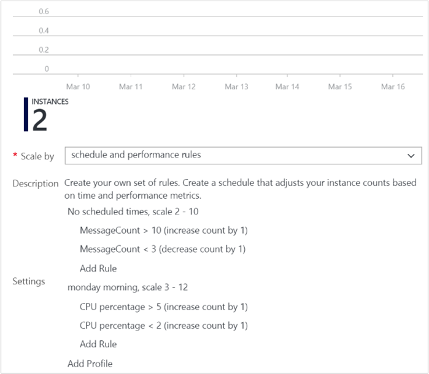

<properties
	pageTitle="Azure Insights: Best practices for Azure Insights autoscaling. | Microsoft Azure"
	description="Learn principles to effectively use autoscaling in Azure Insights."
	authors="kamathashwin"
	manager=""
	editor=""
	services="azure-portal"
	documentationCenter="na"/>

<tags
	ms.service="azure-portal"
	ms.workload="na"
	ms.tgt_pltfrm="na"
	ms.devlang="na"
	ms.topic="article"
	ms.date="07/15/2016"
	ms.author="ashwink"/>

# Best practices for Azure Insights autoscaling

The following sections in this document will help you understand the best practices for Autoscale in Azure Insights. After reviewing this information, you'll be better able to effectively use Autoscale in your Azure infrastructure.

## Autoscale concepts

- A resource can have only *one* autoscale setting
- An autoscale setting can have one or more profiles and each profile can have one or more autoscale rules.
- An autoscale setting scales instances horizontally, which is *out* by increasing the instances and *in* by decreasing the number of instances.
 An autoscale setting has a maximum, minimum, and default value of instances.
- An autoscale job always reads the associated metric to scale by, checking if it has crossed the configured threshold for scale out or scale in. You can view a list of metrics that autoscale can scale by at [Azure Insights autoscaling common metrics](insights-autoscale-common-metrics.md).
- All thresholds are calculated at an instance level. For example, "scale out by 1 instance when average CPU > 80% when instance count is 2", means scale out when the average CPU across all instances is greater than 80%.
- You will always receive failure notifications via email. Specifically, the owner, contributor, and readers of the target resource will receive email. You will also always receive a *recovery* email when autoscale recovers from a failure and starts functioning normally.
- You can opt-in to receive a successful scale action notification via email and webhooks.

## Autoscale best practices

Use the following best practices as you use Autoscale.

### Ensure the maximum and minimum values are different and have an adequate margin between them
If you have a setting that has maximum=2, minimum=2 and the current instance count is 2, no scale action can occur. A recommended setting is to keep an adequate margin between the maximum and minimum instance counts. Autoscale will always scale between these limits, which is inclusive. However, assume that you decide to manually scale (update) the instance count to a value above the maximum. The next time an autoscale job runs, it checks if the current instance count is greater than maximum - if so, it scales in to the maximum, regardless of the threshold set on the rules. Similarly, if you manually arrive at a current instance count less than the minimum, the next time an autoscale job runs, it scales out to the minimum number of instances.

### Always use a scale out and scale in rule combination that performs an increase and decrease

If you use only one part of the combination, autoscale will scale in that single out, or in, until the maximum, or minimum, is reached.

### Do not switch between the Azure portal and the Azure classic portal when managing Autoscale
For Cloud Services and App Services (Web Apps), use the Azure portal (portal.azure.com) to create and manage Autoscale settings. For Virtual Machine Scale Sets use PoSH, CLI or REST API to create and manage autoscale setting. Do not switch between the Azure classic portal (manage.windowsazure.com) and the Azure portal (portal.azure.com) when managing autoscale configurations. The Azure classic portal and its underlying backend has limitations. Move to the Azure portal to manage autoscale using a graphical user interface. The options are to use the Autoscale PowerShell, CLI or REST API (via Azure Resource Explorer).

### Choose the appropriate statistic for your diagnostics metric
For diagnostics metrics, you can choose among *Average*, *Minimum*, *Maximum* and *Total* as a metric to scale by. The most common statistic is *Average*.

### Choose the thresholds carefully for all metric types
We recommend carefully choosing different thresholds for scale out and scale in based on practical situations.

We *do not recommend* autoscale settings like the examples below with the same or very similar threshold values for out and in conditions:

- Increase instances by 1 count when Thread Count <= 600
- Decrease instances by 1 count when Thread Count >= 600

Let's look at an example of what can lead to a behavior that may seem confusing. Assume there are 2 instances to begin with and then the average number of threads per instance grows to 625. Autoscale scales out adding a 3rd instance. Next, assume that the average thread count across instance falls to 575. Before scaling down, autoscale tries to estimate what the final state will be if it scaled in. For example, 575 x  3 (current instance count) = 1,725 / 2 (final number of instances when scaled down) = 862.5 threads. This means Autoscale will have to immediately scale out again even after it scaled in, if the average thread count remains the same or even falls only a small amount. However, if it scaled up again, the whole process would repeat, leading to an infinite loop. To avoid this *flappy* situation, Autoscale does not scale down at all. Instead, it skips and reevaluates the condition again the next time the service's job executes. This could confuse many people because autoscale wouldn't appear to work when the average thread count was 575.

This estimation behavior during a scale in is intended to avoid a flappy situation. You should keep this behavior in mind when you choose the same thresholds for scale out and in.

We recommend choosing an adequate margin between the scale out and in thresholds. As an example, consider the following better rule combination.

- Increase instances by 1 count when CPU%  >= 80
- Decrease instances by 1 count when CPU% <= 60

Let's review how this example works. Assume there are 2 instances to start with. If the average CPU% across instances goes to 80, autoscale scales out adding a 3rd instance. Now assume that over time the CPU% falls to 60. Autoscale's scale in rule estimates the final state if it were to scale in. For example, 60 x 3 (current instance count) = 180 / 2 (final number of instances when scaled down) = 90. So Autoscale does not scale in because it would have to scale out again immediately. Instead, it skips scaling down. Next, assume that the next time it checks, the CPU continues to fall to 50, then it estimates again -  50 x 3 instance = 150 / 2 instances = 75, which is below the scale out threshold of 80, so it scales in successfully to 2 instances.

### Considerations for scaling threshold values for special metrics
 For special metrics such as Storage or Service Bus Queue length metric, the threshold is the average number of messages available per current number of instances. Carefully choose the choose the threshold value for this metric.

Let's illustrate it with an example to ensure you understand the behavior better.

- Increase instances by 1 count when Storage Queue message count >= 50
- Decrease instances by 1 count when Storage Queue message count <= 10

Assume there are 2 instances to start with. Next, assume that messages keep coming and when you review the storage queue, the total count reads 50. You might assume that autoscale should start a scale out action. However, note that it is still 50/2 = 25 messages per instance. So, scale out does not occur. For the first scale out to happen, the total message count in the storage queue should be 100. Next, assume that the total message count reaches 100. A 3rd instance is added due to a scale out action. The next scale out action will not happen until the total message count in the queue reaches 150. Let's look at the scale in action. Assume that the number of instances is 3. The first scale in action happens when the total messages in the queue reaches 30, making it 30/3 = 10 messages per instance, which is the scale in threshold.

### Considerations for scaling when multiple profiles are configured in an autoscale setting

In an autoscale setting, you can choose a default profile, which is always applied without any dependency on schedule or time, or you can choose a recurring profile or a profile for a fixed period with a date and time range.

When Autoscale service processes them, it always checks in the following order:

1. Fixed Date profile
2. Recurring profile
3. Default ("Always") profile

If a profile condition is met, autoscale does not check the next profile condition below it. Autoscale only processes one profile at a time. This means if you want to also include a processing condition from a lower-tier profile, you must include those rules as well in the current profile.

Let's review this using an example:

The image below shows an autoscale setting with a default profile of minimum instances = 2 and maximum instances = 10. In this example, rules are configured to scale out when the message count in the queue is greater than 10 and scale in when the message count in the queue is less than 3. So now the resource can scale between 2 and 10 instances.

In addition, there is a recurring profile set for Monday. It is set for minimum instances = 2 and maximum instances = 12. This means on Monday, the first time Autoscale checks for this condition, if the instance count was 2, it will scale it to the new minimum of 3. As long as autoscale continues to find this profile condition matched (Monday), it will only process the CPU based scale out/in rules configured for this profile. At this time, it will not check for the queue length. However, if you also want the queue length condition to be checked, you should include those rules from the default profile as well in your Monday profile. 

Similarly, when Autoscale switches back to the default profile, it first checks if the minimum and maximum conditions are met. If the number of instances at the time is 12, it scales in to 10, the maximum allowed for the default profile.

### Considerations for scaling when multiple rules are configured in a profile
There are cases where you may have to set multiple rules in a profile. The following set of autoscale rules are used by services use when multiple rules are set.

On *scale out*, Autoscale will run if any rule is met.
On *scale in*, Autoscale require all rules to be met.
 
To illustrate, assume that you have the following 4 autoscale rules:
 
- If CPU < 30 %, scale in​ by 1
- ​If Memory < 50%, scale in by 1​
- ​If CPU > 75%, scale ​out by 1
- ​If Memory > 75%, scale out by 1​

Then the follow will occur:  
- If CPU is 76% and Memory is 50%, we will scale out.
- If CPU is 50% and Memory is 76% we will scale out.
 
On the other hand, if CPU is 25% and memory is 51% autoscale will **not** scale in. In order to scale in, CPU must be 29% and Memory 49%.

### Always select a safe default instance count
The default instance count is important because it the instance count that Autoscale scales your service to when metrics are not available. Therefore, select a default instance count that's safe for your workloads.

### Configure autoscale notifications
Autoscale notifies the administrators and contributors of the resource by email if any of the following conditions occur:
- Autoscale service fails to take an action.
- Metrics are not available for autoscale service to make a scale decision.
- Metrics are available (recovery) again to make a scale decision.
In addition to the conditions above, you can configure email or webhook notifications to get notified for successful scale actions.
