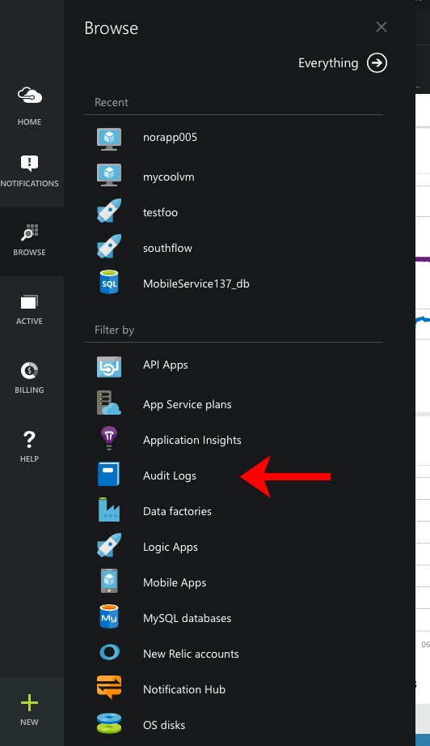
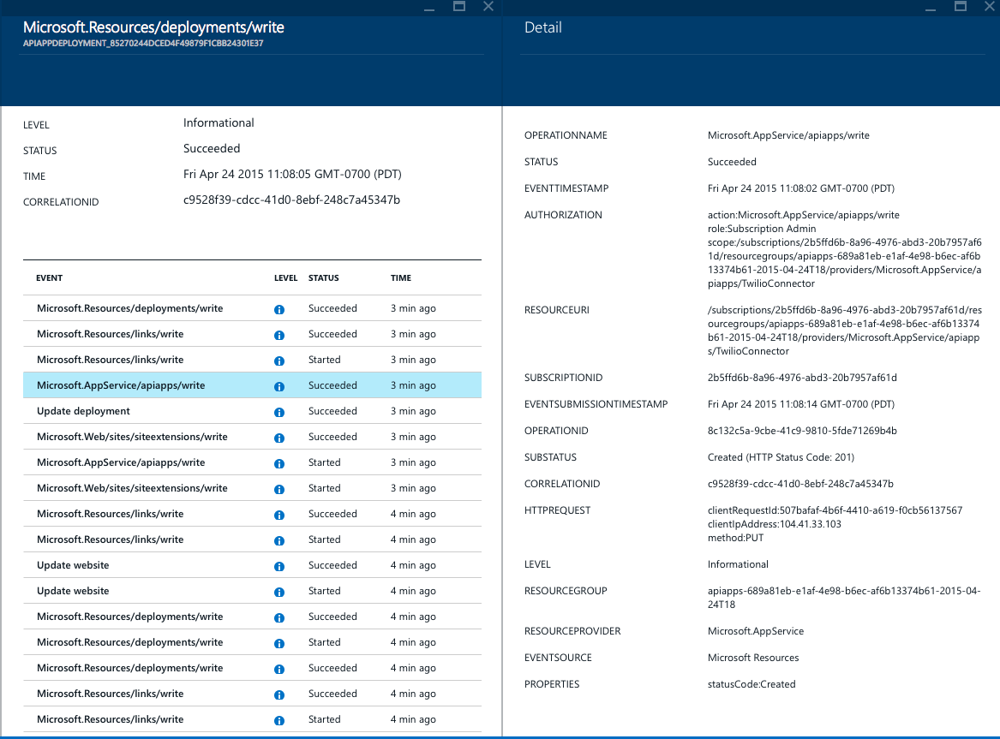

<properties
	pageTitle="View events and audit logs"
	description="Learn how to see all of the events that happen in your Azure subscription."
	authors="HaniKN-MSFT"
	manager="kamrani"
	editor=""
	services="monitoring"
	documentationCenter="monitoring"/>

<tags
	ms.service="monitoring"
	ms.workload="na"
	ms.tgt_pltfrm="na"
	ms.devlang="na"
	ms.topic="article"
	ms.date="04/28/2015"
	ms.author="hanikn"/>

# View events and audit logs

All operations performed on Azure resources are fully audited by the Azure Resource Manager, from creation and deletions to granting or revoking access. You can browse these logs in the Azure portal, and you can also use the [REST API](https://msdn.microsoft.com/library/azure/dn931927.aspx) or [.NET SDK](https://www.nuget.org/packages/Microsoft.Azure.Insights/) to access the full set of events programmatically.

## Browse the events impacting your Azure subscription

1. Sign in to the [Azure Portal](https://portal.azure.com/).
2. Click on the **Browse** and select **Audit logs**.  
    
3. This will open up a blade showing all of the events that have impacted any of your subscriptions for the past 7 days. At the top is a chart showing data by level, and below that is the full list of logs:
    

>[AZURE.NOTE] You can only view the 500 most recent events for a given subscription in the Azure portal.

4. You can click on any log entry to see the events that made it up. For example, when you deploy something to a resource group, many different resources may be created or modified. For each entry you can see:
    * The **Level** of the event - for example, it could be just something to track (**Informational**), or when something has gone wrong that you need to know about (**Error**).
    * The **Status** - the final status will generally be **Succeeded** or **Failed**, but it may also be **Accepted** for long-running operations.
    * *When* the event occurred.
    * *Who* performed the operation, if anyone. Not all operations are performed by users, some are performed by backend services so they would not have a **Caller**.
    * The **Correlation ID** of the event - this is the unique identifier for this set of operations.

5. From there you can go to the details blade to see the specifics of the event.

    

    For **Failed** events, this page usually includes a **Substatus** and a **Properties** section that include useful details for debugging purposes.

## Filter to specific logs

In order to see events that apply to a specific entity, or of a specific type, you can filter the Audit logs blade by clicking the **Filter** command. You also use the Filter blade to change the **Time span** of the Audit logs blade.

Once you click this command, a new blade will open:

There are four types of filters:

1. By subscription
2. By a **Resource group**
3. By a **Resource type**
4. By a particular **Resource** - for this you must past in the full *Resource ID* of the resource you are interested in

In addition, you can also filter events by who performed the event, or, by the level of the event.

Once you have finished choosing what you want to see, click the **Update** button at the bottom of the blade.

## Monitor events impacting specific resources

1. Click on **Browse** to find the resource you are interested in. You can also see all of the logs for an entire **Resource group**.
2. On the resource's blade, scroll down until you find the **Events** tile.  
    
3. Click on that tile to see events filtered to just the resource that you selected. You can use the **Filter** command to change the time range or apply more specific filters.

## Next steps

* [Receive alert notifications](insights-receive-alert-notifications.md) whenever an event happens.
* [Monitor service metrics](insights-how-to-customize-monitoring.md) to make sure your service is available and responsive.
* [Track service health](insights-service-health.md) to find out when Azure has experienced performance degradation or service interruptions.  
