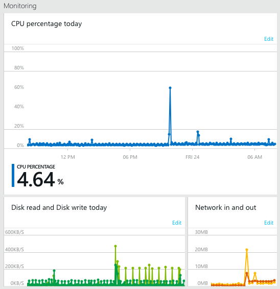
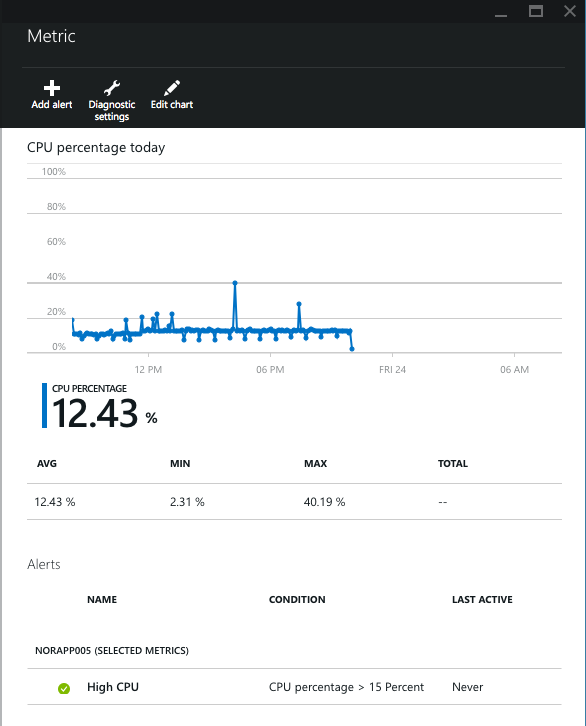
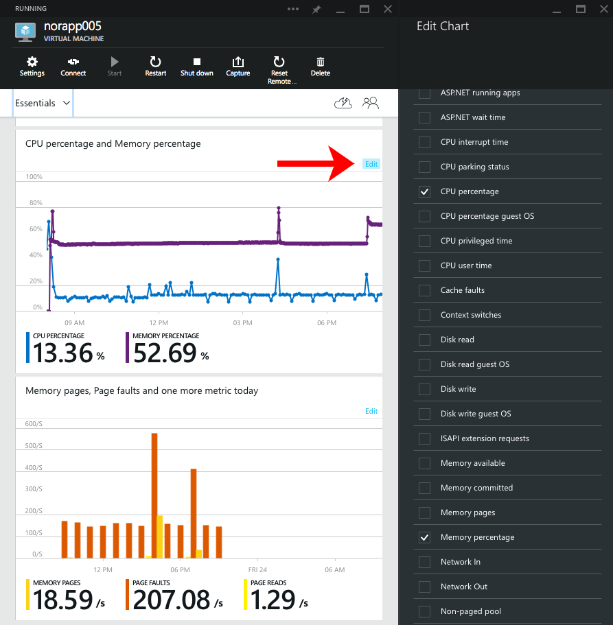
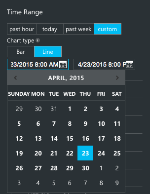
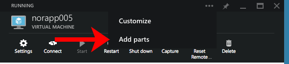
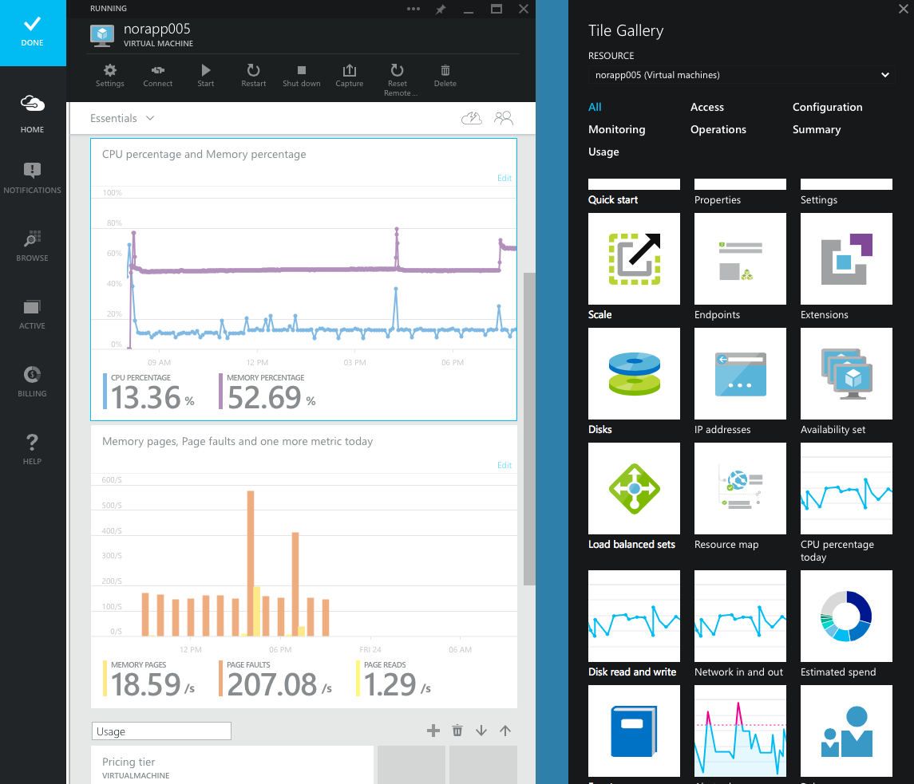
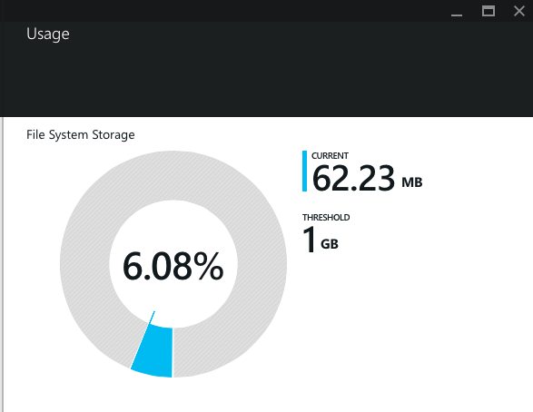

<properties
	pageTitle="Monitor service metrics in Microsoft Azure | Microsoft Azure"
	description="Learn how to customize monitoring charts in Azure."
	authors="rboucher"
	manager=""
	editor=""
	services="monitoring-and-diagnostics"
	documentationCenter="monitoring-and-diagnostics"/>

<tags
	ms.service="monitoring-and-diagnostics"
	ms.workload="na"
	ms.tgt_pltfrm="na"
	ms.devlang="na"
	ms.topic="article"
	ms.date="09/08/2015"
	ms.author="robb"/>

# Monitor service metrics

All Azure services track key metrics that allow you to monitor the health, performance, availability and usage of your services. You can view these metrics in the Azure portal, and you can also use the [REST API](https://msdn.microsoft.com/library/azure/dn931930.aspx) or [.NET SDK](https://www.nuget.org/packages/Microsoft.Azure.Insights/) to access the full set of metrics programmatically.

For some services, you may need to turn on diagnostics in order to see any metrics. For others, such as virtual machines, you will get a basic set of metrics, but need to enable the full set high-frequency metrics. See [Enable monitoring and diagnostics](insights-how-to-use-diagnostics.md) to learn more.

## Using monitoring charts

You can chart any of the metrics them over any time period you choose.

1. In the [Azure Portal](https://portal.azure.com/), click **Browse**, and then a resource you're interested in monitoring.

2. The **Monitoring** section contains the most important metrics for each Azure resource. For example, a web app has **Requests and Errors**, where as a virtual machine would have **CPU percentage** and **Disk read and write**:
    

3. Clicking on any chart will show you the **Metric** blade. On the blade, in addition to the graph, is a table that shows you aggregations of the metrics (such as average, minimum and maximum, over the time range you chose). Below that are the alert rules for the resource.
    

4. To customize the lines that appear, click the **Edit** button on the chart, or, the **Edit chart** command on the Metric blade.

5. On the Edit Query blade you can do three things:
    - Change the time range
    - Switch the appearance between Bar and Line
    - Choose different metics
    

6. Changing the time range is as easy as selecting a different range (such as **Past Hour**) and clicking **Save** at the bottom of the blade. You can also choose **Custom**, which allows you to choose any period of time over the past 2 weeks. For example, you can see the whole two weeks, or, just 1 hour from yesterday. Type in the text box to enter a different hour.
    

7. Below the time range, you chan choose any number of metrics to show on the chart.

8. When you click Save your changes will be saved for that particular resource. For example, if you have two virtual machines, and you change a chart on one, it will not impact the other.

## Creating side-by-side charts

With the powerful customization in the portal you can add as many charts as you want.

1. In the **...** menu at the top of the blade click **Add tiles**:  
    
2. Then, you can select select a chart from the **Gallery** on the right side of your screen:
    
3. If you don't see the metric you want, you can always add one of the preset metrics, and **Edit** the chart to show the metric that you need.

## Monitoring usage quotas

Most metrics show you trends over time, but certain data, like usage quotas, are point-in-time information with a threshold.

You can also see usage quotas on the blade for resources that have quotas:

Like with metrics, you can use the [REST API](https://msdn.microsoft.com/library/azure/dn931963.aspx) or [.NET SDK](https://www.nuget.org/packages/Microsoft.Azure.Insights/) to access the full set of usage quotas programmatically.

## Next steps

* [Receive alert notifications](insights-receive-alert-notifications.md) whenever a metric crosses a threshold.
* [Enable monitoring and diagnostics](insights-how-to-use-diagnostics.md) to collect detailed high-frequency metrics on your service.
* [Scale instance count automatically](insights-how-to-scale.md) to make sure your service is available and responsive.
* [Monitor application performance](insights-perf-analytics.md) if you want to understand exactly how your code is performing in the cloud.
* Use [Application Insights for JavaScript apps and web pages](../application-insights/app-insights-web-track-usage.md) to get client analytics about the browsers that visit a web page.
* [Monitor availability and responsiveness of any web page](../application-insights/app-insights-monitor-web-app-availability.md) with Application Insights so you can find out if your page is down.
