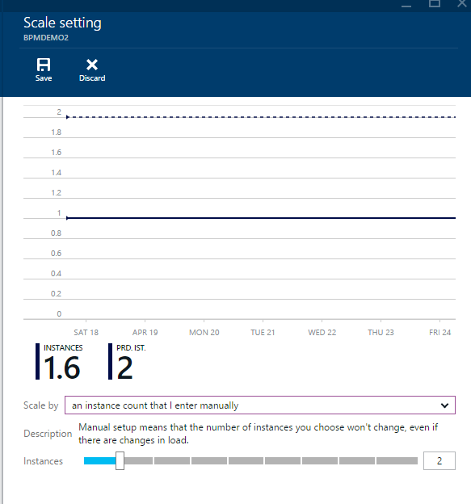
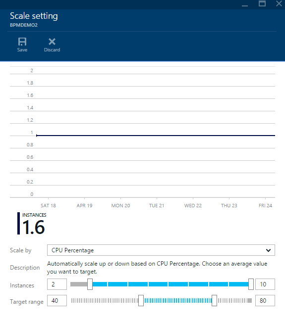
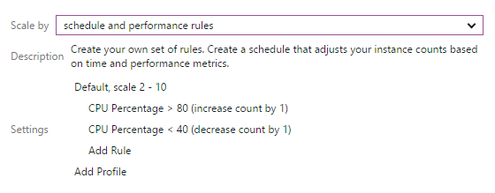
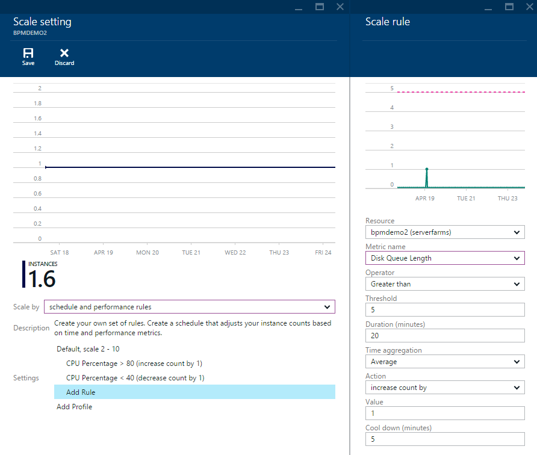
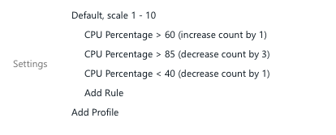
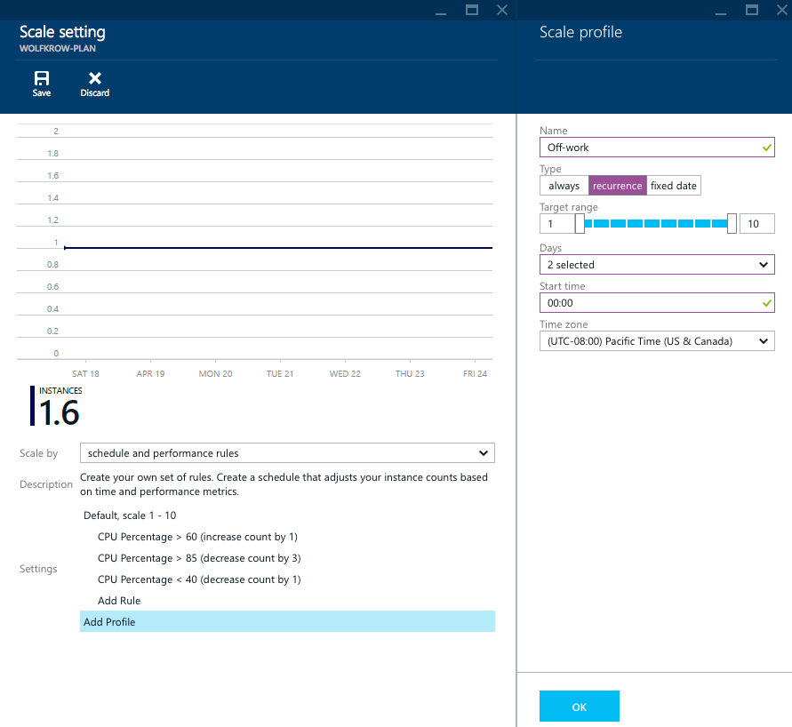
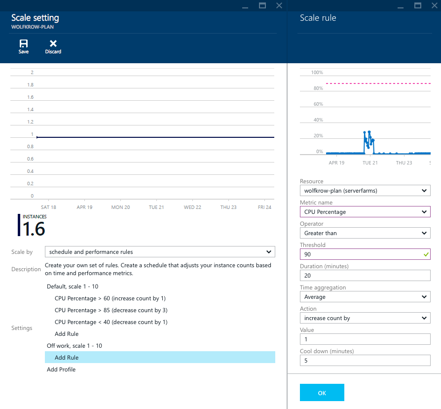

<properties
	pageTitle="Scale instance count manually or automatically | Microsoft Azure"
	description="Learn how to scale your services Azure."
	authors="rboucher"
	manager=""
	editor=""
	services="monitoring-and-diagnostics"
	documentationCenter="monitoring"/>

<tags
	ms.service="monitoring-and-diagnostics"
	ms.workload="na"
	ms.tgt_pltfrm="na"
	ms.devlang="na"
	ms.topic="article"
	ms.date="09/08/2015"
	ms.author="robb"/>

# Scale instance count manually or automatically

In the [Azure Portal](https://portal.azure.com/), you can manually set the instance count of your service, or, you can set parameters to have it automatically scale based on demand. This is typically referred to as *Scale out* or *Scale in*.

Before scaling based on instance count, you should consider that scaling is affected by **Pricing tier** in addition to instance count. Different pricing tiers can have different numbers cores and memory, and so they will have better performance for the same number of instances (which is *Scale up* or *Scale down*). This article specifically covers *Scale in* and *out*.

You can scale in the portal, and you can also use the [REST API](https://msdn.microsoft.com/library/azure/dn931953.aspx) or [.NET SDK](https://www.nuget.org/packages/Microsoft.Azure.Insights/) to adjust scale manually or automatically.

## Scaling manually

1. In the [Azure Portal](https://portal.azure.com/), click **Browse**, then navigate to the resource you want to scale, such as a **App Service plan**.

2. The **Scale** tile in **Operations** will tell you the status of scaling: **Off** for when you are scaling manually, **On** for when you are scaling by one or more performance metrics.
    

3. Clicking on the tile will take you to the **Scale** blade. At the top of the scale blade you can see a history of autoscale actions the service.  
    

>[AZURE.NOTE] Only actions that are performed by autoscale will show up in this chart. If you manually adjust the instance count, the change will not be reflected in this chart.

4. You can manually adjust the number **Instances** with slider.
5. Click the **Save** command and you'll be scaled to that number of instances almost immediately.

## Scaling based on a pre-set metric

If you want the number of instances to automatically adjust based on a metric, select the metric you want in the **Scale by** dropdown. For example, for an **App Service plan** you can scale by **CPU Percentage**.

1. When you select a metric you'll get a slider, and/or, text boxes to enter the number of instances you want to scale between:

    

    Autoscale will never take your service below or above the boundaries that you set, no matter your load.

2. Second, you choose the target range for the metric. For example, if you chose **CPU percentage**, you can set a target for the average CPU across all of the instances in your service. A scale out will happen when the average CPU exceeds the maximum you define, likewise, a scale in will happen whenever the average CPU drops below the minimum.

3. Click the **Save** command. Autoscale will check every few minutes to make sure that you are in the instance range and target for your metric. When your service receives additional traffic,  you will get more instances without doing anything.

## Scale based on other metrics

You can scale based on metrics other than the presets that appear in the **Scale by** dropdown, and can even have a complex set of scale out and scale in rules.

### Adding or changing a rule

1. Choose the **schedule and performance rules** in the **Scale by** dropdown:

2. If you previously had autoscale, on you'll see a view of the exact rules that you had.

3. To scale based on another metric click the **Add Rule** row. You can also click one of the existing rows to change from the metric you previously had to the metric you want to scale by.

4. Now you need to select which metric you want to scale by. When choosing a metric there are a couple things to consider:
    * The *resource* the metric comes from. Typically, this will be the same as the resource you are scaling. However, if you want to scale by the depth of a Storage queue, the resource is the queue that you want to scale by.
    * The *metric name* itself.
    * The *time aggregation* of the metric. This is how the data is combine over the *duration*.

5. After choosing your metric you choose the threshold for the metric, and the operator. For example, you could say **Greater than** **80%**.

6. Then choose the action that you want to take. There are a couple different type of actions:
    * Increase or decrease by - this will add or remove the **Value** number of instances you define
    * Increase or decrease percent - this will change the instance count by a percent. For example, you could put 25 in the **Value** field, and if you currently had 8 instances, 2 would be added.
    * Increase or decrease to - this will set the instance count to the **Value** you define.

7. Finally, you can choose cool down - how long this rule should wait after the previous scale action to scale again.

8. After configuring your rule hit **OK**.

9. Once you have configured all of the rules you want, be sure to hit the **Save** command.

### Scaling with multiple steps

The examples above are pretty basic. However, if you want to be more agressive about scaling up (or down), you can even add multiple scale rules for the same metric. For example, you can define two scale rules on CPU percentage:

1. Scale out by 1 instance if CPU percentage is above 60%
2. Scale out by 3 instances if CPU percentage is above 85%

With this additional rule, if your load exceeds 85% before a scale action, you will get two additional instances instead of one.

## Scale based on a schedule

By default, when you create a scale rule it will  always apply. You can see that when you click on the profile header:

However, you may want to have more agressive scaling during the day, or the week, than on the weekend. You could even shut down your service entirely off working hours.

1. To do this, on the profile you have, select **recurrence** instead of **always,** and choose the times that you want the profile to apply.

2. For example, to have a profile that applies during the week, in the **Days** dropdown uncheck **Saturday** and **Sunday**.

3. To have a profile that applies during the daytime, set the **Start time** to the time of day that you want to start at.
    

4. Click **OK**.

5. Next, you will need to add the profile that you want to apply at other times. Click the **Add Profile** row.
    

6. Name your new, second, profile, for example you could call it **Off work**.

7. Then select **recurrence** again, and choose the instance count range you want during this time.

8. As with the Default profile, choose the **Days** you want this profile to apply to, and the **Start time** during the day.

>[AZURE.NOTE] Autoscale will use the Daylight savings rules for whichever **Time zone** you select. However, during Daylight savings time the UTC offset will show the base Time zone offset, not the Daylight savings UTC offset.

9. Click **OK**.

10. Now, you will need to add whatever rules you want to apply during your second profile. Click **Add Rule**, and then you could construct the same rule you have during the Default profile.
    

11. Be sure to create both a rule for scale out and scale in, or else during the profile the instance count will only grow (or decrease).

12. Finally, click **Save**.

## Next steps

* [Monitor service metrics](insights-how-to-customize-monitoring.md) to make sure your service is available and responsive.
* [Enable monitoring and diagnostics](insights-how-to-use-diagnostics.md) to collect detailed high-frequency metrics on your service.
* [Receive alert notifications](insights-receive-alert-notifications.md) whenever operational events happen or metrics cross a threshold.
* [Monitor application performance](insights-perf-analytics.md) if you want to understand exactly how your code is performing in the cloud.
* [View events and audit logs](insights-debugging-with-events.md) to learn everything that has happened in your service.
* [Monitor availability and responsiveness of any web page](../application-insights/app-insights-monitor-web-app-availability.md) with Application Insights so you can find out if your page is down.
