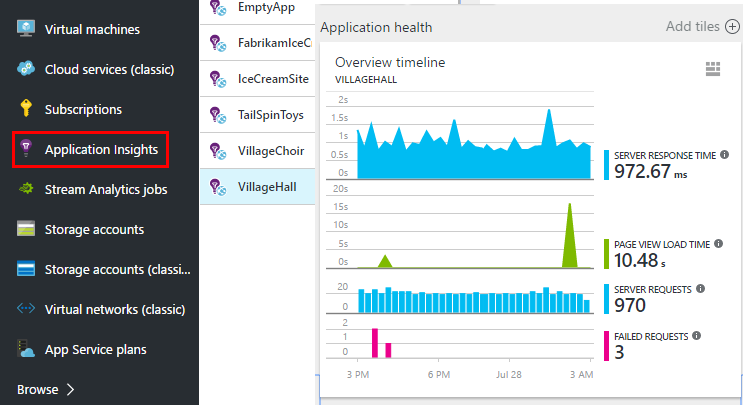
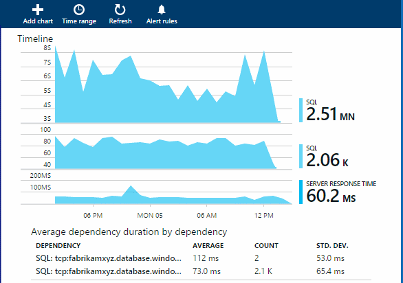

<properties 
	pageTitle="Monitor Azure web app performance" 
	description="Chart load and response time, dependency information and set alerts on performance." 
	services="azure-portal"
    documentationCenter="na"
	authors="alancameronwills" 
	manager="douge"/>

<tags 
	ms.service="azure-portal" 
	ms.workload="na" 
	ms.tgt_pltfrm="na" 
	ms.devlang="na" 
	ms.topic="article" 
	ms.date="09/23/2015" 
	ms.author="awills"/>

# Monitor Azure web app performance

In the [Azure Portal](http://portal.azure.com) you can set up monitoring to collect the  statistics and details on the application dependencies in your [Azure web apps](../app-service-web/app-service-web-overview.md) or [virtual machines](../virtual-machines/virtual-machines-about.md).

Azure supports Application performance monitoring (or, *APM*) by leveraging *extensions*. These extensions are installed into your application and collect the data and report back to the monitoring services. 

Application Insights and New Relic are two of the performance monitoring extensions that are available. To use them, you install an agent at runtime. With Application Insights, there's also the option to build your code with an SDK. The SDK lets you write code to monitor the usage and performance of your app in more detail.

## Enable an extension

1. Click **Browse** and select the web app or virtual machine you would like to instrument.

2. Add the Application Insights or the New Relic extension. 

    If you're instrumenting a web app:

Or if you're using a virtual machine:

### Optional for Application Insights: rebuild with the SDK

Application Insights can provide more detailed telemetry by installing an SDK into your app. 

In Visual Studio, add the Application Insights SDK to your project.

When you're asked to login, use the credentials for your Azure account.

You can test the telemetry by running the app in your development machine, or you can just go ahead and republish it. 

The SDK provides an API so that you can [write custom telemetry](../app-insights-api-custom-events-metrics.md) to track usage.

## Explore the data

Use your application for a while to generate some telemetry.

1. Then, from your web app or virtual machine blade, you'll see the extension installed.
2. Click on the row that represents your application to navigate to that provider:

You can also use **Browse** to go directly to the Application Insights component or New Relic account that you used.

Once you get to the blade, for Application Insights, for example, you can:
- Open Performance:

- Drill through to see individual requests:

- Here's an example that shows the amount of time spent in a SQL dependency including the number of SQL calls and related statistics such as the average duration and standard deviation. 

 

## Next steps

* [Monitor service health metrics](insights-how-to-customize-monitoring.md) to make sure your service is available and responsive.
* [Enable monitoring and diagnostics](insights-how-to-use-diagnostics.md) to collect detailed high-frequency metrics on your service.
* [Receive alert notifications](insights-receive-alert-notifications.md) whenever operational events happen or metrics cross a threshold.
* Use [Application Insights for JavaScript apps and web pages](../app-insights-web-track-usage.md) to get client analytics about the browsers that visit a web page.
* [Monitor availability and responsiveness of any web page](../app-insights-monitor-web-app-availability.md) with Application Insights so you can find out if your page is down.
 