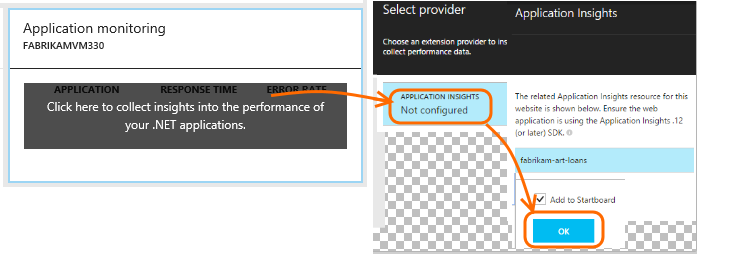
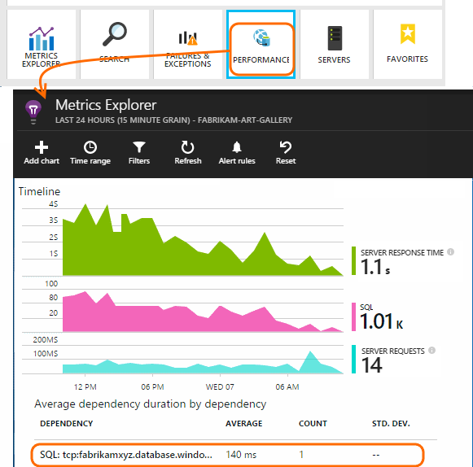

<properties
	pageTitle="Monitor Azure web app performance | Microsoft Azure"
	description="Chart load and response time, dependency information and set alerts on performance."
	services="azure-portal"
    documentationCenter="na"
	authors="alancameronwills"
	manager="douge"/>

<tags
	ms.service="azure-portal"
	ms.workload="na"
	ms.tgt_pltfrm="na"
	ms.devlang="na"
	ms.topic="article"
	ms.date="07/28/2016"
	ms.author="awills"/>

# Monitor Azure web app performance

In the [Azure Portal](https://portal.azure.com) you can set up monitoring to collect the  statistics and details on the application dependencies in your [Azure web apps](../app-service-web/app-service-web-overview.md) or [virtual machines](../virtual-machines/virtual-machines-linux-about.md).

Azure supports Application Performance Monitoring (APM) by leveraging extensions. These extensions are installed into your application and collect the data and report back to the monitoring services.

**Application Insights** and **New Relic** are two of the performance monitoring extensions that are available. To use them, you install an agent at runtime. With Application Insights, there's also the option to build your code with an SDK. The SDK lets you write code to monitor the usage and performance of your app in more detail.

## Application Insights

### (Optional) Rebuild the app with the SDK...

Application Insights can provide more detailed telemetry by installing an SDK into your app.

In Visual Studio (2013 update 2 or later), add the Application Insights SDK to your project.

If you're asked to sign in, use the credentials for your Azure account.

The operation has two effects:

1. Creates an Application Insights resource in Azure, where telemetry is stored, analyzed and displayed.
2. Adds the Application Insights NuGet package to your code, and configures it to send telemetry to the Azure resource.

You can test the telemetry by running the app in your development machine (F5), or you can just go ahead and republish the app.

The SDK provides an API so that you can [write custom telemetry](../application-insights/app-insights-api-custom-events-metrics.md) to track usage.

### ...or set up a resource manually

If you didn't add the SDK in Visual Studio, you must set up the Application Insights resource in Azure, where telemetry is stored, analyzed and displayed.

## Enable an extension

1. Browse to the control blade of the web app or virtual machine you would like to instrument.

2. Add the Application Insights or the New Relic extension.

    If you're instrumenting a web app:

Or if you're using a virtual machine:

## Explore the data

1. Open the Application Insights resource (either directly from Browse, or from the Performance Monitoring tool of the web app).

2. Click through any chart to get more detail:

    

    You can [customize metrics blades](../application-insights/app-insights-metrics-explorer.md).

3. Click through further to see individual events and their properties:

    

    Notice the "..." link to open all properties.

    You can [customize searches](../application-insights/app-insights-diagnostic-search.md).

For more powerful searches over your telemetry, use the [Analytics query language](../application-insights/app-insights-analytics-tour.md).

## Q & A

How do I change to send data to a different Application Insights resource?

* *If you added Application Insights to your code in Visual Studio:* Right-click the project, choose **Application Insights > Configure** and choose the resource you want. You get the option to create a new resource. Rebuild and redeploy.
* *Otherwise:* In Azure, open the web app control blade, and open **Tools > Extensions**. Delete the Application Insights extension. Then open **Tools > Performance**, 'click here', choose Application Insights, and then the resource that you want. (If you want to create a new Application Insights resource, do that first.)

## Next steps

* [Monitor service health metrics](insights-how-to-customize-monitoring.md) to make sure your service is available and responsive.
* [Enable monitoring and diagnostics](insights-how-to-use-diagnostics.md) to collect detailed high-frequency metrics on your service.
* [Receive alert notifications](insights-receive-alert-notifications.md) whenever operational events happen or metrics cross a threshold.
* Use [Application Insights for JavaScript apps and web pages](../application-insights/app-insights-web-track-usage.md) to get client telemetry from the browsers that visit a web page.
* [Set up Availability web tests](../application-insights/app-insights-monitor-web-app-availability.md) to be alerted if your site is down.
