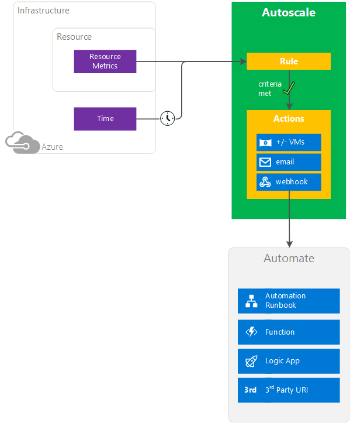

<properties
	pageTitle="Overview of autoscale in Microsoft Azure Compute | Microsoft Azure"
	description="Overview of autoscaling in Microsoft Azure. Applies to Virtual Machines, Cloud Services and Web Apps."
	authors="rboucher"
	manager=""
	editor=""
	services="monitoring-and-diagnostics"
	documentationCenter="monitoring-and-diagnostics"/>

<tags
	ms.service="monitoring-and-diagnostics"
	ms.workload="na"
	ms.tgt_pltfrm="na"
	ms.devlang="na"
	ms.topic="article"
	ms.date="08/30/2016"
	ms.author="robb"/>

# Overview of autoscale in Microsoft Azure Compute

This article describes what Microsoft Azure autoscaling is, its benefits, and starts you on the path to using it. 

Azure Insights autoscaling applies only to 

* [Cloud Services](https://azure.microsoft.com/services/cloud-services/)
* [Virtual Machine Scale Sets](https://azure.microsoft.com/services/virtual-machine-scale-sets/)
* [App Service - Web Apps](https://azure.microsoft.com/services/app-service/web/) 
 
Azure has two autoscaling methods. The older technology works with availability sets while the newer with Virtual Machine Scale Sets (VMSS).   

>[AZURE.NOTE] An older version of autoscaling applies to Virtual Machines (Availability sets). This feature has limited support and we recommend migrating to VM Scale Sets for faster and more reliable autoscaling support.

## What is autoscaling 

Autoscaling allows you to have the right amount of resources running to handle the load on your application without wasting money due to resources sitting idle. It allows you to add or remove compute resources automatically based on a set of rules. Figure 1 shows this concept. 

**Figure 1: Autoscaling concept explained**

Autoscaling only scales "out" and "in", that is, it refers to an increase or decrease in the number of VM instances.  This is more flexible in a cloud situation, giving you access to potentially hundreds of VMs. The other type of scaling goes "up and down". That refers to keeping the same number of VMs, but making the VM more or less powerful (more or less memory, CPU speed, disk space, etc).  This is typically limited by the hardware the VM is running on. 

Autoscaling requires you to create rules about when to scale resources out or in. Criteria you can set to control scale actions include 

* **Minimum** and **maximum** number of instances to run. A minimum to make sure your application is always running and a maximum to control your costs.
* **Rule or condition** for autoscaling. It can be a metric or schedule based scaling. 
* **Cool down time**, which is the amount of time to wait after an autoscale event before allowing another autoscale event to occur. This period of time is to protect against a state called "flapping", which occurs when VMs are rapidly added and removed over minutes of time. There is a cost start or stop a VM. Flapping doesn't save cost and the VM being started and stopped can't do any useful processing, so it's worse than just leaving the VM running.    

   
The full list of configurable values is available in the [Autoscale REST API](https://msdn.microsoft.com/library/dn931928.aspx)

## Conceptual Diagram  
Figure 2 shows a conceptual overview of autoscaling followed by an explanation of the parts of diagram. 

**Figure 2: Autoscaling process overview** 

## Resource Metrics 
Resources emit metrics, which are later processed by rules. Metrics come via different methods.
VM Scale Sets uses telemetry data from Azure diagnostics agents whereas telemetry for Web apps and Cloud services comes directly from the Azure Infrastructure. Some commonly used statistics include CPU Usage, memory usage, thread counts, queue length, and disk usage. For a list of what telemetry data you can use, see [Autoscale Common Metrics](insights-autoscale-common-metrics.md). 

 
## Time
Schedule-based rules are based on UTC. You have to set your time zone properly when setting up your rules.  

## Autoscale Rules
The diagram shows only one autoscale rule, but you can have many of them. You can create complex overlapping rules as needed for your situation.  Rule types include  
 
 - **Metric-based** - For example, do this action when CPU usage is above 50%. 
 - **Time-based** - For example, trigger a webhook every 8am on Saturday in a given time zone.

 
## Autoscale Actions and Automation

Rules can trigger one or more types of actions.

- **Scale** - Scale VMs in or out
- **Email** - Send email to admins and co-admins of a subscription, and to additional email address you specify
- **Automate via webhooks** - Call webhooks, which can trigger multiple complex actions inside or outside Azure. Inside Azure, you can start an Azure Automation runbook, Azure Function, or Azure Logic App. Example 3rd party URL outside Azure include services like Slack and Twilio. 

## Resource Manager Rules Details

Autoscaling rules have the following structure in an Azure Resource Manager template. 

You can list multiple profiles.  Each profile can have multiple rules. Notification methods and locations (for example, a webhook and the URI or emails and the email addresses) are included after your profiles.  

For code examples, see

* [Advanced Autoscale configuration using Resource Manager templates for VM Scale Sets](insights-advanced-autoscale-virtual-machine-scale-sets.md)  
* [Autoscaling REST API](https://msdn.microsoft.com/library/dn931953.aspx) 

## Methods of Access 
You can set up autoscale rules via 

- Azure Portal
- PowerShell 
- Common Library Interface (CLI)
- Insights REST API

## Autoscaling Walkthroughs

- [Scaling Cloud Services](../cloud-services/cloud-services-how-to-scale-portal.md)
- [Scaling Web Apps](insights-how-to-scale.md)
- [Scaling Classic Virtual Machine Availability Sets](https://blogs.msdn.microsoft.com/kaevans/2015/02/20/autoscaling-azurevirtual-machines/)
- [Scaling VM Scale Sets in Windows](../virtual-machine-scale-sets/virtual-machine-scale-sets-windows-autoscale.md)
- [Scaling VM Scale Sets in Linux](../virtual-machine-scale-sets/virtual-machine-scale-sets-linux-autoscale.md)
- [Advanced Autoscale configuration using Resource Manager templates for VM Scale Sets](insights-advanced-autoscale-virtual-machine-scale-sets.md) 

## Next steps

Use one of the Autoscale Walkthroughs listed previously or refer to these other resources to learn more about autoscaling.  

- [Azure Insights autoscaling common metrics](insights-autoscale-common-metrics.md)
- [Best practices for Azure Insights autoscaling](insights-autoscale-best-practices.md)
- [Use autoscale actions to send email and webhook alert notifications](insights-autoscale-to-webhook-email.md)
- [Autoscaling REST API](https://msdn.microsoft.com/library/dn931953.aspx) - See the entire API and meanings for each of the fields and values
* >>>> ADD Link to VM Scale Sets up and down.

