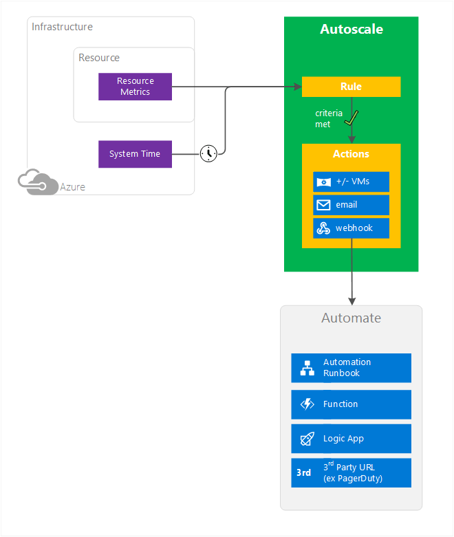
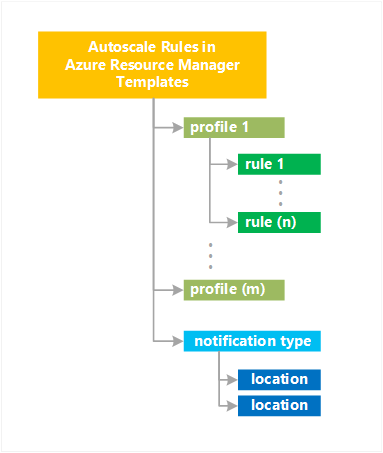

<properties
	pageTitle="Overview of autoscale in Microsoft Azure | Microsoft Azure"
	description="Overview of about autoscaling in Microsoft Azure"
	authors="rboucher"
	manager=""
	editor=""
	services="monitoring-and-diagnostics"
	documentationCenter="monitoring-and-diagnostics"/>

<tags
	ms.service="monitoring-and-diagnostics"
	ms.workload="na"
	ms.tgt_pltfrm="na"
	ms.devlang="na"
	ms.topic="article"
	ms.date="08/30/2016"
	ms.author="robb"/>

# Overview of autoscale in Microsoft Azure

This article describes what Microsoft Azure autoscaling is, its benefits, and starts you on the path to using it. 

Azure Insights autoscaling applies only to 

* Cloud Services
* Virtual Machines 
* Web apps 
 
All other Azure services use other methods of scaling. Azure has two autoscaling methods. The older technology works with availability sets while the newer with Virtual Machine Scale Sets (VMSS).   

## What is autoscaling 

Autoscaling allow you to ensure that you have just the right amount of resources running to handle the load on your application without wasting money due to resources sitting idle. Autoscaling allows you to add or remove compute resources automatically based on a set of rules.   Figure 1 shows this concept. 

**Figure 1: Autoscaling concept explained**

Autoscaling requires you to create rules about when to scale resources up or down. Criteria you can set to control scale actions include 

* **minimum** and **maximum** number of instances to run. A minimum to make sure your application is always running and a maximum to control your costs. 
* **cool down time**, which is the amount of time to wait after an autoscale event before allowing another autoscale event to occur. This period of time is to protect against something called "flapping", which occurs when VMs are rapidly added and removed over minutes of time. There is a cost start or stop a VM. Flapping doesn't save cost and the VM being started and stopped can't do any useful processing so it's worse then just leaving the VM running.    
* **granularity** of the monitoring the metric.  You can go from a minimum of 1 minute on up, but certain resources may not deliver that level of granularity. You can discover the granularity of each resource programmatically using the [Azure Insights Metrics REST API](https://msdn.microsoft.com/library/dn931939.aspx). 
   
The full list of configurable values is available in the [Autoscale REST API](https://msdn.microsoft.com/library/dn931928.aspx)

## Conceptual Diagram  
Figure 2 below shows a conceptual overview of autoscaling followed by and explanation 

**Figure 2: Autoscaling process overview** 

## Resource Metrics 
Resources emit metrics, which are later processed by rules. Metrics come via different methods.
Cloud services and VM Scale Sets use telemetry data from Azure diagnostics agents whereas telemetry for Web apps comes directly from the Azure Infrastructure. Some commonly used statistics include CPU Usage, memory usage, thread counts, queue length, and disk usage. For a list of what telemetry data you can use, see [Autoscale Common Metrics](insights-autoscale-common-metrics.md). Some data is gathered by default and other types you must tell the system to gather. 

You can also use the Azure Diagnostics SDK and write custom code to create custom metrics, which you can then use to trigger rules.
 
## System Time
Schedule-based rules are triggered using the system time of the virtual machine where the rules are running. 

## Autoscale Rules
The diagram shows only one autoscale rule, but you can have many of them. You can create complex overlapping rules as needed for your situation.  Rule types include  
 
 - **Metric-based** - For example, do this action when CPU usage is above 50%. 
 - **Time-based** - For example, trigger a webhook every 8am on Saturday.

With custom code, you can also write rules that use both metric data and system time in some combination to fire a custom trigger.  

Azure checks rule conditions every 5 minutes. 
 
## Autoscale Actions and Automation

Rules can trigger one or more types of actions.

- **Scale** - Scale VMs up or down
- **Email** - Send email to admins and co-admins of a subscription, and to additional email address you specify
- **Automate via webhooks** - Call webhooks which can trigger multiple complex actions inside or outside Azure. Inside Azure, you can start an Azure Automation runbook, Azure Function, or Azure Logic App. Example 3rd party URL outside Azure include services like Slack and Twilio. 

## Resource Manager Rules Details

Autoscaling rules have the following structure in an Azure Resource Manager template. 

You can list multiple profiles.  Each profile can have multiple rules. After all your profiles Afterwards the various methods of notification are listed

For code examples, see

* [Advanced Autoscale configuration using Resource Manager templates for VM Scale Sets](insights-advanced-autoscale-virtual-machine-scale-sets.md)  
* [Autoscaling REST API](https://msdn.microsoft.com/library/dn931953.aspx) 

## Methods of Access 
You can set up autoscale rules via 

- Azure Portal
- PowerShell 
- Common Library Interface (CLI)
- Insights REST API

## Next steps

Read more about autoscaling

* [Azure Insights autoscaling common metrics](insights-autoscale-common-metrics.md)
* [Best practices for Azure Insights autoscaling](insights-autoscale-best-practices.md)
* [Use autoscale actions to send email and webhook alert notifications](insights-autoscale-to-webhook-email.md)
* [Advanced Autoscale configuration using Resource Manager templates for VM Scale Sets](insights-advanced-autoscale-virtual-machine-scale-sets.md) 
* [Autoscaling REST API](https://msdn.microsoft.com/library/dn931953.aspx) - See the entire API and meanings for each of the fields and values

