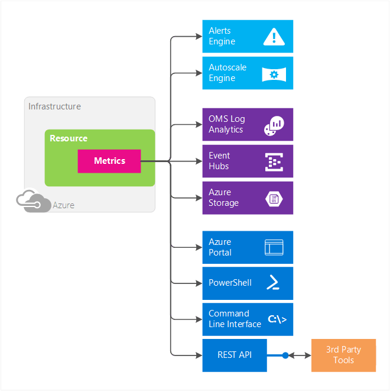

<properties
	pageTitle="Overview of metrics in Microsoft Azure | Microsoft Azure"
	description="Overview of metrics and their uses in Microsoft Azure"
	authors="kamathashwin"
	manager=""
	editor=""
	services="monitoring-and-diagnostics"
	documentationCenter="monitoring-and-diagnostics"/>

<tags
	ms.service="monitoring-and-diagnostics"
	ms.workload="na"
	ms.tgt_pltfrm="na"
	ms.devlang="na"
	ms.topic="article"
	ms.date="09/26/2016"
	ms.author="ashwink"/>

# Overview of metrics in Microsoft Azure 

This article describes what metrics are in Microsoft Azure, their benefits, and how to get started using them.  

## What are metrics?

Azure Monitor enables you to consume telemetry to gain visibility into the performance and health of your workloads on Azure. The most important type of Azure telemetry data are the metrics (also called performance counters) emitted by most Azure resources. Azure Monitor provides several ways to configure and consume these metrics for monitoring and troubleshooting.

## What can you do with Metrics?

Metrics are a valuable source of telemetry and allow you to do the following:

- **Track the performance** of your resource (such as a VM, Website, or Logic App) by plotting its metrics on a portal chart and pinning that chart to a dashboard.
- **Get notified of an issue** impacting the performance of your resource when a metric crosses a certain threshold.
- **Configure automated actions**, such as autoscaling a resource or firing a runbook when a metric crosses a certain threshold.
- **Perform advanced analytics** or reporting on performance or usage trends of your resource(s).
- **Archive** the performance or health history of your resource **for compliance/auditing** purposes.

##  Metric Characteristics
Metrics have the following characteristics:

- All metrics have **1-minute frequency**. You receive a metric value every minute from your resource, giving you near real-time visibility into the state and health of your resource.
- Metrics are **available out-of-the-box without needing to opt in** or setting up additional diagnostics.
- You can access **30 days of history** for each metric. You can quickly look at the recent and monthly trends in the performance or health of your resource.

You can:

- Easily discover, access, and **view all metrics** via the Azure portal when you select a resource and plot them on a chart. 
- Configure a metric **alert rule that sends a notification or takes automated action** when the metric crosses the threshold you have set. Autoscale is a special automated action that allows you to scale out your resource to meet the incoming requests or load on your web site or compute resources. You can configure an Autoscale setting rule to scale out/in based on a metric crossing a threshold.
- **Archive** metrics for longer or use them for offline reporting. You can route your metrics to blob storage when you configure diagnostic settings for your resource.
- **Stream** metrics to an Event Hub, enabling you to then route them to Azure Stream Analytics or custom apps for near-real time analysis. You can do the using diagnostic settings.
- **Route** all metrics to OMS Log Analytics to unlock instant analytics, search, and custom alerting on metrics data from your resources.
- **Consume** the metrics via new Azure Monitor REST APIs.
- **Query** metrics using the PowerShell Cmdlets or Cross-Platform REST API.

 

## Access metrics via portal
Here is a quick walkthrough of creating a metric chart via Azure portal

### View metrics after creating a resource
1. Open Azure portal
2. Create a new App Service - Web Site.
3. After you create a website, go to the Overview blade of the web site.
4. You can view new metrics as a 'Monitoring' tile. You can Edit the tile and select more metrics

 	

### Access all metrics in a single place
1. Open the Azure portal 
2. Navigate to the new Monitor tab and select the Metrics option under it 
3. You can select your subscription, resource group, and the name of the resource from the drop-down list. 
4. You can now view the available metrics list. 
5. Select the metric you are interested in and plot it. 
6. You can pin it to the dashboard by clicking on the pin on the top-right corner.

 	

>[AZURE.NOTE] You can access host-level metrics from VMs (Azure Resource Manager based) and VM Scale Sets without any additional diagnostic setup. These new host-level metrics are available for Windows and Linux instances. These metrics are not to be confused with the Guest-OS level metrics that you have access to when you turn on Azure Diagnostics on your VMs or VMSS. To learn more about configuring Azure Diagnostics, see [What is Microsoft Azure Diagnostics](../azure-diagnostics.md).

## Access metrics via REST API
Azure Metrics can be accessed via Azure Monitor APIs. There are two APIs that help you discover and access metrics. Use the: 

- [Azure Monitor Metric definitions REST API](https://msdn.microsoft.com/library/mt743621.aspx) to access the list of metrics available for a service.
- [Azure Monitor Metrics REST API](https://msdn.microsoft.com/library/mt743622.aspx) to access the actual metrics data

>[AZURE.NOTE] This article covers the metrics via the [new API for metrics](https://msdn.microsoft.com/library/dn931930.aspx) for Azure resources. The API version for the new metric definitions API is 2016-03-01 and the version for metrics API is 2016-09-01. The legacy metric definitions and metrics can be accessed with the api-version 2014-04-01.

For a more detailed walkthrough using the Azure Monitor REST APIs, see [Azure Monitor REST API Walkthrough](monitoring-rest-api-walkthrough.md).

## Export options for metrics
You can go to the Diagnostics logs blade under the Monitor tab and view the export options for metrics. You can select metrics (and diagnostic logs) to be routed to Blob Storage, Event Hubs or to OMS Log Analytics for use-cases mentioned previously in this article. 

 	

You can configure this via Resource Manager templates, [PowerShell](insights-powershell-samples.md), [CLI](insights-cli-samples.md) or [REST APIs](https://msdn.microsoft.com/library/dn931943.aspx). 

## Take Action on Metrics
You can receive notifications or take automated actions on metric data. You can configure Alert rules or Autoscale settings to do so.

### Alert Rules
You can configure alert rules on metrics. These alert rules can check if a metric has crossed a certain threshold and notify you via email or fire a webhook that can then be used to execute any custom script. You can also use the webhook to configure 3rd product integrations.

 

### Autoscale
Some Azure resources support multiple instances to scale out or in to handle your workloads. Autoscale applies to App Services (Web apps), Virtual Machine Scale Sets (VMSS) and classic Cloud Services. You can configure autoscale rules to scale out or in when a certain metric impacting your workload crosses a threshold you specify. For more information, see [Overview of autoscaling](monitoring-overview-autoscale.md).

 

## Supported Services and Metrics
Azure Monitor is a new metrics infrastructure. It provides support for the following Azure services in the Azure portal and the new version of the Azure Monitor API:

- VMs (Azure Resource Manager based)
- VM Scale Sets
- Batch
- Event Hub namespace 
- Service Bus namespace (premium SKU only)
- SQL (version 12)
- Elastic SQL Pool
- Web Sites
- Web Server Farms
- Logic Apps
- IoT Hubs
- Redis Cache
- Networking: Application Gateways
- Search

You can view a a detailed list of all the supported services and their metrics at [Azure Monitor metrics - supported metrics per resource type](monitoring-supported-metrics.md). 

## Next steps

Refer to the links throughout this article. Additionally, learn:  

- about [common metrics for autoscaling](insights-autoscale-common-metrics.md)
- how to [create alert rules](insights-alerts-portal.md)

