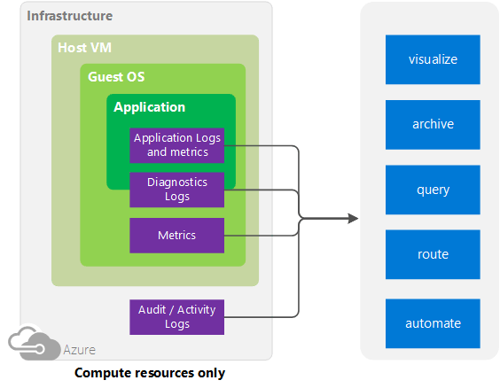

<properties
	pageTitle="Overview of Monitoring in Microsoft Azure | Microsoft Azure"
	description="Top level overview of monitoring and diagnostics in Microsoft Azure including alerts, webhooks, autoscale and more."
	authors="rboucher"
	manager=""
	editor=""
	services="monitoring-and-diagnostics"
	documentationCenter="monitoring-and-diagnostics"/>

<tags
	ms.service="monitoring-and-diagnostics"
	ms.workload="na"
	ms.tgt_pltfrm="na"
	ms.devlang="na"
	ms.topic="article"
	ms.date="09/06/2016"
	ms.author="robb"/>

# Overview of Monitoring in Microsoft Azure

This article provides a conceptual overview of monitoring Azure resources and pointers to more information on specific types of resources.  For high-level information on monitoring your application from non-Azure point of view, see [Monitoring and diagnostics guidance](../best-practices-monitoring.md).

Cloud applications are complex with many moving parts. Monitoring provides data to ensure that your application stays up and running in a healthy state. It also helps you to stave off potential problems or troubleshoot past ones. In addition, you can use monitoring data to gain deep insights about your application. Those insights may help you to improve its performance or maintainability, or to automate some actions that would otherwise require manual intervention.

The following diagram shows a conceptual view of Azure monitoring, including the type of logs you can collect and what you can do with that data.   

Figure 1: Conceptual Model for monitoring and diagnostics for non-compute resources

 

Figure 2: Conceptual Model for monitoring and diagnostics for compute resources

## Monitoring Sources
### Infrastructure Activity Logs
You can search the Audit log (sometimes called Operational or Activity Logs) for information about your resource as seen by the Azure infrastructure. The log contains information such as times when resources are created or destroyed.  

### Host VM
**Compute Only**

You cannot currently collect metrics on the Host VM, but it is listed here for completeness.

Some compute resources like Cloud Services, Virtual Machines, and Service Fabric have a dedicated Host VM they interact with. The Host VM is the equivalent of Root VM in the Hyper-V hypervisor model.

For other Azure services, there is not necessarily a 1:1 mapping between your resource and a particular Host VM.

### Resource - Metrics and Diagnostics Logs
Collectable metrics vary based on the resource type. For example, Virtual Machines provides statistics on the Disk IO and Percent CPU. But those stats don't exist for a Service Bus queue, which instead provides metrics like queue size and message throughput.

For compute resources you can obtain metrics on the Guest OS and diagnostics modules like Azure Diagnostics. Azure Diagnostics helps gather and route gather diagnostic data to other locations, including Azure storage.

### Application - Diagnostics Logs, Application Logs, and Metrics
**Compute Only**

Applications can run on top of the Guest OS in the compute model. They emit their own set of logs and metrics.

Types of metrics include

- Performance counters
- Application Logs
- Windows Event Logs
- .NET Event Source
- IIS Logs
- Manifest based ETW
- Crash Dumps
- Customer Error Logs

## Uses for Monitoring Data

### Visualize
Visualizing your monitoring data in graphics and charts helps you find trends far more quickly than looking through the data itself.  

A few vizualization methods include:

- Use the Azure portal
- Route data to Azure Application Insights
- Route data to Microsoft PowerBI
- Route the data to a 3rd party visualization tool using either live streaming or by having the tool read from an archive in Azure storage

### Archive
Monitoring data is typically written to Azure storage and kept there until you delete it.

A few ways to use this data:

- Once written, you can have other tools within or outside of Azure read it and process it.
- You download the data locally for a local archive or change your retention policy in the cloud to keep data for extended periods of time.  
- You leave the data in Azure storage indefinitely. Note that you have to pay for Azure storage based on the amount of data you keep.

### Query
You can use the Insights REST API, Common Language Interface (CLI) commands, PowerShell cmdlets, or the .NET SDK to access the data in the system or Azure storage

Examples include:

-  Getting data for a custom monitoring application you have written
-  Creating custom queries and sending that data to a 3rd party application.

### Route
You can stream monitoring data to other locations in real time.

Examples include:

- Send to Application Insights so you can use the visualization tools there.
- Send to Event Hubs so you can route to 3rd party tools to perform real-time analysis.

### Automate
You can use monitoring data to trigger events or even whole processes
Examples include:

- Use data to autoscale compute instances up or down based on application load.
- Send emails when a metric crosses a predetermined threshold.
- Call a web URL (webhook) to execute an action in a system outside of Azure
- Start a runbook in Azure automation to perform any variety of tasks

## Methods of Use
In general, you can manipulate data tracking, routing, and retrieval using one of the following methods. Not all methods are available for all actions or data types.

- [Azure portal](https://portal.azure.com)
- [PowerShell](insights-powershell-samples.md)  
- [Cross-platform Command Line Interface (CLI)](insights-cli-samples.md)
- [REST API](https://msdn.microsoft.com/library/dn931943.aspx)
- [.NET SDK](https://msdn.microsoft.com/library/dn802153.aspx)

## Azure’s Monitoring Offerings
Azure has offerings available for monitoring your services from bare-metal infrastructure to application telemetry. The best monitoring strategy combines use of all three to gain comprehensive, detailed insight into the health of your services.

- [Azure Insights (Platform) Monitoring](http://aka.ms/azmondocs) – Offers visualization, query, routing, alerting, autoscale, and automation on data both from the Azure infrastructure (Activity Log) and each individual Azure resource (Diagnostic Logs). This article is part of the Azure Insights documentation.
- [Application Insights](https://azure.microsoft.com/documentation/services/application-insights/) – Provides rich detection and diagnostics for issues at the application layer of your service, well-integrated on top of data from Azure Monitoring.
- [Log Analytics](https://azure.microsoft.com/documentation/services/log-analytics/) part of [Operations Management Suite](https://www.microsoft.com/cloud-platform/operations-management-suite) – Provides a holistic IT management solution for both on premise and cloud-based infrastructure, including log search and analytics from your Azure resources.  

## Next steps
Learn more about

- [Azure Insights](http://aka.ms/azmondocs) by exploring the links in the TOC to the left and the videos at this link.
- [Azure Diagnostics](../azure-diagnostics.md) if you are attempting to diagnose problems in your Cloud Service, Virtual Machine, or Service Fabric application.
- [Application Insights](https://azure.microsoft.com/documentation/services/application-insights/) if you are trying to diagnostic problems in your App Service Web app.
- [Troubleshooting Azure Storage](../storage/storage-e2e-troubleshooting.md) when using Storage Blobs, Tables, or Queues
- [Log Analytics](https://azure.microsoft.com/documentation/services/log-analytics/) and the [Operations Management Suite](https://www.microsoft.com/cloud-platform/operations-management-suite)
