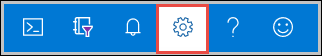
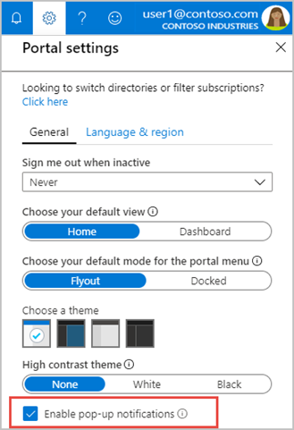
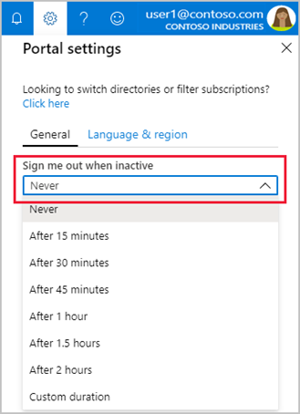
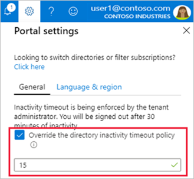
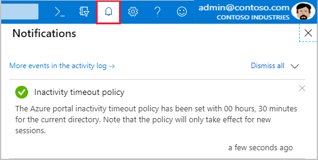

# Manage Azure portal settings and preferences (older version)

You can change the default settings of the Azure portal to meet your own preferences. 

> [!IMPORTANT]
> We're in the process of moving all Azure users to a newer experience. This topic describes the older experience. For the latest information, see [Manage Azure portal settings and preferences](set-preferences.md).

Most settings are available from the **Settings** menu in the global page header.

## Choose your default subscription

You can change the subscription that opens by default when you sign-in to the Azure portal. This is helpful if you have a primary subscription you work with but use others occasionally. 

:::image type="content" source="media/original-preferences/filter-subscription-default-view.png" alt-text="Filter resource list by subscription.":::

1. Select the directory and subscription filter icon in the global page header.

1. Select the subscriptions you want as the default subscriptions when you launch the portal. 

    :::image type="content" source="media/original-preferences/default-directory-subscription-filter.png" alt-text="Select the subscriptions you want as the default subscriptions when you launch the portal."::: 

## Choose your default view 

You can change the page that opens by default when you sign in to the Azure portal.

- **Home** can't be customized.  It displays shortcuts to popular Azure services and lists the resources you've used most recently. We also give you useful links to resources like Microsoft Learn and the Azure roadmap.

- Dashboards can be customized to create a workspace designed just for you. For example, you can build a dashboard that is project, task, or role focused. If you select **Dashboard**, your default view will go to your most recently used dashboard. For more information, see [Create and share dashboards in the Azure portal](azure-portal-dashboards.md).

## Choose a portal menu mode

The default mode for the portal menu controls how much space the portal menu takes up on the page.

- When the portal menu is in **Flyout** mode, it's hidden until you need it. Select the menu icon to open or close the menu.

- If you choose **Docked mode** for the portal menu, it's always visible. You can collapse the menu to provide more working space.

## Choose a theme or enable high contrast

The theme that you choose affects the background and font colors that appear in the Azure portal. You can select from one of four preset color themes. Select each thumbnail to find the theme that best suits you.

Alternatively, you can choose one of the high-contrast themes. The high contrast themes make the Azure portal easier to read for people who have a visual impairment; they override all other theme selections.

## Enable or disable pop-up notifications

Notifications are system messages related to your current session. They provide information like your current credit balance, when resources you just created become available, or confirm your last action, for example. When pop-up notifications are turned on, the messages briefly display in the top corner of your screen. 

To enable or disable pop-up notifications, select or clear **Enable pop-up notifications**.

To read all notifications received during your current session, select **Notifications** from the global header.

If you want to read notifications from previous sessions, look for events in the Activity log. For more information, see [View the Activity log](../azure-monitor/essentials/activity-log.md#view-the-activity-log). 

## Change the inactivity timeout setting

The inactivity timeout setting helps to protect resources from unauthorized access if you forget to secure your workstation. After you've been idle for a while, you're automatically signed out of your Azure portal session. As an individual, you can change the timeout setting for yourself. If you're an admin, you can set it at the directory level for all your users in the directory.

### Change your individual timeout setting (user)

Select the drop-down under **Sign me out when inactive**. Choose the duration after which your Azure portal session is  signed out if you're idle.

The change is saved automatically. If you're idle, your Azure portal session will sign out after the duration you set.

If your admin has enabled an inactivity timeout policy, you can still set your own, as long as it's less than the directory-level setting. Select **Override the directory inactivity timeout policy**, then set a time interval.

### Change the directory timeout setting (admin)

Admins in the [Global Administrator role](../active-directory/roles/permissions-reference.md#global-administrator) can enforce the maximum idle time before a session is signed out. The inactivity timeout setting applies at the directory level. The setting takes effect for new sessions. It won't apply immediately to any users who are already signed in. For more information about directories, see [Active Directory Domain Services Overview](/windows-server/identity/ad-ds/get-started/virtual-dc/active-directory-domain-services-overview).

If you're a Global Administrator, and you want to enforce an idle timeout setting for all users of the Azure portal, follow these steps:

1. Select the link text **Configure directory level timeout**.

    

1. On the **Configure directory level inactivity timeout** page, select **Enable directory level idle timeout for the Azure portal** to turn on the setting.

1. Next, enter the **Hours** and **Minutes** for the maximum time that a user can be idle before their session is automatically signed out.

1. Select **Apply**.

    

To confirm that the inactivity timeout policy is set correctly, select **Notifications** from the global page header. Verify that a success notification is listed.

## Restore default settings

If you've made changes to the Azure portal settings and want to discard them, select **Restore default settings**. Any changes you've made to portal settings will be lost. This option doesn't affect dashboard customizations.

## Export user settings

Information about your custom settings is stored in Azure. You can export the following user data:

* Private dashboards in the Azure portal
* User settings like favorite subscriptions or directories, and last logged-in directory
* Themes and other custom portal settings

It's a good idea to export and review your settings if you plan to delete them. Rebuilding dashboards or redoing settings can be time-consuming.

To export your portal settings, select **Export all settings**.

Exporting settings creates a *.json* file that contains your user settings like your color theme, favorites, and private dashboards. Due to the dynamic nature of user settings and risk of data corruption, you can't import settings from the *.json* file.

## Delete user settings and dashboards

Information about your custom settings is stored in Azure. You can delete the following user data:

* Private dashboards in the Azure portal
* User settings like favorite subscriptions or directories, and last logged-in directory
* Themes and other custom portal settings

It's a good idea to export and review your settings before you delete them. Rebuilding dashboards or redoing custom settings can be time-consuming.

[!INCLUDE [GDPR-related guidance](../../includes/gdpr-intro-sentence.md)]

To delete your portal settings, select **Delete all settings and private dashboards**.

## Change language and regional settings

There are two settings that control how the text in the Azure portal appears: 
- The **Language** setting controls the language you see for text in the Azure portal. 

- **Regional format** controls the way dates, time, numbers, and currency are shown.

To change the language that is used in the Azure portal, use the drop-down to select from the list of available languages.

The regional format selection changes to display regional options for only the language you selected. To change that automatic selection, use the drop-down to choose the regional format you want.

For example, if you select English as your language, and then select United States as the regional format, currency is shown in U.S. dollars. If you select English as the language and then select Europe as the regional format, currency is shown  in euros.

Select **Apply** to update your language and regional format settings.

   

>[!NOTE]
>These language and regional settings affect only the Azure portal. Documentation links that open in a new tab or window use your browser's language settings to determine the language to display.
>

## Next steps

- [Keyboard shortcuts in Azure portal](azure-portal-keyboard-shortcuts.md)
- [Supported browsers and devices](azure-portal-supported-browsers-devices.md)
- [Add, remove, and rearrange favorites](azure-portal-add-remove-sort-favorites.md)
- [Create and share custom dashboards](azure-portal-dashboards.md)
- [Azure portal how-to video series](azure-portal-video-series.md)
