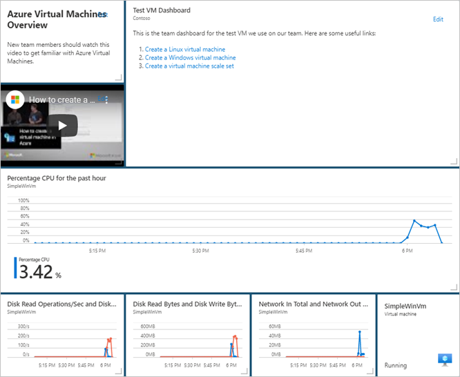

# Quickstart: Create an Azure portal dashboard with Azure CLI

A dashboard in the Azure portal is a focused and organized view of your cloud resources.

[!INCLUDE [azure-cli-prepare-your-environment.md](../../includes/azure-cli-prepare-your-environment.md)]

If you have multiple Azure subscriptions, choose the appropriate subscription in which the resources
should be billed. Select a specific subscription using the [az account set](/cli/azure/account#az_account_set) command:

   ```azurecli
   az account set --subscription 00000000-0000-0000-0000-000000000000
   ```

Create an [Azure resource group](../azure-resource-manager/management/overview.md)
by using the [az group create](/cli/azure/group#az_group_create)
command:

   ```azurecli
   az group create --name myResourceGroup --location centralus
   ```

A resource group is a logical container in which Azure resources are deployed and managed as
a group.


## Create a virtual machine

The password must be complex. This is a new user
name and password; it's not, for example, the account you use to sign in to Azure. For more
information, see [username requirements](../virtual-machines/windows/faq.md#what-are-the-username-requirements-when-creating-a-vm)
and [password requirements](../virtual-machines/windows/faq.md#what-are-the-password-requirements-when-creating-a-vm).

Create the VM.

az vm create --resource-group myResourceGroup --name SimpleWinVM --image win2016datacenter --admin-username azureuser --admin-password 1StrongPassword$

>[!Note] The VM deployment now starts and typically takes a few minutes to complete. After deployment
completes, move on to the next section.

## Download the dashboard template

Since Azure dashboards are resources, they can be represented as JSON. The following code downloads
a JSON representation of a sample dashboard. For more information, see [The structure of Azure Dashboards](./azure-portal-dashboards-structure.md).

Download the following dashboard: 'https://raw.githubusercontent.com/Azure/azure-docs-powershell-samples/master/azure-portal/portal-dashboard-template-testvm.json'


Customize the downloaded template by changing the following values to your values:

* `<subscriptionID>`: Your subscription
* `<rgName>`: Resource group, for example `myResourceGroup`
* `<vmName>`: Virual machine name, for example `SimpleWinVM`
* `<dashboardTitle>`: Dashboard title, for example `Simple VM Dashboard`
* `<location>`: Your Azure region, for example, `centralus`

For more information, see [Microsoft portal dashboards template reference](/azure/templates/microsoft.portal/dashboards).

## Deploy the dashboard template

You can use the [az portal dashboard create](/cli/azure/ext/portal/portal/dashboard#ext_portal_az_portal_dashboard_create) command to deploy the
template directly from the Azure CLI:

az portal dashboard create --resource-group myResourceGroup --name 'Simple VM Dashboard' --input-path portal-dashboard-template-testvm.json --location centralus

Check that the dashboard was created successfully by running the [az portal dashboard show](/cli/azure/ext/portal/portal/dashboard#ext_portal_az_portal_dashboard_show) command:

az portal dashboard show --resource-group myResourceGroup --name 'Simple VM Dashboard'

Verify that you can see data about the VM from within the Azure portal.

1. In the Azure portal, select **Dashboard**.

   

1. On the dashboard page, select **Simple VM Dashboard**.

   

1. Review the dashboard. You can see that some of the content is static, but there are also charts
   that show the performance of the VM.

   

## Clean up resources

To remove the VM and associated dashboard, delete the resource group that contains them.

> [!CAUTION]
> The following example deletes the specified resource group and all resources contained within it.
> If resources outside the scope of this article exist in the specified resource group, they will
> also be deleted.

```azurepowershell-interactive
Remove-AzResourceGroup -Name $resourceGroupName
```

## Next steps

For more information about the cmdlets contained in the Az.Portal PowerShell module, see:

> [!div class="nextstepaction"]
> [Microsoft Azure PowerShell: Portal Dashboard cmdlets](/powershell/module/Az.Portal/)