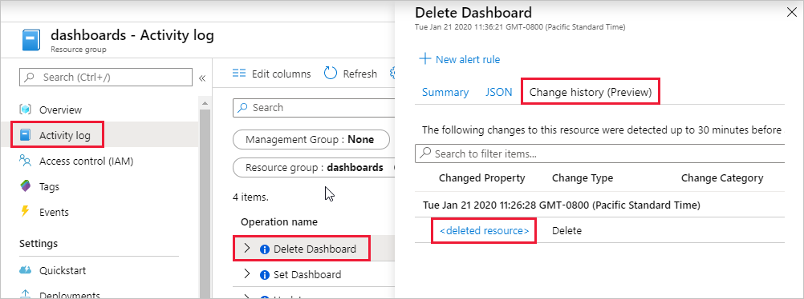
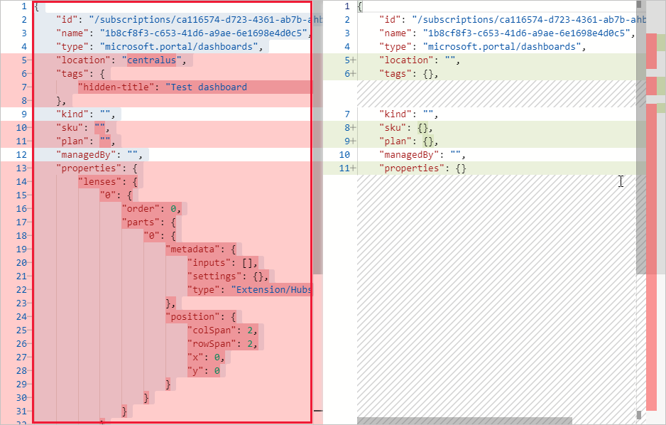

# Recover a deleted dashboard in the Azure portal

If you're in the global Azure cloud, and you delete a _published_ (shared) dashboard in the Azure portal, you can recover that dashboard within seven days of the delete.

> [!IMPORTANT]
> If you're in an Azure Government cloud, or if the dashboard isn't published, you can't recover a deleted dashboard.

Follow these steps to recover a published dashboard:

1. From the Azure portal menu, select **Resource groups**, then select the resource group where you published the dashboard. (The default resource group is named **dashboards**.)

1. Under **Activity log**, expand the **Delete Dashboard** operation. Select the **Change history** tab, then select **\<deleted resource\>**.

    

1. Select and copy the contents of the left pane, then save to a text file with a _.json_ file extension. The portal can use this JSON file to re-create the dashboard.

    

1. From the Azure portal menu, select **Dashboards**, then select **Upload**.

    :::image type="content" source="media/recover-shared-deleted-dashboard/dashboard-upload.png" alt-text="Screenshot of the Upload option in the Azure portal.":::

1. Select the JSON file you saved. The portal re-creates the dashboard with the same name and elements as the deleted dashboard.

1. Select **Share** to publish the dashboard and re-establish the appropriate access control.

    :::image type="content" source="media/recover-shared-deleted-dashboard/dashboard-share.png" alt-text="Screenshot of the Share option for dashboards in the Azure portal.":::
