<properties 
	pageTitle="Use Azure portal to manage Azure resources | Microsoft Azure" 
	description="Use Azure portal and Azure Resource Manage to manage your resources. Shows how to work with dashboards and tiles to monitor resources." 
	services="azure-resource-manager,azure-portal" 
	documentationCenter="" 
	authors="tfitzmac" 
	manager="timlt" 
	editor="tysonn"/>

<tags 
	ms.service="azure-resource-manager" 
	ms.workload="multiple" 
	ms.tgt_pltfrm="na" 
	ms.devlang="na" 
	ms.topic="article" 
	ms.date="06/10/2016" 
	ms.author="tomfitz"/>

# Manage Azure resources through portal

> [AZURE.SELECTOR]
- [Portal](azure-portal/resource-group-portal.md) 
- [Azure CLI](xplat-cli-azure-resource-manager.md)
- [Azure PowerShell](powershell-azure-resource-manager.md)
- [.NET](https://azure.microsoft.com/documentation/samples/resource-manager-dotnet-resources-and-groups/)
- [Java](https://azure.microsoft.com/documentation/samples/resources-java-manage-resource-group/)
- [Node](https://azure.microsoft.com/documentation/samples/resource-manager-node-resources-and-groups/)
- [Python](https://azure.microsoft.com/documentation/samples/resource-manager-python-resources-and-groups/)
- [Ruby](https://azure.microsoft.com/documentation/samples/resource-manager-ruby-resources-and-groups/)

This topic shows how to use the [Azure portal](https://portal.azure.com) with [Azure Resource Manager](../resource-group-overview.md) to manage your Azure resources. To learn about deploying resources through the portal, see [Deploy resources with Resource Manager templates and Azure portal](../resource-group-template-deploy-portal.md).

Currently, not every service supports the portal or Resource Manager. For those services, you will need to use the [classic portal](https://manage.windowsazure.com). For the status of each service, see [Azure portal availability chart](https://azure.microsoft.com/features/azure-portal/availability/).

<a id="access-control-for-azure-dashboards" />
## Customize dashboard to monitor resources

The portal provides a dashboard which you can use for monitoring and managing your resources. The dashboard is completely customizable, and you can create multiple dashboards to easily provide different views of subscription.

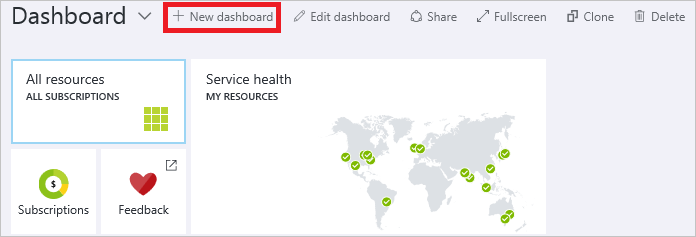

> [AZURE.TIP] The best way to learn about working with dashboards is to view the [Build Custom Dashboards in the Microsoft Azure Portal](https://channel9.msdn.com/Blogs/trevor-cloud/azure-portal-dashboards) video.

### Sharing Azure dashboards and access control
After configuring a dashboard, you can publish it and share it with other users in your organization. Azure [Role Based Access Control](../active-directory/role-based-access-control-configure.md) governs access to the information displayed by tiles in the portal. All published dashboards are implemented as Azure resources.  From an access control perspective, dashboards are no different than a virtual machine or a storage account.

Here is an example.  Let's say you have an Azure subscription and various members of your team have been assigned the roles of **owner**, **contributor**, or **reader** of the subscription.  Users who are owners or contributors are able to list, view, create, modify, or delete dashboards within the subscription.  Users who are readers are able to list and view dashboards, but cannot modify or delete them.  Users with reader access are able to make local edits to a published dashboard (e.g. when troubleshooting an issue), but are not able to publish those changes back to the server.  They will have the option to make a private copy of the dashboard for themselves.

Individual tiles on the dashboard enforce their own access control requirements based on the resources they display.  Therefore, you can design a dashboard that is shared broadly while still protecting the data on individual tiles.

## Manage resource groups

1. To see all of the resource groups in your subscription, select **Resource groups**.

    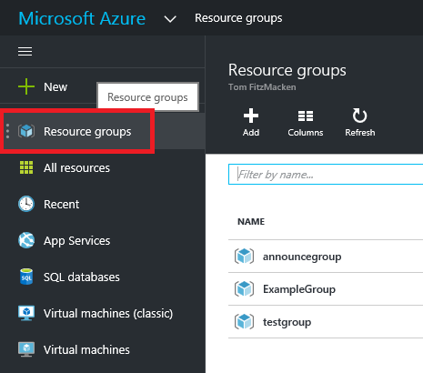

2. Select the particular resource group you wish to manage. You will see a resource group blade that gives you information about that resource group, including a list of all of the resources in the group.

    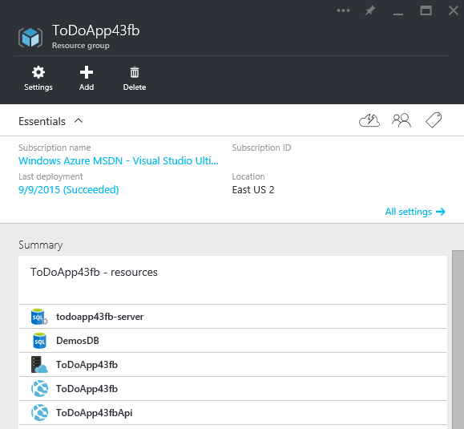

    Selecting any of the resources shows you details about that resource.

3. Within the blade for a resource, you can add more graphs and tables by selecting **Add a section** below the summary.

    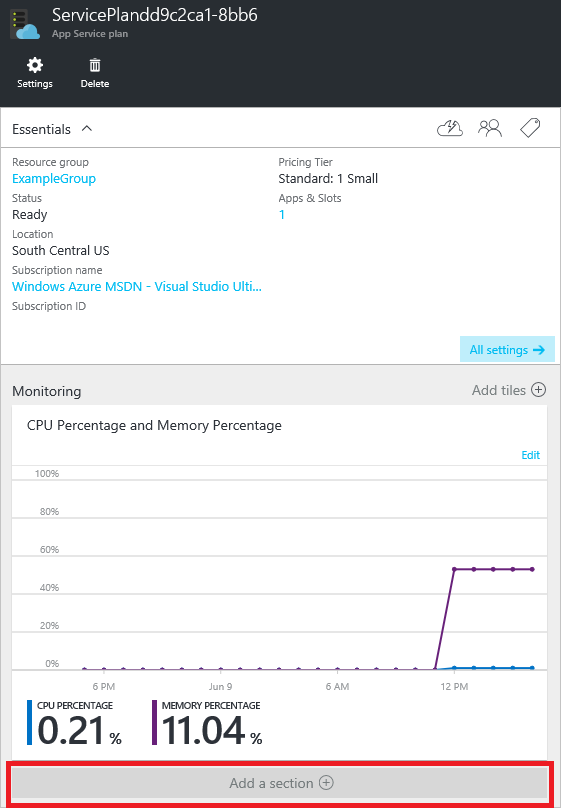

4. You are presented with a tile gallery to select the information you would like to include in the blade. The types of tiles that are displayed are filtered by the resource type. Selecting a different resource will change the available tiles.

    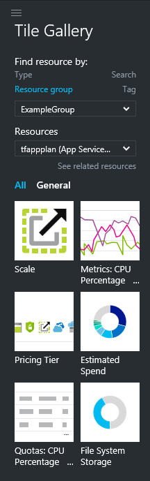

5. Drag the tile you need into the available spaces.

    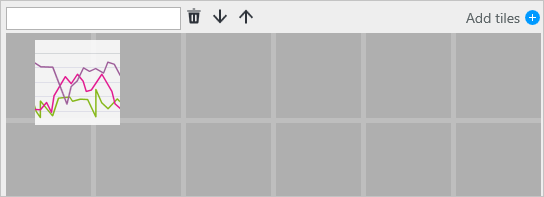

6. After selecting **Done** at the top of the portal, your new view is part of the blade.

    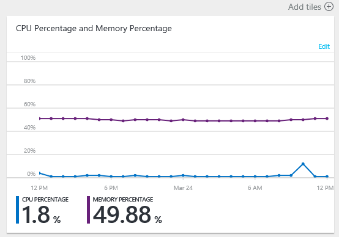

7. For quick access to a resource group, you can pin the blade to your dashboard.

    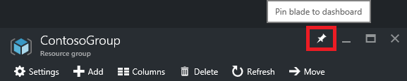

    Or, you can pin a section of the blade to your dashboard by selecting the ellipsis (...) above the section. You can also customize the size the section in the blade or remove it completely. The following image shows how to pin, customize, or remove the CPU and Memory section.

    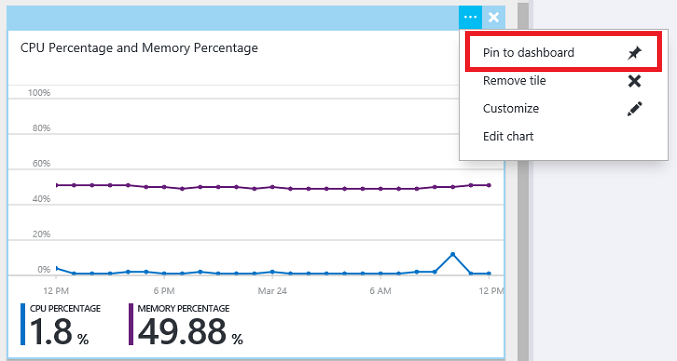

8. After pinning the section to the dashboard, you will see the summary on the dashboard.

    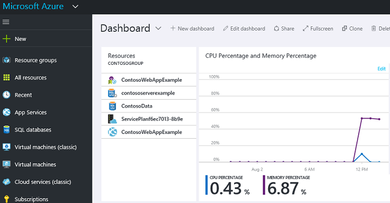

And, selecting it immediately takes you to more details about the data.

## Tag resources

You can apply tags to resource groups and resources to logically organize your assets. For information about working with tags through the portal, see [Using tags to organize your Azure resources](../resource-group-using-tags.md).

## View your subscription and costs

You can view information about your subscription and the rolled-up costs for all of your resources. Select **Subscriptions** and the subscription you want to see. You might only have one subscription to select.

Within the subscription blade, you will see a burn rate.

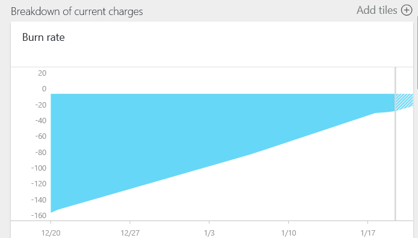

And, a breakdown of costs by resource type.

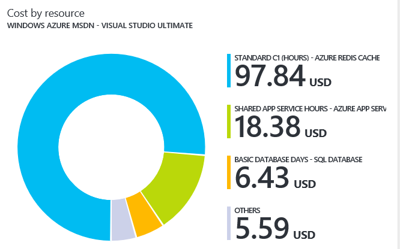

## Export template

After setting up your resource group, you may want to view the Resource Manager template for the resource group. Exporting the template offers two benefits:

1. You can easily automate future deployments of the solution because all of the infrastructure is defined in the template.

2. You can become familiar with template syntax by looking at the JavaScript Object Notation (JSON) that represents your solution.

For step-by-step guidance, see [Export Azure Resource Manager template from existing resources](../resource-manager-export-template.md).

## Delete resource group or resources

Deleting a resource group deletes all the resources contained within it. You can also delete individual resources within a resource group. You want to exercise caution when you are deleting a resource group because there might be resources in other resource groups that are linked to it. The linked resources will not be deleted but they may not operate as expected.

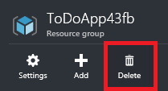

## Next Steps

- To view audit logs, see [Audit operations with Resource Manager](../resource-group-audit.md).
- To troubleshoot deployment errors, see [Troubleshooting resource group deployments with Azure Portal](../resource-manager-troubleshoot-deployments-portal.md).
- To deploy resources through the portal, see [Deploy resources with Resource Manager templates and Azure portal](../resource-group-template-deploy-portal.md).

