<properties 
	pageTitle="Use Azure portal to manage Azure resources | Microsoft Azure" 
	description="Use Azure portal and Azure Resource Manage to deploy and manage your resources. Shows how to tag resources and view audit logs." 
	services="azure-resource-manager,azure-portal" 
	documentationCenter="" 
	authors="tfitzmac" 
	manager="timlt" 
	editor="tysonn"/>

<tags 
	ms.service="azure-resource-manager" 
	ms.workload="multiple" 
	ms.tgt_pltfrm="na" 
	ms.devlang="na" 
	ms.topic="article" 
	ms.date="05/16/2016" 
	ms.author="tomfitz"/>

# Using the Azure Portal to deploy and manage your Azure resources

## Introduction

This topic shows how to use the [Azure portal](https://portal.azure.com) with [Azure Resource Manager](../resource-group-overview.md) to deploy and manage your Azure resources.

Currently, not every service supports the portal or Resource Manager. For those services, you will need to use
the [classic portal](https://manage.windowsazure.com). For the status of each service, see [Azure portal availability chart](https://azure.microsoft.com/features/azure-portal/availability/).

You can also manage resources through Azure PowerShell and Azure CLI. For more information about using those interfaces, see [Using Azure PowerShell with Azure Resource Manager](../powershell-azure-resource-manager.md) and
[Use the Azure CLI for Mac, Linux, and Windows with Azure Resource Manager](../xplat-cli-azure-resource-manager.md). For more information about deploying solutions through Visual Studio,
see [Creating and deploying Azure resource groups through Visual Studio](../vs-azure-tools-resource-groups-deployment-projects-create-deploy.md).

## Create resource group

To create an empty resource group, select **New**, **Management**, and **Resource Group**.

Give it a name and location, and, if necessary, select a subscription.

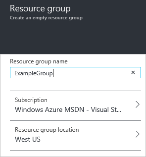

## Deploy resources

After you create a resource group, you can deploy resources to it. To start a deployment, simply select **New** and the type of resource you would like to deploy.

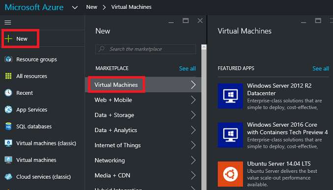

If you do not see the type of resource you would like to deploy, you can search the marketplace for it.

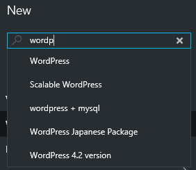

Depending on the type of resource you have selected, you will have a collection of relevant properties to set before deployment. Those options are not shown here, as they vary based on resource type.
For all types, you must select a destination resource group. The following image shows how to create a new web app and deploy it to the resource group you just created.

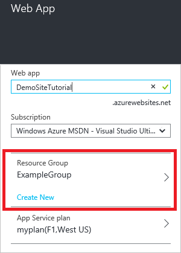

Alternatively, you can decide to create a new resource group when deploying your resources. Instead of selecting one of the existing resource groups in your subscription, select **New** and give the resource group a name.

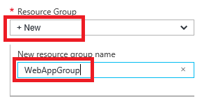

Your deployment will begin. This could take a few minutes. When the deployment has finished, you will see a notification.

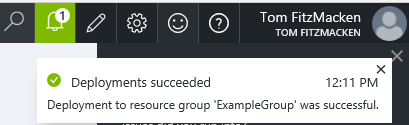

After deploying your resources, you may decide that you need to add more resources to the group. You can add resources to a resource group by using the **Add** command on the resource group blade.

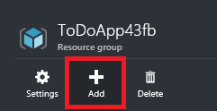

## Export template

After setting up your resource group, you may want to view the Resource Manager template for the resource group. Exporting the template offers two benefits:

1. You can easily automate future deployments of the solution because all of the infrastructure is defined in the template.

2. You can become familiar with template syntax by looking at the JavaScript Object Notation (JSON) that represents your solution.

> [AZURE.NOTE] The export template feature is in preview, and not all resource types currently support exporting a template. When attempting to export a template, you may see an error that states some resources were not exported. If needed, you can manually define these resources in your template after downloading it.

For step-by-step guidance, see [Export Azure Resource Manager template from existing resources](../resource-manager-export-template/).

## Manage resource group

You can browse all resource groups by clicking **Resource groups**.

When you select a particular resource group, you see a resource group blade that gives you information about that resource group, including a list of all of the resources in the group.

You can add more graphs and tables to the resource group blade by selecting **Add a section** below the summary.

You are presented with a tile gallery to select the information you would like to include in the blade. The types of tiles that are displayed are filtered by the resource type. Selecting a different resource will
change the available tiles.

Drag the tile you need into the available spaces.

After selecting **Done** at the top of the portal, your new view is part of the blade.

For quick access to a resource group, you can pin the blade to your dashboard.

Or, you can pin a section of the blade to your dashboard by selecting the ellipsis (...) above the section. You can also customize the size the section in the blade or remove it completely. The following image shows how to pin, customize, or remove the CPU and Memory section.

After pinning the section to the dashboard, you will see the summary on the dashboard.

And, selecting it immediately takes you to more details about the data.

Since resource groups allow you to manage the lifecycle of all the contained resources, deleting a resource group will delete all the resources contained within it. You can also delete individual
resources within a resource group. You want to exercise caution when you are deleting a resource group because there might be resources in other resource groups that are linked to it.
The linked resources will not be deleted but they may not operate as expected.

## Tag resources

You can apply tags to resource groups and resources to logically organize your assets. For information about working with tags through the portal, see [Using tags to organize your Azure resources](../resource-group-using-tags.md).

## Deploy saved template

If you saved a template to your account, you can view it later by select **Browse** and **Templates**.

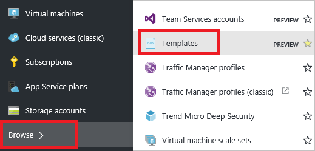

You will see your own collection of templates.

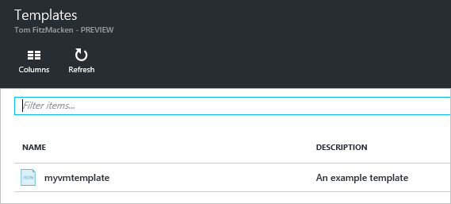

## Deploy custom template

If you want to execute a deployment but not use any of the templates in the Marketplace, you can create customized template that defines the infrastructure for your solution. For more information about templates, see [Authoring Azure Resource Manager templates](../resource-group-authoring-templates.md).

To deploy a customized template through the portal, select **New**, and start searching for **Template Deployment** until you can select it from the options.

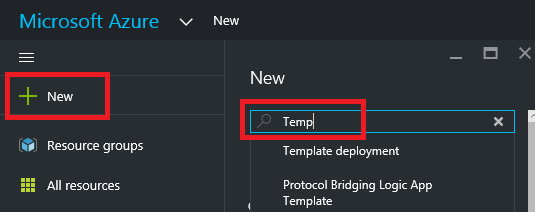

Select **Template Deployment** from the available resources.

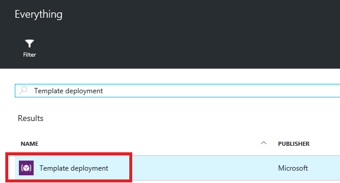

After launching the template deployment, you can create the custom template and set values for the deployment.

Or, you can select a pre-existing template from the [Azure quickstart templates](https://azure.microsoft.com/documentation/templates/). These templates are contributed by the community. They cover many common scenarios, and 
someone may have added a template that is similar to what you are trying to deploy. You can search the templates to find something that matches your scenario.

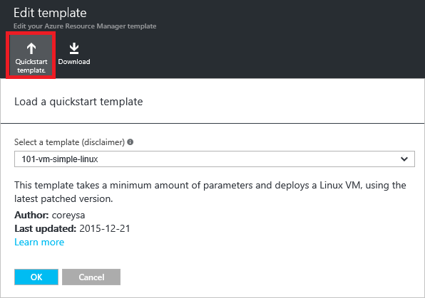

After selecting a template, it is loaded in the editor.

## View your subscription and costs

You can view information about your subscription and the rolled-up costs for all of your resources. Select **Subscriptions** and the subscription you want to see. You might only have one subscription to select.

Within the subscription blade, you will see a burn rate.

And, a breakdown of costs by resource type.

## Access control for Azure dashboards

Access to the information displayed by most tiles in the portal are governed by Azure [Role Based Access Control](../active-directory/role-based-access-control-configure.md).  In order to seamlessly integrate dashboards into the ecosystem all published dashboards are implemented as Azure resources.  From an access control perspective dashboards are no different from a virtual machine or a storage account.

Here is an example.  Let's say you have an Azure subscription and various members of your team have been assigned the roles of **owner**, **contributor**, or **reader** of the subscription.  Users who are owners or contributors will be able to list, view, create, modify, or delete dashboards within the subscription.  Users who are readers will be able to list and view dashboards, but cannot modify or delete them.  Users with reader access will be able to make local edits to a published dashboard (e.g. when troubleshooting an issue), but will not be given the option to publish those changes back to the server.  They will have the option to make a private copy of the dashboard for themselves.

Note that the individual tiles on the dashboard will enforce their own access control requirements based on the resources they are showing data for.  This means that you can design a dashboard that can be shared more broadly while still protecting the data on individual tiles.

## Next Steps

- To view audit logs, see [Audit operations with Resource Manager](../resource-group-audit.md).
- To troubleshoot deployment errors, see [Troubleshooting resource group deployments with Azure Portal](../resource-manager-troubleshoot-deployments-portal.md).

