<properties 
	pageTitle="Use Azure portal to manage Azure resources | Microsoft Azure" 
	description="Group multiple resources as a logical group that becomes the lifecycle boundary for resources contained within it." 
	services="azure-resource-manager,azure-portal" 
	documentationCenter="" 
	authors="tfitzmac" 
	manager="wpickett" 
	editor=""/>

<tags 
	ms.service="azure-resource-manager" 
	ms.workload="multiple" 
	ms.tgt_pltfrm="na" 
	ms.devlang="na" 
	ms.topic="get-started-article" 
	ms.date="02/11/2016" 
	ms.author="tomfitz"/>

# Using the Azure Portal to manage your Azure resources

## Introduction

Azure Resource Manager enables you to deploy and manage your solutions through resource groups. This topic provides an overview of how to use resource groups within the Azure portal. Typically, a resource group contains
resources related to a specific application. For example, a group may contain a web app that hosts your public website, a SQL Database that stores relational data used
by the site, and a Storage account that stores non-relational assets. Every resource in a resource group should share the same lifecycle. For more information about
Resource Manager, see [Resource Manager overview](../resource-group-overview.md).

Currently, not every service supports the portal or Resource Manager. For those services, you will need to use
the [classic portal](https://manage.windowsazure.com). For the status of each service, see [Azure portal availability chart](https://azure.microsoft.com/features/azure-portal/availability/).

You can also manage resources through Azure PowerShell and Azure CLI. For more information about using those interfaces, see [Using Azure PowerShell with Azure Resource Manager](../powershell-azure-resource-manager.md) and
[Use the Azure CLI for Mac, Linux, and Windows with Azure Resource Manager](../xplat-cli-azure-resource-manager.md).

## Create resource group and resources

If you need to create an empty resource group, you can select **New**, **Management**, and **Resource Group**.

You give it a name and location, and, if necessary, select a subscription.

When deploying your resources, you can choose to deploy them to the resource group you created. The following image shows how to create a new web app in an existing resource group.

Alternatively, you can decide to create a new resource group when deploying your resources. Instead of selecting one of the existing resource groups in your subscription, select **New** and give the resource group a name.

## Browse resource groups

You can browse all resource groups by clicking **Resource groups**.

When you select a particular resource group, you see a resource group blade that gives you information about that resource group, including a list of all of the resources in the group.

The resource group blade also gives you a unified view of your billing and monitoring information for all the resources in the resource group.

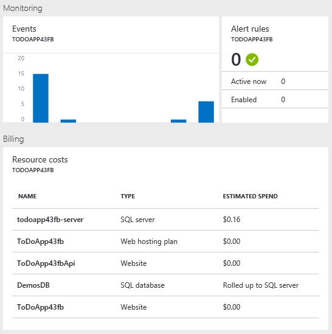

## View your subscription and costs

You can view information about your subscription and the rolled-up costs for all of your resources. Select **Subscriptions** and the subscription you want to see. You might only have one subscription to select.

Within the subscription blade, you will see a burn rate.

And, a breakdown of costs by resource type.

## Customizing the interface

For quick access to the resource group summary, you can pin the blade to your Startboard.

Or, you can pin a section of the blade to your Startboard by selecting the ellipsis (...) above the section. You can also customize the size the section in the blade or remove it completely. The following image shows how to pin, customize, or remove the Events section.

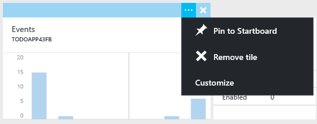

After pinning the Events section to the Startboard, you will see a summary of events on the Startboard.

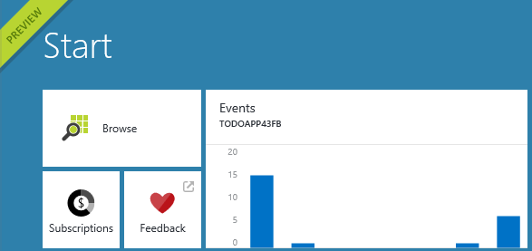

And, selecting it immediately takes you to more details about the events.

## Viewing past deployments

From within the resource group blade, you can see the date and status of the last deployment for this resource group. Selecting the link, displays a history of deployments for the group.

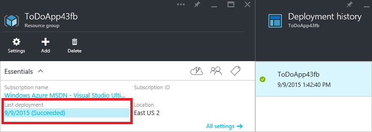

Selecting any deployment from the history shows details about that deployment.

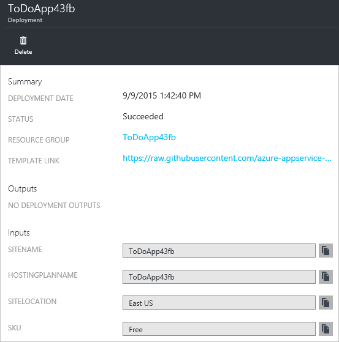

You can see the individual operations that were executed during the deployment. The following image shows one operation that succeeded and one that failed.

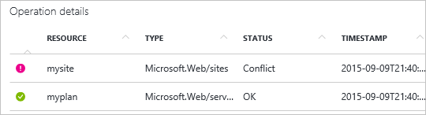

Selecting any of the operations shows more details about the operation. This can be especially helpful when an operation has failed, as shown below. It can help you troubleshoot why a deployment failed. In the following image, you can see that the web site was not deployed because the name was not unique.

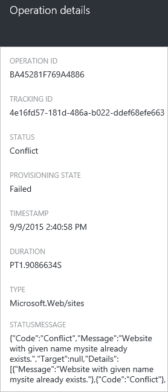

## Viewing audit logs

The audit log contains not just deployment operations, but all management operations taken on resources in your subscription. For example, you can see in the audit logs when someone in your organization stopped an app. To see the audit logs, select **Browse All** and **Audit Logs**.

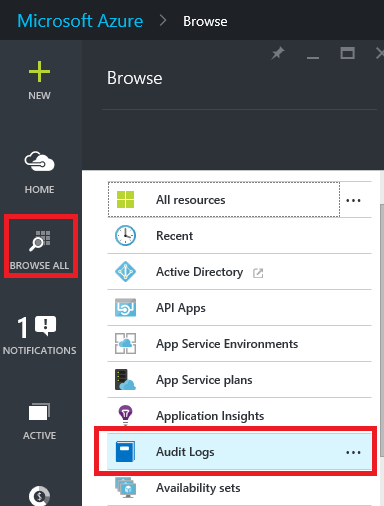

In the operations section, you can see the individual operations that have been performed across your subscription.

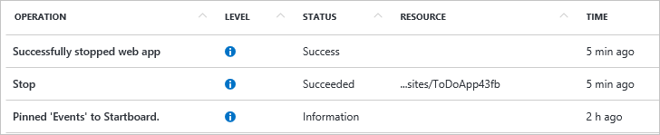

By selecting any of the operations, you can see greater details, including which user executed the operation.

You can filter what is shown in the audit log, by selecting **Filter**.

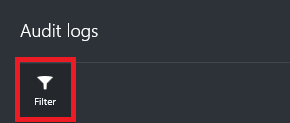

You can select what type of operations to show, such belonging to a resource group or resource, within a specified time span, initiated by a particular caller, or the levels of operation.

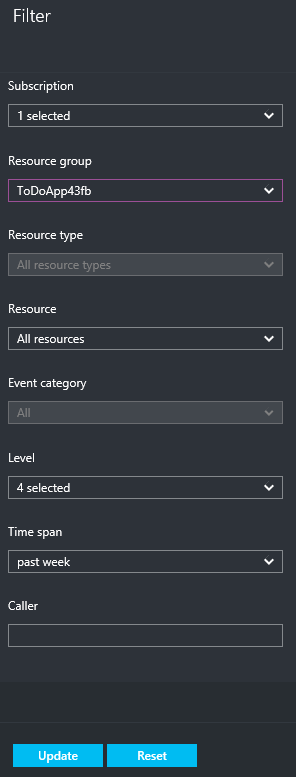

## Adding resources to resource groups

You can add resources to a resource group using the **Add** command on the resource group blade.

You can select the resource you want from the available list.

## Deleting resource groups

Since resource groups allow you to manage the lifecycle of all the contained resources, deleting a resource group will delete all the resources contained within it. You can also delete individual resources within a resource group. You want to exercise caution when you are deleting a resource group since there might be other resources linked to it. You can see the linked resources in the resource map and take the necessary steps to avoid any unintentional consequences when you delete resource groups. The linked resources will not be deleted but they may not operate as expected.

## Tagging resources

You can apply tags to resource groups and resources to logically organize your assets. For information about working with tags through the portal, see [Using tags to organize your Azure resources](../resource-group-using-tags.md).

## Deploying a custom template

If you want to execute a deployment but not use any of the templates in the Marketplace, you can create customized template that defines the infrastructure for your solution. For more information about templates, see [Authoring Azure Resource Manager templates](../resource-group-authoring-templates.md).

To deploy a customized template through the portal, select **New**, and start searching for **Template Deployment** until you can select it from the options.

Select **Template Deployment** from the available resources.

After launching the template deployment, you can create the custom template and set values for the deployment.

## Next Steps
Getting Started

- For an introduction to the concepts in Resource Manager, see [Azure Resource Manager Overview](../resource-group-overview.md).
- For an introduction to using Azure PowerShell when deploying resources, see [Using Azure PowerShell with Azure Resource Manager](../powershell-azure-resource-manager.md).
- For an introduction to using Azure CLI when deploying resources, see [Using the Azure CLI for Mac, Linux, and Windows with Azure Resource Management](../xplat-cli-azure-resource-manager.md).

