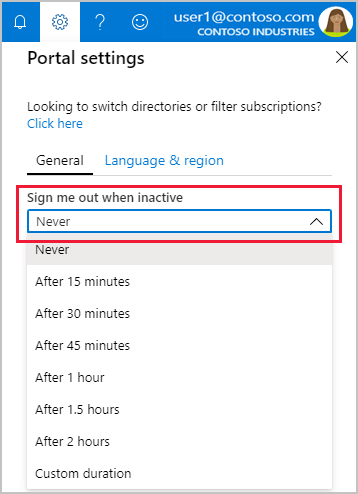
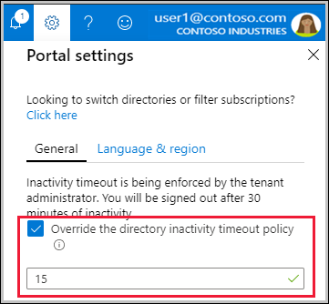
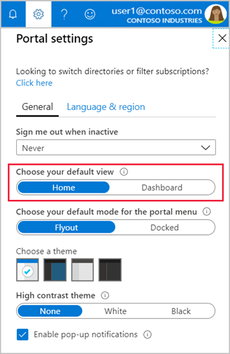
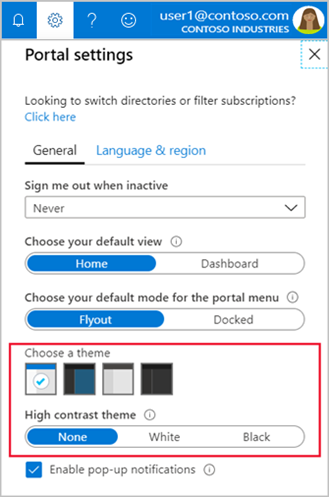
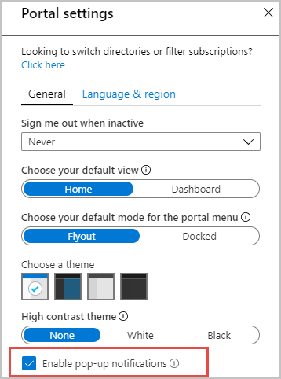
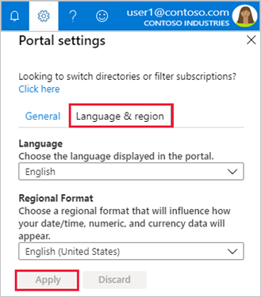

# Set your Azure portal preferences

You can change the default settings of the Azure portal to meet your own preferences. Each of the settings listed below can be changed:

* [Inactive session time-out](#change-the-idle-duration-for-inactive-sign-out)
* [Default view](#choose-your-default-view)
* [Portal menu mode](#choose-a-portal-menu-mode)
* [Color and high contrast theme](#choose-a-theme)
* [Pop-up notifications](#enable-or-disable-pop-up-notifications)
* [Language and regional format](#change-language-and-regional-settings)

## Change general portal settings

1. Sign in to the [Azure portal](https://portal.azure.com).
2. Select **Settings** from the global page header.

    

### Change the idle duration for inactive sign-out

The inactivity timeout setting helps to protect  resources from unauthorized access if you forget to secure your workstation. After you've been idle for a while, you’re automatically signed out of your Azure portal session.

Select the drop-down under **Sign me out when inactive**. Choose the duration after which your Azure portal session is  signed out if you’re idle.

   

The change is saved automatically. If you’re idle, your Azure portal session will sign out after the duration you set.

This setting can also be made by an admin at the directory level to enforce a maximum idle time. If an admin has made a directory-level timeout setting, you can still set your own inactive sign-out duration. Choose a time setting that is less than what is set at the directory level.

If your admin has enabled an inactivity timeout policy, select the **Override the directory inactivity timeout policy** checkbox. Set a time interval that is less than the policy setting.

   

> [!NOTE]
> If you’re an admin, and you want to enforce an inactive timeout setting for all users of the Azure portal, see [Set directory-level inactivity timeout for users of the Azure portal](admin-timeout.md)
>

### Choose your default view 

You can change the page that opens by default when your sign-in to the Azure portal.

   

The default view setting controls which Azure portal view is shown when you sign in. You can choose to open Azure Home by default, or the Dashboard view.

* **Home** can’t be customized.  It displays shortcuts to popular Azure services and lists the resources you’ve used most recently. We also give you useful links to resources like Microsoft Learn and the Azure roadmap.
* Dashboards can be customized to create a workspace designed just for you. For example, you can build a dashboard that is project, task, or role focused. If you select **Dashboard**, your default view will go to your most recently used dashboard.

### Choose a portal menu mode

The default mode for the portal menu controls how much space the portal menu takes up on the page.

* When the portal menu is in **flyout** mode, it’s hidden until you need it. Select the menu icon to open or close the menu.
* If you choose **docked** mode for the portal menu, it’s always visible. You can collapse the menu to provide more working space. 

### Choose a theme

The theme that you choose affects the background and font colors that appear in the Azure portal. You can select from one of four preset color themes. Select each thumbnail to find the theme that best suits you.

   

You can choose one of the high-contrast themes instead. The high contrast settings make the Azure portal easier to read for vision-impaired users and override all other theme selections. For more information, see [Turn on high contrast or change theme](azure-portal-change-theme-high-contrast.md).

### Enable or disable pop-up notifications

Notifications are system messages related to your current session. They provide information like your current credit balance, when resources you just created become available, or confirm your last action, for example. When pop-up notifications are turned on, the messages briefly display in the top corner of your screen. 

To enable or disable pop-up notifications, select or de-select the **Enable pop-up notifications** checkbox.

   

To read all notifications received during your current session, select **Notifications** from the global header.

   

If you want to read notifications from previous sessions, look for events in the Activity log. To learn more, read [View and retrieve Azure Activity log events](/azure/azure-monitor/platform/activity-log-view).

### Settings under useful links

If you’ve made changes to the Azure portal settings and want to discard them, select **Restore default settings**. Any changes you’ve made to portal settings will be lost. This option doesn’t affect dashboard customizations.

For more information about **Export all settings** or **Delete all settings and private dashboards**, see [Export or delete user settings](azure-portal-export-delete-settings.md).

## Change language and regional settings

There are two settings that control how the text in the Azure portal appears. The **Language** setting controls the language you see for text in the Azure portal. **Regional format** controls the way dates, time, numbers, and currency are shown.

To change the language that is used in the Azure portal, use the drop-down to select from the list of available languages.

The regional format selection changes to display regional options for only the language you selected. To change that automatic selection, use the drop-down to choose the regional format you want.

For example, if you select English as your language, and then select United States as the regional format, currency is shown in U.S. dollars. If you select English as the language and then select Europe as the regional format, currency is shown  in euros.

Select **Apply** to update your language and regional format settings.

   

>[!NOTE]
>These language and regional settings affect only the Azure portal. Documentation links that open in a new tab or window will use your browser's language settings to determine the language to display.
>

## Next steps

* [Create and share custom dashboards](azure-portal-dashboards.md)
* [Azure portal how-to video series](azure-portal-video-series.md)
